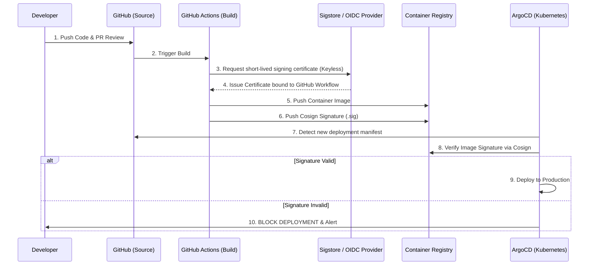

In the wake of devastating supply chain attacks like SolarWinds and the XZ Utils backdoor, the perimeter of cybersecurity has fundamentally shifted. Attackers are no longer trying to breach your production firewalls; they are compromising your build servers. If an attacker can inject malicious code into your CI/CD pipeline, they implicitly gain the trust of your entire production infrastructure.

By 2026, implementing SLSA (Supply-chain Levels for Software Artifacts) framework is no longer an optional compliance checklist—it is the bare minimum for DevSecOps. In this guide, we will architect a zero-trust build and deployment pipeline using **GitHub Actions, Sigstore (Cosign), and ArgoCD**.

## The Core Problem: The Blind Trust of `kubectl apply`

For years, DevOps engineers focused on automating deployments. If code was merged to the `main` branch, a CI runner built a Docker image, pushed it to a registry, and CD pulled it into production. 

The fatal flaw here is **provenance**. How does the production Kubernetes cluster *actually* know that the image it is pulling was built by your approved CI pipeline and not secretly swapped in the registry by a compromised credential?

### Enter SLSA and Sigstore
SLSA provides a framework for securing the software supply chain. At SLSA Level 3, the build platform must generate unforgeable provenance (a cryptographic receipt of how and where the artifact was built). **Sigstore (specifically Cosign)** allows us to sign container images cryptographically, and **ArgoCD** verifies those signatures before allowing the deployment to proceed.

## Architecture: Zero-Trust CI/CD



### Keyless Signing: The Game Changer
Notice step 3. We are not managing static GPG keys or long-lived secrets. The CI pipeline authenticates to Sigstore using OpenID Connect (OIDC) tied directly to the GitHub Actions runner identity. Sigstore issues a short-lived certificate valid for exactly 10 minutes. The image is signed, and the certificate expires. There are no keys to leak.

## Real-world Implementation: GitHub Actions + Cosign

Here is a hardened GitHub Actions workflow snippet that builds a Docker image and signs it using keyless authentication.

```yaml
name: Build and Sign (SLSA Level 3)
on:
  push:
    branches: [ "main" ]

# Explicitly grant permissions to request an OIDC token
permissions:
  contents: read
  packages: write
  id-token: write 

jobs:
  build:
    runs-on: ubuntu-latest
    steps:
      - uses: actions/checkout@v4
      
      - name: Install Cosign
        uses: sigstore/cosign-installer@v3.5.0
        
      - name: Build and Push Container
        id: build-and-push
        uses: docker/build-push-action@v5
        with:
          push: true
          tags: ghcr.io/my-org/secure-app:${{ github.sha }}
          
      - name: Sign the published Docker image
        env:
          # This step uses the ephemeral OIDC token
          COSIGN_EXPERIMENTAL: "true" 
        run: |
          cosign sign --yes \
            ghcr.io/my-org/secure-app@${{ steps.build-and-push.outputs.digest }}
```

## Enforcing Provenance with ArgoCD and Kyverno

Signing the image is only half the battle. You must enforce the verification at the cluster edge. While ArgoCD can be extended to verify signatures natively, the most robust enterprise architecture pairs ArgoCD with **Kyverno** or **OPA Gatekeeper**.

Here is a Kyverno ClusterPolicy that prevents ArgoCD (or anyone else) from running an unsigned container:

```yaml
apiVersion: kyverno.io/v1
kind: ClusterPolicy
metadata:
  name: check-image-signature
spec:
  validationFailureAction: Enforce
  rules:
    - name: verify-cosign-signature
      match:
        resources:
          kinds:
            - Pod
      verifyImages:
        - imageReferences:
            - "ghcr.io/my-org/*"
          attestors:
            - entries:
                - keyless:
                    issuer: "https://token.actions.githubusercontent.com"
                    subject: "https://github.com/my-org/secure-app/.github/workflows/build.yml@refs/heads/main"
```

This policy strictly dictates that only images built by a specific GitHub Actions workflow (`build.yml`) on the `main` branch are allowed to execute. Even if a cluster admin tries to `kubectl apply` a rogue image manually, the API server will reject it.

## Performance and Cost Implications

| Aspect | Impact Analysis |
| :--- | :--- |
| **Pipeline Duration** | Keyless signing adds ~15 seconds to the CI pipeline. Highly acceptable. |
| **Storage Cost** | Signatures (.sig objects) are pushed alongside the image in the OCI registry. They are tiny (a few KBs). Storage cost impact is effectively zero. |
| **Cluster Overhead** | Kyverno admission webhooks add 10-20ms of latency during Pod creation. No impact on running applications. |

## Alternatives and Trade-offs

- **Notary v2 (Docker Trust)**: The enterprise alternative heavily backed by Microsoft Azure. It works well within the Azure ecosystem but is much heavier to implement outside of it compared to Cosign.
- **GitLab CI Native Features**: GitLab is aggressively building SLSA provenance generation directly into their runners. If you are exclusively on GitLab, relying on their native features might be simpler than bolting on Cosign.

## The Senior Engineer's Verdict

You cannot protect your data center if the software you pull into it has been tampered with. Implementing SLSA Level 3 using keyless signing sounds intimidating, but the tooling (Cosign and Kyverno) has matured to the point where it takes less than an afternoon to implement. 

The ROI is massive: you completely eliminate entire classes of supply chain attacks and guarantee cryptographic provenance for every single pod running in your production environment.


## References & Community Insights
The architectural perspectives and technical implementations discussed in this article were synthesized from real-world engineering experiences, post-mortems, and discussions shared across technical communities including Hacker News, Reddit, and specialized engineering blogs.
