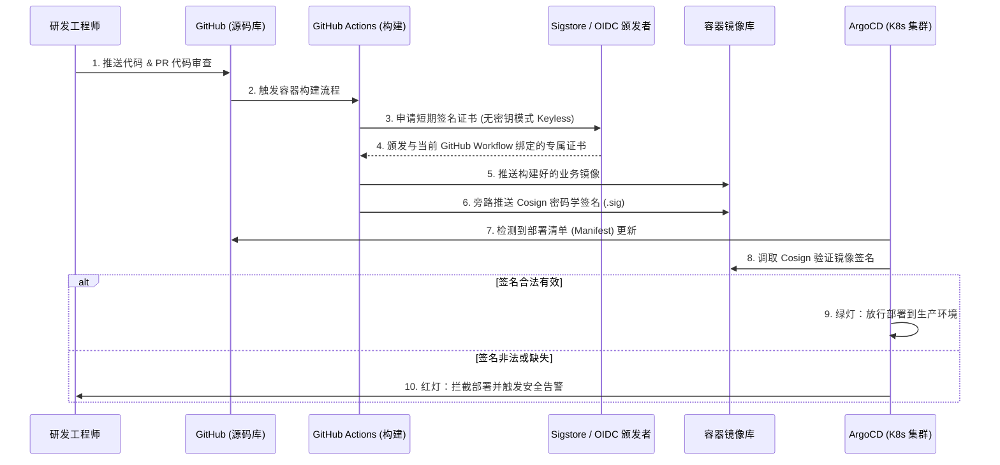

在经历了 SolarWinds 供应链投毒和可怕的 XZ Utils 后门事件后，网络安全的边界已经被彻底重塑。黑客们早就懒得去硬刚你生产环境的防火墙了，他们现在的首选目标是：**攻破你的构建服务器 (Build Server)**。因为一旦黑客能把恶意代码注入到你的 CI/CD 流水线里，他们就等同于拿到了整个生产环境基础设施的最高信任凭证。

到了 2026 年，实施 SLSA (软件制品供应链安全级别) 框架不再是那些枯燥的合规检查清单，而是所有 DevSecOps 团队必须坚守的底线。在这篇实战指南中，我们将基于 **GitHub Actions、Sigstore (Cosign) 和 ArgoCD**，从零架构一条真正的零信任构建与部署流水线。

## 核心痛点：`kubectl apply` 的盲目信任

多年来，DevOps 工程师们痴迷于“自动化部署”。一旦代码合并到 `main` 分支，CI 就会自动打一个 Docker 镜像推送到镜像库，然后 CD 把它拉取并部署到生产环境。

这套行云流水的操作里藏着一个致命缺陷：**溯源 (Provenance)**。生产环境的 Kubernetes 集群*凭什么*相信，它正在拉取的这个镜像，真的是由你官方认可的 CI 流水线构建的？如果某个内鬼或者黑客拿着泄露的凭证，偷偷在镜像库里把同名镜像给替换了呢？

### SLSA 与 Sigstore 的降维打击
SLSA 提供了一套保护软件供应链的框架标准。要达到 SLSA Level 3 的标准，构建平台必须生成不可伪造的来源证明（也就是一份密码学“发票”，证明这个包是在哪儿、怎么构建出来的）。**Sigstore（具体来说是 Cosign 工具）** 允许我们对容器镜像进行极其优雅的密码学签名，而 **ArgoCD** 会在允许镜像部署之前，严格验证这些签名。

## 零信任 CI/CD 架构设计



### 改变游戏规则的“无密钥签名” (Keyless Signing)
请仔细看图里的第 3 步。我们**不需要**维护任何静态的 GPG 密钥，也不需要管理那些一旦泄露就极其危险的长期凭证。CI 流水线通过 OpenID Connect (OIDC) 直接用当前 GitHub Actions 运行器的“身份”向 Sigstore 进行认证。Sigstore 确认身份后，会签发一张存活期只有 10 分钟的临时证书。用这张证书把镜像签完名后，证书就直接作废。**没有密钥存留，也就没有密钥泄露的风险。**

## 实战落地：GitHub Actions + Cosign 配置

下面是一段经过安全加固的 GitHub Actions 工作流代码，它完美实现了容器的构建，并使用无密钥认证对其进行了防伪签名。

```yaml
name: Build and Sign (达到 SLSA Level 3 标准)
on:
  push:
    branches: [ "main" ]

# 极其关键：必须显式授予流水线申请 OIDC 临时 Token 的权限
permissions:
  contents: read
  packages: write
  id-token: write 

jobs:
  build:
    runs-on: ubuntu-latest
    steps:
      - uses: actions/checkout@v4
      
      - name: 安装 Cosign
        uses: sigstore/cosign-installer@v3.5.0
        
      - name: 构建并推送 Docker 镜像
        id: build-and-push
        uses: docker/build-push-action@v5
        with:
          push: true
          tags: ghcr.io/my-org/secure-app:${{ github.sha }}
          
      - name: 对推送成功的镜像进行无密钥签名
        env:
          # 开启此环境变量，启用 OIDC 临时令牌签名功能
          COSIGN_EXPERIMENTAL: "true" 
        run: |
          cosign sign --yes \
            ghcr.io/my-org/secure-app@${{ steps.build-and-push.outputs.digest }}
```

## 在边界实施拦截：ArgoCD 与 Kyverno

在 CI 阶段给镜像签名只是完成了防守的一半。你必须在 Kubernetes 集群的入口处强制实施签名校验。虽然 ArgoCD 本身也可以被扩展来验证签名，但目前最主流、最坚固的企业级架构是将 ArgoCD 与 **Kyverno** 或 **OPA Gatekeeper** 结合使用。

以下是一个 Kyverno 准入策略 (ClusterPolicy) 的例子，它能死死拦住 ArgoCD（甚至任何具有集群管理员权限的活人）运行未签名的容器：

```yaml
apiVersion: kyverno.io/v1
kind: ClusterPolicy
metadata:
  name: check-image-signature
spec:
  validationFailureAction: Enforce
  rules:
    - name: verify-cosign-signature
      match:
        resources:
          kinds:
            - Pod
      verifyImages:
        - imageReferences:
            - "ghcr.io/my-org/*"
          attestors:
            - entries:
                - keyless:
                    issuer: "https://token.actions.githubusercontent.com"
                    # 这里是核武器：强制校验该镜像必须由 "main" 分支的 "build.yml" 流水线构建！
                    subject: "https://github.com/my-org/secure-app/.github/workflows/build.yml@refs/heads/main"
```

这个策略执行了极其严苛的规定：只有由 `main` 分支上特定的 GitHub Actions 流水线 (`build.yml`) 构建的镜像，才被允许在集群里跑起来。哪怕是有最高权限的 Kubernetes 集群管理员，如果试图手动 `kubectl apply` 跑一个自己偷偷打的非官方镜像，API Server 也会直接把请求给弹回去。

## 性能、成本与副作用分析

| 维度 | 影响面分析 |
| :--- | :--- |
| **CI 流水线时长** | 无密钥签名步骤大概只会给流水线增加 15 秒左右的开销。对于安全收益来说完全可以接受。 |
| **镜像库存储成本** | 签名文件 (.sig) 会像幽灵一样紧贴着原始镜像推送到 OCI 镜像库。它们非常小（几 KB），对存储成本的影响无限趋近于零。 |
| **Kubernetes 性能开销** | Kyverno 的准入 Webhook 会在创建 Pod 阶段增加大约 10-20 毫秒的延迟。一旦 Pod 跑起来后，对业务代码没有任何性能影响。 |

## 替代方案与权衡 (Trade-offs)

- **Notary v2 (Docker Trust)**：这套体系背后最大的金主是微软。如果你全套都在 Azure 生态里，它能跑得很顺畅。但如果你在跨云或者开源生态里，相比于轻量级无侵入的 Cosign，部署 Notary v2 的心智负担要重得多。
- **GitLab CI 的原生能力**：GitLab 目前正在疯狂地把 SLSA 溯源能力直接原生地做进他们的 Runner 里。如果你是一家纯粹的 GitLab 重度依赖企业，等他们把原生能力打磨好之后，直接用自带的功能可能会比额外集成 Cosign 更加简单。

## 资深安全架构师的最后总结

如果被拉进机房的软件从根源上就已经被篡改了，那你花几百万买的防火墙和堡垒机就跟废铁没有任何区别。

用“无密钥签名”来落地 SLSA Level 3 标准听起来像是个晦涩难懂的密码学噩梦。但在今天，相关的开源生态（Cosign 和 Kyverno）已经打磨得极其成熟，一个熟练的工程师连一个下午都用不了就能把全套走通。

这笔投资的 ROI 是不可估量的：你只需要做一次改造，就能彻底消除整整一大类的供应链投毒攻击，并用密码学级别的铁证，向所有人担保你生产环境里跑的每一行代码都是绝对清白的。


## 社区灵感与参考 (References & Community Insights)
本文探讨的架构演进与技术实现方案，深度提炼自 Hacker News、Reddit 等极客社区的真实工程师讨论、线上事故复盘（Post-mortems）以及一线技术博客的实战经验分享。
