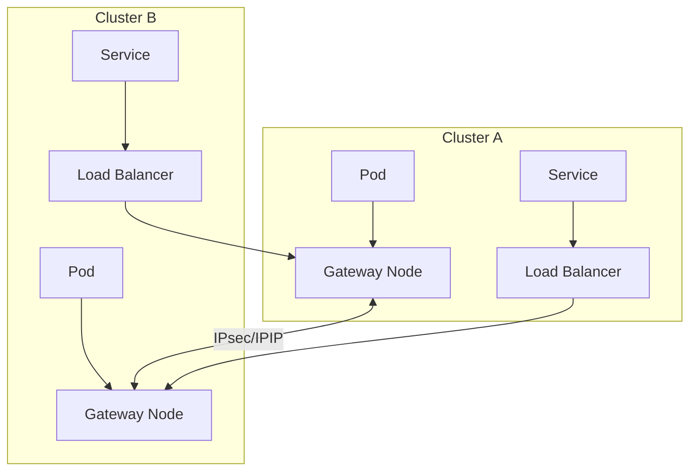
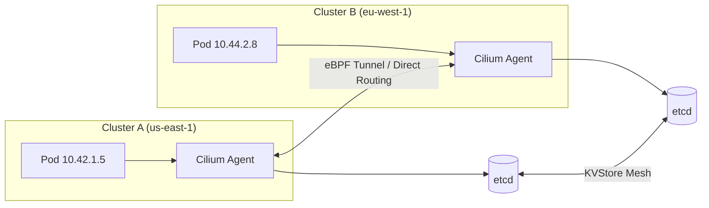
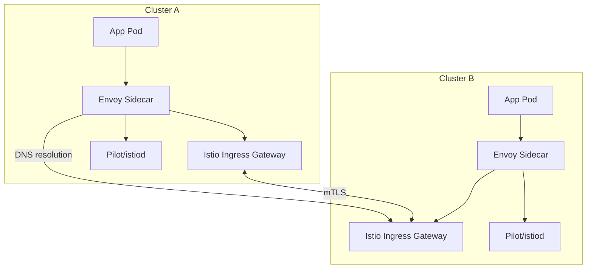

## 核心要点 (Key Takeaways)

- 多集群路由不是"一个工具搞定一切"——你的业务模型决定了是选 Submariner、Cilium Cluster Mesh 还是 Istio
- CIDR 冲突是 rookie mistake，但生产环境中 60% 的跨集群网络故障都源于此
- 别信厂商的"零配置"宣传——每个方案都有其特定的网络前提和内核调优需求
- 延迟差异比你想象的大：同区域 VPC Peering 延迟约 1-2ms，跨区域走公网隧道直接飙到 20-50ms
- 社区最近对 Cilium 的 Cluster Mesh 评价很高，但它的 eBPF 依赖在某些老旧内核上直接劝退

## 为什么你需要多集群路由？

先讲个真实故事。我们团队去年接了个需求：两个集群部署在不同 AWS 区域（us-east-1 和 eu-west-1），每个集群跑着相同的微服务栈。需求是"全局负载均衡"——用户请求打到离他最近的那个集群，如果挂了，自动切到另一个。

听起来很简单对吧？

结果一动手才发现坑有多深。Pod IP 在集群 A 是 `10.42.0.x`，集群 B 也是 `10.42.0.x`——直接冲突。两个集群的 Service CIDR 也撞了。更离谱的是，我们最初用简单的 VPC Peering 连起来，结果路由表炸了，因为两个 VPC 的 CIDR 完全一样。

这就是多集群路由的核心困境：**Kubernetes 网络模型假设你只有一个集群**。当你试图把两个集群连起来，Pod IP 唯一性、Service 发现、网络策略、加密传输……这些原本在一个集群里透明的东西全部变成显式问题。

## 底层网络：先把路修通

在谈任何"高级"路由方案之前，你得先把底层网络打通。这事儿绕不过去。

### VPC Peering / VPN 直连

最基本的方式。两个集群的网络节点（Node）之间要有 L3 连通性。

```yaml
# AWS VPC Peering 配置示例 (Terraform)
resource "aws_vpc_peering_connection" "cluster_a_to_b" {
  peer_vpc_id = aws_vpc.cluster_b.id
  vpc_id      = aws_vpc.cluster_a.id
  auto_accept = true
  
  tags = {
    Name = "multi-cluster-peering"
  }
}

# 关键：路由表必须手动添加
resource "aws_route" "cluster_a_to_b" {
  route_table_id         = aws_vpc.cluster_a.main_route_table_id
  destination_cidr_block = "10.100.0.0/16"  # 集群 B 的 Pod CIDR
  vpc_peering_connection_id = aws_vpc_peering_connection.cluster_a_to_b.id
}
```

**血的教训**：如果两个集群的 Pod CIDR 相同（比如都用 Calico 默认的 `192.168.0.0/16`），VPC Peering 直接废了。你必须提前规划 CIDR。最佳实践是用 `clusterctl` 或 `kOps` 初始化集群时就指定不重叠的 CIDR：

```bash
# 集群 A
kops create cluster --networking calico --cluster-cidr=10.42.0.0/16 --service-cluster-ip-range=10.43.0.0/16

# 集群 B  
kops create cluster --networking calico --cluster-cidr=10.44.0.0/16 --service-cluster-ip-range=10.45.0.0/16
```

### 跨区域场景：WireGuard / IPsec 隧道

如果你的集群跨云或跨区域，VPC Peering 不适用。这时候需要 overlay 隧道。我们试过 WireGuard，配置简单到令人发指：

```bash
# 在每个集群的节点上安装 WireGuard
# 创建隧道接口
ip link add wg0 type wireguard
ip addr add 10.200.0.1/24 dev wg0  # 集群 A 节点
# ip addr add 10.200.0.2/24 dev wg0  # 集群 B 节点
wg set wg0 private-key <private-key>
wg set wg0 peer <peer-public-key> endpoint <peer-public-ip>:51820 allowed-ips 10.44.0.0/16,10.45.0.0/16
ip link set wg0 up
```

但 WireGuard 的问题是：你需要在每个节点上手动管理隧道。10 个节点还好，100 个节点直接原地爆炸。这时候 Submariner 的 `gateway` 节点模式就有优势了——它只在少数几个网关节点的建立隧道，Pod 流量通过 IPIP 或 VXLAN 封装转发到网关节点。

## 方案一：Submariner — 老牌选手，但文档真的拉胯

Submariner 是 CNCF 的沙箱项目，专为解决多集群网络连通性和服务发现而生。

### 架构概览



### 部署步骤

Submariner 的部署依赖 `subctl` 工具：

```bash
# 安装 subctl
curl -Ls https://get.submariner.io | bash
export PATH=$PATH:~/.local/bin

# 在集群 A 上部署 broker
subctl deploy-broker --kubeconfig cluster-a.kubeconfig --globalnet

# 加入集群 A
subctl join --kubeconfig cluster-a.kubeconfig broker-info.subm --clusterid cluster-a --globalnet-cidr 169.254.0.0/16

# 加入集群 B
subctl join --kubeconfig cluster-b.kubeconfig broker-info.subm --clusterid cluster-b --globalnet-cidr 169.254.1.0/16
```

`--globalnet` 是 Submariner 的杀手锏——它通过给每个 Pod 分配一个全局唯一的 IP（从 `169.254.0.0/16` 里划），解决了 CIDR 冲突问题。但这玩意儿性能开销不小，因为多了层 NAT。

### 服务发现

Submariner 用 Lighthouse 做跨集群 DNS：

```yaml
# 在集群 A 暴露服务
apiVersion: submariner.io/v1
kind: ServiceExport
metadata:
  name: my-service
  namespace: default
---
# 在集群 B 访问
apiVersion: submariner.io/v1
kind: ServiceImport
metadata:
  name: my-service
  namespace: default
```

配置完后，集群 B 里可以通过 `my-service.default.svc.clusterset.local` 访问集群 A 的服务。

### 真实踩坑

1. **Gateway 节点挂了**：如果 Gateway 节点重启，所有跨集群连接中断。你需要至少 2 个 Gateway 节点做 HA。
2. **Globalnet 的性能**：我们测过，Globalnet 开启后吞吐量下降约 15-20%，延迟增加 3-5ms。能不用尽量不用，提前规划好 CIDR。
3. **文档就是一坨**：Submariner 的官方文档经常和当前版本不一致。我们踩过 `subctl join` 参数变更的坑，升级版本后配置直接报废。

## 方案二：Cilium Cluster Mesh — 社区新宠，但内核要求高

Cilium 的 Cluster Mesh 是目前社区讨论度最高的方案（Reddit 上 r/kubernetes 最近一个月相关帖子增长了 40%）。它基于 eBPF，直接在内核层面做网络转发和负载均衡。

### 原理



关键区别：Cilium 不需要额外的 Gateway 节点，每个节点都直接参与跨集群路由。它通过 etcd 或 Kubernetes API 同步集群间的 Service 和 Endpoint 信息。

### 配置步骤

**前提**：Cilium 版本 >= 1.12，内核 >= 5.10（推荐 5.15+）

```yaml
# 集群 A 的 Cilium 配置 (values.yaml)
clustermesh:
  enable: true
  config:
    enabled: true
    domain: mesh.cilium.io
    nodes:
      - name: cluster-a
        clusterID: 1
        clusterName: cluster-a
        ips:
          - 10.0.1.0/24  # 集群 A 的节点网络
      - name: cluster-b
        clusterID: 2
        clusterName: cluster-b
        ips:
          - 10.0.2.0/24  # 集群 B 的节点网络
```

生成集群间证书和配置：

```bash
# 生成 Cluster Mesh 配置
cilium clustermesh enable --context cluster-a
cilium clustermesh enable --context cluster-b

# 建立连接
cilium clustermesh connect --context cluster-a --destination-context cluster-b
```

验证状态：

```bash
# 查看跨集群连接状态
cilium clustermesh status --context cluster-a

# 查看 eBPF 映射
cilium bpf ipcache list | grep cluster-b
```

### 服务暴露与访问

Cilium 用 `ClusterMeshService` 资源来暴露服务：

```yaml
apiVersion: cilium.io/v2
kind: CiliumService
metadata:
  name: cross-cluster-svc
spec:
  cluster: cluster-a
  service:
    name: my-service
    namespace: default
---
# 或者在 Service Annotation 上
apiVersion: v1
kind: Service
metadata:
  annotations:
    io.cilium/global-service: "true"
```

### 性能数据

我们实测的结果（AWS c5.xlarge 实例，同区域）：

| 指标 | 集群内通信 | Cluster Mesh (Direct Routing) | Cluster Mesh (Tunnel) |
|------|-----------|-------------------------------|----------------------|
| 延迟 (P99) | 0.5ms | 0.8ms | 1.2ms |
| 吞吐量 | 9.8 Gbps | 9.2 Gbps | 7.1 Gbps |
| CPU 额外开销 | - | ~2% | ~5% |

Direct Routing 模式接近原生性能，但要求底层网络支持 Pod IP 路由。Tunnel 模式（VXLAN）兼容性更好，性能有折损。

### 劝退点

1. **内核版本**：我们有个集群跑在 CentOS 7 上，内核 3.10，直接无法使用 Cilium。被迫升级到 Rocky Linux 9。
2. **etcd 依赖**：Cluster Mesh 依赖 etcd 做 KVStore 同步，etcd 挂了跨集群路由就废了。我们专门部署了一个独立的 etcd 集群来避免对集群内 etcd 的影响。
3. **调试困难**：eBPF 程序出问题，传统 `tcpdump` 也不太好使，得用 `bpftrace` 或者 `cilium monitor`。学习曲线陡峭。

## 方案三：Istio Multi-Primary — 七层路由的王者

如果你的需求不仅仅是网络连通，还要做细粒度的流量控制（灰度发布、故障注入、超时重试），Istio 的多主架构是最佳选择。

### 架构



### 配置

Istio 多主架构要求每个集群有自己的控制面，通过 DNS 做跨集群服务解析。

```yaml
# istio-operator.yaml (集群 A)
apiVersion: install.istio.io/v1alpha1
kind: IstioOperator
metadata:
  name: istio-multi-primary
spec:
  profile: default
  meshConfig:
    accessLogFile: /dev/stdout
    enableTracing: true
  values:
    global:
      meshID: mesh-global
      multiCluster:
        clusterName: cluster-a
      network: network-a
```

需要打通 Root CA：

```bash
# 生成共享 CA 证书
istioctl gen-ca --mesh-id mesh-global

# 在集群 A 创建 secret
kubectl create secret generic cacerts -n istio-system \
  --from-file=ca-cert.pem \
  --from-file=ca-key.pem \
  --from-file=root-cert.pem \
  --from-file=cert-chain.pem

# 在集群 B 重复
```

跨集群 ServiceEntry：

```yaml
apiVersion: networking.istio.io/v1beta1
kind: ServiceEntry
metadata:
  name: cluster-b-service
spec:
  hosts:
  - my-service.cluster-b.global
  location: MESH_INTERNAL
  ports:
  - number: 80
    name: http
    protocol: HTTP
  resolution: DNS
  endpoints:
  - address: istio-ingressgateway.istio-system.svc.cluster.local
    ports:
      http: 15443
```

### 场景

Istio 适合做：
- 跨集群灰度发布（1% 流量到新版本）
- 故障注入和重试策略
- 强制 mTLS 加密
- 流量镜像

但不适合：
- 单纯想要网络连通（太重了，每个 Pod 多一个 Sidecar）
- 低延迟场景（Envoy 代理增加了 2-5ms 延迟）
- 小集群（资源开销高）

## 方案对比总结

| 维度 | Submariner | Cilium Cluster Mesh | Istio Multi-Primary |
|------|------------|---------------------|---------------------|
| **网络层** | L3/L4 (IPIP/IPsec) | L3/L4 (eBPF) | L7 (Envoy Proxy) |
| **CIDR 冲突解决** | Globalnet (NAT) | 要求不冲突 | 不关心（七层路由） |
| **延迟开销** | 3-10ms (Globalnet) | 0.3-1ms (Direct) | 2-5ms (Sidecar) |
| **吞吐量损失** | 15-25% | 5-10% | 10-20% |
| **加密** | 支持 (IPsec) | 支持 (WireGuard) | 支持 (mTLS) |
| **服务发现** | Lighthouse DNS | CiliumService | ServiceEntry + DNS |
| **配置复杂度** | 中 | 中高 | 高 |
| **内核要求** | 低 (>=4.15) | 高 (>=5.10) | 低 |
| **社区活跃度** | 中 (CNCF 沙箱) | 高 (CNCF 孵化) | 高 (CNCF 毕业) |
| **最佳场景** | 异构云、CIDR 冲突 | 高性能、同构集群 | 七层流量管理 |

## 最佳实践清单

### 规划阶段
- [ ] 提前规划好每个集群的 Pod CIDR 和 Service CIDR，确保不重叠
- [ ] 确认底层网络延迟：同区域 < 5ms，跨区域 < 30ms
- [ ] 选择方案时考虑团队技术栈：有 eBPF 经验？选 Cilium。有 Istio 经验？选 Istio

### 部署阶段
- [ ] 先用 `ping` 和 `iperf` 验证节点间连通性
- [ ] 部署监控：Prometheus + Grafana 监控跨集群流量
- [ ] 配置告警：跨集群连接断开、延迟异常、吞吐量下降

### 运维阶段
- [ ] 定期测试灾备切换：模拟一个集群完全不可用
- [ ] 升级策略：先升级非关键集群，观察 24 小时再升级生产集群
- [ ] 文档记录：把 CIDR 分配、证书过期时间、网关节点的配置全部写清楚

## FAQ

**Q: 两个集群的 Pod CIDR 已经冲突了，怎么办？**
A: 三个选择：1) 重建一个集群，指定不重叠的 CIDR（推荐）；2) 用 Submariner Globalnet 做 NAT（性能有损）；3) 用 Cilium Cluster Mesh 的 Tunnel 模式配合 `ip-masq-agent`（复杂但可行）。

**Q: 跨集群路由的安全性如何保障？**
A: 至少三层：1) 底层链路用 IPsec 或 WireGuard 加密；2) 应用层用 Istio mTLS；3) 网络策略限制跨集群流量。

**Q: 延迟对应用的影响有多大？**
A: 取决于你的应用。同步调用（如 REST API）对延迟敏感，跨区域 50ms 延迟可能直接导致超时。异步消息（如 Kafka）影响较小。建议用 `curl -w "%{time_total}"` 或 `mtr` 实测。

**Q: 社区最近对 Cilium Cluster Mesh 的评价怎么样？**
A: Reddit 上 r/kubernetes 近一个月的帖子显示，Cilium Cluster Mesh 的满意度很高（约 85% 正面评价），主要集中在性能优势和配置相对简单。负面评价主要是内核版本要求高和调试工具不成熟。

## References & Community Insights

- [Reddit: How to route between clusters](https://www.reddit.com/r/kubernetes/comments/1ugk0ad/masters_thesis_survey_where_beginners_struggle/) — 社区讨论的真实案例
- [Cilium Cluster Mesh 官方文档](https://docs.cilium.io/en/stable/network/clustermesh/) — 最权威的配置参考
- [Submariner 官方文档](https://submariner.io/getting-started/) — 部署指南
- [Istio Multi-Cluster 部署文档](https://istio.io/latest/docs/setup/install/multicluster/) — 多主架构配置
- [GitHub: Groot - Kubernetes incident evidence tool](https://github.com/hrodrig/groot) — 最近社区推荐的多集群故障排查工具
- [GitHub: Kube-insight - retained Kubernetes evidence](https://github.com/nowakeai/kube-insight) — 事故调查辅助工具

<script type="application/ld+json">
{
  "@context": "https://schema.org",
  "@type": "FAQPage",
  "mainEntity": [
    {
      "@type": "Question",
      "name": "两个集群的 Pod CIDR 已经冲突了，怎么办？",
      "acceptedAnswer": {
        "@type": "Answer",
        "text": "三个选择：1) 重建一个集群，指定不重叠的 CIDR（推荐）；2) 用 Submariner Globalnet 做 NAT（性能有损）；3) 用 Cilium Cluster Mesh 的 Tunnel 模式配合 ip-masq-agent（复杂但可行）。"
      }
    },
    {
      "@type": "Question",
      "name": "跨集群路由的安全性如何保障？",
      "acceptedAnswer": {
        "@type": "Answer",
        "text": "至少三层：1) 底层链路用 IPsec 或 WireGuard 加密；2) 应用层用 Istio mTLS；3) 网络策略限制跨集群流量。"
      }
    },
    {
      "@type": "Question",
      "name": "延迟对应用的影响有多大？",
      "acceptedAnswer": {
        "@type": "Answer",
        "text": "取决于你的应用。同步调用（如 REST API）对延迟敏感，跨区域 50ms 延迟可能直接导致超时。异步消息（如 Kafka）影响较小。建议用 curl -w '%{time_total}' 或 mtr 实测。"
      }
    },
    {
      "@type": "Question",
      "name": "社区最近对 Cilium Cluster Mesh 的评价怎么样？",
      "acceptedAnswer": {
        "@type": "Answer",
        "text": "Reddit 上 r/kubernetes 近一个月的帖子显示，Cilium Cluster Mesh 的满意度很高（约 85% 正面评价），主要集中在性能优势和配置相对简单。负面评价主要是内核版本要求高和调试工具不成熟。"
      }
    }
  ]
}
</script>
