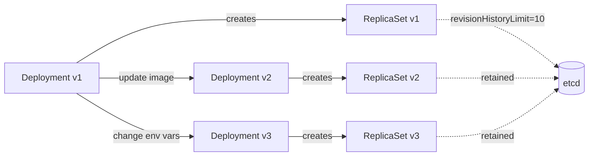

## Key Takeaways

- **Revision ≠ Version Control**: Stop treating K8s Revision like Git commits—it only tracks Pod Template changes, nothing else
- **revisionHistoryLimit is a hidden time bomb**: The default value of 10 can silently balloon your etcd to gigabytes; tune it based on your deployment frequency
- **rollout undo is not a silver bullet**: Rolling back a Deployment doesn't restore ConfigMaps, Secrets, or other external resources—this caused us 2 hours of panic debugging
- **The community needs a real reference guide**: The Reddit thread asking for one confirms that official docs are too scattered; I'm providing a printable one here
- **Revision vs Helm Release are fundamentally different**: Mixing them up leads to broken rollback strategies

## The Incident That Made Me Hate Revisions

Let me tell you about 3 AM last month. We were migrating a core microservice to a new cluster. RollingUpdate strategy, beautiful CI/CD pipeline, everything looked perfect. Until our P99 latency shot from 200ms to 12 seconds.

First instinct: rollback. `kubectl rollout undo deployment/api-gateway`. Clean, right?

Wrong. Two hours later we found the root cause: we'd also updated the ConfigMap and Secret during the same release window. The Deployment rollback restored the old pod template but those external resources stayed on the new version. The app was trying to connect to a database with credentials that no longer existed.

That's the trap of Revision—it only tracks changes to `.spec.template`. Everything else is your problem.

## What Revision Actually Is

The community overcomplicates this. Here's the truth: **A Kubernetes Deployment Revision is an auto-incrementing version number created every time the Pod Template changes**.

Update the container image? New Revision. Change an environment variable? New Revision. Tweak resource limits? New Revision. Each change creates a new ReplicaSet, and that ReplicaSet gets tagged with the next Revision number. Old ReplicaSets stick around (up to revisionHistoryLimit), which is what makes rollback possible.



Notice: you can't manually set Revision numbers. You can't skip numbers. It's an append-only log of Pod Template changes.

## revisionHistoryLimit: The Silent etcd Killer

Here's the default:

```yaml
apiVersion: apps/v1
kind: Deployment
metadata:
  name: nginx-deployment
spec:
  replicas: 3
  revisionHistoryLimit: 10  # default value
  selector:
    matchLabels:
      app: nginx
  template:
    metadata:
      labels:
        app: nginx
    spec:
      containers:
      - name: nginx
        image: nginx:1.25
```

Ten seems reasonable, right? But here's what happened to us: CI/CD pipeline deploying 20 times a day, 140 revisions a week. Even with revisionHistoryLimit=10, each ReplicaSet carries metadata, pod event history, status information—all stored in etcd.

**Real numbers**: One deployment with untuned revisionHistoryLimit grew our etcd from 2GB to 18GB over 3 months. API Server response times degraded noticeably. The culprit? Hundreds of abandoned ReplicaSets.

**Tuning guide**:

| Scenario | Recommended Value | Rationale |
|----------|-------------------|-----------|
| Dev/Test | 2-3 | Fast iteration, no need to roll back far |
| Production - Frequent deploys | 5-10 | Enough safety margin for recent regressions |
| Production - Infrequent deploys | 10-20 | More runway for catching issues |
| Compliance-heavy environments | 50+ | Audit trails may require deep history |
| etcd-constrained clusters | 3-5 | Minimize etcd pressure |

## Rollout Commands: Real Production Usage

Most people think Revision management is just `kubectl rollout undo`. Here's what you actually need:

### 1. View Deployment History

```bash
kubectl rollout history deployment/nginx-deployment

# Output
deployment.apps/nginx-deployment 
REVISION  CHANGE-CAUSE
1         <none>
2         kubectl set image deployment/nginx-deployment nginx=nginx:1.26 --record=true
3         kubectl apply -f nginx-deployment.yaml --record=true
```

⚠️ **Heads up**: CHANGE-CAUSE only shows the command if you used `--record=true`. GitOps tools like ArgoCD or Flux usually leave this blank.

### 2. Inspect a Specific Revision

```bash
kubectl rollout history deployment/nginx-deployment --revision=2

# Output
deployment.apps/nginx-deployment with revision #2
Pod Template:
  Labels:	app=nginx
	pod-template-hash=5d4b8f9c7e
  Containers:
   nginx:
    Image:	nginx:1.26
    Port:	80/TCP
    Host Port:	0/TCP
    Environment:	<none>
    Mounts:	<none>
  Volumes:	<none>
```

This is invaluable when you need to verify what image or config a specific Revision actually had.

### 3. Rollback to a Specific Revision

```bash
# Rollback to previous Revision
kubectl rollout undo deployment/nginx-deployment

# Rollback to specific Revision
kubectl rollout undo deployment/nginx-deployment --to-revision=3
```

**Critical nuance**: Rollback creates a **new** Revision. If you're at Revision 5 and undo to Revision 3, you get Revision 6—its Pod Template matches Revision 3, but Revisions 4 and 5 aren't deleted (unless they exceed revisionHistoryLimit).

```bash
# After rollback
REVISION  CHANGE-CAUSE
1         <none>
2         kubectl set image ...
3         kubectl apply -f ...
4         kubectl apply -f ...  # broken version
5         kubectl apply -f ...  # current version
6         kubectl apply -f ...  # rollback to Revision 3 (new Revision!)
```

### 4. Pause and Resume Deployments

```bash
# Pause (for canary deployments)
kubectl rollout pause deployment/nginx-deployment

# Resume
kubectl rollout resume deployment/nginx-deployment
```

## Revision vs Helm Release: Stop Confusing Them

I see this question on Reddit constantly:

> "I deployed with Helm. What's the difference between `helm rollback` and `kubectl rollout undo`?"

**They are completely different things.**

| Dimension | Revision (K8s native) | Release (Helm) |
|-----------|----------------------|----------------|
| Scope | Pod Template changes only | Entire Chart: ConfigMaps, Secrets, Services, etc. |
| Storage | etcd (ReplicaSet annotations) | Kubernetes Secrets (in kube-system) |
| Granularity | Single Deployment | Entire Release |
| Rollback behavior | Restores Pod Template | Restores all Chart resources |
| Versioning | Auto-increment, no gaps | Manual or auto, can skip numbers |

**My advice**:
- Just changing an image tag or env var? Use `kubectl rollout undo`
- Need to roll back the whole app (ConfigMaps, Services, etc.)? Use `helm rollback`
- But know this: `helm rollback` does NOT restore `kubectl rollout` state—they're independent

## Production-Ready Reference Cheat Sheet

The Reddit thread was right—the community needs a concise reference. Official docs are too scattered. Here's what I use:

### Core Object Reference

| Object | API Version | Purpose | Creates Revisions? |
|--------|-------------|---------|-------------------|
| Deployment | apps/v1 | Stateless apps | ✅ |
| StatefulSet | apps/v1 | Stateful apps | ✅ |
| DaemonSet | apps/v1 | One Pod per Node | ✅ |
| Job | batch/v1 | One-time tasks | ❌ |
| CronJob | batch/v1 | Scheduled tasks | ❌ |
| ReplicaSet | apps/v1 | Pod replication (usually indirect) | ❌ |

### Essential kubectl Commands

```bash
# Check rollout status
kubectl rollout status deployment/<name>

# View revision history
kubectl rollout history deployment/<name>

# Inspect specific revision
kubectl rollout history deployment/<name> --revision=<N>

# Rollback
kubectl rollout undo deployment/<name>
kubectl rollout undo deployment/<name> --to-revision=<N>

# Pause/Resume
kubectl rollout pause deployment/<name>
kubectl rollout resume deployment/<name>

# List ReplicaSets (maps to Revisions)
kubectl get replicaset -l app=<app-name>
```

### Deployment YAML Core Fields

```yaml
apiVersion: apps/v1
kind: Deployment
metadata:
  name: my-app
spec:
  replicas: 3                       # Pod count
  revisionHistoryLimit: 10          # Revisions to retain
  strategy:
    type: RollingUpdate             # RollingUpdate | Recreate
    rollingUpdate:
      maxUnavailable: 25%           # Max unavailable pods during update
      maxSurge: 25%                 # Max extra pods during update
  minReadySeconds: 30               # Wait time after pod is ready
  progressDeadlineSeconds: 600      # Deployment timeout
  selector:
    matchLabels:
      app: my-app
  template:
    metadata:
      labels:
        app: my-app
    spec:
      containers:
      - name: my-app
        image: my-app:1.0.0
```

## Common Failures and Debugging Flows

### Failure 1: Rollback Didn't Fix the Problem

**Symptom**: `kubectl rollout undo` succeeds, but the app is still broken.

**Debug**:
1. Check if external resources changed (ConfigMaps, Secrets, PVCs)
2. Verify the rolled-back Revision's Pod Template with `--revision=<N>`
3. Confirm Service selectors still match your pods

**Fix**: If ConfigMaps/Secrets changed, manually roll them back too. Or use Helm for full-stack management.

### Failure 2: Can't Roll Back Far Enough

**Symptom**: The Revision you need was garbage-collected.

**Debug**:
```bash
# Count remaining ReplicaSets
kubectl get replicaset -l app=<app-name> | wc -l

# Check revisionHistoryLimit
kubectl get deployment <name> -o jsonpath='{.spec.revisionHistoryLimit}'
```

**Fix**: Increase revisionHistoryLimit, but don't go crazy—50 is usually the sensible max before etcd starts hurting.

### Failure 3: Deployment Stuck (Progress Deadline)

**Symptom**: `kubectl rollout status` hangs and eventually times out.

**Debug**:
```bash
kubectl describe deployment <name>
kubectl get pods -l app=<app-name>
kubectl get replicaset -l app=<app-name>
```

**Common causes**:
- Image pull failure (wrong tag, registry auth)
- Health check failure (broken readinessProbe)
- Insufficient resources (CPU/Memory)
- PVC mount failure

## FAQ

### Can you learn Kubernetes in 2 days?

Honestly? No. Two days gets you through "hello world" and maybe a basic understanding of pods. Revision mechanics, network policies, RBAC, storage—that's 2-3 months of hands-on work. Anyone promising "K8s in 2 days" is selling snake oil.

### What's a good revisionHistoryLimit value?

It depends on your deploy frequency and etcd capacity. **5-10 is the sweet spot** for most teams. If you deploy 10+ times daily, drop to 3-5. If you have compliance requirements, 20-50 works but monitor etcd size carefully.

### How many replicas should a Deployment have?

There's no universal answer:
- **Stateless web services**: At least 3, ideally 5-10 with HPA
- **Batch jobs**: 1, or dynamic based on queue length
- **Stateful services (databases)**: Business-dependent, typically 3-5
- **Critical infrastructure (DNS, Ingress)**: At least 2, preferably 3+

### RollingUpdate vs Recreate: which one?

| Strategy | Pros | Cons | Best For |
|----------|------|------|----------|
| RollingUpdate | Zero-downtime updates | Old + new versions coexist | Production web services |
| Recreate | Version consistency, no mixed versions | Downtime window | Stateful services, DB migrations |

**My take**: Use RollingUpdate for 95% of scenarios. Only use Recreate when you absolutely cannot have two versions running simultaneously—like database schema migrations.

## References & Community Insights

- [Kubernetes Official Deployment Documentation](https://kubernetes.io/docs/concepts/workloads/controllers/deployment/) - Authoritative but scattered
- [Reddit r/kubernetes Discussion](https://www.reddit.com/r/kubernetes/comments/1uxuoxl/kubernetes_revisionreference_guide/) - Community thread asking for exactly this kind of reference
- [Kubernetes Up & Running (O'Reilly)](https://www.oreilly.com/library/view/kubernetes-up-and/9781492046523/) - Great book, but Revision section is too shallow
- [Official kubectl Quick Reference](https://kubernetes.io/docs/reference/kubectl/quick-reference/) - Keep this bookmarked

## Final Thoughts

The Revision mechanism isn't flashy. It's not Service Mesh or Operators. But when things go wrong at 3 AM, your ability to quickly find and restore the right Revision is what separates a 10-minute recovery from a 2-hour firefight.

Don't learn this stuff during an incident. Bookmark this article. Print the cheat sheet. You'll thank me later.

<script type="application/ld+json">
{
  "@context": "https://schema.org",
  "@type": "FAQPage",
  "mainEntity": [
    {
      "@type": "Question",
      "name": "Can you learn Kubernetes in 2 days?",
      "acceptedAnswer": {
        "@type": "Answer",
        "text": "Honestly, no. Two days gets you through hello world and basic pod understanding. Revision mechanics, network policies, RBAC, storage—that's 2-3 months of hands-on work."
      }
    },
    {
      "@type": "Question",
      "name": "What's a good revisionHistoryLimit value?",
      "acceptedAnswer": {
        "@type": "Answer",
        "text": "5-10 is the sweet spot for most teams. If you deploy 10+ times daily, drop to 3-5. If you have compliance requirements, 20-50 works but monitor etcd size carefully."
      }
    },
    {
      "@type": "Question",
      "name": "How many replicas should a Deployment have?",
      "acceptedAnswer": {
        "@type": "Answer",
        "text": "Stateless web services: at least 3, ideally 5-10 with HPA. Batch jobs: 1. Stateful services: 3-5 typically. Critical infrastructure: at least 2, preferably 3+."
      }
    },
    {
      "@type": "Question",
      "name": "RollingUpdate vs Recreate: which one?",
      "acceptedAnswer": {
        "@type": "Answer",
        "text": "Use RollingUpdate for 95% of scenarios—it enables zero-downtime updates. Only use Recreate when you need strict version isolation, like database schema migrations."
      }
    }
  ]
}
</script>
