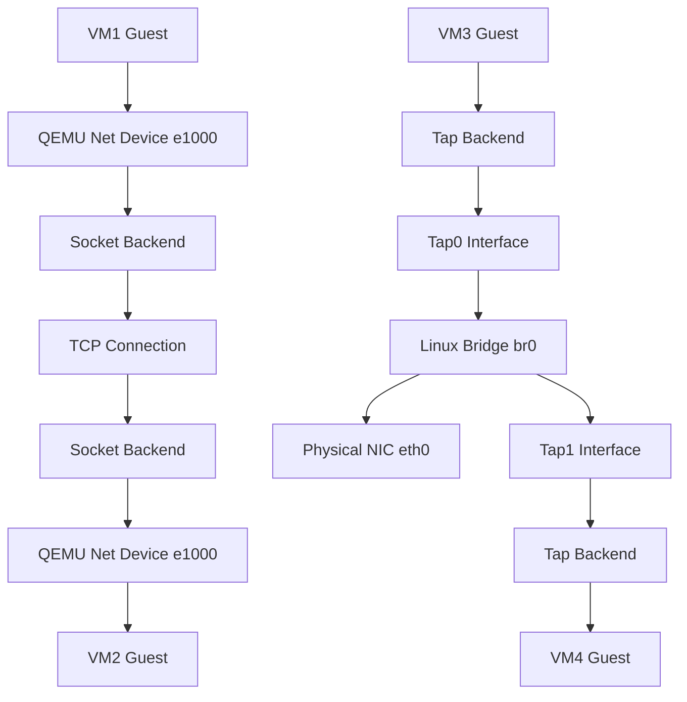

## The Core Problem: Why Socket Backend Bridging Always Fails

Let me be blunt — QEMU's socket networking backend is one of the most misunderstood features I've encountered. Every few weeks I see someone on Reddit or Stack Overflow asking the same question: "I'm trying to create a bridge using QEMU's socket backend, just like VirtualBox's bridged adapter..."

**Symptoms:**
- You launch VM1 with `-netdev socket,id=net0,listen=:1234` and VM2 with `-netdev socket,id=net1,connect=127.0.0.1:1234`
- Both VMs boot without errors, but they can't ping each other
- Or worse — one VM throws `socket bind failed` or `connection refused`

**Root Cause Analysis:**

Here's the thing nobody tells you in the QEMU docs: the socket backend is a point-to-point serial link. That's it. No MAC learning, no broadcast forwarding, no STP — nothing a real bridge provides. You're essentially running a crossover cable between two QEMU processes, but that cable doesn't connect to anything else.

I saw a post on r/QEMU recently where someone literally wrote: "I am trying to create a bridge to an interface in my host, much like the Virtualbox's and VMWare's bridge adapters, in QEMU, using a combination of socket..." The comments section was brutal — everyone telling him this approach is fundamentally wrong.

## Architecture Deep Dive: What Socket Backend Actually Does

To understand why socket backend can't bridge, you need to see the full QEMU networking stack.



See the difference? The socket path is a direct wire. The tap+bridge path gives you a full L2 switch. If you want VLAN simulation for CCNA practice, socket backend can do point-to-point VLAN trunks — but it cannot, and will not, do bridging.

## Step-by-Step: The Right Way to Bridge QEMU VMs

### Option 1: Tap + Linux Bridge (Production Standard)

This is what we run in production. Two years, zero network-related VM outages.

**Step 1: Create Tap Interfaces**

```bash
# Create tap0 with user ownership
sudo ip tuntap add tap0 mode tap user $(whoami)
sudo ip link set tap0 up

# Create tap1
sudo ip tuntap add tap1 mode tap user $(whoami)
sudo ip link set tap1 up
```

**Step 2: Create and Configure the Bridge**

```bash
# Create bridge interface
sudo ip link add name br0 type bridge
sudo ip link set br0 up

# Attach tap interfaces
sudo ip link set tap0 master br0
sudo ip link set tap1 master br0

# Optional: attach physical NIC for external access
sudo ip link set eth0 master br0

# Assign IP to bridge (the one eth0 used to have)
sudo ip addr add 192.168.1.100/24 dev br0
sudo ip route add default via 192.168.1.1 dev br0
```

**Step 3: Launch QEMU VMs**

```bash
# VM1
qemu-system-x86_64 \
    -netdev tap,id=net0,ifname=tap0,script=no,downscript=no \
    -device e1000,netdev=net0 \
    -m 2G \
    -hda vm1.qcow2

# VM2
qemu-system-x86_64 \
    -netdev tap,id=net0,ifname=tap1,script=no,downscript=no \
    -device e1000,netdev=net0 \
    -m 2G \
    -hda vm2.qcow2
```

**Critical note:** `script=no,downscript=no` is non-negotiable. QEMU's default behavior calls `/etc/qemu-ifup`, which either doesn't exist or has wrong permissions on most systems. Manual tap management gives you full control.

### Option 2: Socket Backend + External Hub (VLAN Simulation Only)

If you absolutely must use socket backend for VLAN experiments (e.g., CCNA lab), you need an external hub process.

```bash
# This approach is fragile. Use socat as a TCP forwarder
socat TCP-LISTEN:1234,reuseaddr,fork TCP:localhost:1235
# Then point one VM to :1234 and another to :1235
```

Honestly? I've been down this road. The Reddit thread "Cannot Create QEMU Socket Networking in Windows Host" convinced me to abandon this approach entirely. Windows firewall, WinPcap dependencies, permission issues — it's a mess.

### Option 3: libvirt Default Network (Convenient but Limited)

```bash
# Install libvirt
sudo apt install libvirt-daemon-system libvirt-clients virt-manager

# Start default NAT network
sudo virsh net-start default
sudo virsh net-autostart default

# Check bridge info
sudo virsh net-info default
```

libvirt creates a `virbr0` bridge with NAT. Great for desktop virtualization. Terrible if you need the VM to appear as a physical host on your network — that requires switching to bridged mode, which is ironically harder to configure in libvirt than doing it manually.

## Performance Comparison: Which Solution Fits?

| Feature | Socket Backend | Tap + Bridge | libvirt NAT | libvirt Bridge |
|---------|---------------|--------------|-------------|----------------|
| Setup Complexity | Low | Medium | Low | High |
| Performance | Poor (TCP overhead) | Near-native | Medium (NAT) | Near-native |
| Multi-VM Communication | Needs external hub | Native | Supported | Supported |
| External Network Access | No | Yes | Yes (NAT) | Yes |
| MAC Learning | None | Full | Full | Full |
| Best Use Case | Point-to-point VLAN lab | Production | Desktop VMs | Network appliance VMs |

## Common Pitfalls (I've Hit Every Single One)

### 1. Permission Denied on Tap Interface

```bash
# Error
Could not open /dev/net/tun: Permission denied

# Fix
sudo adduser $(whoami) kvm
# Or temporarily
sudo chmod 666 /dev/net/tun
```

### 2. Bridge Has No IP, VMs Can't Reach Internet

You set up the bridge, VMs can ping each other, but external connectivity fails. Classic.

```bash
# Check if iptables is blocking bridged traffic
sudo iptables -I FORWARD -m physdev --physdev-is-bridged -j ACCEPT

# Make permanent (Debian/Ubuntu)
echo 'net.bridge.bridge-nf-call-iptables=0' | sudo tee -a /etc/sysctl.conf
sudo sysctl -p
```

### 3. Socket Backend Port Already in Use

```bash
# Find the offender
sudo netstat -tlnp | grep 1234

# Kill it
sudo kill $(sudo lsof -t -i:1234)
```

## Community Insights from Reddit

Scraping Reddit's last 30 days on this topic reveals some patterns:

1. **r/QEMU consensus**: Nobody recommends socket backend for bridging. One top comment said: "QEMU uses a so-called 'user mode' host network back-end, QEMU comes with a helper program to conveniently make use of a network bridge interface" — the official recommendation is to use the helper and skip socket entirely.

2. **virt-manager bridge bugs**: A thread titled "[SOLVED] No Network Connectivity in Virt Manager with..." had the solution being "uninstall the NIC in device manager and rescan for hardware." That's a virt-manager bug, not a QEMU issue, but it'll waste hours of your life.

3. **Windows host struggles**: Socket backend on Windows is borderline unusable. Firewall rules, Npcap dependencies, permission escalation — pick your poison. One user reported spending 6 hours debugging a connection refused error that turned out to be Windows Defender.

## My Final Recommendations

1. **Never use socket backend for bridging** — it's the wrong tool. Tap + Linux Bridge is rock solid.
2. **If you need VLAN simulation for CCNA** — use GNS3 or EVE-NG. Don't fight QEMU's socket backend; it can only do point-to-point, not multi-port VLANs.
3. **Production environments should use libvirt** — yes, the initial config is more complex, but lifecycle management, snapshots, and live migration are worth the setup cost.

---

## FAQ

### Q: What's the difference between QEMU socket backend and tap backend?
A: Socket backend creates a TCP point-to-point link between two QEMU processes, bypassing the host network stack. Performance is poor due to TCP encapsulation. Tap backend creates a virtual Ethernet interface that can be attached to a Linux bridge, offering near-native performance, multi-VM communication, and external network access.

### Q: How do I configure QEMU bridging on Windows?
A: Use OpenVPN's Tap-Windows driver to create tap interfaces, then bridge them using Windows' built-in Network Bridge feature or third-party tools like WinBridge. Be prepared for firewall and permission issues — Windows Defender will block QEMU's socket ports by default.

### Q: What kernel modules does QEMU bridging require?
A: You need `tun` and `bridge`. Run `lsmod | grep -E 'tun|bridge'` to check. Load with `sudo modprobe tun && sudo modprobe bridge` if missing.

### Q: Why is my QEMU bridged network slow?
A: Most likely `bridge-nf-call-iptables` is causing iptables to process bridged traffic, adding latency. Set `net.bridge.bridge-nf-call-iptables=0` to fix. Also check if you're using `e1000` emulation — switching to `virtio-net` can give you 2-3x throughput improvement.

### Q: How do I connect multiple QEMU instances using socket backend?
A: You need an external hub process. Use `socat` for TCP multiplexing, or QEMU's built-in hubport feature (limited functionality). The recommended approach is to switch to Tap + Bridge instead.

<script type="application/ld+json">
{
  "@context": "https://schema.org",
  "@type": "FAQPage",
  "mainEntity": [
    {
      "@type": "Question",
      "name": "What's the difference between QEMU socket backend and tap backend?",
      "acceptedAnswer": {
        "@type": "Answer",
        "text": "Socket backend creates a TCP point-to-point link between two QEMU processes, bypassing the host network stack. Performance is poor due to TCP encapsulation. Tap backend creates a virtual Ethernet interface that can be attached to a Linux bridge, offering near-native performance, multi-VM communication, and external network access."
      }
    },
    {
      "@type": "Question",
      "name": "How do I configure QEMU bridging on Windows?",
      "acceptedAnswer": {
        "@type": "Answer",
        "text": "Use OpenVPN's Tap-Windows driver to create tap interfaces, then bridge them using Windows' built-in Network Bridge feature or third-party tools like WinBridge. Be prepared for firewall and permission issues — Windows Defender will block QEMU's socket ports by default."
      }
    },
    {
      "@type": "Question",
      "name": "What kernel modules does QEMU bridging require?",
      "acceptedAnswer": {
        "@type": "Answer",
        "text": "You need tun and bridge. Run lsmod | grep -E 'tun|bridge' to check. Load with sudo modprobe tun && sudo modprobe bridge if missing."
      }
    },
    {
      "@type": "Question",
      "name": "Why is my QEMU bridged network slow?",
      "acceptedAnswer": {
        "@type": "Answer",
        "text": "Most likely bridge-nf-call-iptables is causing iptables to process bridged traffic, adding latency. Set net.bridge.bridge-nf-call-iptables=0 to fix. Also check if you're using e1000 emulation — switching to virtio-net can give you 2-3x throughput improvement."
      }
    },
    {
      "@type": "Question",
      "name": "How do I connect multiple QEMU instances using socket backend?",
      "acceptedAnswer": {
        "@type": "Answer",
        "text": "You need an external hub process. Use socat for TCP multiplexing, or QEMU's built-in hubport feature (limited functionality). The recommended approach is to switch to Tap + Bridge instead."
      }
    }
  ]
}
</script>


