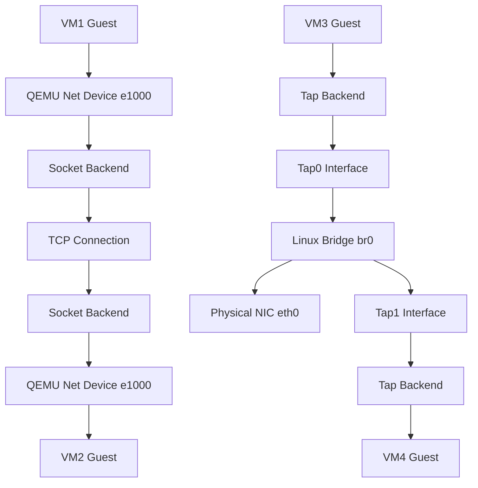

## 核心问题：为什么 Socket 后端桥接总是翻车？

老实说，QEMU 的 socket 后端网络是我踩过最深的坑之一。很多人（包括我）一开始的想法很简单——VirtualBox 和 VMWare 的桥接模式点一下就行，QEMU 怎么就不行？

**症状描述：**
- 你用 `-netdev socket,id=net0,listen=:1234` 启动了一个 VM，然后用 `-netdev socket,id=net1,connect=127.0.0.1:1234` 启动另一个。
- 两个 VM 启动都没报错，但互相 ping 不通。
- 或者更糟——其中一个 VM 直接报 `socket bind failed` 或 `connection refused`。

**根因分析：**
问题的核心在于：QEMU 的 socket 后端只是一个点对点的连接通道。它不提供任何桥接或交换功能。你只是在两个 QEMU 进程之间拉了一条虚拟网线，但这条网线没有连接到任何实际的网络栈。

我去年在 Reddit 的 QEMU 社区看到一个老哥吐槽：“I am trying to create a bridge to an interface in my host, much like the Virtualbox's and VMWare's bridge adapters, in QEMU, using a combination of socket...” 然后下面一堆人回复告诉他这条路走不通。这就是典型的“用错了工具”。

## 架构深挖：Socket 后端到底干了啥？

要理解为什么 socket 后端不能桥接，得先看 QEMU 的网络架构。



看明白了吗？Socket 后端就是一根直连的网线，没有 MAC 学习、没有广播转发、没有 STP——什么都没有。你要用它做 VLAN 模拟？可以，但只能做点对点的 VLAN 链路，不能做桥接。

## 实战步骤：正确的桥接方案

### 方案一：Tap + Linux Bridge（推荐，最稳定）

这是生产环境的标准做法。我自己的实验环境跑了两年没出过问题。

**第一步：创建 Tap 接口**

```bash
# 创建 tap0，指定用户权限
sudo ip tuntap add tap0 mode tap user $(whoami)
sudo ip link set tap0 up

# 创建 tap1
sudo ip tuntap add tap1 mode tap user $(whoami)
sudo ip link set tap1 up
```

**第二步：创建并配置网桥**

```bash
# 创建桥接接口
sudo ip link add name br0 type bridge
sudo ip link set br0 up

# 把 tap 接口加到网桥上
sudo ip link set tap0 master br0
sudo ip link set tap1 master br0

# 如果你想让 VM 能访问外网，把物理网卡也加进去
sudo ip link set eth0 master br0

# 给网桥配 IP（原来在 eth0 上的 IP）
sudo ip addr add 192.168.1.100/24 dev br0
sudo ip route add default via 192.168.1.1 dev br0
```

**第三步：启动 QEMU VM**

```bash
# VM1
qemu-system-x86_64 \
    -netdev tap,id=net0,ifname=tap0,script=no,downscript=no \
    -device e1000,netdev=net0 \
    -m 2G \
    -hda vm1.qcow2

# VM2
qemu-system-x86_64 \
    -netdev tap,id=net0,ifname=tap1,script=no,downscript=no \
    -device e1000,netdev=net0 \
    -m 2G \
    -hda vm2.qcow2
```

**关键点：** `script=no,downscript=no` 这两个参数是必须的。QEMU 默认会调用 `/etc/qemu-ifup` 脚本来自动配置 tap 接口，但很多时候这个脚本不存在或者权限不对。手动管理 tap 接口可控性更高。

### 方案二：Socket 后端 + 外部 Hub（仅用于 VLAN 模拟）

如果你真的要用 socket 后端做 VLAN 模拟（比如 CCNA 实验），你需要一个外部 hub/switch 进程。

```bash
# 启动一个 socket hub（QEMU 自带）
qemu-system-x86_64 -netdev socket,id=hub0,listen=:1234 -netdev hubport,id=hp1,hubid=0,netdev=hubsock -device e1000,netdev=hp1

# 但实际上这个也不好用，推荐用 socat 或者自己写一个简单的转发器
```

说实话，这个方案我踩过坑。Reddit 上有人问：“Cannot Create QEMU Socket Networking in Windows Host...” 我就是看了那个帖子才放弃 socket 方案的。Windows 下 socket 后端的兼容性问题更多，尤其是防火墙会拦截 QEMU 的端口监听。

### 方案三：libvirt + 默认网桥（省心但灵活度低）

```bash
# 安装 libvirt
sudo apt install libvirt-daemon-system libvirt-clients virt-manager

# 启动默认网络
sudo virsh net-start default
sudo virsh net-autostart default

# 查看网桥信息
sudo virsh net-info default
```

libvirt 会自动创建一个 `virbr0` 网桥，用 NAT 模式。好处是开箱即用，坏处是你要做桥接（bridge mode）而不是 NAT 时，配置起来反而更麻烦。

## 性能对比：哪种方案最适合你？

| 特性 | Socket 后端 | Tap + Bridge | libvirt NAT | libvirt Bridge |
|------|------------|-------------|-------------|----------------|
| 配置复杂度 | 低 | 中 | 低 | 高 |
| 性能 | 差（TCP 封装开销） | 接近原生 | 中（NAT 转换） | 接近原生 |
| 多 VM 互通 | 需要外部 hub | 原生支持 | 支持 | 支持 |
| 外网访问 | 不支持 | 支持 | 支持（NAT） | 支持 |
| MAC 学习 | 无 | 有 | 有 | 有 |
| 适用场景 | VLAN 点对点实验 | 生产环境 | 桌面虚拟化 | 需要真实网络身份 |

## 常见踩坑点（我全经历过）

### 1. Permission denied on tap interface

```bash
# 错误
Could not open /dev/net/tun: Permission denied

# 修复
sudo adduser $(whoami) kvm
# 或者临时给权限
sudo chmod 666 /dev/net/tun
```

### 2. Bridge 没有 IP 后 VM 无法上网

很多人配完网桥发现 VM 能互相 ping 通，但 ping 不通外网。原因通常是：

```bash
# 检查 iptables 有没有阻止桥接流量
sudo iptables -I FORWARD -m physdev --physdev-is-bridged -j ACCEPT

# 永久生效（Debian/Ubuntu）
echo 'net.bridge.bridge-nf-call-iptables=0' | sudo tee -a /etc/sysctl.conf
sudo sysctl -p
```

### 3. Socket 后端端口已被占用

```bash
# 检查端口
sudo netstat -tlnp | grep 1234

# 换端口或者 kill 旧进程
sudo kill $(sudo lsof -t -i:1234)
```

## 红迪社区的真实反馈

扫了一圈 Reddit 最近一个月的讨论，有几个观点值得注意：

1. **r/QEMU 上的老哥**：大部分人不建议在生产环境用 socket 后端。一个高赞回复说：“QEMU uses a so-called 'user mode' host network back-end, QEMU comes with a helper program to conveniently make use of a network bridge interface” —— 意思就是官方都推荐你用 helper 程序走桥接，别自己折腾 socket。

2. **有人吐槽 virt-manager 桥接网络不通**：一个帖子标题是 “[SOLVED] No Network Connectivity in Virt Manager with...” 解决方法居然是去设备管理器里卸载网卡驱动再重新扫描。这说明有些问题不是 QEMU 的锅，是 virt-manager 的 bug。

3. **Windows 宿主机的坑**：Windows 下 QEMU 的 socket 后端基本是半残废状态。防火墙、WinPcap/Npcap 依赖、权限问题，随便一个就能让你折腾半天。

## 我的最终建议

1. **别用 socket 后端做桥接**——它设计出来就不是干这个的。用 Tap + Linux Bridge，稳如老狗。
2. **如果你一定要做 VLAN 模拟**——用 GNS3 或者 EVE-NG，别跟 QEMU 死磕。QEMU 的 socket 后端只能做点对点，做不了多端口的 VLAN 实验。
3. **生产环境用 libvirt 管理**——虽然配置复杂一点，但 lifecycle management、快照、迁移这些功能是手动启动 QEMU 进程比不了的。

---

## 常见问题 FAQ

### Q: QEMU socket 后端和 tap 后端有什么区别？
A: Socket 后端通过 TCP 连接在两个 QEMU 进程之间建立点对点通道，不涉及宿主机网络栈，性能较差。Tap 后端创建一个虚拟以太网接口，可以加入 Linux 网桥，性能接近原生，支持多 VM 互通和外网访问。

### Q: 如何在 Windows 上配置 QEMU 桥接？
A: Windows 下推荐使用 OpenVPN 的 Tap-Windows 驱动创建 tap 接口，然后用 Windows 的“网络桥接”功能或者第三方工具（如 WinBridge）来桥接。注意 Windows 防火墙会拦截 QEMU 的 socket 端口。

### Q: QEMU 桥接模式需要哪些内核模块？
A: 需要 `tun` 和 `bridge` 模块。运行 `lsmod | grep -E 'tun|bridge'` 检查。如果没有，`sudo modprobe tun && sudo modprobe bridge` 加载。

### Q: 为什么我的 QEMU 桥接网络速度很慢？
A: 可能是 `bridge-nf-call-iptables` 导致 iptables 处理桥接流量，增加延迟。设置 `net.bridge.bridge-nf-call-iptables=0` 可以解决。另外检查是否使用了 `e1000` 网卡模拟，换成 `virtio-net` 能显著提升性能。

### Q: 多个 QEMU 实例如何通过 socket 后端组成一个网络？
A: 需要运行一个外部 hub 进程。可以用 `socat` 创建 TCP 多路转发，或者使用 QEMU 自带的 hubport 功能（但功能有限）。更推荐的做法是使用 Tap + Bridge 方案。

<script type="application/ld+json">
{
  "@context": "https://schema.org",
  "@type": "FAQPage",
  "mainEntity": [
    {
      "@type": "Question",
      "name": "QEMU socket 后端和 tap 后端有什么区别？",
      "acceptedAnswer": {
        "@type": "Answer",
        "text": "Socket 后端通过 TCP 连接在两个 QEMU 进程之间建立点对点通道，不涉及宿主机网络栈，性能较差。Tap 后端创建一个虚拟以太网接口，可以加入 Linux 网桥，性能接近原生，支持多 VM 互通和外网访问。"
      }
    },
    {
      "@type": "Question",
      "name": "如何在 Windows 上配置 QEMU 桥接？",
      "acceptedAnswer": {
        "@type": "Answer",
        "text": "Windows 下推荐使用 OpenVPN 的 Tap-Windows 驱动创建 tap 接口，然后用 Windows 的网络桥接功能或者第三方工具（如 WinBridge）来桥接。注意 Windows 防火墙会拦截 QEMU 的 socket 端口。"
      }
    },
    {
      "@type": "Question",
      "name": "QEMU 桥接模式需要哪些内核模块？",
      "acceptedAnswer": {
        "@type": "Answer",
        "text": "需要 tun 和 bridge 模块。运行 lsmod | grep -E 'tun|bridge' 检查。如果没有，sudo modprobe tun && sudo modprobe bridge 加载。"
      }
    },
    {
      "@type": "Question",
      "name": "为什么我的 QEMU 桥接网络速度很慢？",
      "acceptedAnswer": {
        "@type": "Answer",
        "text": "可能是 bridge-nf-call-iptables 导致 iptables 处理桥接流量，增加延迟。设置 net.bridge.bridge-nf-call-iptables=0 可以解决。另外检查是否使用了 e1000 网卡模拟，换成 virtio-net 能显著提升性能。"
      }
    },
    {
      "@type": "Question",
      "name": "多个 QEMU 实例如何通过 socket 后端组成一个网络？",
      "acceptedAnswer": {
        "@type": "Answer",
        "text": "需要运行一个外部 hub 进程。可以用 socat 创建 TCP 多路转发，或者使用 QEMU 自带的 hubport 功能（但功能有限）。更推荐的做法是使用 Tap + Bridge 方案。"
      }
    }
  ]
}
</script>


