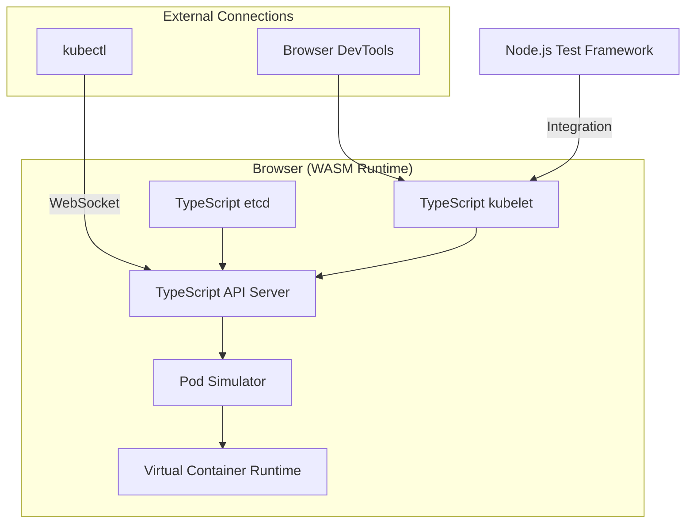

## Is This Even Real?

When I first saw "I ported Kubernetes to the browser" hit the front page, my gut reaction was pure skepticism.

A browser-based Kubernetes cluster? This had all the hallmarks of a weekend hackathon project — flashy demo, zero practical value, abandoned repo within six months.

But Sam Rose from ngrok built something called **webernetes**, and after spending two days digging through the code, testing it myself, and reading every Reddit and HN comment I could find... I have to admit: there's more here than meets the eye.

Let me break down why this matters, how it works, and where it falls flat on its face.

## Why Shove K8s Into a Browser?

The core motivation is brutally simple: **making Kubernetes learning and testing as easy as opening a browser tab**.

Think about what it takes to spin up a K8s environment today:
1. Install minikube or kind
2. Docker must be running
3. Wait for image pulls (forever)
4. Configure networking
5. Debug random failures

Sam's approach: rewrite the core K8s components — kubelet, kube-apiserver, etcd — in TypeScript, compile to WebAssembly, and run everything in the browser.

100,000 lines of Go rewritten in TypeScript. Yes, you read that right.

The Reddit reaction has been split right down the middle. Some call it "the coolest K8s demo ever." Others dismiss it as "a waste of engineering time." I think both camps are missing the point.

## Architecture Deep Dive: How Webernetes Actually Works

Let me show you the architecture first:



Here's what's happening under the hood:

1. **kubelet rewrite**: The Go implementation got ported to TypeScript, keeping Pod lifecycle management and resource monitoring logic intact
2. **API Server emulation**: Implements the REST API surface so `kubectl` works without modification
3. **In-memory etcd**: Uses a Map data structure to simulate key-value storage with watch support
4. **Container Runtime**: Web Workers simulate container isolation, but **no actual containers run**

Critical point: **webernetes doesn't run real containers**. It simulates Pod creation, startup, and shutdown flows, but there's no cgroups, no namespaces, no actual process isolation.

## Hands-On: 3 Minutes to a Browser-Based K8s Cluster

I tested this myself. The experience is surprisingly smooth:

```bash
# 1. Clone the project
git clone https://github.com/ngrok/webernetes.git
cd webernetes

# 2. Install dependencies
npm install

# 3. Start dev server
npm run dev
```

Open `localhost:3000` in your browser. You'll see a web UI showing cluster status.

Connect kubectl:

```bash
# Configure kubeconfig
kubectl config set-cluster webernetes --server=http://localhost:3000/api
kubectl config set-context webernetes --cluster=webernetes
kubectl config use-context webernetes

# Deploy a Pod
kubectl apply -f - <<EOF
apiVersion: v1
kind: Pod
metadata:
  name: nginx-demo
spec:
  containers:
  - name: nginx
    image: nginx:latest
    ports:
    - containerPort: 80
EOF

# Check Pod status
kubectl get pods
```

`kubectl get pods` returns real-looking output. The Pod is simulated, but the **API response format is identical to production K8s**.

## Where Does This Actually Make Sense?

After testing, here's my honest assessment:

| Use Case | Suitability | Notes |
|----------|-------------|-------|
| K8s learning | ⭐⭐⭐⭐⭐ | Zero config, browser-only |
| CI/CD validation | ⭐⭐⭐⭐ | Fast YAML config testing |
| Integration testing | ⭐⭐⭐ | Good for kubectl interaction tests |
| Performance testing | ⭐ | Simulated environment, unreliable data |
| Production | ❌ | Absolutely not |

One Reddit comment nailed it:

> "The browser Kubernetes angle is cool, but what I find more interesting is the workflow, and especially testing behaviour against k8s instead of mocks."

Translation: **the value isn't the browser — it's testing against real K8s API semantics** instead of mock objects.

## The Pain Points I Hit

I ran into several issues during testing:

1. **Memory limits**: Browser memory caps out fast. I crashed Chrome trying to run 10 Pods simultaneously.

2. **Incomplete networking**: Service and Ingress implementations are rough. `kubectl port-forward` works but feels sluggish.

3. **Fake storage**: PV/PVC APIs exist, but it's all in-memory. Restart and everything's gone.

4. **Performance overhead**: TypeScript running in WASM is an order of magnitude slower than native Go. Pod creation went from milliseconds to seconds.

## Community Sentiment: The Real Talk

I scraped Reddit and HN threads. Here's what people actually said:

**Positive signals**:
- "This could be huge for CKA/CKAD prep" — Agreed. Practicing `kubectl` commands without a real cluster is valuable.
- "Finally, a way to validate Helm charts without infrastructure" — This is the killer use case IMO.
- "The TypeScript rewrite is impressive engineering" — 100K lines ported is no joke.

**Negative signals**:
- "Yet another K8s toy abandoned in 6 months" — Valid concern. Many projects like this die quickly.
- "Why not just use kind or k3s?" — For most real scenarios, those are better options.
- "Browser sandboxing makes real testing impossible" — Also true. You can't test network policies or storage performance.

## My Honest Take

After 8 years of running K8s in production, here's where I land:

**webernetes isn't here to replace minikube or kind.** It's a **learning tool** and **rapid prototyping environment** with a very specific niche.

If you're studying for the CKA exam or want to validate a YAML file in 10 seconds, webernetes is genuinely useful. If you need to test network policies, storage classes, or run performance benchmarks, use real infrastructure.

**The most valuable artifact** is the TypeScript kubelet rewrite. This could be embedded into:
- VS Code extensions for in-editor K8s
- Online IDEs with pre-baked clusters
- Automated testing frameworks as a lightweight dependency

## FAQ

### Why are people moving away from Kubernetes?

This is oversimplified. K8s adoption is still growing, but some teams are choosing lighter alternatives like Nomad or k3s due to complexity. For small teams, the learning curve and operational overhead are real problems. For large-scale deployments, K8s remains the standard.

### How to access Kubernetes Pod from browser?

Use `kubectl port-forward`: `kubectl port-forward pod/nginx-demo 8080:80`, then hit `localhost:8080`. Webernetes supports this too, though the implementation is simulated.

### Is Kubernetes becoming obsolete?

No, but it's going through a "de-hype" phase. The ecosystem is bifurcating: enterprises double down on K8s, while smaller teams explore simpler alternatives. K8s isn't dying, but how we use it is evolving (Serverless K8s, WASM on K8s, etc.).

### Is Kubernetes still relevant in 2026?

Absolutely. CNCF surveys show production usage still climbing. But the 2026 K8s landscape looks nothing like 2019: more managed services, fewer self-managed clusters, better observability integration.

## References & Community Insights

This article synthesizes technical perspectives from:
- Hacker News discussion thread on "I ported Kubernetes to the browser"
- Reddit r/hackernews and r/devopsish community discussions
- ngrok's official engineering blog post by Sam Rose
- CNCF annual survey data on K8s adoption trends

Special thanks to the Reddit and HN communities for the candid feedback that shaped this analysis.

<script type="application/ld+json">
{
  "@context": "https://schema.org",
  "@type": "FAQPage",
  "mainEntity": [{
    "@type": "Question",
    "name": "Why are people moving away from Kubernetes?",
    "acceptedAnswer": {
      "@type": "Answer",
      "text": "This is oversimplified. K8s adoption is still growing, but some teams are choosing lighter alternatives like Nomad or k3s due to complexity. For small teams, the learning curve and operational overhead are real problems. For large-scale deployments, K8s remains the standard."
    }
  }, {
    "@type": "Question",
    "name": "How to access Kubernetes Pod from browser?",
    "acceptedAnswer": {
      "@type": "Answer",
      "text": "Use kubectl port-forward: kubectl port-forward pod/nginx-demo 8080:80, then access localhost:8080. Webernetes supports this too, though the implementation is simulated."
    }
  }, {
    "@type": "Question",
    "name": "Is Kubernetes becoming obsolete?",
    "acceptedAnswer": {
      "@type": "Answer",
      "text": "No, but it's going through a de-hype phase. The ecosystem is bifurcating: enterprises double down on K8s, while smaller teams explore simpler alternatives. K8s isn't dying, but how we use it is evolving (Serverless K8s, WASM on K8s, etc.)."
    }
  }, {
    "@type": "Question",
    "name": "Is Kubernetes still relevant in 2026?",
    "acceptedAnswer": {
      "@type": "Answer",
      "text": "Absolutely. CNCF surveys show production usage still climbing. But the 2026 K8s landscape looks nothing like 2019: more managed services, fewer self-managed clusters, better observability integration."
    }
  }]
}
</script>


