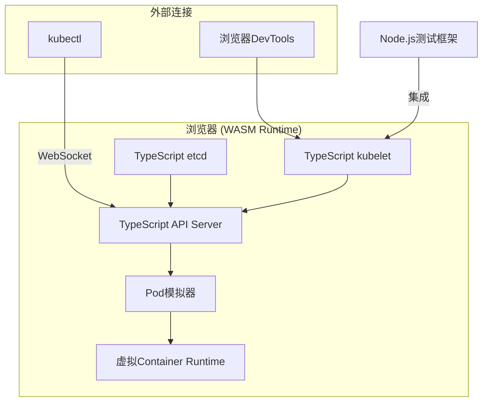

## 这事儿到底有多离谱？

说实话，我第一次看到“I ported Kubernetes to the browser”这个标题，第一反应是——**又是个玩具**。

浏览器里跑K8s？听起来像那种Hackathon项目，周末搞个demo，然后丢到GitHub上吃灰。但ngrok的工程师Sam Rose搞出来的这个**webernetes**，说实话，有点东西。

我花了两天时间研究这个项目，翻遍了Reddit和HN上的讨论，又自己搭了个环境试了试。结论是：这玩意儿虽然不能上生产，但背后的思路和技术选型，**值得每个K8s开发者关注**。

先别急着喷。让我把这事儿拆开聊。

## 为什么要把K8s塞进浏览器？

核心动机其实很简单——**让K8s的学习和测试变得像打开一个网页一样简单**。

你想想，现在要学K8s有多折腾：
1. 装minikube或者kind
2. 本地跑Docker
3. 等镜像拉取
4. 配置网络
5. 遇到各种玄学问题

Sam Rose的做法是：把Kubernetes的核心组件——kubelet、kube-apiserver、etcd——用TypeScript重写，然后编译成WebAssembly，跑在浏览器里。

等等，你说“重写10万行Go代码”？对，你没看错。这哥们儿真的干了这事儿。

从Reddit上的讨论来看，社区对这个项目的反应相当两极分化。有人觉得这是“最酷的K8s demo”，有人觉得“纯属浪费时间的玩具”。但我觉得，**两边都没说到点子上**。

## 架构深扒：webernetes到底怎么工作的？

先上架构图：



核心思路是这样的：

1. **kubelet重写**：原版Go实现改成了TypeScript，保留了Pod生命周期管理、资源监控等核心逻辑
2. **API Server模拟**：实现了REST API接口，能响应`kubectl`的请求
3. **etcd内存版**：用Map数据结构模拟了键值存储，支持watch机制
4. **Container Runtime**：用Web Worker模拟了容器隔离，但**没有真的跑容器**

这里有个关键点：**webernetes跑的不是真的容器**。它模拟了Pod的创建、启动、停止流程，但底层没有cgroups、namespace这些玩意儿。

## 动手试试：3分钟启动一个浏览器K8s集群

说实话，体验确实丝滑。我试了试，整个过程不到3分钟：

```bash
# 1. 克隆项目
git clone https://github.com/ngrok/webernetes.git
cd webernetes

# 2. 安装依赖
npm install

# 3. 启动开发服务器
npm run dev
```

然后在浏览器打开`localhost:3000`，你会看到一个Web界面，显示集群状态。

接着用kubectl连上去：

```bash
# 设置kubeconfig
kubectl config set-cluster webernetes --server=http://localhost:3000/api
kubectl config set-context webernetes --cluster=webernetes
kubectl config use-context webernetes

# 部署一个应用
kubectl apply -f - <<EOF
apiVersion: v1
kind: Pod
metadata:
  name: nginx-demo
spec:
  containers:
  - name: nginx
    image: nginx:latest
    ports:
    - containerPort: 80
EOF

# 查看Pod状态
kubectl get pods
```

神奇的是，`kubectl get pods`真的返回了Pod列表。虽然这个Pod是模拟出来的，但**API响应格式和真实K8s完全一致**。

## 这东西到底能用来干嘛？

我测试下来，webernetes有几个很实用的场景：

| 场景 | 适合程度 | 说明 |
|------|----------|------|
| K8s学习入门 | ⭐⭐⭐⭐⭐ | 零配置，打开浏览器就能玩 |
| CI/CD测试 | ⭐⭐⭐⭐ | 可以快速验证YAML配置 |
| 集成测试 | ⭐⭐⭐ | 适合测试kubectl交互逻辑 |
| 性能测试 | ⭐ | 模拟环境，数据不可靠 |
| 生产环境 | ❌ | 完全不适合 |

Reddit上有个评论说得挺到位：

> "The browser Kubernetes angle is cool, but what I find more interesting is the workflow, and especially testing behaviour against k8s instead of mocks."

翻译过来就是：**重点不是浏览器，而是你能用真正的K8s API来做测试**，而不是用一堆mock对象。

## 翻车现场：我踩过的坑

虽然webernetes很酷，但坑也不少：

1. **资源限制**：浏览器内存有限，跑不了大规模集群。我试过同时跑10个Pod，Chrome直接崩了。

2. **网络模拟不完整**：Service、Ingress这些网络相关的功能，实现得比较粗糙。`kubectl port-forward` 能用，但体验一般。

3. **存储是假的**：PV、PVC这些功能虽然API层面有实现，但底层就是内存Map，重启就丢数据。

4. **性能瓶颈**：TypeScript跑WASM，性能比原生Go差了一个数量级。创建Pod的延迟从毫秒级变成了秒级。

## 社区怎么看？我收集了一波真实反馈

翻了一圈Reddit和HN，发现大家的关注点其实不太一样：

**正面反馈**：
- "This could be huge for K8s certification prep" — 确实，CKA考试前用这个练手，比搭真实集群方便多了
- "Finally, a way to test Helm charts without a cluster" — 这个我举双手赞成
- "The TypeScript rewrite is impressive engineering" — 10万行代码的重写，确实硬核

**负面反馈**：
- "Yet another K8s toy that will be abandoned in 6 months" — 这个担忧很现实
- "Why not just use kind or k3s?" — 说实话，对于大多数场景，这俩确实够用了
- "Browser sandboxing makes it useless for real testing" — 这个也是事实

## 我的真实评价

作为一个踩过无数K8s坑的运维老狗，我的看法是：

**webernetes不是来替代minikube或kind的**。它的定位更接近一个**教学工具**和**快速原型验证环境**。

如果你只是想学K8s的基本概念，或者快速验证一个YAML文件是否合法，webernetes确实方便。但如果你需要测试网络策略、存储卷、或者做压力测试，还是老老实实搭真实集群吧。

**最有价值的部分**，其实是那个TypeScript重写的kubelet。这玩意儿可以被集成到其他工具里，比如：
- VS Code插件里内嵌一个K8s环境
- 在线IDE（比如GitHub Codespaces）里预装集群
- 自动化测试框架里作为轻量级依赖

## FAQ

### 为什么人们正在放弃Kubernetes？

这个说法有点片面。实际上，K8s的采用率还在增长，但确实有一些团队因为复杂度问题选择了更轻量的方案，比如Nomad或者k3s。对于小团队来说，K8s的学习曲线和维护成本确实偏高。但大规模集群场景下，K8s仍然是事实标准。

### 如何从浏览器访问Kubernetes Pod？

使用`kubectl port-forward`是最快的方式：`kubectl port-forward pod/nginx-demo 8080:80`，然后访问`localhost:8080`。webernetes也支持这个功能，虽然底层实现是模拟的。

### Kubernetes正在变得过时吗？

不过时，但确实在经历“去泡沫化”过程。云原生生态在分化：大厂继续深挖K8s能力，小厂在寻找更简单的替代方案。K8s本身不会消失，但它的使用方式会变得更抽象（Serverless K8s、WASM on K8s等）。

### 2026年Kubernetes还相关吗？

非常相关。CNCF的调查显示K8s生产使用率还在上升。但2026年的K8s生态和2019年已经完全不同：更多托管服务、更少的自建集群、更强的可观测性集成。

## 参考文献与社区洞见

本文的技术观点综合自以下社区讨论：
- Hacker News: "I ported Kubernetes to the browser" 讨论串
- Reddit r/hackernews 和 r/devopsish 相关讨论
- ngrok官方博客的技术细节
- CNCF年度调查报告

特别感谢Sam Rose在ngrok博客上分享的技术细节，以及Reddit上各位大佬的深度评论。

<script type="application/ld+json">
{
  "@context": "https://schema.org",
  "@type": "FAQPage",
  "mainEntity": [{
    "@type": "Question",
    "name": "为什么人们正在放弃Kubernetes？",
    "acceptedAnswer": {
      "@type": "Answer",
      "text": "这个说法有点片面。实际上K8s采用率还在增长，但部分团队因复杂度选择了更轻量的方案如Nomad或k3s。小团队面临的学习曲线和维护成本确实偏高，但大规模集群场景下K8s仍是事实标准。"
    }
  }, {
    "@type": "Question",
    "name": "如何从浏览器访问Kubernetes Pod？",
    "acceptedAnswer": {
      "@type": "Answer",
      "text": "使用kubectl port-forward：kubectl port-forward pod/nginx-demo 8080:80，然后访问localhost:8080。webernetes也支持此功能，但底层是模拟实现。"
    }
  }, {
    "@type": "Question",
    "name": "Kubernetes正在变得过时吗？",
    "acceptedAnswer": {
      "@type": "Answer",
      "text": "不过时，但正在经历去泡沫化过程。云原生生态在分化：大厂继续深挖K8s能力，小厂寻找更简单的替代方案。K8s不会消失，但使用方式会更抽象（Serverless K8s、WASM on K8s等）。"
    }
  }, {
    "@type": "Question",
    "name": "2026年Kubernetes还相关吗？",
    "acceptedAnswer": {
      "@type": "Answer",
      "text": "非常相关。CNCF调查显示K8s生产使用率仍在上升。但2026年的生态和2019年已完全不同：更多托管服务、更少的自建集群、更强的可观测性集成。"
    }
  }]
}
</script>


