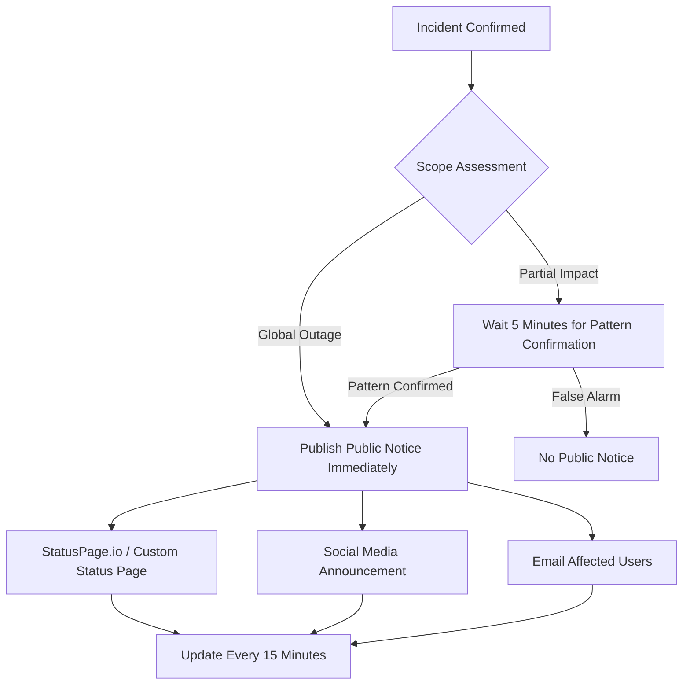

## The Core Problem: Why "Just Send an Email" Doesn't Scale

I was at a meetup last month, and a friend who just joined a mid-sized FinTech was venting. At his old company (200 people), an outage meant yelling in Slack or making a phone call. At the new place, it took him two weeks just to figure out who to notify when something breaks.

This isn't an edge case. The r/sysadmin subreddit has a perennial thread: "Larger Companies - How to notify outages?" The answers are usually polarized — either "we use a Slack bot + email blast" or "we have a dedicated Incident Response team with a full-blown process."

**But the real challenge for large companies (5,000+ employees, multi-datacenter, global user base) goes way beyond "sending a notification."**

1. **Notification Link Reliability**: Your Slack, Teams, or Email probably runs on the same cloud you're trying to monitor. During the March 2022 AWS us-east-1 outage, a ton of companies that relied on AWS SES for email notifications went completely silent — because the email service itself was down.
2. **Audience Diversity**: Internal engineers, executives, customers, partners, regulators — each group needs different content delivered through different channels.
3. **Timeliness vs. Accuracy**: Early in an incident, information is chaotic. Send too early, and it's a false alarm. Send too late, and your users have already rage-posted on social media. There's a classic Reddit story about a SaaS company that had a 6-hour outage but didn't issue a public notice until hour 4. The backlash was brutal.

From my experience, this isn't a "which tool" problem. It's about **designing a layered, fault-tolerant, auditable notification protocol**.

## Architecture Deep Dive: The Three-Layer Notification Protocol

After a few spectacular notification failures, our team iterated on a three-tier architecture. The TL;DR: don't put all your eggs in one basket.

### Layer 1: Internal Real-Time Alerts (TTD < 1 minute)

This layer targets the on-call engineer. The goal is **sub-minute triggering**.

```yaml
# A simplified PagerDuty-like notification rule configuration
notification_rules:
  - name: "critical_prod_outage"
    conditions:
      - metric: "error_rate"
        threshold: 5%
        window: "1m"
    targets:
      - channel: "pagerduty"
        urgency: "critical"
        escalation_policy: "sre-core"
      - channel: "slack"
        channel_id: "C01XXXXXX"
        message_template: "🚨 CRITICAL: {{service}} error_rate is {{value}}%"
        override_do_not_disturb: true
      - channel: "sms"
        provider: "twilio"
        numbers: ["+1-555-XXXXXX"]
        fallback: true  # Only triggers if PagerDuty and Slack both fail
```

**Key takeaways**:
- Use at least two independent notification providers. We ran PagerDuty and Opsgenie (now Atlassian) in parallel. It's expensive, but once PagerDuty itself had an incident, and Opsgenie was the backup that actually woke up the SRE.
- SMS as the last-resort physical layer. Don't laugh — during a major cloud outage last year, a single SMS was what actually reached the on-call engineer.

### Layer 2: Internal Status Page & Org-Wide Broadcast (TTD < 5 minutes)

This layer targets all internal employees, especially non-technical teams (support, sales, execs).

```python
# A simplified internal status page update script
import requests
import json

def update_internal_status_page(incident_id, severity, affected_services, message):
    """
    Updates the internal status page. This page is independent from the external 
    StatusPage and is used for internal communication.
    """
    payload = {
        "incident_id": incident_id,
        "severity": severity,  # SEV1, SEV2, SEV3
        "status": "investigating",
        "affected_services": affected_services,
        "message": message,
        "timestamp": datetime.utcnow().isoformat() + "Z",
        "next_update_eta": "5 minutes"
    }
    
    # Push update to internal status API
    response = requests.post(
        "https://internal-status.company.com/api/incidents",
        headers={"Authorization": "Bearer ${INTERNAL_STATUS_API_KEY}"},
        json=payload
    )
    
    # Simultaneously trigger internal email broadcast via independent relay
    send_internal_broadcast_email(
        subject=f"[{severity}] {incident_id}: {affected_services} degradation",
        body=message,
        distribution_list="all-hands@company.com",
        smtp_relay="smtp-backup.company.com"  # Independent email relay
    )
```

**Why an internal status page?**
- Prevents support from being blindsided by user questions like "Are you guys down?"
- Gives executives a unified view, reducing "Why didn't anyone tell me?" complaints.
- Acts as a draft area for the external StatusPage, ensuring internal alignment before going public.

### Layer 3: External User Notification (TTD < 15 minutes)

This is the face of your company during an outage.



**Here's a hard lesson**: Never just say "We are investigating" on your external status page and leave it at that. Users need to know:
1. You're aware of the problem.
2. You have a rough idea of the scope.
3. When to expect the next update.

There's a Reddit thread that absolutely roasted a cloud provider for leaving their StatusPage on "Investigating" for six straight hours with no updates. That's worse than saying nothing.

## Real-World Case Study: How We Faceplanted (and Recovered) During a BGP Routing Outage

Last year, a BGP route leak caused a global service degradation for us. We recovered eventually, but the notification process was a dumpster fire.

### Timeline Post-Mortem

| Time | Event | Notification Status |
|------|-------|---------------------|
| T+0 | BGP route leak, global latency spikes | PagerDuty alert triggered (success) |
| T+5 | SRE confirms network-layer issue | Slack notification to SRE team (success) |
| T+12 | Need to contact network provider identified | Internal status page updated (success) |
| T+35 | CEO demands public statement | External StatusPage update fails (API rate-limited) |
| T+60 | Support team flooded with user complaints | Email broadcast sent (success, but content was stale) |
| T+120 | Incident resolved | Belated public notice |

**Failure Analysis**:
1. **External StatusPage API Rate Limiting**: Our monitoring system fired 50 StatusPage update requests in 5 minutes and got rate-limited. The last successful update said "Investigating," and then nothing for 6 hours.
2. **Stale Email Content**: The email sent at T+60 still said "We are identifying the issue," but the root cause had been found at T+45 and a rollback was already in progress.
3. **CEO Bypass**: This showed that the internal communication chain wasn't fast enough. Execs had to go through informal channels to get updates.

### The Fix: Notification Circuit Breaker

We implemented a "notification circuit breaker" pattern:

```yaml
# Notification circuit breaker configuration
circuit_breaker:
  - target: "statuspage_api"
    max_requests_per_minute: 10
    cooldown_period: 60s
    fallback_channel: "twitter"  # Auto-post to Twitter if StatusPage API is down
    degraded_mode: true  # Only send critical updates, reduce frequency
  - target: "email_broadcast"
    max_emails_per_hour: 4
    dedup_window: 15m  # Deduplicate identical content within 15 minutes
  - target: "slack_broadcast"
    rate_limit: "1 message per 5 minutes per channel"
```

Core idea: **Your notification system itself needs circuit breakers and degradation modes.** During a major incident, the notification pipeline can become a bottleneck.

## Tooling & Cost Trade-offs

There's no silver bullet. We evaluated several approaches and ended up with a hybrid.

| Solution | Pros | Cons | Best For | Monthly Cost |
|----------|------|------|----------|--------------|
| PagerDuty + StatusPage.io | Turnkey, rich integrations | Expensive, reliant on third-party reliability | Mature SRE teams | $5,000+ |
| Opsgenie + Atlassian Statuspage | Great Jira integration | Opsgenie innovation stalled post-acquisition | Shops deep in Atlassian ecosystem | $3,000+ |
| Self-built: Prometheus + Alertmanager + Custom Gateway | Fully controllable, lower infrastructure cost | High maintenance, needs dedicated team | Hyper-scale (10k+ nodes) | Mostly labor |
| Grafana OnCall + Open Source StatusPage | Active community, customizable | Poor documentation, needs heavy tuning | Tech-forward teams | $500+ (infra) |

**Our pick**: PagerDuty for core alerting + a lightweight in-house notification gateway (for internal broadcast and circuit breaking) + a custom status page (forked from an open-source project).

Why not build everything? PagerDuty's on-call scheduling and escalation policies are genuinely well-designed. Replicating that would take at least two full-time SREs.

## Best Practices Summary Table

| Practice | Description | Priority |
|----------|-------------|----------|
| Notification Path Redundancy | Use at least two independent notification providers | P0 |
| Information Layering | Separate tiers for SRE, internal staff, and external users | P0 |
| Update Frequency Commitment | Promise a next-update time on external notices and stick to it | P0 |
| Notification Circuit Breaking | Prevent notification system overload during major incidents | P1 |
| Post-Incident Review | Review notification effectiveness as part of every post-mortem | P1 |
| Segmented User Notification | Only notify affected users, avoid blanket blasts | P2 |
| Multi-Language Support | Essential for global companies | P2 |

## FAQ

### How do you track outages and communicate updates to users?

This splits into two domains:
- **Internal tracking**: Use Incident Management tools (PagerDuty, FireHydrant, Rootly) to log timelines, action items, and decisions.
- **External communication**: Use StatusPage-style tools. The key is to **commit to an update frequency** (e.g., every 15 minutes) and provide actionable info in each update ("We are rolling back version X, estimated 30 minutes").

A practical tip from a Reddit user: they set their StatusPage to auto-post "Next update in 10 minutes." If no update comes in 10 minutes, it auto-posts "We're still working on it but don't have a firm timeline yet. Next update in 15 minutes." **Honesty beats perfection.**

### How do large companies ensure the reliability of their notification systems?

It comes down to **independence and redundancy**:
1. The notification system must not share infrastructure with the systems it monitors. If AWS us-east-1 goes down, your notification system should still work.
2. Use multiple cloud providers for notification services. For example, PagerDuty runs on AWS, while your backup SMS gateway runs on Twilio (independent infrastructure).
3. Run regular drills. We do a "Notification System Failure Drill" every quarter, simulating scenarios where PagerDuty is down, Slack is down, and even the internet egress is down.

### How do you handle the uncertainty of information early in an incident?

This is the hardest part. Our principle:
- **Internal communication can be fuzzy**: "We suspect it's a database layer issue, confirming now."
- **External communication must be precise**: "We are experiencing service degradation affecting scope X. Expected next update in Y minutes."

Never say "We're not sure what the problem is" to users. They don't need your diagnostic process. They need to know you're handling it and when they'll hear from you next.

---

*The technical perspectives in this article are synthesized from real-world engineering discussions on r/sysadmin, Hacker News, and multiple engineering team post-mortems. Special thanks to Reddit user u/sysadmin-recovery for the BGP outage breakdown.*

<script type="application/ld+json">
{
  "@context": "https://schema.org",
  "@type": "FAQPage",
  "mainEntity": [{
    "@type": "Question",
    "name": "How do you track outages and communicate updates to users?",
    "acceptedAnswer": {
      "@type": "Answer",
      "text": "Use Incident Management tools (PagerDuty, FireHydrant) for internal tracking of timelines and action items. For external communication, use StatusPage-style tools. The key is to commit to an update frequency (e.g., every 15 minutes) and provide actionable information in each update."
    }
  }, {
    "@type": "Question",
    "name": "How do large companies ensure the reliability of their notification systems?",
    "acceptedAnswer": {
      "@type": "Answer",
      "text": "The core principles are independence and redundancy: the notification system must not share infrastructure with the systems it monitors; use multiple cloud providers for notification services (e.g., PagerDuty + independent SMS gateway); and run regular notification system failure drills."
    }
  }, {
    "@type": "Question",
    "name": "How do you handle the uncertainty of information early in an incident?",
    "acceptedAnswer": {
      "@type": "Answer",
      "text": "Internal communication can be fuzzy (e.g., 'We suspect a database layer issue'), but external communication must be precise (e.g., 'We are experiencing service degradation affecting scope X, expected next update in Y minutes'). Never tell users 'We're not sure what the problem is.'"
    }
  }]
}
</script>


