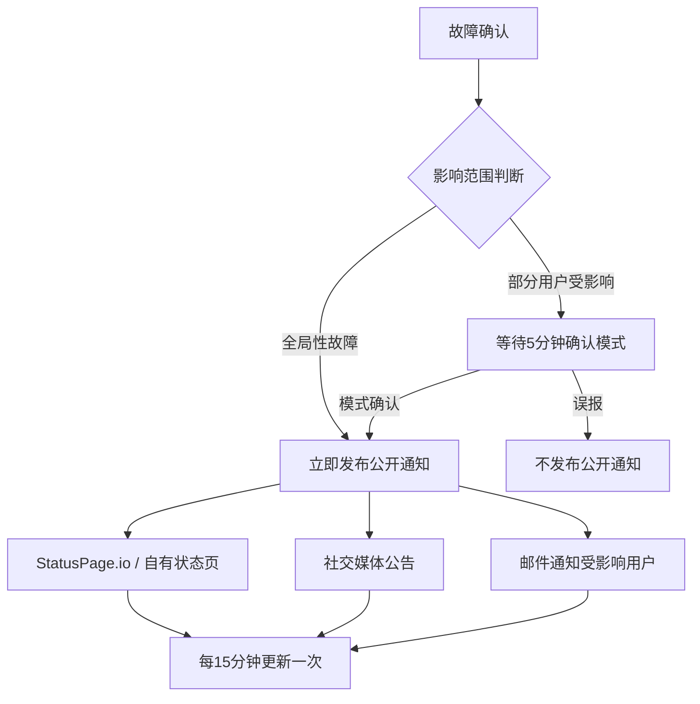

## 一、核心痛点：为什么大厂的通知体系比小公司复杂十倍？

上周跟一个刚跳槽到某FinTech的朋友喝酒，他吐槽了一件事：原公司（200人左右）出故障就是群里吼一声，或者直接打电话。到了新公司，光是搞清楚“故障发生时该通知谁”就花了两周。

这其实是个经典问题。Reddit r/sysadmin 上常年有人问：“Large companies - How to notify outages?” 底下的回复往往两极分化——要么是“我们用Slack bot + email blast”，要么是“我们有一个专门的Incident Response团队，走完整流程”。

**但真正的大厂（5000+员工，多数据中心，全球用户）面临的挑战远不止“发个通知”这么简单。**

1. **通知链路的可靠性**：你依赖的Slack/Teams/Email本身可能就在同一片云上。2022年3月AWS us-east-1的大规模故障中，大量依赖AWS SES发送邮件通知的公司直接失声——因为邮件服务本身挂了。
2. **受众的多样性**：内部工程师、管理层、客户、合作伙伴、监管机构——每个群体需要的通知内容和渠道完全不同。
3. **通知的时效性与准确性**：在故障初期，信息是混乱的。发早了可能是误报，发晚了用户已经炸锅。Reddit上有个经典案例：某SaaS公司故障持续了6小时，但直到第4小时才发出第一条公开通知，导致社交媒体上骂声一片。

我自己的经验是，这个问题的本质不是“用什么工具”，而是**设计一套分层的、容错的、可审计的通知协议**。

## 二、架构深潜：分层通知协议的设计

我们团队在经历了几次“通知翻车”后，逐步迭代出一套三层通知架构。说白了，就是别把所有鸡蛋放在一个篮子里。

### 第一层：内部实时告警（TTD < 1分钟）

这一层面向值班工程师（on-call），目标是**秒级触发**。

```yaml
# 一个简化的PagerDuty-like通知规则配置
notification_rules:
  - name: "critical_prod_outage"
    conditions:
      - metric: "error_rate"
        threshold: 5%
        window: "1m"
    targets:
      - channel: "pagerduty"
        urgency: "critical"
        escalation_policy: "sre-core"
      - channel: "slack"
        channel_id: "C01XXXXXX"
        message_template: "🚨 CRITICAL: {{service}} error_rate is {{value}}%"
        override_do_not_disturb: true
      - channel: "sms"
        provider: "twilio"
        numbers: ["+1-555-XXXXXX"]
        fallback: true  # 只有当PagerDuty和Slack都失败时才触发
```

**关键点**：
- 使用至少两个独立的通知提供商。我们同时用PagerDuty和Opsgenie（现在是Atlassian的），虽然贵，但有一次PagerDuty本身挂了，Opsgenie顶上来了。
- SMS作为最后的物理层备份。别笑，去年一次大规模云故障中，就是一条SMS叫醒了值班的SRE。

### 第二层：内部状态页与组织内广播（TTD < 5分钟）

这一层面向所有内部员工，尤其是非技术部门（客服、销售、管理层）。

```python
# 一个简化的内部状态页更新脚本
import requests
import json

def update_internal_status_page(incident_id, severity, affected_services, message):
    """
    更新内部状态页。这个页面独立于外部StatusPage，用于内部沟通。
    """
    payload = {
        "incident_id": incident_id,
        "severity": severity,  # SEV1, SEV2, SEV3
        "status": "investigating",
        "affected_services": affected_services,
        "message": message,
        "timestamp": datetime.utcnow().isoformat() + "Z",
        "next_update_eta": "5 minutes"
    }
    
    # 向内部状态API发送更新
    response = requests.post(
        "https://internal-status.company.com/api/incidents",
        headers={"Authorization": "Bearer ${INTERNAL_STATUS_API_KEY}"},
        json=payload
    )
    
    # 同时触发内部邮件广播（走独立的邮件中继，避免与主邮件系统共用）
    send_internal_broadcast_email(
        subject=f"[{severity}] {incident_id}: {affected_services} degradation",
        body=message,
        distribution_list="all-hands@company.com",
        smtp_relay="smtp-backup.company.com"  # 独立的邮件中继
    )
```

**为什么需要内部状态页？**
- 避免客服团队被用户问“你们是不是挂了？”时一脸懵逼。
- 给管理层一个统一的视图，减少“为什么没人告诉我”的投诉。
- 作为外部StatusPage的草稿区，确保对外发布前内部已对齐。

### 第三层：外部用户通知（TTD < 15分钟）

这一层面向用户，是公司形象的直接体现。



**这里有个血的教训**：永远不要在外部通知里写“我们正在调查”就完事了。用户需要知道：
1. 你意识到了问题。
2. 你大概知道是什么范围。
3. 你预计多久会有下一次更新。

Reddit上有个帖子骂某云服务商，说他们的StatusPage连续6小时显示“Investigating”，期间没有任何更新。这种操作比不通知更招黑。

## 三、实战案例：我们如何在一次BGP路由故障中翻车又爬起来的

去年我们经历了一次BGP路由配置错误导致的全球性服务中断。虽然最终恢复了，但通知环节暴露了大量问题。

### 时间线复盘

| 时间 | 事件 | 通知状态 |
|------|------|----------|
| T+0 | BGP路由泄漏，全球延迟飙升 | PagerDuty告警触发（成功） |
| T+5 | SRE确认是网络层问题 | Slack通知SRE团队（成功） |
| T+12 | 发现需要联系网络运营商 | 内部状态页更新（成功） |
| T+35 | CEO要求发公开声明 | 外部StatusPage更新（失败——API限流） |
| T+60 | 客服团队收到大量用户投诉 | 邮件广播发送（成功，但内容过时） |
| T+120 | 故障恢复 | 后知后觉的公开通知 |

**失败点分析**：
1. **外部StatusPage的API限流**：我们的监控系统在5分钟内触发了50次StatusPage更新请求，被限流了。结果是最后一次成功更新的内容是“正在调查”，之后6小时没有更新。
2. **邮件内容过时**：T+60发送的邮件还在说“我们正在定位问题”，但实际上T+45时已经找到了根因并开始回滚。
3. **CEO直接介入**：这说明内部沟通链路的时效性不够，管理层需要通过非正式渠道获取信息。

### 改进方案

我们后来做了一套“通知熔断”机制：

```yaml
# 通知熔断配置
circuit_breaker:
  - target: "statuspage_api"
    max_requests_per_minute: 10
    cooldown_period: 60s
    fallback_channel: "twitter"  # 如果StatusPage API挂了，自动发Twitter
    degraded_mode: true  # 降级模式下只发关键更新，减少频率
  - target: "email_broadcast"
    max_emails_per_hour: 4
    dedup_window: 15m  # 15分钟内相同内容的邮件去重
  - target: "slack_broadcast"
    rate_limit: "1 message per 5 minutes per channel"
```

核心思路：**通知本身也需要熔断和降级**。故障期间，通知系统可能成为另一个瓶颈。

## 四、工具选型与成本权衡

没有银弹。我们评估了几种方案，最终选择了组合路线。

| 方案 | 优点 | 缺点 | 适用场景 | 成本（月） |
|------|------|------|----------|-----------|
| PagerDuty + StatusPage.io | 开箱即用，集成丰富 | 贵，依赖第三方可靠性 | 中大型企业，SRE团队成熟 | $5000+ |
| Opsgenie + Atlassian Statuspage | 与Jira集成好 | Opsgenie被收购后创新停滞 | 已有Atlassian生态的企业 | $3000+ |
| 自建：Prometheus + Alertmanager + 自研通知网关 | 完全可控，成本低 | 维护成本高，需要专职团队 | 超大规模（万级节点以上） | 人力成本为主 |
| Grafana OnCall + 开源StatusPage | 社区活跃，可定制 | 文档差，需要大量调试 | 技术驱动型团队 | $500+（基础设施成本） |

**我们的选择**：PagerDuty用于核心告警 + 自研轻量级通知网关（用于内部广播和熔断） + 自建状态页（基于开源方案二次开发）。

为什么不自建全部？因为PagerDuty的轮值调度和升级策略（escalation policy）做得确实好，自建同样功能至少需要两个全职SRE维护。

## 五、最佳实践总结表

| 实践 | 描述 | 优先级 |
|------|------|--------|
| 通知链路冗余 | 至少使用两个独立的通知提供商 | P0 |
| 信息分层 | 内部SRE、内部全员、外部用户三个层级，内容不同 | P0 |
| 更新频率承诺 | 对外通知承诺下一次更新时间，并严格遵守 | P0 |
| 通知熔断 | 防止故障期间通知系统被冲垮 | P1 |
| 事后复盘 | 每次故障后Review通知流程的有效性 | P1 |
| 用户分群通知 | 只通知受影响用户，避免全员轰炸 | P2 |
| 多语言支持 | 国际公司必须考虑非英语用户的通知 | P2 |

## 六、常见问题（FAQ）

### 如何跟踪故障并向用户传达更新？

这其实分两个层面：
- **内部跟踪**：使用Incident Management工具（PagerDuty、FireHydrant、Rootly）记录时间线、行动项、决策记录。
- **外部传达**：使用StatusPage类工具，关键是**承诺更新频率**（比如每15分钟更新一次），并在每次更新中提供可操作的信息（“我们正在回滚版本X，预计需要30分钟”）。

Reddit上有个用户分享的经验很实在：他们会在StatusPage上写“下次更新在10分钟后”，如果10分钟后没有更新，就自动发一条“我们正在努力，但还没有确切的时间线，将在15分钟后再次更新”。**诚实比完美更重要**。

### 大厂如何确保通知系统的可靠性？

核心是**独立性和冗余**：
1. 通知系统不能与被监控系统共享基础设施。如果AWS us-east-1挂了，你的通知系统也要能工作。
2. 使用多个云提供商的通知服务。比如PagerDuty运行在AWS上，备用SMS网关运行在Twilio（独立基础设施）。
3. 定期演练。我们每季度做一次“通知系统故障演练”，模拟PagerDuty挂了、Slack挂了、甚至互联网出口挂了的情况。

### 如何处理故障初期的信息不确定性？

这是最难的部分。我们的原则是：
- **内部沟通可以模糊**：“我们怀疑是数据库层的问题，正在确认。”
- **外部沟通必须明确**：“我们正在经历服务降级，影响范围是X，预计Y时间内给出更新。”

不要对外说“我们还不确定是什么问题”。用户不需要知道你的诊断过程，他们只需要知道你在处理，以及什么时候会有更多信息。

---

*本文的技术视角综合自r/sysadmin、Hacker News及多个工程团队的实战复盘。特别感谢Reddit用户u/sysadmin-recovery在BGP故障复盘中的分享。*

<script type="application/ld+json">
{
  "@context": "https://schema.org",
  "@type": "FAQPage",
  "mainEntity": [{
    "@type": "Question",
    "name": "如何跟踪故障并向用户传达更新？",
    "acceptedAnswer": {
      "@type": "Answer",
      "text": "内部使用Incident Management工具（如PagerDuty、FireHydrant）跟踪时间线和行动项；外部使用StatusPage类工具，关键是承诺并遵守更新频率（如每15分钟一次），每次更新提供可操作信息。"
    }
  }, {
    "@type": "Question",
    "name": "大厂如何确保通知系统的可靠性？",
    "acceptedAnswer": {
      "@type": "Answer",
      "text": "核心是独立性和冗余：通知系统不能与被监控系统共享基础设施；使用多个云提供商的通知服务（如PagerDuty + 独立SMS网关）；定期进行通知系统故障演练。"
    }
  }, {
    "@type": "Question",
    "name": "如何处理故障初期的信息不确定性？",
    "acceptedAnswer": {
      "@type": "Answer",
      "text": "内部沟通可以模糊（如'怀疑是数据库层问题'），外部沟通必须明确（如'正在经历服务降级，影响范围X，预计Y时间内更新'）。不要对外说'我们还不确定是什么问题'。"
    }
  }]
}
</script>


