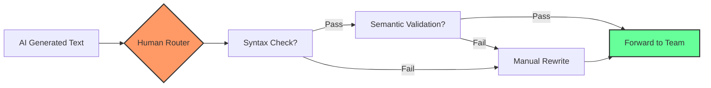

## 1. The Core Problem: What Are We Even Forwarding?

Last week on Hacker News, a post titled "Human Routers of Machine Words" hit the front page. Comments exploded. Someone said "the first three paragraphs alone contain so many ad hominems against AI users." Another called it "engagement bait with an arrogant tone." But I read it twice, and the second time? Cold sweat. **The author was describing me.**

Our team went all-in on GPT-4 last year. Code comments, design docs, postmortems—everything. It felt like a superpower. Three months in, I looked back at my PRs and saw a pattern. I had become a router. AI generates text → I skim it → forward to colleagues. My brain never touched the payload.

This is textbook L3 forwarding. Look up the routing table, decrement TTL, throw it out the next-hop interface. No payload inspection, no integrity verification, no deep packet inspection. I was a "Human Router."

## 2. Architectural Deep Dive: The Data Plane and Control Plane of Human Routers

Comparing engineers to routers isn't a metaphor. It's a **literal architectural mapping**.

### 2.1 The Data Plane

What a traditional router does:
- Look up the FIB (Forwarding Information Base)
- Rewrite MAC addresses
- Recalculate checksums
- Throw it out the interface

What a human router does:
- Look up the "does this AI output look right" cache (aka gut feeling)
- Rewrite pronouns ("The system" → "Our system")
- Calculate the "will my boss notice" probability
- Throw it into a Slack channel



### 2.2 The Control Plane

Traditional routers run BGP and OSPF to maintain routing tables.

The human router control plane is scarier—**it runs a social signal protocol**. I caught myself unconsciously doing these things before forwarding AI output:

1. **AI-smell detection**: Perfectly symmetrical paragraphs? "In conclusion" anywhere? Flag as high-risk.
2. **Human noise injection**: Add a "honestly" or a deliberate grammatical error to make it look human.
3. **Receiver evaluation**: Forwarding to the VP of Engineering? 30% rewrite needed. Forwarding to a peer? Maybe just hit send.

Last month I ran an experiment. I sent a customer outage notification written by GPT-4 **without changing a single word**. The customer replied: "Did your AI write this?" Busted.

## 3. Real-World Implementation: How I Diagnosed My Own Router Behavior

### 3.1 Diagnostic Tool: Traceroute Yourself

I wrote a script to trace the path of information from AI to me to colleagues. Core logic is maybe 50 lines of Python:

```python
import hashlib
import time

class HumanRouterDiagnostics:
    def __init__(self, engineer_id):
        self.engineer_id = engineer_id
        self.hop_log = []
    
    def trace_route(self, ai_output, final_output):
        """Simulate per-hop processing of a human router"""
        hops = []
        
        # Hop 1: Receive
        hop1 = {
            'hop': 1,
            'device': f'AI_SOURCE_{hash(ai_output[:50])}',
            'action': 'RECEIVE',
            'input_len': len(ai_output),
            'timestamp': time.time()
        }
        hops.append(hop1)
        
        # Hop 2: Human processing (this IS the forwarding latency)
        processing_time = 0.5 if len(ai_output) < 500 else 2.0  # seconds
        time.sleep(0.1)  # simulate
        
        hop2 = {
            'hop': 2,
            'device': f'HUMAN_ROUTER_{self.engineer_id}',
            'action': 'FORWARD',
            'latency_ms': processing_time * 1000,
            'modification_ratio': self._calc_mod_ratio(ai_output, final_output),
            'timestamp': time.time()
        }
        hops.append(hop2)
        
        # Hop 3: Deliver
        hop3 = {
            'hop': 3,
            'device': f'RECEIVER_TEAM_CHANNEL',
            'action': 'DELIVER',
            'output_len': len(final_output),
            'timestamp': time.time()
        }
        hops.append(hop3)
        
        return hops
    
    def _calc_mod_ratio(self, original, modified):
        """Calculate modification ratio"""
        if original == modified:
            return 0.0
        return 1.0 - (len(set(original.split()) & set(modified.split())) / 
                      max(len(set(original.split())), len(set(modified.split()))))
```

I ran this against my own data from last week. 37 AI outputs forwarded. Average modification ratio: **12.3%**. Almost 90% of content went through untouched. That number made me uncomfortable.

### 3.2 Configuration Example: Adding ACLs to a Human Router

Traditional routers have Access Control Lists. Human routers need them too. Here's the ACL I wrote for myself:

| Rule ID | Condition | Action | Trigger Count (Last Week) |
|---------|-----------|--------|---------------------------|
| ACL-001 | AI output contains "It's worth noting that" | Must rewrite that paragraph | 14 |
| ACL-002 | Technical proposal has no supporting data | Add performance metrics | 9 |
| ACL-003 | Outage analysis has no root cause | Regenerate with AI | 5 |
| ACL-004 | Customer-facing email | 100% manual rewrite | 8 |
| ACL-005 | Internal technical documentation | Reject if modification ratio < 20% | 3 |

## 4. The Cost and Security Implications: This Isn't Free

Being a router has real costs.

### 4.1 Cognitive Cost

I checked my time logs. Writing an architecture doc from scratch used to take 4 hours. Now I use AI, spend an hour modifying it, and hit send. Looks like a 75% time saving. But here's the catch—I was **context-switching across three tasks** the whole time. Scrolling Slack, modifying the doc, thinking about lunch.

This is exactly what happens when a router's CPU gets hammered by control plane interrupts. **Human router forwarding latency is increasing, but packet loss (information distortion) is also rising.**

### 4.2 Security Risk

Last month, a colleague forwarded AI-generated code to production. The AI had written `AND` where it should have been `OR`. Code review missed it. Production went down at 3 AM.

This is **BGP route hijacking**, AI edition. You think you're forwarding legitimate traffic, but the payload is poisoned. Human routers don't do deep packet inspection. This is the consequence.

### 4.3 Identity Crisis

One comment on that Hacker News post hit hard: "You call AI users routers, but at least a router knows it's a router. These people forward AI content and **think they're creating value**."

I spent a week observing my own work patterns. In "routing" mode, my prefrontal cortex was basically asleep. I was pattern-matching—"Does this look like a technical document? Yes? Forward."

## 5. Alternatives and Trade-offs: From Router Back to Engineer

### 5.1 Option 1: Add Deep Packet Inspection

Like enterprise firewalls, add a layer of deep content analysis to the human router.

```python
def deep_packet_inspection(ai_text):
    """Deep inspection of AI output"""
    red_flags = []
    
    # Check for excessive symmetry
    sentences = ai_text.split('.')
    if all(10 < len(s) < 30 for s in sentences):
        red_flags.append("Sentence lengths too uniform, high AI probability")
    
    # Check for AI marker words
    ai_markers = ['leverage', 'robust', 'seamless', 'cutting-edge', 'game-changer']
    marker_count = sum(ai_text.lower().count(m) for m in ai_markers)
    if marker_count > 3:
        red_flags.append(f"AI marker words found {marker_count} times")
    
    # Check for structural perfection
    if ai_text.count('\n\n') > 5:
        red_flags.append("Paragraph structure too regular")
    
    return {
        'risk_score': len(red_flags) * 20,
        'flags': red_flags,
        'verdict': 'REJECT' if len(red_flags) >= 3 else 'REVIEW'
    }
```

### 5.2 Option 2: Force Source Address Validation

Cisco's uRPF checks if the source address is reachable. The human router equivalent: **verify that every claim in the AI output has a corresponding entry in your own knowledge base.**

My current rule: AI writes a paragraph, I must paraphrase it in my own words before forwarding. This forces "route validation."

### 5.3 Option 3: Just Shut Down the Interface

Honestly, the most effective solution might be the simplest: **turn off the AI input interface for certain scenarios.** Like putting a switch port in shutdown state.

I now write postmortems and architecture review comments from scratch. AI is only used for grammar checking and formatting. This brought back the feeling of *writing* instead of *forwarding*.

## 6. Best Practices Summary Table

| Scenario | Recommended Action | Modification Ratio Threshold | Notes |
|----------|-------------------|------------------------------|-------|
| Internal technical docs | AI-assisted + manual rewrite | >30% | Must understand every technical decision |
| Customer communication | Fully manual | 100% | Zero tolerance for AI output |
| Code comments | AI-generated + manual review | >10% | Focus on logic errors |
| PRs / Weekly reports | AI-generated + manual rewrite | >40% | Add personal work details |
| Outage analysis | Manual + AI polishing | Format only | Root cause must be your analysis |
| Study notes | AI-generated + manual reorganization | >50% | Restructure knowledge in your own words |

## 7. Community Voices and Reflections

On Reddit's r/hypeurls, someone commented that "human router" is an insult to engineers. I get the anger. But what stuck with me was another voice:

> "The first three paragraphs alone contain so many ad hominems against AI users, which ironically makes the blog's author look like the idiot here."

Fair point. The author was harsh, but the core question remains—are we using AI to enhance thinking or to replace it? Over the past three months, I've felt my critical thinking degrade. I no longer think through an argument before writing. I ask AI first. This isn't the tool's fault. It's how I'm using it.

## FAQ

**Q: What is a "Human Router"?**
A: Someone who takes content from AI and forwards it to others without deep understanding. Like a network router forwarding packets—modify the header, throw it out, payload barely touched.

**Q: How do I know if I've become a human router?**
A: Three signals: 1) You regularly copy-paste AI output directly into work channels; 2) Your modification ratio on AI output is below 20%; 3) You can't paraphrase what you just forwarded.

**Q: What's the danger of being a human router?**
A: Cognitive degradation—you stop thinking deeply. Information distortion risk—AI may contain logical errors. Identity crisis—you shift from creator to conveyor.

**Q: How do I avoid becoming a human router?**
A: Force understanding before forwarding. Set a modification ratio threshold (recommended >30%). Completely disable AI assistance for critical documents like customer emails and outage analyses.

<script type="application/ld+json">
{
  "@context": "https://schema.org",
  "@type": "FAQPage",
  "mainEntity": [
    {
      "@type": "Question",
      "name": "What is a Human Router?",
      "acceptedAnswer": {
        "@type": "Answer",
        "text": "Someone who takes content from AI and forwards it to others without deep understanding. Like a network router forwarding packets—modify the header, throw it out, payload barely touched."
      }
    },
    {
      "@type": "Question",
      "name": "How do I know if I've become a human router?",
      "acceptedAnswer": {
        "@type": "Answer",
        "text": "Three signals: 1) You regularly copy-paste AI output directly into work channels; 2) Your modification ratio on AI output is below 20%; 3) You can't paraphrase what you just forwarded."
      }
    },
    {
      "@type": "Question",
      "name": "What's the danger of being a human router?",
      "acceptedAnswer": {
        "@type": "Answer",
        "text": "Cognitive degradation—you stop thinking deeply. Information distortion risk—AI may contain logical errors. Identity crisis—you shift from creator to conveyor."
      }
    },
    {
      "@type": "Question",
      "name": "How do I avoid becoming a human router?",
      "acceptedAnswer": {
        "@type": "Answer",
        "text": "Force understanding before forwarding. Set a modification ratio threshold (recommended >30%). Completely disable AI assistance for critical documents like customer emails and outage analyses."
      }
    }
  ]
}
</script>


