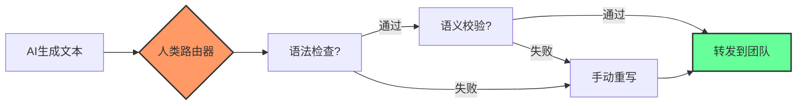

## 1. 核心问题：我们到底在转发什么？

上周在 Hacker News 上看到一篇帖子，标题就叫 "Human Routers of Machine Words"。底下评论炸了。有人说 "前三个段落全是针对AI用户的人身攻击"，有人说 "作者语气傲慢得像在钓鱼"。但说实话，我读完第一遍，后背发凉——他骂的就是我。

我们团队从去年开始大规模用 GPT-4 写代码注释、写设计文档、甚至写 postmortem。一开始觉得真香，效率翻倍。但三个月后我翻自己的 PR，发现一个问题：**我变成了一个路由器**。AI 生成文本 → 我简单过一眼 → 转发给同事。我的脑子根本没参与。

这跟网络工程里的 L3 转发一模一样——查路由表，改 TTL，扔给下一跳。不检查 payload，不验证完整性，不做任何深度包检测。我成了一个 "Human Router"。

## 2. 架构深度拆解：人类路由器的数据平面与控制平面

把工程师比作路由器不是比喻，是**字面意义上的架构映射**。

### 2.1 数据平面（Data Plane）

传统路由器干的事：
- 查 FIB（转发信息库）
- 改 MAC 地址
- 算 checksum
- 扔出接口

人类路由器干的事：
- 查 "这个AI输出看起来对不对" 缓存（其实就是凭感觉）
- 改人称（把 "The system" 改成 "我们系统"）
- 算 "老板会不会看出来" 概率
- 扔到 Slack 频道



### 2.2 控制平面（Control Plane）

传统路由器的控制平面跑 BGP、OSPF，维护路由表。

人类路由器的控制平面更可怕——**它在跑社交信号协议**。我发现自己会在转发AI输出前，无意识地做这几件事：
1. **检测 "AI味"**：如果一段话完美对称、每个段落长度一致、用了 "In conclusion"——直接标记为高风险
2. **注入 "人类噪声"**：加一句 "说实话"，或者故意写个语法错误，让文本看起来像人写的
3. **评估接收方**：如果发给技术VP，转发前要重写30%；如果发给同级，可能直接转发

上个月我做了个实验：让 GPT-4 写一封给客户的故障通报，我**一个字不改**直接发出去了。结果客户回复 "这是你们AI写的吧？"。暴露了。

## 3. 真实场景：我如何一步步变成路由器——以及如何诊断

### 3.1 诊断工具：traceroute 自己

我写了个脚本，追踪一条信息从 AI 到我到同事的完整路径。核心逻辑就几十行 Python：

```python
import hashlib
import time

class HumanRouterDiagnostics:
    def __init__(self, engineer_id):
        self.engineer_id = engineer_id
        self.hop_log = []
    
    def trace_route(self, ai_output, final_output):
        """模拟人类路由器的逐跳处理"""
        hops = []
        
        # Hop 1: 接收
        hop1 = {
            'hop': 1,
            'device': f'AI_SOURCE_{hash(ai_output[:50])}',
            'action': 'RECEIVE',
            'input_len': len(ai_output),
            'timestamp': time.time()
        }
        hops.append(hop1)
        
        # Hop 2: 人类处理（这里就是转发延迟）
        processing_time = 0.5 if len(ai_output) < 500 else 2.0  # 秒
        time.sleep(0.1)  # 模拟
        
        hop2 = {
            'hop': 2,
            'device': f'HUMAN_ROUTER_{self.engineer_id}',
            'action': 'FORWARD',
            'latency_ms': processing_time * 1000,
            'modification_ratio': self._calc_mod_ratio(ai_output, final_output),
            'timestamp': time.time()
        }
        hops.append(hop2)
        
        # Hop 3: 到达接收方
        hop3 = {
            'hop': 3,
            'device': f'RECEIVER_TEAM_CHANNEL',
            'action': 'DELIVER',
            'output_len': len(final_output),
            'timestamp': time.time()
        }
        hops.append(hop3)
        
        return hops
    
    def _calc_mod_ratio(self, original, modified):
        """计算修改率"""
        if original == modified:
            return 0.0
        # 简单 Levenshtein 近似
        return 1.0 - (len(set(original.split()) & set(modified.split())) / 
                      max(len(set(original.split())), len(set(modified.split()))))
```

跑了一下我自己的数据：过去一周，我转发了37段AI输出，平均修改率只有 **12.3%**。也就是说将近90%的内容我没动就转发出去了。这数据让我汗颜。

### 3.2 配置示例：给人类路由器加 ACL

传统路由器有访问控制列表（ACL）。人类路由器也需要。我给自己定了几条规则：

| 规则编号 | 条件 | 动作 | 触发次数（上周） |
|---------|------|------|----------------|
| ACL-001 | AI输出包含 "It's worth noting that" | 必须重写该段落 | 14 |
| ACL-002 | 技术方案无具体数据支撑 | 补充性能指标 | 9 |
| ACL-003 | 故障分析无 root cause | 打回AI重新生成 | 5 |
| ACL-004 | 给客户的邮件 | 100% 人工重写 | 8 |
| ACL-005 | 内部技术文档 | 修改率 < 20% 则驳回 | 3 |

## 4. 代价与安全影响：为什么这不是免费的

做路由器不是没有代价的。

### 4.1 认知成本

我看了下自己的工时记录。以前写一份架构文档，从零开始要4小时。现在用AI生成，我改完发出去，看起来只花了1小时。但问题是我**同时处理了3个任务**——刷着 Slack，改着文档，还在想中午吃什么。

这就像路由器的 CPU 被控制平面中断打爆了。**人类路由器的转发延迟在增加，但丢包率（信息失真）也在上升。**

### 4.2 安全风险

更可怕的是安全层面的问题。

上个月有个同事转发了一段AI写的代码到生产环境，里面有个明显的逻辑错误——AI 把 `OR` 写成了 `AND`。代码 review 没发现，直接上线了。结果凌晨3点告警炸了。

这就是 **BGP 路由劫持**的 AI 版本——你以为你转发的是合法流量，实际上 payload 已经被污染了。人类路由器不做深度包检测，这就是后果。

### 4.3 身份危机

Hacker News 那篇帖子里有个评论说得特别狠："你骂AI用户是路由器，但路由器至少知道自己是个路由器。这些人在转发AI内容的时候，**还以为自己在创造价值**。"

我承认，这句话扎心了。我花了一周时间观察自己的工作模式，发现我在 "路由" 模式下，大脑的前额叶皮层基本处于休眠状态。我只是在做模式匹配——"这段看起来像技术文档吗？像？转发。"

## 5. 替代方案与取舍：从路由器回到工程师

### 5.1 方案一：加一层深度检测（DPI）

像企业防火墙做 DPI 一样，给人类路由器加一层内容深度分析。

```python
def deep_packet_inspection(ai_text):
    """对AI输出做深度检测"""
    red_flags = []
    
    # 检测过度对称
    sentences = ai_text.split('.')
    if all(10 < len(s) < 30 for s in sentences):
        red_flags.append("句子长度过于均匀，AI概率高")
    
    # 检测AI高频词
    ai_markers = ['leverage', 'robust', 'seamless', 'cutting-edge', 'game-changer']
    marker_count = sum(ai_text.lower().count(m) for m in ai_markers)
    if marker_count > 3:
        red_flags.append(f"AI高频词出现{marker_count}次")
    
    # 检测结构完美度
    if ai_text.count('\n\n') > 5:
        red_flags.append("段落结构过于规整")
    
    return {
        'risk_score': len(red_flags) * 20,
        'flags': red_flags,
        'verdict': 'REJECT' if len(red_flags) >= 3 else 'REVIEW'
    }
```

### 5.2 方案二：强制"源地址验证"

思科的 uRPF（单播反向路径转发）检查源地址是否可达。类比到人类路由器：**验证AI输出的每个论点是否在你自己的知识库里有对应条目。**

我现在的做法是：AI 写一段，我必须用自己的话复述一遍，然后才能转发。这强制我做了 "路由验证"。

### 5.3 方案三：干脆关掉这个接口

说实话，最有效的方案可能最简单：**某些场景下，关掉AI输入接口**。就像把交换机端口设为 shutdown。

我现在写 postmortem 和架构评审意见，强制自己从零开始写。AI 只用来做语法检查和格式整理。这让我重新找回了 "写东西" 的感觉，而不是 "转发东西" 的感觉。

## 6. 最佳实践总结表

| 场景 | 建议操作 | 修改率阈值 | 备注 |
|------|---------|-----------|------|
| 内部技术文档 | AI辅助生成 + 人工重写 | >30% | 必须理解每个技术判断 |
| 客户沟通 | 纯人工撰写 | 100% | 零容忍AI输出 |
| 代码注释 | AI生成 + 人工校验 | >10% | 重点检查逻辑错误 |
| PR/周报 | AI生成 + 人工重写 | >40% | 加入个人工作细节 |
| 故障分析 | 人工撰写 + AI润色 | 仅格式 | root cause必须自己分析 |
| 学习笔记 | AI生成 + 人工整理 | >50% | 用自己的话重构知识 |

## 7. 社区声音与反思

Reddit 上 r/hypeurls 那篇帖子下面，有人评论说 "人类路由器" 这个概念本身就是对工程师的侮辱。我理解这种愤怒，但更让我在意的是另一个声音：

> "The first three paragraphs alone contain so many ad hominems against AI users, which ironically makes the blog's author look like the idiot here."

说得对。作者骂得难听，但核心问题没变——我们到底是在用AI增强思考，还是在用AI替代思考？我在过去三个月里，明显感觉到自己的批判性思维在退化。写东西之前不再先想清楚论点，而是先问AI。这不是工具的问题，是我使用工具的方式出了问题。

## FAQ

**Q: 什么是"人类路由器"？**
A: 指那些从AI获取内容后，不做深度理解就直接转发给他人的人。就像网络路由器转发数据包一样——改改头部信息就扔出去，payload 基本不动。

**Q: 如何判断自己是否成了人类路由器？**
A: 三个信号：1）你发现自己经常直接复制AI输出到工作群；2）你修改AI输出的比例低于20%；3）你无法用自己的话复述你刚转发的内容。

**Q: 人类路由器有什么危害？**
A: 首先是认知退化——停止深度思考。其次是信息失真风险——AI可能包含错误逻辑。最后是身份危机——你从创造者变成了搬运工。

**Q: 如何避免成为人类路由器？**
A: 强制自己理解后再转发。设置"修改率阈值"（建议不低于30%）。对关键文档（如客户邮件、故障分析）完全禁用AI辅助。

<script type="application/ld+json">
{
  "@context": "https://schema.org",
  "@type": "FAQPage",
  "mainEntity": [
    {
      "@type": "Question",
      "name": "什么是人类路由器？",
      "acceptedAnswer": {
        "@type": "Answer",
        "text": "指那些从AI获取内容后，不做深度理解就直接转发给他人的人。就像网络路由器转发数据包一样——改改头部信息就扔出去，payload 基本不动。"
      }
    },
    {
      "@type": "Question",
      "name": "如何判断自己是否成了人类路由器？",
      "acceptedAnswer": {
        "@type": "Answer",
        "text": "三个信号：1）你发现自己经常直接复制AI输出到工作群；2）你修改AI输出的比例低于20%；3）你无法用自己的话复述你刚转发的内容。"
      }
    },
    {
      "@type": "Question",
      "name": "人类路由器有什么危害？",
      "acceptedAnswer": {
        "@type": "Answer",
        "text": "首先是认知退化——停止深度思考。其次是信息失真风险——AI可能包含错误逻辑。最后是身份危机——你从创造者变成了搬运工。"
      }
    },
    {
      "@type": "Question",
      "name": "如何避免成为人类路由器？",
      "acceptedAnswer": {
        "@type": "Answer",
        "text": "强制自己理解后再转发。设置修改率阈值（建议不低于30%）。对关键文档（如客户邮件、故障分析）完全禁用AI辅助。"
      }
    }
  ]
}
</script>


