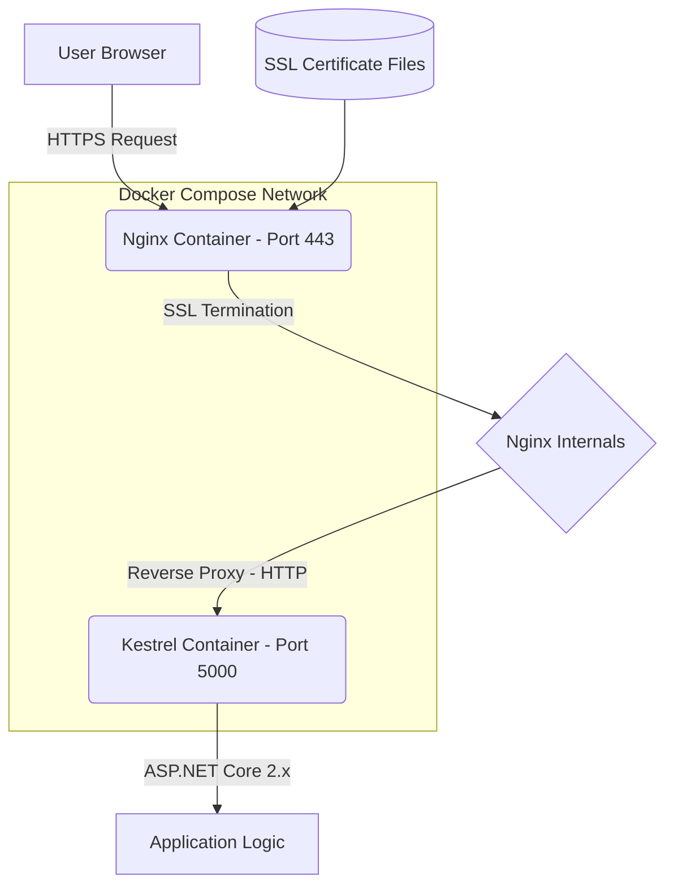

## I Spent Three Days on This Garbage

Honestly, when I first saw `ERR_SSL_VERSION_OR_CIPHER_MISMATCH` in my browser, my immediate thought was, "Oh great, another expired cert." Nope. There's a thread on Reddit's r/LearnLinuxServer from June 2026 dedicated to this exact error, and the comments are full of people pulling their hair out. I felt every single one of them.

The core of this error is simple: during the SSL/TLS handshake, your browser and the server aren't speaking the same security language. The ciphers or protocol versions you configured don't match what the client supports.

But here's the kicker—this error is a special kind of hell when you're dealing with **Docker Compose + ASP.NET Core 2.x + Nginx**. It's not that the technology is hard. It's that **ASP.NET Core 2.x ships with an old .NET Core runtime (2.1 or 2.2)**. Its built-in Kestrel server has some weird default behaviors around TLS 1.2/1.3 support. Throw in Docker container certificate trust chains and Nginx's SSL config, and if any one of these three isn't perfectly aligned, you're staring at that red error screen.

My team hit this exact wall last month when migrating a legacy .NET Core 2.2 application to a Docker Compose environment. This entire article is my debugging log and the final fix. Hope it saves you some pain.

## The Architecture: Where Does Your Request Actually Go?

A lot of people think configuring HTTPS is just "drop in the cert and you're done." But in this stack, the traffic path is more complex than you think.



**The critical points are:**
1. **Nginx handles SSL termination.** The actual HTTPS handshake only happens between the browser and Nginx. Nginx to the backend Kestrel is plain HTTP.
2. **ASP.NET Core 2.x's Kestrel should NOT handle HTTPS directly** (at least not in this containerized reverse proxy scenario). It should only listen on HTTP.
3. **The explosion point**: If Nginx's SSL protocol or cipher configuration is too old (or too new) and doesn't match the client, the TLS handshake fails. And sometimes, ASP.NET Core 2.x's old runtime injects weird `Connection` or `Server` headers into the response, causing a protocol mismatch when Nginx tries to forward it.

## Symptom Checklist: How Many Did You Hit?

Based on my own experience and the Reddit thread, here are the three most common symptoms:

| Symptom | Behavior | Root Cause Probability |
|---|---|---|
| **ERR_SSL_VERSION_OR_CIPHER_MISMATCH** | Browser refuses connection outright, Chrome/Firefox both show red screen | 70% - Nginx SSL config issue |
| **502 Bad Gateway** | Nginx handshake succeeds, but forwarding to Kestrel fails | 20% - Container network or Kestrel binding issue |
| **HTTPS page loads but CSS/JS are HTTP** | Mixed content blocked by browser | 10% - ASP.NET Core `ForwardedHeaders` middleware missing |

We hit the first one. The absolute worst. Chrome threw `ERR_SSL_VERSION_OR_CIPHER_MISMATCH` without even giving us an HTTP status code.

## Root Cause Analysis: Who's Really to Blame?

In a Docker Compose environment, this problem is almost always a **stack of three factors**:

### 1. Nginx SSL Config is Too "Conservative" or Too "Aggressive"

A lot of online tutorials (including some very old ones) tell you to write this in your `nginx.conf`:

```nginx
ssl_protocols TLSv1 TLSv1.1 TLSv1.2;
ssl_ciphers HIGH:!aNULL:!MD5;
```

**What's the problem?** `TLSv1` and `TLSv1.1` have been deprecated by modern browsers. Chrome started phasing them out back in 2020. If you're still enabling these protocols in 2026, newer versions of Chrome/Edge will fail the TLS handshake immediately.

But the more insidious trap is this: if you lock down your `ssl_ciphers` too tightly—say, only allowing `ECDHE-RSA-AES128-GCM-SHA256`—and your client (like an old mobile device or API caller) doesn't support that suite, the handshake fails too.

### 2. Missing `ForwardedHeaders` Middleware in ASP.NET Core 2.x

This is the one .NET developers miss most often. When Nginx acts as a reverse proxy, Kestrel sees the request source IP as the Nginx container's IP (e.g., `172.19.0.2`), not the real client. If your application logic depends on `HttpContext.Connection.RemoteIpAddress` or needs to generate absolute URLs (like in email templates), you **must** configure `ForwardedHeaders` in your `Startup.cs`.

**What happens if you don't?** In certain edge cases, Kestrel will try to force a redirect to an HTTPS URL. But because it doesn't know the external request was HTTPS (it only sees the HTTP request from Nginx), it generates a wrong `Location` header or just refuses to process the request. This alone won't cause `ERR_SSL_VERSION_OR_CIPHER_MISMATCH`, but it **amplifies** the chaos of a bad SSL config.

### 3. Certificate Trust Issues in the Docker Compose Network

This is the dumbest pitfall. If you're using self-signed certificates in development, you need to trust them inside the container. But the ASP.NET Core 2.x Docker images (typically `mcr.microsoft.com/dotnet/core/aspnet:2.2` or `2.1`) are based on older Linux distros (Debian Stretch or Ubuntu 18.04) with potentially outdated CA certificate bundles. If you mount your certs without updating the system's CA trust chain, Nginx (or Kestrel on startup) might choke on certificate validation.

## The Fix: From Crashed to Stable

### Step 1: Clean Up Your Nginx SSL Config

This is the most critical step. Stop using tutorials from 2019.

```nginx
# Critical section of nginx.conf
server {
    listen 443 ssl http2;
    server_name yourdomain.com;

    ssl_certificate /etc/nginx/ssl/yourdomain.crt;
    ssl_certificate_key /etc/nginx/ssl/yourdomain.key;

    # Only enable TLSv1.2 and TLSv1.3
    ssl_protocols TLSv1.2 TLSv1.3;

    # Use Mozilla's recommended modern cipher suite
    ssl_ciphers 'ECDHE-ECDSA-AES128-GCM-SHA256:ECDHE-RSA-AES128-GCM-SHA256:ECDHE-ECDSA-AES256-GCM-SHA384:ECDHE-RSA-AES256-GCM-SHA384:ECDHE-ECDSA-CHACHA20-POLY1305:ECDHE-RSA-CHACHA20-POLY1305:DHE-RSA-AES128-GCM-SHA256:DHE-RSA-AES256-GCM-SHA384';

    ssl_prefer_server_ciphers off;

    # Add HSTS (optional but highly recommended)
    add_header Strict-Transport-Security "max-age=63072000" always;

    # Forward to Kestrel
    location / {
        proxy_pass http://aspnetcore_app:5000;
        proxy_http_version 1.1;
        proxy_set_header Upgrade $http_upgrade;
        proxy_set_header Connection keep-alive;
        proxy_set_header Host $host;
        proxy_cache_bypass $http_upgrade;
        proxy_set_header X-Forwarded-For $proxy_add_x_forwarded_for;
        proxy_set_header X-Forwarded-Proto $scheme;
    }
}
```

**Why this change?**
- Removed `TLSv1` and `TLSv1.1`: Modern browsers don't support them, and keeping them can interfere with the handshake negotiation.
- Using a more modern cipher list: This comes from the [Mozilla SSL Configuration Generator](https://ssl-config.mozilla.org/), which balances compatibility and security.
- Set `ssl_prefer_server_ciphers off`: Let the client decide the cipher, don't force the server's order. This eliminates a ton of weird compatibility issues.

### Step 2: Configure ForwardedHeaders in ASP.NET Core 2.x

In your `Startup.cs`, in the `ConfigureServices` method:

```csharp
public void ConfigureServices(IServiceCollection services)
{
    // ... other services

    // Configure forwarded headers middleware
    services.Configure<ForwardedHeadersOptions>(options =>
    {
        options.ForwardedHeaders = ForwardedHeaders.XForwardedFor | ForwardedHeaders.XForwardedProto;
        // Only for development. In production, restrict to Nginx container IP
        options.KnownNetworks.Clear();
        options.KnownProxies.Clear();
    });

    services.AddMvc();
}

public void Configure(IApplicationBuilder app, IHostingEnvironment env)
{
    // This MUST be called before UseMvc!
    app.UseForwardedHeaders();
    app.UseHttpsRedirection(); // Use if you want HTTPS redirect
    app.UseMvc();
}
```

**Note**: `.NET Core 2.x`'s `UseHttpsRedirection` can conflict with Nginx's SSL termination in some cases. If you're already doing HTTP-to-HTTPS redirect at the Nginx layer, you can skip calling `UseHttpsRedirection` in ASP.NET Core, or just comment it out. I recommend doing the redirect at the Nginx level—it's cleaner.

### Step 3: Fix Docker Compose Networking and Certificate Mounts

```yaml
# docker-compose.yml
version: '3.8'

services:
  nginx:
    image: nginx:1.25-alpine
    ports:
      - "80:80"
      - "443:443"
    volumes:
      - ./nginx.conf:/etc/nginx/nginx.conf:ro
      - ./ssl:/etc/nginx/ssl:ro
    depends_on:
      - aspnetcore_app
    networks:
      - app_network

  aspnetcore_app:
    build:
      context: .
      dockerfile: Dockerfile
    expose:
      - "5000"  # Expose only to internal network, NOT to host
    environment:
      - ASPNETCORE_URLS=http://+:500


