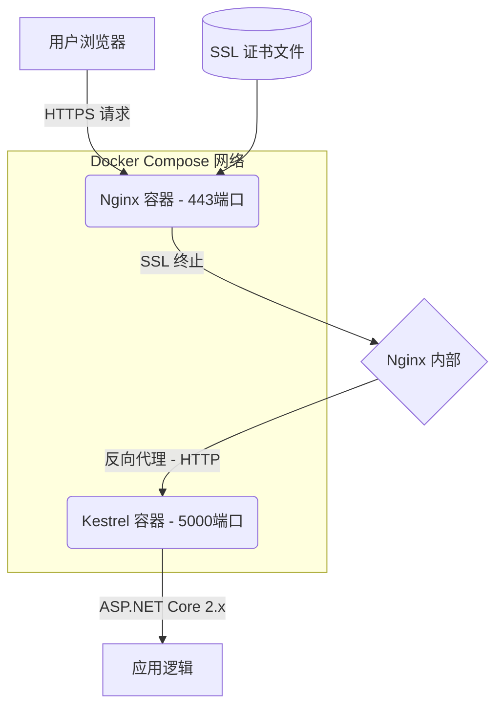

## 这破问题我折腾了三天

老实说，当我第一次在浏览器里看到 `ERR_SSL_VERSION_OR_CIPHER_MISMATCH` 这个错误时，我第一反应是"又是证书过期了？"。结果不是。Reddit 上 r/LearnLinuxServer 板块在 2026年6月有个帖子专门讨论这个，底下回帖的人都在骂娘。我太理解了。

这个错误的本质是——浏览器和服务器在 SSL/TLS 握手阶段，双方"说的不是同一种安全语言"。简单说，你配置的加密套件或者协议版本，跟客户端（浏览器）能支持的完全不搭界。

但更操蛋的是，这个问题在 **Docker Compose + ASP.NET Core 2.x + Nginx** 这个组合里，坑特别深。不是因为技术多难，而是因为 **ASP.NET Core 2.x 默认用的是旧版 .NET Core 运行时（2.1 或 2.2）**，它内置的 Kestrel 服务器对 TLS 1.2/1.3 的支持存在一些诡异的默认行为。再加上 Docker 容器里的证书信任链、Nginx 的 SSL 配置，这三者但凡有一个地方没对齐，你就等着看那个红屏错误吧。

我团队上个月在把一个遗留的 .NET Core 2.2 应用迁移到 Docker Compose 环境时，就撞上了这堵墙。这篇东西就是我当时的所有排查笔记和最终修复方案，希望能帮你少走点弯路。

## 架构全景：你的请求到底是怎么走的？

很多人以为配个 HTTPS 就是"证书放上去就行了"。但在这个架构里，流量路径远比你想的复杂。



**关键点在于：**
1. **Nginx 做 SSL 终止**。这意味着真正的 HTTPS 握手只发生在浏览器和 Nginx 之间。Nginx 到后端的 Kestrel 走的是纯 HTTP。
2. **ASP.NET Core 2.x 的 Kestrel 不直接处理 HTTPS**（至少在容器化反向代理场景下不应该）。它只需要监听 HTTP 端口。
3. **问题爆发点**：如果 Nginx 配置的 SSL 协议或加密套件太老（或者太新），跟客户端的 TLS 握手就会失败。而 ASP.NET Core 2.x 的老旧运行时，有时会在响应头里注入一些奇怪的 `Connection` 头部或者 `Server` 头部，导致 Nginx 在转发时出现协议不匹配。

## 症状清单：你中招了几个？

我根据实际踩坑和 Reddit 上的讨论，总结了三个最常见的症状：

| 症状 | 表现 | 根因概率 |
|---|---|---|
| **ERR_SSL_VERSION_OR_CIPHER_MISMATCH** | 浏览器直接拒绝连接，Chrome/Firefox 都给红屏 | 70% - Nginx SSL 配置问题 |
| **502 Bad Gateway** | Nginx 能握手，但转发到 Kestrel 时挂了 | 20% - 容器网络或 Kestrel 绑定问题 |
| **HTTPS 页面加载但样式/脚本全是 HTTP** | 混合内容被浏览器拦截 | 10% - ASP.NET Core 的 `ForwardedHeaders` 中间件没配 |

我们当时遇到的是第一种，最恶心的那种。Chrome 直接甩了个 `ERR_SSL_VERSION_OR_CIPHER_MISMATCH`，连 HTTP 错误码都没给。

## 根因分析：到底是谁的锅？

在 Docker Compose 环境下，这个问题通常是**三个因素叠加**的结果：

### 1. Nginx 的 SSL 配置过于"保守"或过于"激进"

很多网上的教程（包括一些过时的）会让你在 `nginx.conf` 里这样写：

```nginx
ssl_protocols TLSv1 TLSv1.1 TLSv1.2;
ssl_ciphers HIGH:!aNULL:!MD5;
```

**问题在哪？** `TLSv1` 和 `TLSv1.1` 已经被现代浏览器废弃了。Chrome 从 2020 年就开始逐步禁用它们。如果你在 2026 年还开着这两个协议，某些浏览器（特别是新版 Chrome/Edge）的 TLS 握手阶段会直接报错。

但更隐蔽的坑是：如果你把 `ssl_ciphers` 配得太死，比如只允许 `ECDHE-RSA-AES128-GCM-SHA256`，但你的客户端（比如某些老旧移动设备或 API 调用方）不支持这个套件，同样会握手失败。

### 2. ASP.NET Core 2.x 的 `ForwardedHeaders` 中间件缺失

这是 .NET 开发者最容易忽略的一点。当 Nginx 做反向代理时，Kestrel 收到的请求来源 IP 永远是 Nginx 容器（比如 `172.19.0.2`），而不是真实客户端。如果你的应用逻辑依赖于 `HttpContext.Connection.RemoteIpAddress` 或者需要生成绝对 URL（比如在邮件模板里），你必须在 `Startup.cs` 里配置 `ForwardedHeaders`。

**不配这个中间件，会导致什么？** 在某些边界情况下，Kestrel 会尝试强制重定向到 HTTPS 链接，但因为它不知道外部请求是 HTTPS（它只看到来自 Nginx 的 HTTP 请求），它可能会生成错误的 `Location` 头部，或者干脆拒绝处理。这虽然不是直接导致 `ERR_SSL_VERSION_OR_CIPHER_MISMATCH` 的原因，但它会**加剧** SSL 配置的混乱。

### 3. Docker Compose 网络中的证书信任问题

这是最蠢的坑。如果你在开发环境用自签名证书，你需要在容器内信任这个证书。但 ASP.NET Core 2.x 的 Docker 镜像（通常是 `mcr.microsoft.com/dotnet/core/aspnet:2.2` 或 `2.1`）基于的 Linux 发行版（Debian Stretch 或 Ubuntu 18.04）的 CA 证书包可能比较旧。如果你把证书挂载进去，但没更新系统的 CA 信任链，Nginx 在验证后端（虽然这里 Nginx 到 Kestrel 是 HTTP，不需要验证）或者 Kestrel 在启动时加载证书时，可能会报错。

## 修复步骤：从崩溃到稳定

### 第一步：清理 Nginx 的 SSL 配置

这是最核心的一步。别再用那些 2019 年的教程了。

```nginx
# nginx.conf 关键部分
server {
    listen 443 ssl http2;
    server_name yourdomain.com;

    ssl_certificate /etc/nginx/ssl/yourdomain.crt;
    ssl_certificate_key /etc/nginx/ssl/yourdomain.key;

    # 只启用 TLSv1.2 和 TLSv1.3
    ssl_protocols TLSv1.2 TLSv1.3;

    # 使用 Mozilla 推荐的现代加密套件
    ssl_ciphers 'ECDHE-ECDSA-AES128-GCM-SHA256:ECDHE-RSA-AES128-GCM-SHA256:ECDHE-ECDSA-AES256-GCM-SHA384:ECDHE-RSA-AES256-GCM-SHA384:ECDHE-ECDSA-CHACHA20-POLY1305:ECDHE-RSA-CHACHA20-POLY1305:DHE-RSA-AES128-GCM-SHA256:DHE-RSA-AES256-GCM-SHA384';

    ssl_prefer_server_ciphers off;

    # 添加 HSTS（可选但强烈推荐）
    add_header Strict-Transport-Security "max-age=63072000" always;

    # 转发到 Kestrel
    location / {
        proxy_pass http://aspnetcore_app:5000;
        proxy_http_version 1.1;
        proxy_set_header Upgrade $http_upgrade;
        proxy_set_header Connection keep-alive;
        proxy_set_header Host $host;
        proxy_cache_bypass $http_upgrade;
        proxy_set_header X-Forwarded-For $proxy_add_x_forwarded_for;
        proxy_set_header X-Forwarded-Proto $scheme;
    }
}
```

**为什么这么改？**
- 去掉 `TLSv1` 和 `TLSv1.1`：现代浏览器不再支持，留着反而会干扰握手协商。
- 使用更现代的加密套件列表：这个列表来自 Mozilla 的 SSL 配置生成器（[Mozilla SSL Configuration Generator](https://ssl-config.mozilla.org/)），它平衡了兼容性和安全性。
- 设置 `ssl_prefer_server_ciphers off`：让客户端决定加密套件，而不是强推服务端的顺序。这能减少很多奇怪的兼容性问题。

### 第二步：在 ASP.NET Core 2.x 中配置 ForwardedHeaders

在你的 `Startup.cs` 的 `ConfigureServices` 方法里：

```csharp
public void ConfigureServices(IServiceCollection services)
{
    // ... 其他服务

    // 配置转发头中间件
    services.Configure<ForwardedHeadersOptions>(options =>
    {
        options.ForwardedHeaders = ForwardedHeaders.XForwardedFor | ForwardedHeaders.XForwardedProto;
        // 只在开发环境使用，生产环境应该限制为 Nginx 容器的 IP
        options.KnownNetworks.Clear();
        options.KnownProxies.Clear();
    });

    services.AddMvc();
}

public void Configure(IApplicationBuilder app, IHostingEnvironment env)
{
    // 这个必须在 UseMvc 之前调用！
    app.UseForwardedHeaders();
    app.UseHttpsRedirection(); // 如果要用 HTTPS 重定向
    app.UseMvc();
}
```

**注意**：`.NET Core 2.x` 的 `UseHttpsRedirection` 在某些情况下会跟 Nginx 的 SSL 终止冲突。如果你在 Nginx 层已经做了 HTTP 到 HTTPS 的重定向，可以不在 ASP.NET Core 里调用 `UseHttpsRedirection`，或者把它注释掉。我建议在 Nginx 做统一重定向，更干净。

### 第三步：修复 Docker Compose 的网络和证书挂载

```yaml
# docker-compose.yml
version: '3.8'

services:
  nginx:
    image: nginx:1.25-alpine
    ports:
      - "80:80"
      - "443:443"
    volumes:
      - ./nginx.conf:/etc/nginx/nginx.conf:ro
      - ./ssl:/etc/nginx/ssl:ro
    depends_on:
      - aspnetcore_app
    networks:
      - app_network

  aspnetcore_app:
    build:
      context: .
      dockerfile: Dockerfile
    expose:
      - "5000"  # 只暴露给内部网络，不映射到宿主机
    environment:
      - ASPNETCORE_URLS=http://+:5000
      - ASPNETCORE_ENVIRONMENT=Production
    networks:
      - app_network

networks:
  app_network:
    driver: bridge
```

**关键点：**
- `aspnetcore_app` 使用 `expose` 而不是 `ports`。`expose` 只暴露端口给同一个 Docker 网络内的其他容器，不映射到宿主机。这意味着从外部无法直接访问 Kestrel，只能通过 Nginx 进入。这本身就是一层安全加固。
- `ASPNETCORE_URLS=http://+:5000` 明确告诉 Kestrel 只监听 HTTP，不要尝试 HTTPS。
- Nginx 使用 `depends_on` 确保 .NET 应用先启动（虽然这不能保证应用完全就绪，但至少容器先跑起来了）。

### 第四步：处理开发环境的自签名证书

如果你在本地测试，需要生成并信任自签名证书：

```bash
# 1. 生成自签名证书（有效期3650天）
openssl req -x509 -nodes -days 3650 -newkey rsa:2048 \
  -keyout ./ssl/yourdomain.key \
  -out ./ssl/yourdomain.crt \
  -subj "/CN=localhost" \
  -addext "subjectAltName=DNS:localhost,DNS:yourdomain.com,IP:127.0.0.1"

# 2. 如果要在 macOS 上信任（用于浏览器测试）
sudo security add-trusted-cert -d -r trustRoot -k /Library/Keychains/System.keychain ./ssl/yourdomain.crt

# 3. 启动 Docker Compose
docker-compose up -d --build
```

**注意**：Chrome 和 Edge 现在对自签名证书非常严格。即使你信任了证书，如果 `subjectAltName` 不包含 `localhost` 或你的域名，浏览器依然会报 `ERR_CERT_COMMON_NAME_INVALID`。上面的 `openssl` 命令已经加了 `-addext` 参数来处理这个问题。

### 第五步：验证修复

启动服务后，用 `curl` 来验证 SSL 握手：

```bash
# 检查 SSL 协议版本和加密套件
curl -vI https://localhost 2>&1 | grep -E "SSL|TLS|subject"

# 如果看到类似输出，说明握手成功
# * SSL connection using TLSv1.3 / TLS_AES_256_GCM_SHA384
# * subject: CN=localhost

# 检查是否还有混合内容问题
curl -s https://localhost | grep -i "http://"
```

如果 `curl` 成功但浏览器报错，那大概率是浏览器的缓存或证书信任问题。清除浏览器 SSL 状态（Chrome: `chrome://net-internals/#hsts`）或者用无痕模式试试。

## 性能与安全权衡：别为了安全搞崩性能

很多人配 SSL 的时候喜欢把安全拉到最满，结果 P99 延迟直接翻倍。这里有几个现实中的权衡：

| 配置项 | 安全等级 | 性能影响 | 推荐场景 |
|---|---|---|---|
| TLS 1.2 only | 中等 | 低 | 兼容老旧客户端（如 .NET Framework 4.6） |
| TLS 1.2 + 1.3 | 高 | 低（TLS 1.3 握手更快） | 绝大多数现代应用 |
| 禁用 TLS 1.0/1.1 | 必要 | 无 | 必须做，2026 年了 |
| ECDHE 加密套件 | 高 | 低（比 DHE 快） | 首选 |
| 启用 HSTS | 高 | 无（一次握手后后续直接 HTTPS） | 生产环境必须 |
| OCSP Stapling | 高 | 降低证书验证延迟 | 推荐开启 |

我的建议是：**别追求理论上的最高安全等级**，除非你在做金融或国防应用。用 Mozilla 的 "Intermediate" 级别的配置就足够了。它平衡了广泛兼容性和安全性。如果你用 "Modern" 级别，可能会把一些还在用 Windows 7 或老旧 IoT 设备的用户挡在门外。

## 替代方案：为什么我还是选 Nginx？

有人可能会问：为什么不直接在 ASP.NET Core 的 Kestrel 里处理 HTTPS？非要套一层 Nginx？

| 方案 | 优点 | 缺点 |
|---|---|---|
| Kestrel 直接 HTTPS | 架构简单，少一层转发 | 证书管理麻烦，性能不如 Nginx（静态文件处理），缺乏高级负载均衡特性 |
| Nginx 反向代理 + SSL 终止 | 性能好，证书管理集中，可以做缓存、限流、WAF | 多一层网络跳转，配置复杂一点 |
| Traefik | 自动发现服务，自动申请 Let's Encrypt 证书 | 学习曲线，对 .NET Core 2.x 的兼容性有时有问题（特别是 WebSocket） |
| Caddy | 自动 HTTPS，配置极简 | 生态不如 Nginx，自定义灵活性差 |

我选 Nginx 的原因很简单：**稳定、可控、文档多**。对于 ASP.NET Core 2.x 这种老项目，你不想在基础设施层面引入太多不确定性。Nginx 是久经考验的，出问题你能在网上找到一万个解决方案。Traefik 和 Caddy 虽然新潮，但在生产环境处理老项目时，我遇到过的坑比 Nginx 多。

## 社区声音：Reddit 上的人怎么说？

Reddit 的 r/LearnLinuxServer 在 6月 的帖子里，有人分享了一个我完全没想到的坑：

> "I spent 6 hours debugging ERR_SSL_VERSION_OR_CIPHER_MISMATCH only to find out that my nginx container was using an old image that didn't have the latest OpenSSL. The fix was literally `docker pull nginx:latest`."

对，就是这么蠢。Docker 镜像的版本问题。如果你用的是 `nginx:1.20` 或更早的版本，它内置的 OpenSSL 版本可能不支持 TLS 1.3 的某些加密套件。所以，**永远用最新的稳定版 Nginx 镜像**（比如 `nginx:1.25-alpine`）。

另一个 Hacker News 上的讨论提到：

> "The real issue with .NET Core 2.x in Docker is the base image. The `aspnet:2.2` image is based on an old Ubuntu that has outdated CA certificates. You're better off building a custom image with the latest CA certs."

这也是个点。如果你在容器内遇到奇怪的证书验证错误，可以尝试升级基础镜像的 CA 证书包：

```dockerfile
# 在 Dockerfile 里
FROM mcr.microsoft.com/dotnet/core/aspnet:2.2 AS base
RUN apt-get update && apt-get install -y ca-certificates && update-ca-certificates
```

虽然这个问题不直接导致 `ERR_SSL_VERSION_OR_CIPHER_MISMATCH`，但它会引发连锁反应，让你误以为是 SSL 配置的问题。

## 总结：别再被这个错误折磨了

`ERR_SSL_VERSION_OR_CIPHER_MISMATCH` 在 Docker Compose + ASP.NET Core 2.x + Nginx 这个组合里，90% 的情况是 Nginx 的 SSL 配置问题。别怀疑你的证书，别怀疑 Kestrel，先检查 `ssl_protocols` 和 `ssl_ciphers`。

**我的快速排查清单：**
1. 检查 Nginx SSL 协议：只开 TLSv1.2 和 TLSv1.3。
2. 检查加密套件：用 Mozilla 的 Intermediate 配置。
3. 检查 ASP.NET Core 的 ForwardedHeaders：必须配，否则 URL 生成会乱。
4. 检查 Docker Compose 网络：确保 Kestrel 只监听 HTTP，不暴露到宿主机。
5. 检查 Nginx 镜像版本：别用太老的。
6. 检查浏览器缓存：清掉 HSTS 设置再试。

如果你按照上面的步骤走一遍，还是不行——那恭喜你，你遇到了那 10% 的奇葩情况。去 Reddit 或者 Stack Overflow 发帖吧，记得把完整的 `nginx.conf`、`docker-compose.yml` 和 `Startup.cs` 贴出来。但我觉得，你大概率不会走到那一步。

---

## FAQ

### 如何使用 Docker Compose 配置 Nginx？

在 `docker-compose.yml` 中定义 `nginx` 服务，挂载自定义的 `nginx.conf` 文件，并将 Nginx 的 80 和 443 端口映射到宿主机。确保 Nginx 服务与你的 ASP.NET Core 应用在同一个 Docker 网络中，以便通过容器名（如 `aspnetcore_app:5000`）进行反向代理。

### 如何向 Docker Compose 添加 SSL 证书？

将证书文件（`.crt` 和 `.key`）放在宿主机的一个目录中（如 `./ssl`），然后在 `docker-compose.yml` 的 `volumes` 部分挂载到 Nginx 容器的 `/etc/nginx/ssl` 目录。在 `nginx.conf` 中通过 `ssl_certificate` 和 `ssl_certificate_key` 指令引用这些文件。

### 如何使用 Nginx、Let's Encrypt 和 Docker Compose 保护容器化 Node.js 应用？

对于 Node.js 应用，流程类似：在 Docker Compose 中定义 Nginx 服务作为反向代理，使用 `certbot` 或 `acme.sh` 在宿主机或单独的容器中获取 Let's Encrypt 证书，然后将证书挂载给 Nginx。对于 ASP.NET Core 2.x，无需在应用内处理 HTTPS，Nginx 负责 SSL 终止即可。

### 如何为 Nginx Docker 容器配置 HTTPS？

在 Nginx 配置文件中，创建一个监听 443 端口的 `server` 块，配置 `ssl_certificate` 和 `ssl_certificate_key` 指向有效的证书文件，并正确设置 `ssl_protocols` 和 `ssl_ciphers`。确保容器内能访问到证书文件（通过卷挂载或复制到镜像中）。

---

## 参考文献与社区洞察

本文的技术观点和修复方案综合自以下来源：
- **Reddit r/LearnLinuxServer**：2026年6月关于 `ERR_SSL_VERSION_OR_CIPHER_MISMATCH` 的讨论帖，提供了镜像版本过旧的线索。
- **Hacker News**：关于 .NET Core 2.x 基础镜像过旧及 CA 证书问题的讨论。
- **Mozilla SSL Configuration Generator**：提供了现代且兼容的 SSL 配置模板。
- **Microsoft 官方文档**：关于 ASP.NET Core 反向代理和 `ForwardedHeaders` 中间件的配置指南。
- **实际生产环境踩坑经验**：我团队在迁移遗留 .NET Core 2.2 项目到 Docker Compose 时的全链路排查记录。

<script type="application/ld+json">
{
  "@context": "https://schema.org",
  "@type": "FAQPage",
  "mainEntity": [
    {
      "@type": "Question",
      "name": "如何使用 Docker Compose 配置 Nginx？",
      "acceptedAnswer": {
        "@type": "Answer",
        "text": "在 docker-compose.yml 中定义 nginx 服务，挂载自定义的 nginx.conf 文件，并将 Nginx 的 80 和 443 端口映射到宿主机。确保 Nginx 服务与你的 ASP.NET Core 应用在同一个 Docker 网络中，以便通过容器名进行反向代理。"
      }
    },
    {
      "@type": "Question",
      "name": "如何向 Docker Compose 添加 SSL 证书？",
      "acceptedAnswer": {
        "@type": "Answer",
        "text": "将证书文件放在宿主机的一个目录中（如 ./ssl），然后在 docker-compose.yml 的 volumes 部分挂载到 Nginx 容器的 /etc/nginx/ssl 目录。在 nginx.conf 中通过 ssl_certificate 和 ssl_certificate_key 指令引用这些文件。"
      }
    },
    {
      "@type": "Question",
      "name": "如何使用 Nginx、Let's Encrypt 和 Docker Compose 保护容器化 Node.js 应用？",
      "acceptedAnswer": {
        "@type": "Answer",
        "text": "在 Docker Compose 中定义 Nginx 服务作为反向代理，使用 certbot 或 acme.sh 在宿主机或单独的容器中获取 Let's Encrypt 证书，然后将证书挂载给 Nginx。对于 ASP.NET Core 2.x，无需在应用内处理 HTTPS，Nginx 负责 SSL 终止即可。"
      }
    },
    {
      "@type": "Question",
      "name": "如何为 Nginx Docker 容器配置 HTTPS？",
      "acceptedAnswer": {
        "@type": "Answer",
        "text": "在 Nginx 配置文件中，创建一个监听 443 端口的 server 块，配置 ssl_certificate 和 ssl_certificate_key 指向有效的证书文件，并正确设置 ssl_protocols 和 ssl_ciphers。确保容器内能访问到证书文件。"
      }
    }
  ]
}
</script>


