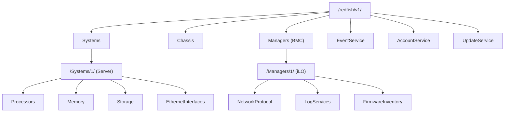

## Stop Clicking Through the Web UI

Look, HPE iLO 6's web interface is decent. But if you're managing dozens or hundreds of ProLiant Gen11 servers, clicking through each one is a waste of time and a recipe for human error. Last week we racked 30 DL380 Gen11s. Every single one needed iLO credentials changed, NTP and SNMP configured, and firmware updated. Doing that through the web UI? That's a three-day slog.

iLO 6 fully supports the Redfish API — an industry standard defined by the DMTF, not some HPE-proprietary protocol. That means you can use standard HTTP REST calls and Python to manage everything at scale. And iLO 6 has Redfish enabled by default, so there's no extra configuration needed.

Here's the gotcha: a lot of tutorials online still point you to the `python-hpilo` library. That thing talks the old RIBCL protocol, which has been deprecated since iLO 5. For iLO 6, you must use Redfish. Don't waste time on the old path.

## Redfish API Architecture at a Glance

iLO 6's Redfish implementation follows the standard resource tree structure:



Every operation is a plain HTTP GET/POST/PATCH/DELETE request returning JSON. For authentication, the recommended approach is Session-based: POST credentials to get a token, then pass it in the `X-Auth-Token` header for subsequent requests. Basic Auth works too, but it's less secure.

## Environment Setup

Python 3.8+ is all you need. No heavy frameworks required.

```bash
pip install requests urllib3
```

HPE provides the `python-ilorest-library`, but honestly, it's bloated and the documentation is terrible. I recommend using bare `requests` — it's more controllable and easier to debug when things go wrong.

## Real-World Example: Bulk Password Change

Here's the scenario: 30 new servers, all with the same default iLO password. We need to generate unique random passwords for each.

```python
import requests
import json
import secrets
import string
import time

# Disable SSL warnings (iLO uses self-signed certs)
requests.packages.urllib3.disable_warnings()

def generate_password(length=20):
    chars = string.ascii_letters + string.digits + "!@#$%^&*"
    return ''.join(secrets.choice(chars) for _ in range(length))

def change_ilo_password(ilo_ip, current_user, current_pass, new_password):
    """
    Change iLO admin password via Redfish API
    """
    base_url = f"https://{ilo_ip}/redfish/v1"
    
    # Step 1: Create a session
    session_payload = {
        "UserName": current_user,
        "Password": current_pass
    }
    
    try:
        session_resp = requests.post(
            f"{base_url}/SessionService/Sessions",
            json=session_payload,
            verify=False,
            timeout=10
        )
        session_resp.raise_for_status()
        
        auth_token = session_resp.headers.get("X-Auth-Token")
        if not auth_token:
            print(f"[{ilo_ip}] Failed to get auth token")
            return False
            
        headers = {
            "X-Auth-Token": auth_token,
            "Content-Type": "application/json"
        }
        
        # Step 2: Find the admin account URI
        accounts_resp = requests.get(
            f"{base_url}/AccountService/Accounts",
            headers=headers,
            verify=False,
            timeout=10
        )
        accounts_resp.raise_for_status()
        accounts_data = accounts_resp.json()
        
        target_account_uri = None
        for member in accounts_data.get("Members", []):
            acct_resp = requests.get(
                f"{base_url}{member['@odata.id']}",
                headers=headers,
                verify=False,
                timeout=10
            )
            acct = acct_resp.json()
            if acct.get("UserName") == current_user:
                target_account_uri = f"{base_url}{member['@odata.id']}"
                break
        
        if not target_account_uri:
            print(f"[{ilo_ip}] User {current_user} not found")
            requests.delete(session_resp.headers.get("Location"), headers=headers, verify=False)
            return False
        
        # Step 3: Change the password
        update_payload = {
            "Password": new_password
        }
        patch_resp = requests.patch(
            target_account_uri,
            json=update_payload,
            headers=headers,
            verify=False,
            timeout=10
        )
        
        if patch_resp.status_code in [200, 204]:
            print(f"[{ilo_ip}] Password changed successfully")
            
            # Verify the new password
            session_location = session_resp.headers.get("Location")
            if session_location:
                requests.delete(session_location, headers=headers, verify=False)
            
            test_resp = requests.post(
                f"{base_url}/SessionService/Sessions",
                json={"UserName": current_user, "Password": new_password},
                verify=False,
                timeout=10
            )
            if test_resp.status_code == 201:
                print(f"[{ilo_ip}] New password verified")
                test_headers = {"X-Auth-Token": test_resp.headers.get("X-Auth-Token")}
                requests.delete(test_resp.headers.get("Location"), headers=test_headers, verify=False)
                return True
            else:
                print(f"[{ilo_ip}] WARNING: New password verification failed! {test_resp.status_code}")
                return False
        else:
            print(f"[{ilo_ip}] Password change failed: {patch_resp.status_code} {patch_resp.text}")
            return False
            
    except requests.exceptions.RequestException as e:
        print(f"[{ilo_ip}] Request exception: {str(e)}")
        return False
    finally:
        if 'headers' in locals() and 'session_resp' in locals():
            session_location = session_resp.headers.get("Location")
            if session_location:
                try:
                    requests.delete(session_location, headers=headers, verify=False, timeout=5)
                except:
                    pass

# Bulk execution
ilo_list = [
    {"ip": "192.168.1.10", "user": "admin", "pass": "defaultpass"},
    # ... more iLOs
]

for ilo in ilo_list:
    new_pass = generate_password()
    success = change_ilo_password(ilo["ip"], ilo["user"], ilo["pass"], new_pass)
    if success:
        print(f"{ilo['ip']} -> {new_pass}")
        # Log this to a password vault or Hashicorp Vault
    time.sleep(1)
```

Key points about this code:

1. **Session lifecycle**: Redfish requires explicit session creation and deletion. If you don't delete sessions, you'll exhaust the iLO's session limit (default is 8).
2. **PATCH, not PUT**: Use PATCH to change the password. Only send the fields you're modifying.
3. **Verification**: After changing the password, I always create a new session with the new password to confirm it works before deleting the old session.

## Bulk Hardware Inventory

Another common need: collecting serial numbers, firmware versions, and memory configurations across your fleet.

```python
def get_server_inventory(ilo_ip, username, password):
    """
    Collect key server hardware information
    """
    base_url = f"https://{ilo_ip}/redfish/v1"
    
    session_resp = requests.post(
        f"{base_url}/SessionService/Sessions",
        json={"UserName": username, "Password": password},
        verify=False,
        timeout=10
    )
    session_resp.raise_for_status()
    token = session_resp.headers.get("X-Auth-Token")
    headers = {"X-Auth-Token": token}
    
    inventory = {}
    
    try:
        sys_resp = requests.get(
            f"{base_url}/Systems/1",
            headers=headers,
            verify=False,
            timeout=10
        )
        sys_data = sys_resp.json()
        
        inventory["serial"] = sys_data.get("SerialNumber", "N/A")
        inventory["model"] = sys_data.get("Model", "N/A")
        inventory["bios_version"] = sys_data.get("BiosVersion", "N/A")
        inventory["cpu_count"] = len(sys_data.get("Processors", {}).get("Members", []))
        inventory["total_memory_gb"] = sys_data.get("MemorySummary", {}).get("TotalSystemMemoryGiB", 0)
        
        mgr_resp = requests.get(
            f"{base_url}/Managers/1",
            headers=headers,
            verify=False,
            timeout=10
        )
        mgr_data = mgr_resp.json()
        inventory["ilo_firmware"] = mgr_data.get("FirmwareVersion", "N/A")
        
        fw_resp = requests.get(
            f"{base_url}/Managers/1/FirmwareInventory",
            headers=headers,
            verify=False,
            timeout=10
        )
        fw_data = fw_resp.json()
        
        inventory["firmware_versions"] = {}
        for member in fw_data.get("Members", []):
            item_resp = requests.get(
                f"{base_url}{member['@odata.id']}",
                headers=headers,
                verify=False,
                timeout=10
            )
            item = item_resp.json()
            inventory["firmware_versions"][item.get("Name", item.get("Id", "unknown"))] = item.get("Version", "N/A")
        
        return inventory
        
    finally:
        requests.delete(session_resp.headers.get("Location"), headers=headers, verify=False, timeout=5)

info = get_server_inventory("192.168.1.10", "admin", "newpass123")
print(json.dumps(info, indent=2))
```

Sample output:
```json
{
  "serial": "SGH1234ABC",
  "model": "ProLiant DL380 Gen11",
  "bios_version": "U41 v2.10 (02/10/2026)",
  "cpu_count": 2,
  "total_memory_gb": 512,
  "ilo_firmware": "iLO 6 v2.45",
  "firmware_versions": {
    "System ROM": "U41 v2.10",
    "iLO 6": "2.45",
    "Power Management Controller": "1.20",
    "Intelligent Platform Management Interface": "2.0",
    "Smart Array P408i-a SR Gen11": "8.20"
  }
}
```

## Firmware Update Automation

iLO 6 firmware updates go through the Redfish `UpdateService`, supporting both HTTP and SMB sources. HTTP is simpler.

```python
def update_ilo_firmware(ilo_ip, username, password, firmware_url):
    """
    Upgrade iLO firmware via HTTP source
    firmware_url: HTTP URL to the firmware file
    """
    base_url = f"https://{ilo_ip}/redfish/v1"
    
    session_resp = requests.post(
        f"{base_url}/SessionService/Sessions",
        json={"UserName": username, "Password": password},
        verify=False,
        timeout=10
    )
    session_resp.raise_for_status()
    token = session_resp.headers.get("X-Auth-Token")
    headers = {"X-Auth-Token": token, "Content-Type": "application/json"}
    
    try:
        update_payload = {
            "ImageURI": firmware_url,
            "UpdateTarget": "Manager",
            "TransferProtocol": "HTTP",
            "ForceUpdate": False
        }
        
        resp = requests.post(
            f"{base_url}/UpdateService/Actions/UpdateService.SimpleUpdate",
            json=update_payload,
            headers=headers,
            verify=False,
            timeout=30
        )
        
        if resp.status_code == 202:
            task_uri = resp.headers.get("Location")
            print(f"[{ilo_ip}] Firmware update task submitted: {task_uri}")
            
            while True:
                task_resp = requests.get(
                    task_uri,
                    headers=headers,
                    verify=False,
                    timeout=10
                )
                task_data = task_resp.json()
                state = task_data.get("TaskState", "")
                status = task_data.get("TaskStatus", "")
                
                print(f"[{ilo_ip}] Task state: {state} / {status}")
                
                if state == "Completed":
                    print(f"[{ilo_ip}] Firmware update complete! iLO will reboot.")
                    return True
                elif state in ["Exception", "Killed"]:
                    print(f"[{ilo_ip}] Firmware update failed: {task_data.get('Messages', [])}")
                    return False
                
                time.sleep(30)
        else:
            print(f"[{ilo_ip}] Failed to submit update: {resp.status_code} {resp.text}")
            return False
            
    finally:
        requests.delete(session_resp.headers.get("Location"), headers=headers, verify=False, timeout=5)
```

Important note: After a firmware update, iLO reboots and is unavailable for 3-5 minutes. If you're doing bulk updates, run them serially or at staggered intervals.

## Performance Comparison: Redfish vs Legacy Protocol

| Dimension | Redfish API (iLO 6) | Legacy RIBCL (python


