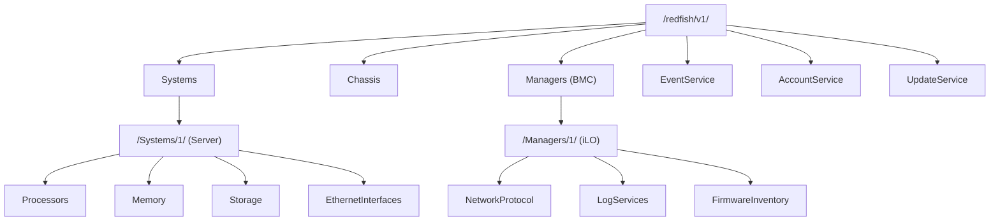

## 别再用 Web 界面点来点去了

说实话，HPE iLO 6 的 Web 界面做得不错，但如果你管着几十上百台 ProLiant Gen11，一个个登录点鼠标，那效率低得让人抓狂。上周我们刚上架了 30 台 DL380 Gen11，全部要改 iLO 账号密码、配置 NTP 和 SNMP、升级固件——用 Web 搞？三天都干不完。

iLO 6 全面支持 Redfish API，这是行业标准（DMTF 定义的），不是 HPE 自己搞的私有协议。这意味着你可以用标准 HTTP REST 调用，通过 Python 脚本批量管理。而且 iLO 6 默认启用了 Redfish，不需要额外配置。

但有个坑：网上很多教程还停留在 `python-hpilo` 那个库，那是基于 iLO 的旧版专有协议（RIBCL），iLO 5 之后就不推荐用了。iLO 6 必须走 Redfish，别走弯路。

## Redfish API 架构速览

iLO 6 的 Redfish 实现遵循标准的资源树结构：



所有操作都是 HTTP GET/POST/PATCH/DELETE 请求，返回 JSON。认证方式推荐 Session 模式（先 POST 登录拿 Token，后续请求带 `X-Auth-Token` 头），当然也支持 Basic Auth。

## 环境准备

Python 3.8+ 就够了，不需要装什么重型框架。核心依赖：

```bash
pip install requests urllib3
```

官方有个 `python-ilorest-library`，但说实话太重了，封装了太多层，文档也写得稀烂。我建议直接用 `requests` 裸写，更可控，出了问题也容易调试。

## 实战：批量改 iLO 密码

来看一个真实场景：30 台新服务器，默认 iLO 密码都一样，需要批量改成随机密码。

```python
import requests
import json
import secrets
import string
import time

# 关闭 SSL 警告（iLO 自签证书）
requests.packages.urllib3.disable_warnings()

def generate_password(length=20):
    chars = string.ascii_letters + string.digits + "!@#$%^&*"
    return ''.join(secrets.choice(chars) for _ in range(length))

def change_ilo_password(ilo_ip, current_user, current_pass, new_password):
    """
    通过 Redfish API 修改 iLO 管理员密码
    """
    base_url = f"https://{ilo_ip}/redfish/v1"
    
    # 第一步：创建 Session
    session_payload = {
        "UserName": current_user,
        "Password": current_pass
    }
    
    try:
        # 注意：创建 Session 用 POST 到 SessionService 的 Sessions 集合
        session_resp = requests.post(
            f"{base_url}/SessionService/Sessions",
            json=session_payload,
            verify=False,
            timeout=10
        )
        session_resp.raise_for_status()
        
        # 从响应头拿 Token
        auth_token = session_resp.headers.get("X-Auth-Token")
        if not auth_token:
            print(f"[{ilo_ip}] 无法获取认证 Token")
            return False
            
        headers = {
            "X-Auth-Token": auth_token,
            "Content-Type": "application/json"
        }
        
        # 第二步：找到管理员账号的 URI
        # 通常管理员账号在 /redfish/v1/AccountService/Accounts/1
        accounts_resp = requests.get(
            f"{base_url}/AccountService/Accounts",
            headers=headers,
            verify=False,
            timeout=10
        )
        accounts_resp.raise_for_status()
        accounts_data = accounts_resp.json()
        
        # 遍历所有账号，找到 Administrator
        target_account_uri = None
        for member in accounts_data.get("Members", []):
            acct_resp = requests.get(
                f"{base_url}{member['@odata.id']}",
                headers=headers,
                verify=False,
                timeout=10
            )
            acct = acct_resp.json()
            if acct.get("UserName") == current_user:
                target_account_uri = f"{base_url}{member['@odata.id']}"
                break
        
        if not target_account_uri:
            print(f"[{ilo_ip}] 未找到用户 {current_user}")
            # 记得删 Session
            requests.delete(session_resp.headers.get("Location"), headers=headers, verify=False)
            return False
        
        # 第三步：修改密码
        update_payload = {
            "Password": new_password
        }
        patch_resp = requests.patch(
            target_account_uri,
            json=update_payload,
            headers=headers,
            verify=False,
            timeout=10
        )
        
        if patch_resp.status_code == 200 or patch_resp.status_code == 204:
            print(f"[{ilo_ip}] 密码修改成功")
            
            # 测试新密码是否生效
            # 先删掉旧 Session
            session_location = session_resp.headers.get("Location")
            if session_location:
                requests.delete(session_location, headers=headers, verify=False)
            
            # 用新密码创建 Session 验证
            test_resp = requests.post(
                f"{base_url}/SessionService/Sessions",
                json={"UserName": current_user, "Password": new_password},
                verify=False,
                timeout=10
            )
            if test_resp.status_code == 201:
                print(f"[{ilo_ip}] 新密码验证通过")
                test_headers = {"X-Auth-Token": test_resp.headers.get("X-Auth-Token")}
                requests.delete(test_resp.headers.get("Location"), headers=test_headers, verify=False)
                return True
            else:
                print(f"[{ilo_ip}] 警告：新密码验证失败！{test_resp.status_code}")
                return False
        else:
            print(f"[{ilo_ip}] 密码修改失败: {patch_resp.status_code} {patch_resp.text}")
            return False
            
    except requests.exceptions.RequestException as e:
        print(f"[{ilo_ip}] 请求异常: {str(e)}")
        return False
    finally:
        # 确保 Session 被清理
        if 'headers' in locals() and 'session_resp' in locals():
            session_location = session_resp.headers.get("Location")
            if session_location:
                try:
                    requests.delete(session_location, headers=headers, verify=False, timeout=5)
                except:
                    pass

# 批量执行
ilo_list = [
    {"ip": "192.168.1.10", "user": "admin", "pass": "defaultpass"},
    # ... 更多 iLO
]

for ilo in ilo_list:
    new_pass = generate_password()
    success = change_ilo_password(ilo["ip"], ilo["user"], ilo["pass"], new_pass)
    if success:
        print(f"{ilo['ip']} -> {new_pass}")
        # 这里可以记录到密码表或 Hashicorp Vault
    time.sleep(1)  # 别把 iLO 打挂了
```

这段代码有几个关键点：

1. **Session 管理**：Redfish 要求显式创建和删除 Session，不删 Session 会占满 iLO 的 Session 配额（默认 8 个）
2. **PATCH 不是 PUT**：修改密码用 PATCH 方法，只需要传要改的字段
3. **验证机制**：改完密码后我习惯用新密码重新建个 Session 验证，防止密码没生效就把旧 Session 删了

## 批量获取硬件信息

另一个高频需求：批量采集服务器序列号、固件版本、内存配置。

```python
def get_server_inventory(ilo_ip, username, password):
    """
    采集服务器关键硬件信息
    """
    base_url = f"https://{ilo_ip}/redfish/v1"
    
    # 创建 Session
    session_resp = requests.post(
        f"{base_url}/SessionService/Sessions",
        json={"UserName": username, "Password": password},
        verify=False,
        timeout=10
    )
    session_resp.raise_for_status()
    token = session_resp.headers.get("X-Auth-Token")
    headers = {"X-Auth-Token": token}
    
    inventory = {}
    
    try:
        # 获取系统信息
        sys_resp = requests.get(
            f"{base_url}/Systems/1",
            headers=headers,
            verify=False,
            timeout=10
        )
        sys_data = sys_resp.json()
        
        inventory["serial"] = sys_data.get("SerialNumber", "N/A")
        inventory["model"] = sys_data.get("Model", "N/A")
        inventory["bios_version"] = sys_data.get("BiosVersion", "N/A")
        inventory["cpu_count"] = len(sys_data.get("Processors", {}).get("Members", []))
        inventory["total_memory_gb"] = sys_data.get("MemorySummary", {}).get("TotalSystemMemoryGiB", 0)
        
        # 获取 iLO 固件版本
        mgr_resp = requests.get(
            f"{base_url}/Managers/1",
            headers=headers,
            verify=False,
            timeout=10
        )
        mgr_data = mgr_resp.json()
        inventory["ilo_firmware"] = mgr_data.get("FirmwareVersion", "N/A")
        
        # 获取固件清单
        fw_resp = requests.get(
            f"{base_url}/Managers/1/FirmwareInventory",
            headers=headers,
            verify=False,
            timeout=10
        )
        fw_data = fw_resp.json()
        
        inventory["firmware_versions"] = {}
        for member in fw_data.get("Members", []):
            item_resp = requests.get(
                f"{base_url}{member['@odata.id']}",
                headers=headers,
                verify=False,
                timeout=10
            )
            item = item_resp.json()
            inventory["firmware_versions"][item.get("Name", item.get("Id", "unknown"))] = item.get("Version", "N/A")
        
        return inventory
        
    finally:
        # 清理 Session
        requests.delete(session_resp.headers.get("Location"), headers=headers, verify=False, timeout=5)

# 使用示例
info = get_server_inventory("192.168.1.10", "admin", "newpass123")
print(json.dumps(info, indent=2))
```

输出示例：
```json
{
  "serial": "SGH1234ABC",
  "model": "ProLiant DL380 Gen11",
  "bios_version": "U41 v2.10 (02/10/2026)",
  "cpu_count": 2,
  "total_memory_gb": 512,
  "ilo_firmware": "iLO 6 v2.45",
  "firmware_versions": {
    "System ROM": "U41 v2.10",
    "iLO 6": "2.45",
    "Power Management Controller": "1.20",
    "Intelligent Platform Management Interface": "2.0",
    "Smart Array P408i-a SR Gen11": "8.20"
  }
}
```

## 固件升级自动化

iLO 6 的固件升级通过 Redfish 的 `UpdateService` 实现，支持 HTTP 和 SMB 两种源。我推荐用 HTTP，简单直接。

```python
def update_ilo_firmware(ilo_ip, username, password, firmware_url):
    """
    通过 HTTP 源升级 iLO 固件
    firmware_url: 可访问的固件文件 HTTP 地址
    """
    base_url = f"https://{ilo_ip}/redfish/v1"
    
    # 创建 Session
    session_resp = requests.post(
        f"{base_url}/SessionService/Sessions",
        json={"UserName": username, "Password": password},
        verify=False,
        timeout=10
    )
    session_resp.raise_for_status()
    token = session_resp.headers.get("X-Auth-Token")
    headers = {"X-Auth-Token": token, "Content-Type": "application/json"}
    
    try:
        # 提交升级任务
        update_payload = {
            "ImageURI": firmware_url,
            "UpdateTarget": "Manager",  # 升级 iLO 自身固件
            "TransferProtocol": "HTTP",
            "ForceUpdate": False  # 先不强制，检查兼容性
        }
        
        resp = requests.post(
            f"{base_url}/UpdateService/Actions/UpdateService.SimpleUpdate",
            json=update_payload,
            headers=headers,
            verify=False,
            timeout=30
        )
        
        if resp.status_code == 202:
            # 202 表示任务已接受，返回 Task 监控 URI
            task_uri = resp.headers.get("Location")
            print(f"[{ilo_ip}] 固件升级任务已提交: {task_uri}")
            
            # 轮询任务状态
            while True:
                task_resp = requests.get(
                    task_uri,
                    headers=headers,
                    verify=False,
                    timeout=10
                )
                task_data = task_resp.json()
                state = task_data.get("TaskState", "")
                status = task_data.get("TaskStatus", "")
                
                print(f"[{ilo_ip}] 任务状态: {state} / {status}")
                
                if state == "Completed":
                    print(f"[{ilo_ip}] 固件升级完成！需要重启 iLO")
                    return True
                elif state == "Exception" or state == "Killed":
                    print(f"[{ilo_ip}] 固件升级失败: {task_data.get('Messages', [])}")
                    return False
                
                time.sleep(30)  # 每 30 秒检查一次
        else:
            print(f"[{ilo_ip}] 提交升级任务失败: {resp.status_code} {resp.text}")
            return False
            
    finally:
        requests.delete(session_resp.headers.get("Location"), headers=headers, verify=False, timeout=5)
```

踩坑提醒：iLO 6 固件升级后会自动重启，重启期间 iLO 会断连大约 3-5 分钟。如果你在批量升级，建议串行执行，或者至少错开时间。

## 性能对比：Redfish vs 旧协议

| 维度 | Redfish API (iLO 6) | 旧 RIBCL 协议 (python-hpilo) |
|------|---------------------|------------------------------|
| 协议标准 | DMTF 行业标准，跨厂商 | HPE 私有，iLO 5 后弃用 |
| 认证方式 | Session Token / Basic Auth | 基于 IPMI 的加密通道 |
| 数据传输 | JSON over HTTP(S) | 二进制 XML over TCP 17990 |
| 批量操作效率 | 高（HTTP Keep-Alive） | 低（每个连接都握手） |
| 文档质量 | 官方 Redfish 文档 + 交互式 API 浏览器 | 文档基本停更 |
| 社区支持 | 活跃，Python/Go/PowerShell 都有库 | 基本只有遗留系统在用 |
| 安全性 | HTTPS + Token，支持 RBAC | 端口 17990 经常被防火墙封 |
| 学习曲线 | 中等（理解 REST 即可） | 高（私有协议，调试困难） |

## 常见问题

**Q: iLO 6 的 Redfish API 地址是多少？**
A: 默认是 `https://<iLO-IP>/redfish/v1/`，可以用浏览器打开，iLO 会返回 JSON 格式的根目录。

**Q: 为什么我的 PATCH 请求返回 405 Method Not Allowed？**
A: 检查你 PATCH 的 URI 是否支持 PATCH。有些资源只支持 GET。另外确认 Content-Type 是 `application/json`。

**Q: 批量操作时 iLO 连接数上限是多少？**
A: iLO 6 默认最多 8 个并发 Session。超过会返回 503。所以批量脚本一定要及时删除不再使用的 Session。

**Q: 自签名证书导致 Python 报 SSL 错误怎么办？**
A: 开发环境用 `verify=False` 跳过验证。生产环境建议给 iLO 导入 CA 签发的证书，代码里用 `verify=/path/to/ca-bundle`。

**Q: 升级 iLO 固件后，之前的 Session 和配置会保留吗？**
A: Session 不会保留（iLO 重启了），但用户账号和网络配置会保留。固件升级脚本里要重新认证。

## 社区声音

Reddit 上 r/devops 有个帖子讨论得很热烈："Transitioning from 6.5 years in IT Infra to DevOps. I built an end-to-end GitOps pipeline on Azure & some Python automation." 帖主说他在传统基础设施干了 6 年多，现在转向 DevOps，发现自动化 iLO 管理这种 "最后一公里" 问题反而最难搞。评论区一致认为：硬件管理自动化是 DevOps 落地最容易被忽视的环节。

还有一个帖子提到 iLO 7 的目录服务支持问题，有人回复说："Use OneView if you want a supported GUI solution, or write a simple REST API script for automated, multi-generation bulk iLO management." 这也印证了我们的方向——脚本化 Redfish 调用才是批量管理的正确姿势。

## 最佳实践总结

| 实践 | 说明 |
|------|------|
| 总是创建和销毁 Session | 不销毁 Session 会耗尽 iLO 连接数 |
| 使用 Session Token 而非 Basic Auth | Token 有过期机制，更安全 |
| 批量操作加间隔 | 至少 1 秒间隔，防止 iLO 过载 |
| 记录所有变更 | 密码变更、固件升级都要记录审计日志 |
| 先用单个 iLO 测试 | 别直接往 100 台机器上跑未验证的脚本 |
| 处理 HTTP 202 状态码 | 异步任务需要轮询，不要假设立即完成 |
| 固件升级前检查兼容性 | ForceUpdate=True 可能导致不兼容版本被刷入 |
| 配置管理用 Infra-as-Code | 把 iLO 配置存到 Git，用 CI/CD 推送变更 |

## 总结

HPE iLO 6 的 Redfish API 把硬件管理拉到了和云 API 同样的水平。用 Python 写几个脚本，就能把以前需要几天的手动操作压缩到十几分钟。关键是别用那些过时的库，直接怼 `requests` 调 REST API，既轻量又可控。

下一步，可以考虑把 iLO 管理集成到 Ansible 或 Terraform 的工作流里，实现真正的从裸机到 OS 部署的全自动化。不过那是另一个话题了。

<script type="application/ld+json">
{
  "@context": "https://schema.org",
  "@type": "FAQPage",
  "mainEntity": [
    {
      "@type": "Question",
      "name": "iLO 6 的 Redfish API 地址是多少？",
      "acceptedAnswer": {
        "@type": "Answer",
        "text": "默认是 https://<iLO-IP>/redfish/v1/，可以用浏览器打开，iLO 会返回 JSON 格式的根目录。"
      }
    },
    {
      "@type": "Question",
      "name": "为什么我的 PATCH 请求返回 405 Method Not Allowed？",
      "acceptedAnswer": {
        "@type": "Answer",
        "text": "检查你 PATCH 的 URI 是否支持 PATCH。有些资源只支持 GET。另外确认 Content-Type 是 application/json。"
      }
    },
    {
      "@type": "Question",
      "name": "批量操作时 iLO 连接数上限是多少？",
      "acceptedAnswer": {
        "@type": "Answer",
        "text": "iLO 6 默认最多 8 个并发 Session。超过会返回 503。所以批量脚本一定要及时删除不再使用的 Session。"
      }
    },
    {
      "@type": "Question",
      "name": "自签名证书导致 Python 报 SSL 错误怎么办？",
      "acceptedAnswer": {
        "@type": "Answer",
        "text": "开发环境用 verify=False 跳过验证。生产环境建议给 iLO 导入 CA 签发的证书，代码里用 verify=/path/to/ca-bundle。"
      }
    },
    {
      "@type": "Question",
      "name": "升级 iLO 固件后，之前的 Session 和配置会保留吗？",
      "acceptedAnswer": {
        "@type": "Answer",
        "text": "Session 不会保留（iLO 重启了），但用户账号和网络配置会保留。固件升级脚本里要重新认证。"
      }
    }
  ]
}
</script>


