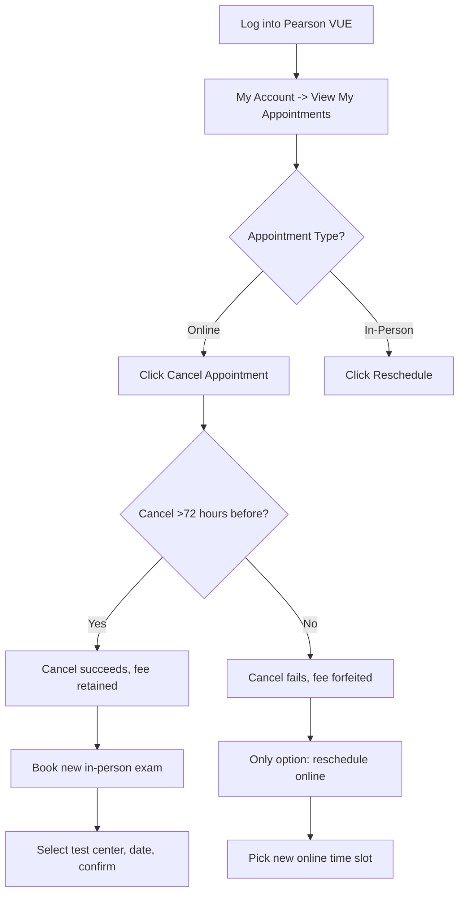

## 1. The Core Problem: Your Online Exam Just Crashed — Now What?

Last week on Reddit, a guy posted in r/ccna saying his Lockdown browser refused to pick up his microphone on exam morning. **His exam slot came and went while he was on hold with Pearson support.** This isn't a fluke — I've personally watched three colleagues lose their exam window to network jitter, a finicky webcam driver, or some random Chrome extension that the proctoring software flagged as "unauthorized."

**So here's the real question: You booked an online exam, but now you want to switch to a physical test center. Can you do it?**

Short answer: **Yes, but there's a hard time window.** The long answer involves understanding how Pearson VUE separates their online (OnVUE) and in-person product lines. Mess this up and you're out $300.

## 2. Pearson VUE Booking Mechanics: Online vs. In-Person

Pearson VUE runs the entire Cisco certification pipeline. Their system treats online exams and test center exams as two completely separate booking silos. You can't just toggle a switch.

| Dimension | Online (OnVUE) | In-Person (Test Center) |
|---|---|---|
| Booking Portal | Pearson VUE Website | Pearson VUE Website |
| Test Environment | Your PC + Lockdown Browser | Test center hardware |
| Proctoring | Remote AI + Human | On-site proctor |
| Reschedule Window | 72+ hours before exam | 24+ hours before exam |
| Cross-Type Switch | **Must cancel & rebook** | **Must cancel & rebook** |
| Cancel Penalty | Fee forfeited if <72 hours | Fee forfeited if <24 hours |
| Hardware Requirements | Strict minimum spec | None required |

**The money line:** Switching from online to in-person isn't a simple "change type" button. You have to **cancel your online appointment first**, then book a new in-person one. And that cancel action has a hard deadline.

## 3. Step-by-Step: Converting an Online Booking to an In-Person Exam

### 3.1 Check Your Time Window

Let's say your exam is scheduled for July 10 at 10:00 AM (UTC+8).

- **Before July 7, 10:00 AM (72-hour mark):** You can cancel the online booking with zero penalty. The fee stays in your account. Then rebook in-person.
- **Between July 7, 10:00 AM and July 9, 10:00 AM (72-24 hours):** You can **reschedule** the online exam to another time, but you **cannot cancel** without losing the fee. If you try to cancel, the $300 is gone.
- **After July 9, 10:00 AM (<24 hours):** You're locked in. Take the exam or forfeit the fee.

**Real-world reality check:** The Reddit guy with the microphone issue could have switched to in-person if he'd checked his setup 72 hours before. He didn't. He found out at T-minus zero. That's a $300 mistake.

### 3.2 The Workflow

### 3.3 The Actual Clicks

1. **Go to Pearson VUE** and log in with your Cisco-linked email.
2. **Navigate to "My Account"** — top right dropdown.
3. **Click "View My Appointments"** — you'll see all your upcoming exams.
4. **Find your CCNA exam** and click the "Actions" dropdown.
5. **Select "Cancel Appointment"** — a modal will pop up warning you about the consequences.
6. **Confirm cancelation** — if you're within the window, it'll say "Your exam fee will be retained for future use."
7. **Rebook from scratch** — go back to the homepage, click "Schedule an Exam," then choose "In-Person at a Test Center."
8. **Pick your test center** — enter your zip code and see what's available.
9. **Select date and time** — pick a slot that works.
10. **Confirm** — if your fee was retained, it should show $0.00.

## 4. Why Online Exams Are a Minefield

I've seen way too many people get burned by OnVUE. **It's not always your fault — the platform has real issues.**

### 4.1 Common Failure Modes

- **Lockdown browser incompatibility:** Enterprise laptops with McAfee or Symantec often get flagged as "unsafe." One colleague had a ThinkPad with Lenovo Vantage pre-installed — Lockdown browser rejected it outright.
- **Network instability:** OnVUE requires 1.5 Mbps up/down minimum. But real-world networks fluctuate. You never know if your neighbor is streaming 4K during your exam.
- **Camera/microphone driver hell:** The Reddit guy's exact problem. Windows 11 privacy settings frequently kill microphone permissions, and Lockdown browser won't give you a friendly warning.
- **Background process interference:** Zoom, Teams, Slack, even OneDrive sync — Lockdown browser detects any of these as "unauthorized software" and kills the exam.

### 4.2 My Hard-Earned Advice: Go In-Person If You Can

**Personal story:** I failed my first CCNA attempt by 5 points (820 out of 825). The cause? A 15-minute network dropout during the exam. My brain went into panic mode. I couldn't recover.

Second attempt? I drove 30 minutes to a test center. Zero issues. Passed with 890.

**Here's the bottom line:** Unless you're 200 miles from the nearest test center, **go in-person.** The test center has standardized hardware, dedicated bandwidth, and a real human proctor. You just show up with your ID and confirmation email. That's it.

## 5. FAQ (Straight from Real User Questions)

### Q1: Can I cancel my online exam within 72 hours?

**No.** Pearson VUE's rule is hard: online exams must be canceled 72+ hours before the start time. If you're inside that window, your options are:
- Take the exam as scheduled (hope for the best)
- Reschedule to another online slot
- Eat the $300 fee

### Q2: What's the difference between rescheduling and canceling?

**Reschedule:** Changes the date/time but keeps the exam type (online stays online). Free if done 72+ hours ahead.
**Cancel:** Terminates the appointment. The fee stays in your Pearson account (if done 72+ hours ahead). You can then rebook — online or in-person.

### Q3: If I cancel, does the fee get refunded to my card?

**No.** The fee does not go back to your credit card or PayPal. It's held in your Pearson VUE account as a credit for future bookings. **That credit expires in 12 months.** Use it or lose it.

### Q4: Can I switch my CCNA exam from online to in-person?

**Yes, but only through cancel-and-rebook.** There's no one-click conversion. Follow the steps in Section 3 above.

### Q5: What if I get sick on exam day?

**Pearson has an emergency cancelation policy.** If you provide a doctor's note (submitted on exam day or the next day), they'll cancel or reschedule for free. But the process is slow — you have to email their support and wait. **Don't rely on this.** If you feel sick, cancel early. It's less painful.

## 6. Summary: Don't Let Tech Problems Torch $300

| Scenario | Action | Time Window | Cost Impact |
|---|---|---|---|
| Online → Online | Reschedule on website | 72+ hours | Free |
| Online → In-Person | Cancel + rebook | 72+ hours | Free |
| Online → Online | Reschedule on website | 72-24 hours | Free |
| Online → In-Person | Cancel + rebook | 72-24 hours | **Not allowed** |
| Any cancel | Cancel on website | <24 hours | Fee forfeited |

**Final word:** If you've booked an online exam and you're even slightly nervous about your setup, **switch to in-person while you still have the 72-hour window.** Don't be the Reddit guy who's still arguing with Pearson support trying to recover his $300. That thread is a cautionary tale we should all learn from.

---


