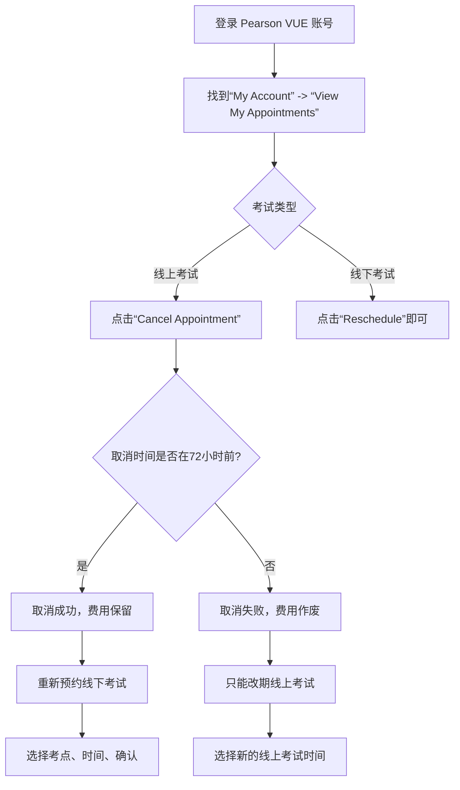

## 一、核心问题：线上考试翻车了，怎么办？

上周Reddit上有个老哥发帖，说他早上准备参加CCNA在线考试，Lockdown浏览器死活识别不了他的麦克风。**考试时间到了，他还在跟技术支持扯皮。** 这种情况不是个例——我见过至少三个同事在考试当天因为网络波动、摄像头驱动、或者某个傻逼的Chrome插件导致考试被强制终止。

**所以问题来了：你已经预约了线上考试，但想改成线下考点，行不行？**

答案是：**可以，但有时间窗口和操作限制。** 别慌，这不是什么高端操作，但如果你不知道规则，代价就是白扔300美元。

## 二、Pearson VUE的预约机制：线上 vs 线下

Pearson VUE是Cisco认证考试的唯一官方合作伙伴。他们的系统里，线上考试（OnVUE）和线下考试（Pearson Professional Center）是两个不同的“产品线”。

| 维度 | 线上考试 (OnVUE) | 线下考试 (Test Center) |
|---|---|---|
| 预约方式 | Pearson VUE官网 | Pearson VUE官网 |
| 考试环境 | 你自己的电脑 + Lockdown浏览器 | 考点提供的电脑 |
| 监考方式 | 远程AI + 人工监考 | 现场监考员 |
| 改期规则 | 考前72小时免费改期 | 考前24小时免费改期 |
| 跨类型改期 | **需要取消重新预约** | **需要取消重新预约** |
| 取消惩罚 | 考前72小时内取消，考试费作废 | 考前24小时内取消，考试费作废 |
| 设备要求 | 必须满足最低配置 | 无设备要求 |

**关键信息：** 从线上改成线下，不是点个按钮就能切换的。你需要**先取消线上预约，再重新预约线下考试**。而这个取消操作有严格的时间限制。

## 三、操作步骤：从线上预约转成线下考点

### 3.1 确认你的时间窗口

假设你的考试时间是7月10日上午10点（UTC+8）。

- **7月7日上午10点前**：你可以自由取消线上预约，然后重新预约线下考试。**没有罚款。**
- **7月7日上午10点后到7月9日上午10点**：你只能**改期**线上考试（改到另一个时间），但不能取消。如果取消，考试费作废。
- **7月9日上午10点后**：任何操作都不行。你只能参加考试或者放弃。

**现实案例：** Reddit上那个麦克风出问题的老哥，他如果在考试前72小时发现问题，完全可以改成线下。但他是在考试当天才发现问题，那就只能硬着头皮上了。

### 3.2 操作流程

### 3.3 具体操作

1. **登录Pearson VUE官网**：用你注册Cisco账号的邮箱登录。
2. **进入“My Account”**：在右上角头像下拉菜单里。
3. **点击“View My Appointments”**：你会看到你所有的预约。
4. **找到你的CCNA考试**：点击旁边的“Actions”按钮。
5. **选择“Cancel Appointment”**：系统会弹出一个确认窗口，告诉你取消的后果。
6. **确认取消**：如果时间允许，系统会提示“Your exam fee will be retained for future use”。
7. **重新预约**：回到首页，选择“Schedule an Exam”，然后选择“In-Person at a Test Center”。
8. **选择考点**：输入你的地址，系统会列出附近的考点。
9. **选择时间**：选择你想要的日期和时间。
10. **确认并支付**：如果之前的考试费已经保留，这里会显示“$0.00”。

## 四、为什么线上考试这么容易翻车？

我见过太多人栽在线上考试上了。**这不是你的问题，是OnVUE本身就有问题。**

### 4.1 常见翻车原因

- **Lockdown浏览器不兼容**：某些企业级电脑（比如装了McAfee或者Symantec的）会被Lockdown浏览器误判为不安全的系统。我见过一个同事的ThinkPad因为预装了Lenovo Vantage软件，被Lockdown浏览器直接拒绝。
- **网络不稳定**：OnVUE要求至少1.5Mbps的上传和下载速度。但问题是，很多人的网络在高峰期会波动。你永远不知道考试那天你的邻居会不会在看4K视频。
- **摄像头/麦克风驱动问题**：Reddit上那个老哥就是这个问题。Windows 11的隐私设置经常会把麦克风权限关掉，而Lockdown浏览器不会给你提示。
- **后台进程干扰**：Zoom、Teams、Slack、甚至OneDrive的同步进程，都可能被Lockdown浏览器检测为“未经授权的软件”，然后终止考试。

### 4.2 我的建议：能线下就别线上

**我个人的血泪教训：** 我考CCNA的时候，线上考试遇到网络波动，考试中断了15分钟。虽然技术支持帮我恢复了，但那15分钟我的心态崩了。**最后我挂了，考了820分（及格线是825分）。**

第二次我直接去线下考点，全程无感，一次过。

**所以我的建议是：** 如果你不是住在离考点300公里以上的地方，**选线下。** 线下考点的电脑是标准配置，网络是专线，监考员是真人。你只需要带身份证和预约确认邮件就行。

## 五、FAQ（来自真实用户疑问）

### Q1: 我能在72小时内取消线上考试吗？

**不能。** Pearson VUE的规则是：线上考试必须在考前72小时以上取消，否则考试费作废。如果你在72小时内发现问题，你只能选择：
- 按时参加考试（碰运气）
- 改期到另一个时间（线上）
- 放弃（考试费打水漂）

### Q2: 线上考试改期和取消有什么区别？

**改期（Reschedule）**：改变考试时间，但不改变考试类型（线上还是线下）。改期免费（72小时前）。
**取消（Cancel）**：终止预约，考试费保留到你的账户（72小时前）。之后你可以重新预约，可以选线上或线下。

### Q3: 我取消了线上预约，考试费会自动退给我吗？

**不会。** 考试费不会退回到你的信用卡或PayPal。它会被保留在你的Pearson VUE账户里，用于下一次预约。**这个保留期是12个月。** 如果12个月内你不用，钱就没了。

### Q4: 我能把CCNA考试从线上改成线下吗？

**可以，但必须通过取消重新预约的方式。** 没有一键切换的按钮。具体流程见上文第三章。

### Q5: 如果我考试当天生病了怎么办？

**Pearson VUE有紧急取消政策。** 如果你能提供医生证明（必须在考试当天或第二天提交），他们会免费取消或改期。但这个过程很麻烦，需要发邮件到他们的客服，等待处理。**我建议不要依赖这个。** 如果你感觉不舒服，提前取消比事后解释容易得多。

## 六、总结：别让技术问题毁掉你的考试

| 场景 | 操作 | 时间窗口 | 费用影响 |
|---|---|---|---|
| 线上改线上 | 官网改期 | 考前72小时 | 免费 |
| 线上改线下 | 取消+重新预约 | 考前72小时 | 免费 |
| 线上改线上 | 官网改期 | 考前72-24小时 | 免费 |
| 线上改线下 | 取消+重新预约 | 考前72-24小时 | **不允许** |
| 任何取消 | 官网取消 | 低于24小时 | 考试费作废 |

**最后一句：** 如果你已经预约了线上考试，但心里没底，**趁还有72小时，赶紧改成线下。** 别等到考试当天才发现Lockdown浏览器跟你过不去。Reddit上那个老哥的帖子就是最好的警示——他到现在还在跟Pearson VUE客服扯皮，想要回那300美元。

---


