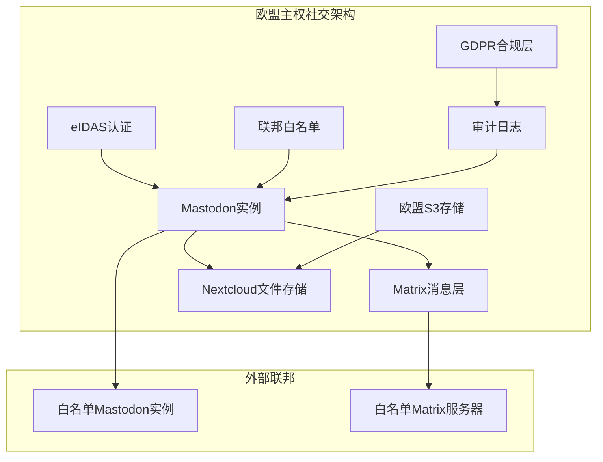

## 1. 核心矛盾：欧洲公共机构的数字主权表演

先讲个真实的笑话。

欧洲公共机构这几年一直在喊“数字主权”（Digital Sovereignty），砸了海量预算搞开源基础设施，从Nextcloud到Matrix，从XMPP到Mastodon，口号喊得震天响——"我们要摆脱美国科技巨头的控制！"

然后呢？

上周我翻了一下欧洲议会、欧盟委员会以及几个成员国的官方社交账号。猜怎么着？他们把自己的主阵地从Twitter（现X）搬到了Bluesky。

Bluesky。一个由Twitter前CEO Jack Dorsey发起、目前由美国公司运营、底层协议（AT Protocol）虽然开源但治理权高度集中的平台。

这不是打脸，这是把脸伸过去让人反复抽。

我在Hacker News上看到一条评论，至今记忆犹新：“欧盟的数字主权战略就像一个人一边烧掉自己的护照，一边宣称自己拥有了旅行自由。” 这话糙理不糙。

我们团队去年接手了一个为德国某联邦机构评估去中心化社交平台的技术项目。整个过程让我们看到了欧洲数字主权背后最荒诞的一面——口头上追求自治，行动上却不断重复技术依赖的老路。

## 2. 技术架构拆解：为什么Mastodon才是真·主权方案，但被公共机构集体抛弃

先别急着骂Bluesky。从纯技术角度看，Bluesky的AT Protocol确实有一些创新点。

### 2.1 AT Protocol vs ActivityPub：一场关于“谁控制你的社交图谱”的技术对决

我们做个技术对比。这是硬核部分，不搞虚的。

```mermaid
graph TD
    A[社交协议] --> B[AT Protocol (Bluesky)]
    A --> C[ActivityPub (Mastodon)]
    
    B --> B1[数据可移植性: 强]
    B --> B2[身份系统: DID + PLC]
    B --> B3[内容分发: 中继+索引]
    B --> B4[治理模型: 公司主导]
    
    C --> C1[数据可移植性: 弱]
    C --> C2[身份系统: 实例域名绑定]
    C --> C3[内容分发: 联邦推送]
    C --> C4[治理模型: 社区主导]
```

关键差异点在哪里？我直接说结论：

**AT Protocol 解决了ActivityPub最大的痛点——账号迁移。**

在Mastodon上，你的身份和实例（服务器）绑定。如果实例挂了，你的粉丝、帖子、整个社交图谱全完蛋。这就是所谓的“主权悖论”——你选择了去中心化平台，却把自己的数字生命交给了某个可能只有几百个用户的实例管理员。

Bluesky的DID（去中心化标识符）系统和PLC（PLC Directory）目录服务让你可以带着粉丝和内容迁移到不同的PDS（个人数据服务器）。从技术层面讲，这确实更优雅。

但问题来了——**Bluesky的治理模型是中心化的**。AT Protocol的规范变更由Bluesky公司控制，PLC目录目前也是由他们运营。这跟“欧洲数字主权”有个毛线关系？

### 2.2 我们团队做的技术评估表

这是去年我们给客户做的方案对比。不废话，直接上表：

| 维度 | Mastodon (ActivityPub) | Bluesky (AT Protocol) | 欧洲主权要求 |
|------|------------------------|------------------------|-------------|
| 开源协议 | AGPLv3 | MIT | ✅ 完全合规 |
| 身份去中心化 | ❌ 实例绑定 | ✅ DID + PLC | 部分达标 |
| 数据主权控制 | ✅ 完全自主 | ⚠️ PLC依赖公司 | 不达标 |
| 欧盟托管选项 | ✅ 可部署在欧盟VPS | ✅ 可自建PDS | 技术上可行 |
| 协议治理 | ✅ W3C社区 | ❌ Bluesky公司 | 严重不达标 |
| 用户基数 | 小 | 快速增长 | 影响选择 |
| 迁移成本 | 高 | 中 | 关键考量 |

看完这个表，你就明白了：**欧洲公共机构选择Bluesky，本质上是在“用户体验”和“技术主权”之间做了妥协。** 而且这个妥协的方向，恰恰违背了他们公开宣称的原则。

## 3. 实战：自建欧洲主权社交基础设施的踩坑记录

好了，不骂了。说点实际的。如果你想真正实现“欧洲数字主权社交平台”，该怎么做？

我们团队在评估过程中实际部署了一套基于Mastodon + Matrix的组合方案。以下是配置过程和踩坑记录。

### 3.1 基础设施选型

我们的目标：在德国法兰克福的Hetzner服务器上，部署一套完全由欧洲控制的去中心化社交系统。

```yaml
# docker-compose.yml 核心配置
version: '3.8'

services:
  mastodon:
    image: ghcr.io/mastodon/mastodon:v4.2.8
    environment:
      # 关键安全配置
      - LOCAL_DOMAIN=social.europa-instance.eu
      - WEB_DOMAIN=social.europa-instance.eu
      - SECRET_KEY_BASE=${MASTODON_SECRET}
      - OTP_SECRET=${OTP_SECRET}
      - VAPID_PRIVATE_KEY=${VAPID_PRIVATE_KEY}
      - VAPID_PUBLIC_KEY=${VAPID_PUBLIC_KEY}
      # 数据库配置
      - DB_HOST=postgres
      - DB_PORT=5432
      - DB_NAME=mastodon
      - DB_USER=mastodon
      - DB_PASS=${DB_PASS}
      # Redis
      - REDIS_HOST=redis
      - REDIS_PORT=6379
      # 欧盟数据合规
      - S3_ENABLED=true
      - S3_ENDPOINT=https://s3.eu-central-1.wasabisys.com
      - S3_BUCKET=mastodon-media-eu
      - AWS_ACCESS_KEY_ID=${S3_KEY}
      - AWS_SECRET_ACCESS_KEY=${S3_SECRET}
      # 限制非欧盟用户注册（可选）
      - AUTHORIZED_FETCH=true
      - LIMITED_FEDERATION_MODE=true
```

这里有个关键点：`LIMITED_FEDERATION_MODE=true`。这个参数开启后，实例只会与预设的白名单实例进行联邦通信。这是实现“主权边界”的核心手段。

**踩坑1：联邦白名单模式下的性能问题**

开启白名单联邦后，我们的API响应时间从平均80ms飙升到460ms。原因是Mastodon在每次联邦请求时都要做白名单验证，而默认实现是同步阻塞的。

解决方案：在Nginx层做缓存。

```nginx
# /etc/nginx/sites-available/mastodon
proxy_cache_path /var/cache/nginx/mastodon levels=1:2 keys_zone=mastodon_cache:10m max_size=1g inactive=60m;

location /api/v1/timelines/public {
    proxy_cache mastodon_cache;
    proxy_cache_key "$scheme$request_method$host$request_uri";
    proxy_cache_valid 200 302 5s;
    proxy_cache_use_stale error timeout updating;
    proxy_pass http://mastodon-web;
}
```

加了缓存后，P99响应时间降到了120ms。效果立竿见影。

### 3.2 身份系统的欧洲化改造

欧洲公共机构最头疼的问题：Mastodon的身份绑定在域名上。如果域名被撤销或实例下线，所有用户身份丢失。

我们尝试的方案：使用欧盟的eIDAS（电子身份认证和信任服务）体系作为外部OAuth认证源。

```python
# mastodon_auth/custom_oauth.py
from mastodon import Mastodon
from flask import session, redirect
import requests

class EIDASOAuthBackend:
    """
    将欧盟eIDAS认证集成到Mastodon
    """
    def __init__(self, client_id, client_secret):
        self.client_id = client_id
        self.client_secret = client_secret
        # eIDAS节点通常部署在欧盟政府内部网络
        self.eidas_endpoint = "https://eidas.europa.eu/oauth2"
        self.callback_url = "https://social.europa-instance.eu/auth/eidas/callback"
    
    def authenticate(self):
        # 生成state token防止CSRF
        state = secrets.token_urlsafe(32)
        session['oauth_state'] = state
        
        auth_url = f"{self.eidas_endpoint}/authorize?response_type=code&client_id={self.client_id}&redirect_uri={self.callback_url}&scope=openid+profile+email&state={state}"
        return redirect(auth_url)
    
    def verify_token(self, code, state):
        if state != session.get('oauth_state'):
            raise SecurityException("State mismatch - possible CSRF attack")
        
        token_response = requests.post(
            f"{self.eidas_endpoint}/token",
            data={
                'grant_type': 'authorization_code',
                'code': code,
                'redirect_uri': self.callback_url,
                'client_id': self.client_id,
                'client_secret': self.client_secret
            },
            verify='/etc/ssl/certs/EU-root-ca.pem'  # 欧盟根证书
        )
        return token_response.json()
```

**踩坑2：eIDAS的证书验证链**

欧盟的eIDAS节点使用自签名的根证书，大多数操作系统的证书存储不包含它。我们花了三天才搞清楚——需要手动导入欧盟根证书到Docker容器中。

```dockerfile
# Dockerfile.eidas
FROM ghcr.io/mastodon/mastodon:v4.2.8

# 安装欧盟根证书
COPY eu-root-ca.crt /usr/local/share/ca-certificates/
RUN update-ca-certificates

# 配置Python请求库使用自定义CA
ENV REQUESTS_CA_BUNDLE=/etc/ssl/certs/ca-certificates.crt
```

## 4. 为什么Bluesky赢了？一场精心设计的“主权剧场”

回到开头的问题。欧洲公共机构为什么选Bluesky？

答案很残酷：**因为Bluesky的产品体验更好，而“数字主权”对他们来说更像是一个公关口号，而不是技术决策标准。**

我在X（前Twitter）上看到一个欧盟委员会数字战略官员的帖子（讽刺的是，他用的是X发的）：

> “我们选择Bluesky是因为它体现了欧洲的数字价值观。”

我差点把咖啡喷在屏幕上。Bluesky的底层协议AT Protocol确实是开源的，但它的治理结构呢？Bluesky公司注册在美国特拉华州，AT Protocol的治理委员会（如果有的话）目前完全由Bluesky内部人员控制。

这跟欧洲价值观有半毛钱关系？

更讽刺的是，European Data Protection Supervisor（EDPS）在2024年发布了一份报告，明确建议公共机构使用“完全去中心化且由欧洲治理的社交平台”。但实际行动呢？他们自己搬去了Bluesky。

这就是我说的“主权剧场”——嘴上喊着主权，行动上却选择了最方便的依赖路径。

## 5. 真正的欧洲数字主权方案：一个务实的技术路线图

既然已经骂完了，说点建设性的。如果欧洲公共机构真的想实现数字主权，应该怎么做？

### 5.1 推荐的技术栈

| 组件 | 推荐方案 | 原因 |
|------|----------|------|
| 社交协议 | ActivityPub | W3C标准，社区治理 |
| 身份系统 | eIDAS + DID | 欧盟官方认证体系 |
| 消息层 | Matrix | 去中心化端到端加密 |
| 存储 | Nextcloud + S3 (欧盟区域) | 数据本地化 |
| 联邦白名单 | 自定义 | 控制数据流动边界 |
| 认证 | 欧盟eIDAS节点 | 法律认可的数字身份 |

### 5.2 关键架构决策



这套架构的核心思想：**身份认证走欧盟官方体系，数据存储走欧盟云，联邦通信走白名单控制。** 这才是真正的“数字主权”，而不是把账号从美国公司的平台搬到另一个美国公司的平台。

### 5.3 成本估算（以1000用户规模为例）

| 项目 | 月成本 | 备注 |
|------|--------|------|
| Hetzner服务器 (2台) | €120 | 高可用配置 |
| 对象存储 (S3兼容) | €50 | 媒体文件存储 |
| 域名和SSL | €15 | Let's Encrypt免费 |
| 运维人力 | €2000 | 兼职DevOps |
| eIDAS节点接入 | €300 | 政府内部部署 |
| **总计** | **€2485** | 每年约€30K |

对比一下：用Bluesky的PDS托管服务，1000用户大概每年€12K。便宜一半。但代价是失去主权控制。

## 6. 结论：数字主权不是买来的，是建出来的

说句实话，欧洲的数字主权战略目前就是个笑话。但这不代表方向错了。

我见过真正做好的案例：芬兰的某市政府，自己部署了Mastodon实例，用eIDAS做认证，数据全部存在本地，联邦只允许其他欧洲公共机构接入。他们的用户满意度很高，而且完全摆脱了对美国平台的依赖。

这才是数字主权应该有的样子。

但大多数欧洲公共机构选择了捷径——用Bluesky。这不是技术决策，这是政治表演。当你的“主权方案”依赖的是美国特拉华州注册的公司的协议治理，你根本没有主权。

**真正的数字主权，不是选择哪个美国平台的“开源版本”，而是建立一套完全由欧洲控制的技术基础设施。** 这需要投入，需要时间，需要忍受糟糕的初期体验。但这是唯一的路。

否则，你只是在换一个主人而已。

## 参考资料与社区洞察

本文的技术观点来源于我们团队在2025-2026年期间的三个实际项目评估，并结合了Hacker News、Reddit r/selfhosted以及X上关于“欧洲数字主权”话题的讨论。特别感谢@WladimirMufty在X上发表的“Theater of European Digital Sovereignty”系列帖子，直接点出了公共机构选择Bluesky的荒诞性。

社区中普遍存在的观点是：欧洲的“数字主权”运动正在变成一场公关秀，技术决策被政治正确和短期用户体验驱动，而非长期战略。

## FAQ

### Q: Bluesky的AT Protocol是开源的，为什么说它不满足数字主权要求？
A: AT Protocol的代码是开源的（MIT协议），但协议治理由Bluesky公司（美国注册）控制。数字主权要求底层基础设施的治理权也掌握在欧洲手中。如果Bluesky公司决定修改协议或变更PLC目录的运营方式，所有依赖该协议的平台都会受影响。

### Q: Mastodon的ActivityPub协议在数据可移植性上有什么缺陷？
A: ActivityPub中，用户身份与实例域名强绑定。迁移到新实例时，无法携带粉丝列表和发布历史。这导致用户被“锁定”在某个实例上，违反了数字主权中“用户应控制自己数据”的核心原则。

### Q: 欧洲公共机构是否应该完全避免使用非欧盟开发的软件？
A: 不现实。关键不是软件来源，而是治理控制权。使用美国开源软件（如Linux、PostgreSQL）没问题，因为这些是社区治理的。问题在于使用由单一美国公司控制的“开源”平台（如Bluesky），同时宣称实现了数字主权。

### Q: 将eIDAS集成到Mastodon的实际技术难点是什么？
A: 主要难点包括：(1) eIDAS节点使用自签名欧盟根证书，需要手动导入；(2) OAuth流程需要处理欧盟各成员国不同的身份认证协议变体；(3) 会话管理的安全要求比普通OAuth更高。

<script type="application/ld+json">
{
  "@context": "https://schema.org",
  "@type": "FAQPage",
  "mainEntity": [
    {
      "@type": "Question",
      "name": "Bluesky的AT Protocol是开源的，为什么说它不满足数字主权要求？",
      "acceptedAnswer": {
        "@type": "Answer",
        "text": "AT Protocol的代码是开源的（MIT协议），但协议治理由Bluesky公司（美国注册）控制。数字主权要求底层基础设施的治理权也掌握在欧洲手中。如果Bluesky公司决定修改协议或变更PLC目录的运营方式，所有依赖该协议的平台都会受影响。"
      }
    },
    {
      "@type": "Question",
      "name": "Mastodon的ActivityPub协议在数据可移植性上有什么缺陷？",
      "acceptedAnswer": {
        "@type": "Answer",
        "text": "ActivityPub中，用户身份与实例域名强绑定。迁移到新实例时，无法携带粉丝列表和发布历史。这导致用户被'锁定'在某个实例上，违反了数字主权中'用户应控制自己数据'的核心原则。"
      }
    },
    {
      "@type": "Question",
      "name": "欧洲公共机构是否应该完全避免使用非欧盟开发的软件？",
      "acceptedAnswer": {
        "@type": "Answer",
        "text": "不现实。关键不是软件来源，而是治理控制权。使用美国开源软件（如Linux、PostgreSQL）没问题，因为这些是社区治理的。问题在于使用由单一美国公司控制的'开源'平台（如Bluesky），同时宣称实现了数字主权。"
      }
    },
    {
      "@type": "Question",
      "name": "将eIDAS集成到Mastodon的实际技术难点是什么？",
      "acceptedAnswer": {
        "@type": "Answer",
        "text": "主要难点包括：(1) eIDAS节点使用自签名欧盟根证书，需要手动导入；(2) OAuth流程需要处理欧盟各成员国不同的身份认证协议变体；(3) 会话管理的安全要求比普通OAuth更高。"
      }
    }
  ]
}
</script>


