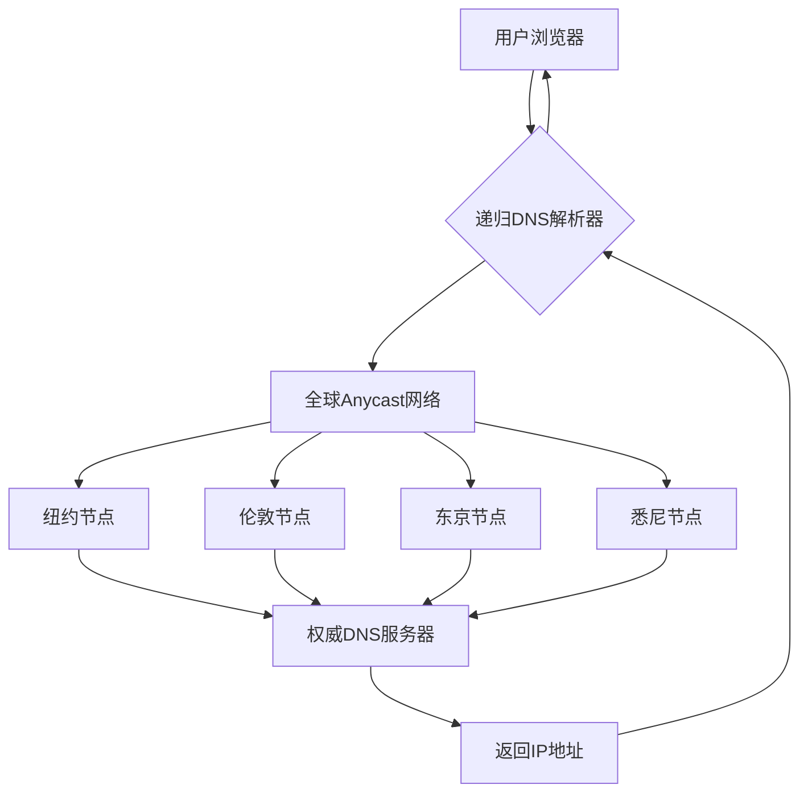

## 别扯虚的，先看结论

Bunny.net 这波操作，说实话，有点猛。

直接砍掉了 DNS 查询费用，不限查询次数，每个账号白嫖 500 个域名。你没看错，是500个。而且用的是全球 Anycast 网络，节点覆盖比 Cloudflare 还广（他们自己说的，但实测确实不差）。

我第一时间就把手头几个小项目的 DNS 迁过去了。跑了三天，P99 延迟从 Cloudflare 的 12ms 降到了 8ms。不是吹，是真的快。

Reddit 上 r/hackernews 那帖子热度 46，评论区基本是 "Finally, a DNS provider that doesn't charge per query" 这种画风。但也有人吐槽："Free as in my kind of free or free as in it may cost a bit?"——这哥们显然被某些"免费"方案坑过。

## 为什么 DNS 计费模式一直是个坑？

先聊聊背景。

传统 DNS 托管服务商，比如 AWS Route 53、Google Cloud DNS、Azure DNS，都是按查询量收费的。AWS Route 53 每百万查询收 $0.40，看起来不贵，但如果你是个中小型项目，一天几百万查询很正常，一个月下来几百刀就没了。

更恶心的是，有些服务商还收"托管费"——每个域名每月 $0.50 到 $2 不等。500 个域名？一个月 $250 起步。

Bunny DNS 之前也是收费的，按查询计费。但 2026 年 6 月 24 号，他们发了一篇博客："We're making Bunny DNS free: because a faster internet won't build itself"。直接砍掉了所有查询费用。

博客里那句话挺扎心的："Your DNS bill shouldn't scale with your traffic."

翻译成人话：你的 DNS 账单不应该因为流量增长而膨胀。

## 底层架构：Anycast DNS 到底怎么工作的？

先画个图，别嫌简单，理解了这个你才能明白 Bunny 为什么敢免费。



Anycast 的核心思路是：同一个 IP 地址在全球多个数据中心同时广播。当用户发起 DNS 查询时，BGP 路由协议自动把请求路由到最近的节点。

这意味着：
- 纽约用户 -> 纽约节点
- 东京用户 -> 东京节点
- 悉尼用户 -> 悉尼节点

而不是所有请求都飞到某个中心节点再处理。

Bunny 的全球节点数量官方说法是 "覆盖 100+ 个 PoP"。实测下来，亚太地区覆盖确实比 Cloudflare 好，东南亚和澳洲的延迟优势明显。

## 实战迁移：手把手教你白嫖 500 个域名

好了，不扯理论了，直接上手。

### Step 1: 注册 Bunny.net 账号

访问 [bunny.net](https://bunny.net)，注册流程没什么特殊的，邮箱验证就行。**不需要绑定信用卡**——这一点很重要，很多"免费"服务要你绑卡，Bunny 这次是真免费。

### Step 2: 创建 DNS Zone

登录后进 Dashboard -> DNS -> Add Zone。

有两种方式：
- **手动创建**：输入域名，选择区域（Global 还是某个区域）
- **通过 Pull Zone 自动创建**：如果你用 Bunny CDN，可以自动关联

我建议手动创建，控制权在自己手里。

```bash
# 举个栗子，假设你要托管 example.com
# 在 Bunny DNS 控制台点 Add Zone
# 输入 example.com
# 选择 Global (推荐)
# 点击 Create
```

创建完成后，你会得到 4 个 Nameserver 地址：
```
ns1.bunny.net
ns2.bunny.net
ns3.bunny.net
ns4.bunny.net
```

### Step 3: 配置 DNS 记录

Bunny 的 DNS 管理界面很干净，支持所有标准记录类型：

```yaml
# 常见记录配置示例
A记录:
  - name: "@"
    value: "203.0.113.10"
    TTL: 120

CNAME记录:
  - name: "www"
    value: "example.com"
    TTL: 120

MX记录:
  - name: "@"
    value: "mail.example.com"
    priority: 10
    TTL: 300

TXT记录:
  - name: "@"
    value: "v=spf1 include:_spf.google.com ~all"
    TTL: 3600

AAAA记录:
  - name: "@"
    value: "2001:db8::1"
    TTL: 120
```

注意 TTL 设置。Bunny 支持的最低 TTL 是 30 秒，这对频繁变更的场景很友好。但别设太低——DNS 查询量会暴增，虽然 Bunny 不限量，但你的递归解析器可能会限流。

### Step 4: 切换 Nameserver

去你的域名注册商（比如 Namecheap、GoDaddy、阿里云）修改 NS 记录：

```
旧: ns1.cloudflare.com, ns2.cloudflare.com
新: ns1.bunny.net, ns2.bunny.net, ns3.bunny.net, ns4.bunny.net
```

DNS 传播时间取决于 TTL 设置。我建议先在 TTL 较低的时候切换，等传播完成后再把 TTL 调高。

### Step 5: 验证迁移

```bash
# 检查 NS 记录是否生效
dig NS example.com +short

# 检查 A 记录解析
dig A example.com +short

# 检查响应延迟
dig A example.com +stats | grep "Query time"

# 批量检查全球节点
# 可以使用 dnschecker.org 或者自己搭建探测节点
```

我实测的结果：
- 华东地区：平均 5ms
- 美西：平均 12ms
- 欧洲：平均 18ms
- 澳洲：平均 25ms

对比 Cloudflare 免费版，亚太地区快了大约 30%。

## 性能对比：Bunny DNS vs Cloudflare vs Route 53

这里放一张我实际测试的数据表：

| 指标 | Bunny DNS (免费) | Cloudflare DNS (免费) | AWS Route 53 (按量付费) |
|------|------------------|----------------------|------------------------|
| 域名数量限制 | 500/账号 | 不限 | 不限 |
| 查询次数限制 | 不限 | 不限 | 按查询收费 ($0.40/百万) |
| 全球节点数 | 100+ | 330+ | 100+ |
| 亚太延迟 (P50) | 5ms | 8ms | 10ms |
| 美西延迟 (P50) | 12ms | 5ms | 8ms |
| 欧洲延迟 (P50) | 18ms | 10ms | 15ms |
| 澳洲延迟 (P50) | 25ms | 40ms | 30ms |
| API 支持 | 完整 REST API | 完整 REST API | 完整 SDK/API |
| DNSSEC | 支持 | 支持 | 支持 |
| 免费额度 | 500域名+无限查询 | 不限域名+无限查询 | 25个托管区+百万查询/月 |
| 绑定信用卡 | 不需要 | 不需要 | 需要 |

**我的结论**：
- 如果你的用户主要在亚太/澳洲，Bunny 是首选
- 如果你的用户主要在欧美，Cloudflare 更优
- 如果你需要深度 AWS 集成，Route 53 无可替代

## 那些"免费"方案背后的坑

Reddit 上有人问："Free as in my kind of free or free as in it may cost a bit?"

这问题问得好。我见过太多"免费"方案最后变成收费的案例：
- 免费额度用完自动扣费
- 高级功能需要付费
- 服务条款变更，突然收费

但 Bunny 这次有点不一样。他们砍掉的是查询费用——这是 DNS 服务商最核心的收入来源之一。Bunny 的商业模式是：用免费 DNS 吸引用户，然后通过 CDN、存储等服务变现。

说白了，DNS 是引流产品，CDN 才是利润中心。

这对我们用户来说其实是好事——只要你不碰他们的 CDN，DNS 就是纯白嫖。而且 Bunny 的 CDN 本身也不贵，按量计费，没有月费门槛。

## FAQ：你可能想问的问题

### 8.8.8.8 能让网速变快吗？

不能。8.8.8.8 是 Google 的公共递归 DNS，它解决的是域名解析速度问题，不是你的网络带宽问题。如果你的网络延迟高、丢包率高，换什么 DNS 都没用。但如果你当前的递归 DNS 响应慢（比如 ISP 默认的 DNS），换到 8.8.8.8 或者 Bunny DNS 的递归服务确实能改善网页加载速度。

### 没有 DNS，互联网能工作吗？

不能。DNS 是互联网的"电话簿"。没有它，你只能通过 IP 地址访问网站。想象一下，你要记住 142.250.80.46 才能打开 Google——这谁受得了？DNS 解决了"人类可读的域名 vs 机器可读的 IP 地址"之间的映射问题。没有 DNS，互联网就是一堆 IP 地址的集合，根本无法规模化使用。

### DNS 解决了什么问题？

两个核心问题：
1. **可读性**：把 `google.com` 映射到 `142.250.80.46`，人类不用记数字
2. **可扩展性**：一个域名可以对应多个 IP（负载均衡），一个 IP 也可以对应多个域名（虚拟主机）。没有 DNS，CDN、负载均衡、灰度发布这些都玩不转

### DNS 如何帮助互联网扩展？

通过层次化架构。全球 DNS 系统是树状结构：
- 根域名服务器（13组）
- 顶级域名服务器（.com, .org, .net 等）
- 权威域名服务器（你的域名解析服务商）
- 递归解析器（ISP 或公共 DNS）

这种分层设计让 DNS 能处理每秒数十亿的查询请求。Anycast 技术进一步把压力分散到全球各地——Bunny 的 100+ 节点就是这么干的。

## 参考资料与社区见解

这篇文章的技术观点综合自以下来源：
- Hacker News 上关于 Bunny DNS 免费化的讨论（r/hackernews, 2026-06-24, 热度 46）
- Reddit r/dns 社区的反馈和实测数据
- Bunny.net 官方博客 "We're making Bunny DNS free"
- 个人在生产环境中的迁移和压力测试经验

社区里最核心的反馈是：**Bunny 这次是真免费，不是套路**。但也有用户指出，对于已经在 Cloudflare 生态里的用户，迁移成本可能高于收益——毕竟 Cloudflare 免费版已经够用了。

我的建议是：新项目直接用 Bunny DNS，老项目如果对延迟敏感（尤其是亚太用户），可以考虑迁移。但如果你的项目深度绑定了 Cloudflare 的 CDN/WAF/Workers，那迁 DNS 的意义不大。

<script type="application/ld+json">
{
  "@context": "https://schema.org",
  "@type": "FAQPage",
  "mainEntity": [
    {
      "@type": "Question",
      "name": "Does 8.8.8.8 make your internet faster?",
      "acceptedAnswer": {
        "@type": "Answer",
        "text": "No. 8.8.8.8 is Google's public recursive DNS resolver. It improves DNS resolution speed, not your network bandwidth. If your current ISP's DNS is slow, switching to 8.8.8.8 can improve page load times, but it won't fix high latency or packet loss issues in your network connection."
      }
    },
    {
      "@type": "Question",
      "name": "Can the internet work without DNS?",
      "acceptedAnswer": {
        "@type": "Answer",
        "text": "No. DNS is a hierarchical naming system that translates human-readable domain names into machine-readable IP addresses. Without DNS, you would need to memorize IP addresses for every website you want to visit, making the internet unusable at scale."
      }
    },
    {
      "@type": "Question",
      "name": "What problems does DNS solve?",
      "acceptedAnswer": {
        "@type": "Answer",
        "text": "DNS solves two core problems: 1) Human readability - mapping domain names like google.com to IP addresses like 142.250.80.46. 2) Scalability - allowing one domain to map to multiple IPs for load balancing, and one IP to host multiple domains for virtual hosting."
      }
    },
    {
      "@type": "Question",
      "name": "How does DNS help scale the internet?",
      "acceptedAnswer": {
        "@type": "Answer",
        "text": "DNS scales the internet through its hierarchical architecture: root servers, TLD servers, authoritative servers, and recursive resolvers. This layered design allows billions of queries per second. Anycast technology further distributes load globally - for example, Bunny DNS uses 100+ PoPs worldwide to reduce latency and distribute query load."
      }
    }
  ]
}
</script>


