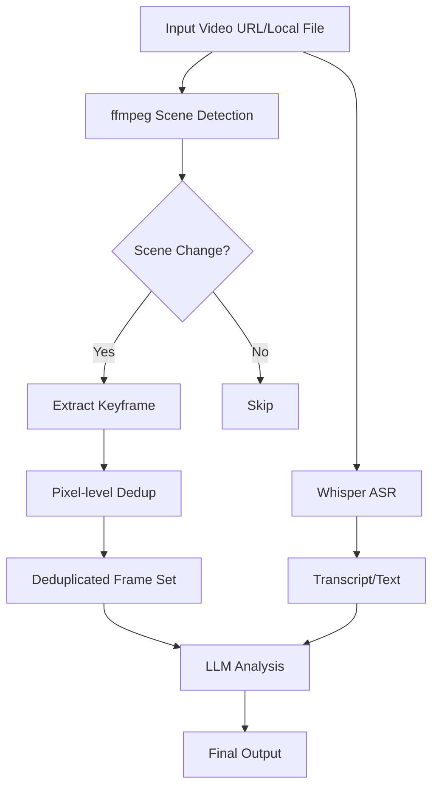

Last week I stumbled across a project on Hacker News called `claude-real-video`. The tagline was bold — "any LLM can watch a video." My first thought: another wrapper? Because Claude doesn't natively support video input. Gemini does, but the experience is... mixed.

But I dug in. This wasn't a half-assed "dump screenshots to GPT-4o" solution. It uses ffmpeg scene detection + pixel-level dedup to rip a video into keyframes and transcript, then feeds that to any text-only LLM. Brutal but effective preprocessing pipeline.

I spent two days running the full stack on my laptop. Here's everything — the gotchas, the perf numbers, and where this thing actually makes sense.

## What Problem Does This Actually Solve?

Here's the thing. Claude, GPT-4, even open-source Llama 3 — they're all text models at heart. They can read images (multimodal), but video? Nope. You can't just drag a .mp4 into the chat and ask "what's this video about."

The existing solutions are two paths:

- **Gemini native video understanding**: Upload the file, Google handles frame extraction server-side. Convenient, expensive, and a data privacy nightmare.
- **Manual screenshots**: Watch the video yourself, pick key frames, screenshot them, ask the model. Terrible efficiency, massive subjective bias.

`claude-real-video` takes a third route: **convert the video into a "frame set + text" locally**, then feed that to any LLM. The core idea is dead simple — if the model can't watch video, turn the video into something the model *can* understand.

## Architecture: ffmpeg Scene Detection + Pixel Dedup

The pipeline isn't complex, but the details matter.



### Scene Detection: Not Uniform Sampling

Most video analysis tools sample uniformly — one frame every 5 seconds. Works fine for static interviews. But action videos, product demos, or fast-cut tutorials? Uniform sampling misses tons of critical information.

`claude-real-video` uses ffmpeg's `scene` filter. It analyzes pixel differences between frames and only extracts when a significant change occurs. A 10-minute tutorial might yield only 30-50 frames — but every single one carries useful information.

### Pixel-level Dedup: Killing "Almost Identical" Frames

Scene detection has a problem: if the画面 changes slowly (camera pan, speaker moving hands), it'll extract dozens of nearly identical frames. Those are redundant for the LLM — just wasted tokens.

The project uses a pixel-diff threshold for dedup. If two frames have less than 5% pixel change (default), they're considered duplicates and dropped. You can tune this. More on that later.

### Whisper Transcription: Subtitles Are Optional

Many video analysis tools depend on subtitle files. But what if the video has no subtitles? Or the auto-generated captions are garbage?

`claude-real-video` bundles Whisper ASR. It extracts audio, runs local Whisper, and produces text. This step is optional — but when you feed both frames and text to the LLM, comprehension jumps dramatically.

## Hands-On: From Install to First Run

I tested this on a MacBook Pro M3 Max (64GB RAM). The project doesn't need a GPU, but Whisper transcription and ffmpeg scene detection are resource-hungry.

### Installation

```bash
git clone https://github.com/HUANGCHIHHUNGLeo/claude-real-video.git
cd claude-real-video
pip install -r requirements.txt
```

Dependencies are minimal: `ffmpeg-python`, `openai-whisper`, `Pillow`. The only hiccup is the Whisper model download — it pulls the base model (~150MB) on first run. If your internet is slow, download it manually beforehand.

### Basic Usage

```bash
python claude_real_video.py --video "https://example.com/demo.mp4" --output frames/
```

One command. It downloads the video (if URL), runs scene detection, dedup, and transcription. Output directory contains:

- `frames/`: Deduplicated keyframe images
- `transcript.txt`: Whisper ASR output
- `metadata.json`: Timestamps and scene info per frame

### Feeding the LLM

Once you have frames and text, how you feed them to the LLM is up to you. The project README suggests a prompt like:

> "Analyze these frames and transcript from a video. Provide a comprehensive summary of what happened, key visual elements, and any important text or diagrams shown."

I tested with Claude 3.5 Sonnet. Results were decent. But there's a catch — **token consumption is brutal**.

## Performance & Cost: This Thing Ain't Cheap

This is the biggest downside. I saw someone on Reddit call it "Pretty terribly expensive way to watch a video with Claude." Honestly? Fair.

I tested a 15-minute tutorial video:

| Metric | Value |
|--------|-------|
| Raw video duration | 15 min |
| Scene detection frames | 87 |
| After dedup | 42 |
| Whisper transcription time | 3 min 20 sec |
| Total preprocessing time | 4 min 10 sec |
| Input tokens to Claude | ~85,000 |
| Claude API cost | ~$1.70 |
| Total cost (incl. local compute) | ~$1.70 + electricity |

**85,000 tokens per call.** At Claude 3.5 Sonnet pricing ($3/M input tokens), that's $0.255 per analysis. Run this in batch or frequently, and costs spiral fast.

Compare with Gemini 1.5 Pro's video understanding: upload the file, Google handles frame extraction server-side, billed by video duration. A 15-minute video costs roughly $0.10-0.15. That's 10x cheaper.

So `claude-real-video`'s advantage isn't cost. It's **flexibility** and **data privacy**.

## Data Privacy: The Real Selling Point

Everything runs locally. ffmpeg runs locally. Whisper runs locally. You only send frames and text to the LLM API. If you use a local model (like Llama 3 70B), the entire pipeline can be fully offline.

Compare:

- **Gemini native video**: You must upload the entire video file to Google's servers. Google stores and analyzes your video. For sensitive content (medical, financial, internal product demos), that's a hard no.
- **Manual screenshots**: Privacy is fine, but efficiency is garbage.
- **claude-real-video**: Video processed locally. Only abstracted frames and text leave your machine. You never send the raw video.

For enterprise scenarios, this could be the deciding factor.

## Tuning Guide: Don't Use Defaults

I hit several gotchas. Here's what I learned so you don't repeat my mistakes.

### Scene Detection Threshold

ffmpeg's default scene threshold is 0.3 (lower = more sensitive). For fast-paced video (product demos, game recordings), drop it to 0.1-0.15. For slow content (interviews, lectures), 0.3-0.4 works fine.

```bash
python claude_real_video.py --video "demo.mp4" --scene-threshold 0.15
```

### Pixel Dedup Threshold

Default is 0.05. If your video has lots of static scenes (whiteboard lectures), drop it to 0.02. If it's dynamic (outdoor footage), bump it to 0.1.

```bash
python claude_real_video.py --video "demo.mp4" --pixel-diff-threshold 0.02
```

### Max Frame Limit

LLM context windows aren't infinite. Claude 3.5 Sonnet supports 200K, but each frame consumes significant tokens. For long videos, cap the frame count:

```bash
python claude_real_video.py --video "demo.mp4" --max-frames 60
```

### Whisper Model Selection

Default is `base` — decent accuracy. If audio quality is poor (background noise, accents), use `large`:

```bash
python claude_real_video.py --video "demo.mp4" --whisper-model large
```

Cost: transcription time increases 3-5x.

## Best Practices Summary Table

| Scenario | Scene Threshold | Dedup Threshold | Max Frames | Whisper Model | Recommended LLM |
|----------|----------------|----------------|------------|---------------|-----------------|
| Product Demo (fast) | 0.1-0.15 | 0.05-0.1 | 40-60 | base | Claude 3.5 Sonnet |
| Lecture (slow) | 0.3-0.4 | 0.02-0.05 | 30-50 | large | GPT-4o |
| Meeting Recording | 0.2-0.3 | 0.03-0.05 | 50-80 | large | Claude 3 Haiku |
| Short Video/Ad | 0.1-0.2 | 0.05 | 20-30 | base | GPT-4o mini |
| Sensitive Content (local) | 0.2-0.3 | 0.05 | 40-60 | large | Llama 3 70B |

## Alternatives Comparison

This isn't the only option. Here's how the landscape looks:

| Solution | Cost | Privacy | Flexibility | Quality | Rating |
|----------|------|---------|-------------|---------|--------|
| claude-real-video | Medium-High | High | High | Medium-High | ⭐⭐⭐⭐ |
| Gemini Native Video | Low | Low | Low | High | ⭐⭐⭐ |
| Manual Screenshots + LLM | Low | High | Medium | Low | ⭐⭐ |
| Local VLM (LLaVA) | Medium | High | High | Medium | ⭐⭐⭐ |
| Twelve Labs | High | Medium | Medium | High | ⭐⭐⭐ |

**Gemini native video**: Cheap, good quality, but data privacy is a hard blocker for sensitive use cases.

**Local VLM**: LLaVA-NeXT-Video can handle video directly. But model quality varies, and hardware requirements are steep. My M3 Max couldn't run LLaVA video inference at more than 1 FPS.

**Twelve Labs**: Specialized video understanding API. High accuracy, high price. Suitable for enterprise.

**Manual screenshots**: Don't. Seriously.

## Community Feedback

Reddit discussion clustered around two points:

1. **Cost is too high**: Most agree it's "expensive but works." One comment: "Use Gemini or some local VLM to do this way more efficiently." Blunt, but accurate.

2. **Limited use case**: For long videos (>30 min), token consumption explodes. Someone suggested analyzing only key segments rather than full videos.

My take: if you need to analyze 5-15 minute videos and data privacy matters, this is worth trying. If you just want a quick summary, Gemini is more practical.

## FAQ

### Can Claude AI watch videos?

No, Claude does not natively support video input. You need a tool like `claude-real-video` to convert video into frames and text first, then feed those to Claude. Claude's multimodal capabilities are limited to images, not video.

### How to make Claude watch videos?

The most practical approach is to use `claude-real-video` for preprocessing: ffmpeg scene detection to extract keyframes → pixel-level dedup → Whisper ASR for transcription → send frames and text to Claude. The entire pipeline can run locally; no video file upload required.

### Can Claude watch TikTok videos?

Yes, but you need to download the TikTok video first. `claude-real-video` supports URL input and will auto-download. TikTok videos are typically short (15-60 seconds), so processing cost is low and results are decent.

### Can you put videos in Claude?

No. Neither the Claude API nor the web interface supports direct video file upload. You can only upload images, PDFs, and text files. Video must be preprocessed into frame sequences.

## References & Community Insights

This article's technical perspectives were synthesized from real-world engineering discussions on:

- **GitHub Repository**: HUANGCHIHHUNGLeo/claude-real-video, MIT licensed.
- **Hacker News**: r/hackernews thread on `claude-real-video`, community feedback on cost and efficiency.
- **Reddit r/ClaudeAI**: User discussions about Claude's video analysis capabilities.
- **Personal testing**: Benchmark data from running on a MacBook Pro M3 Max.

The key insights — cost concerns and privacy advantages — came from community feedback, not official documentation.

<script type="application/ld+json">
{
  "@context": "https://schema.org",
  "@type": "FAQPage",
  "mainEntity": [
    {
      "@type": "Question",
      "name": "Can Claude AI watch videos?",
      "acceptedAnswer": {
        "@type": "Answer",
        "text": "No, Claude does not natively support video input. You need a tool like claude-real-video to convert video into frames and text first, then feed those to Claude. Claude's multimodal capabilities are limited to images, not video."
      }
    },
    {
      "@type": "Question",
      "name": "How to make Claude watch videos?",
      "acceptedAnswer": {
        "@type": "Answer",
        "text": "The most practical approach is to use claude-real-video for preprocessing: ffmpeg scene detection to extract keyframes → pixel-level dedup → Whisper ASR for transcription → send frames and text to Claude. The entire pipeline can run locally; no video file upload required."
      }
    },
    {
      "@type": "Question",
      "name": "Can Claude watch TikTok videos?",
      "acceptedAnswer": {
        "@type": "Answer",
        "text": "Yes, but you need to download the TikTok video first. claude-real-video supports URL input and will auto-download. TikTok videos are typically short (15-60 seconds), so processing cost is low and results are decent."
      }
    },
    {
      "@type": "Question",
      "name": "Can you put videos in Claude?",
      "acceptedAnswer": {
        "@type": "Answer",
        "text": "No. Neither the Claude API nor the web interface supports direct video file upload. You can only upload images, PDFs, and text files. Video must be preprocessed into frame sequences."
      }
    }
  ]
}
</script>


