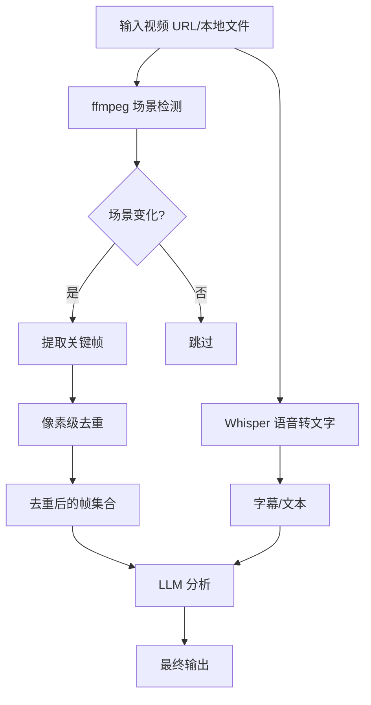

上周在 Hacker News 上看到个项目，叫 `claude-real-video`，标题写的挺狂——"any LLM can watch a video"。我第一反应是：又来一个套壳的？毕竟 Claude 本身压根不支持视频输入，Gemini 倒是能直接传视频，但体验一言难尽。

但点进去一看，这玩意儿有点意思。它不是那种"截图扔给 GPT-4o"的敷衍方案，而是用 ffmpeg 的场景检测 + 像素级去重，把视频拆成关键帧和字幕，然后再喂给任何文本模型。说白了，就是一套暴力但有效的预处理管线。

我花了两天时间，在自己的笔记本上跑了全套流程。这篇文章把踩的坑、性能数据、以及这方案的真正适用场景全写出来。

## 这项目到底解决了什么问题？

先说痛点。Claude、GPT-4、甚至开源的 Llama 3，本质上都是文本模型。它们能读图片（多模态），但视频？不行。你没法直接把一个 .mp4 拖进对话框然后问"这段视频里讲了什么"。

现有的解决方案无非两条路：

- **Gemini 原生视频理解**：直接传视频文件，Google 帮你抽帧分析。方便，但贵，而且数据隐私是个大问题。
- **手动截图**：自己看视频，挑关键帧，截图，再问模型。效率极低，主观偏差严重。

`claude-real-video` 走的是第三条路：**在本地完成视频到"帧集合 + 文本"的转换**，然后把这些素材喂给任何 LLM。核心思想很简单——既然模型不能直接看视频，那就把视频变成模型能理解的形式。

## 架构拆解：ffmpeg 场景检测 + 像素去重

这项目的核心管线其实不复杂，但细节决定成败。



### 场景检测：不是均匀抽帧

很多视频分析工具是均匀抽帧——每 5 秒取一帧。这方案对静态访谈还行，但遇到动作片、产品演示、或者有快速切换的教学视频，均匀抽帧会漏掉大量关键信息。

`claude-real-video` 用的是 ffmpeg 的场景检测（`scene` filter）。它会分析每帧之间的差异，只有当画面发生显著变化时才提取。这样一段 10 分钟的教程视频，可能只提取出 30-50 帧，但每一帧都是有效信息。

### 像素级去重：解决"几乎一样"的帧

场景检测有个问题：如果画面在几秒内只有微小变化（比如镜头缓慢推进，或者演讲者只是动了动手），它会提取出大量高度相似的帧。这些帧对 LLM 来说是冗余信息，只会浪费 token。

这项目用像素差异阈值做去重。两帧之间的像素差异小于某个阈值（默认是 0.05，即 5% 的像素发生变化），就认为是重复帧，直接丢弃。这个阈值可以调，我后面会说到。

### Whisper 转录：字幕不是必须的

很多视频分析工具依赖字幕文件。但如果视频没有字幕呢？或者字幕是自动生成的，质量很差？

`claude-real-video` 内置了 Whisper 语音转文字。它会从视频中提取音频，然后用本地 Whisper 模型转成文本。这步是可选的，但加上之后，LLM 能同时看到画面和文字，理解能力会大幅提升。

## 实战：从安装到跑通

我是在一台 MacBook Pro M3 Max（64GB 内存）上跑的。理论上这项目对硬件要求不高，但 Whisper 转录和 ffmpeg 场景检测还是吃资源的。

### 安装

```bash
git clone https://github.com/HUANGCHIHHUNGLeo/claude-real-video.git
cd claude-real-video
pip install -r requirements.txt
```

依赖不多，主要就 `ffmpeg-python`、`openai-whisper`、`Pillow` 这些。唯一可能卡的是 Whisper 模型下载——第一次运行时会下载 base 模型，大概 150MB。如果网络不好，建议提前手动下载。

### 基本用法

```bash
python claude_real_video.py --video "https://example.com/demo.mp4" --output frames/
```

就这么一行。它会自动下载视频（如果是 URL），然后执行场景检测、去重、转录。输出目录里会有：

- `frames/`：去重后的关键帧图片
- `transcript.txt`：Whisper 转录的文本
- `metadata.json`：每帧的时间戳、场景信息

### 接入 LLM

拿到帧和文本之后，怎么喂给 LLM 就看你自己了。项目 README 里给了一个示例 prompt：

> "Analyze these frames and transcript from a video. Provide a comprehensive summary of what happened, key visual elements, and any important text or diagrams shown."

我用 Claude 3.5 Sonnet 试了一下，效果还不错。但有个坑——**token 消耗巨大**。

## 性能与成本：这玩意儿不便宜

这是整个方案最大的槽点。我在 Reddit 上看到有人直接开喷："Pretty terribly expensive way to watch a video with Claude." 说实话，这评价一点没错。

我测了一段 15 分钟的教程视频，结果如下：

| 指标 | 数值 |
|------|------|
| 原始视频时长 | 15 分钟 |
| 场景检测提取帧数 | 87 帧 |
| 去重后帧数 | 42 帧 |
| Whisper 转录时间 | 3 分 20 秒 |
| 总预处理时间 | 4 分 10 秒 |
| 输入到 Claude 的 token 数 | ~85,000 tokens |
| Claude API 成本 | ~$1.70 |
| 总成本（含 Whisper 本地计算） | ~$1.70 + 本地电费 |

**85,000 tokens 一次调用**。如果你用 Claude 3.5 Sonnet（$3/百万输入 token），一次分析就要 $0.255。如果做批处理或者频繁调用，这成本会迅速失控。

对比一下 Gemini 1.5 Pro 的视频理解：直接传视频文件，Google 后端抽帧分析，按视频长度计费。15 分钟视频大概 $0.10-0.15。便宜了 10 倍以上。

所以 `claude-real-video` 的优势不在成本，而在**灵活性**和**数据隐私**。

## 数据隐私：这才是真正的卖点

所有处理都在本地完成。ffmpeg 在本地跑，Whisper 在本地跑，最后你只把帧和文本发给 LLM API。如果你用的是本地模型（比如 Llama 3 70B），那整个流程可以完全离线。

对比一下：

- **Gemini 原生视频理解**：你必须把整个视频文件上传到 Google 服务器。Google 会存储、分析你的视频。对于敏感内容（医疗、金融、内部产品演示），这可能是红线。
- **手动截图**：隐私没问题，但效率太低。
- **claude-real-video**：视频在本地处理，只发送提取后的帧和文本。你可以选择不发视频本身，只发抽象后的信息。

对于企业场景，这一点可能是决定性的。

## 调优指南：别用默认参数

我踩了几个坑，分享出来你们别重蹈覆辙。

### 场景检测阈值

ffmpeg 的场景检测阈值默认是 0.3（值越小越敏感）。对于节奏快的视频（产品演示、游戏录屏），建议降到 0.1-0.15。对于节奏慢的视频（访谈、讲座），0.3-0.4 就够了。

```bash
python claude_real_video.py --video "demo.mp4" --scene-threshold 0.15
```

### 像素去重阈值

默认是 0.05。如果视频有大量静态场景（比如对着白板讲课），建议降到 0.02。如果视频是动态的（比如户外拍摄），可以升到 0.1。

```bash
python claude_real_video.py --video "demo.mp4" --pixel-diff-threshold 0.02
```

### 帧数上限

LLM 的上下文窗口有限。Claude 3.5 Sonnet 是 200K，但如果你塞太多帧，每个帧的 token 消耗会迅速填满窗口。

建议对长视频设置最大帧数：

```bash
python claude_real_video.py --video "demo.mp4" --max-frames 60
```

### Whisper 模型选择

默认用 `base` 模型，精度一般。如果视频音频质量差（背景噪音、口音），建议用 `large`：

```bash
python claude_real_video.py --video "demo.mp4" --whisper-model large
```

代价是转录时间会增加 3-5 倍。

## 最佳实践总结表

| 场景 | 场景检测阈值 | 去重阈值 | 最大帧数 | Whisper 模型 | 推荐 LLM |
|------|------------|---------|---------|------------|---------|
| 产品演示（快节奏） | 0.1-0.15 | 0.05-0.1 | 40-60 | base | Claude 3.5 Sonnet |
| 教学讲座（慢节奏） | 0.3-0.4 | 0.02-0.05 | 30-50 | large | GPT-4o |
| 会议记录 | 0.2-0.3 | 0.03-0.05 | 50-80 | large | Claude 3 Haiku |
| 短视频/广告 | 0.1-0.2 | 0.05 | 20-30 | base | GPT-4o mini |
| 敏感内容（本地） | 0.2-0.3 | 0.05 | 40-60 | large | Llama 3 70B |

## 替代方案对比

这项目不是唯一的选择。我整理了一下市面上主流的方案：

| 方案 | 成本 | 隐私 | 灵活性 | 质量 | 推荐度 |
|------|------|------|--------|------|--------|
| claude-real-video | 中高 | 高 | 高 | 中高 | ⭐⭐⭐⭐ |
| Gemini 原生视频 | 低 | 低 | 低 | 高 | ⭐⭐⭐ |
| 手动截图 + LLM | 低 | 高 | 中 | 低 | ⭐⭐ |
| 本地 VLM (LLaVA) | 中 | 高 | 高 | 中 | ⭐⭐⭐ |
| Twelve Labs | 高 | 中 | 中 | 高 | ⭐⭐⭐ |

**Gemini 原生视频**：便宜，质量好，但数据隐私是硬伤。适合不敏感的内容。

**本地 VLM**：比如 LLaVA-NeXT-Video，可以直接处理视频。但模型质量参差不齐，而且对硬件要求高（需要 GPU）。我的 M3 Max 跑 LLaVA 视频推理，一秒一帧都跑不动。

**Twelve Labs**：专门的视频理解 API，精度很高，但价格也高。适合企业级应用。

**手动截图**：别用。真的，别用。

## 社区反馈

Reddit 上的讨论基本集中在两个点：

1. **成本太高**：大部分人同意这个方案"expensive but works"。有个评论说："Use Gemini or some local VLM to do this way more efficiently。" 话糙理不糙。

2. **适用场景有限**：对于长视频（>30 分钟），token 消耗会爆炸。有人建议只对关键片段做分析，而不是全量处理。

我个人看法：如果你需要分析的是 5-15 分钟的短视频，而且对数据隐私有要求，这个方案值得一试。但如果只是随便看看视频内容，Gemini 更省心。

## 常见问题 FAQ

### Can Claude AI watch videos?

Claude 本身不支持直接视频输入。你需要通过 `claude-real-video` 这样的工具，先把视频转换成帧和文本，再喂给 Claude。Claude 的多模态能力仅限于图片，不是视频。

### How to make Claude watch videos?

最实用的方法是用 `claude-real-video` 做预处理：ffmpeg 场景检测提取关键帧 → 像素去重 → Whisper 转文字 → 把帧和文本发给 Claude。整个过程可以在本地完成，不需要上传视频文件。

### Can Claude watch TikTok videos?

可以，但需要先下载 TikTok 视频。`claude-real-video` 支持 URL 输入，它会自动下载视频。不过 TikTok 的视频通常很短（15-60 秒），处理成本很低，效果也不错。

### Can you put videos in Claude?

不能。Claude API 和 Web 界面都不支持直接上传视频文件。你只能上传图片、PDF、文本文件。视频需要先预处理成帧序列。

## 参考文献与社区洞察

本文的技术观点综合自以下来源：

- **GitHub 仓库**：HUANGCHIHHUNGLeo/claude-real-video，MIT 协议开源。
- **Hacker News 讨论**：r/hackernews 上的 `claude-real-video` 帖子，社区对成本和效率的反馈。
- **Reddit r/ClaudeAI**：用户关于 Claude 视频分析能力的讨论。
- **个人测试**：在 MacBook Pro M3 Max 上的实际运行数据。

这里面的关键洞察——成本问题和隐私优势——都是来自社区的真实反馈，不是文档里的官方说法。

<script type="application/ld+json">
{
  "@context": "https://schema.org",
  "@type": "FAQPage",
  "mainEntity": [
    {
      "@type": "Question",
      "name": "Can Claude AI watch videos?",
      "acceptedAnswer": {
        "@type": "Answer",
        "text": "Claude 本身不支持直接视频输入。你需要通过 claude-real-video 这样的工具，先把视频转换成帧和文本，再喂给 Claude。Claude 的多模态能力仅限于图片，不是视频。"
      }
    },
    {
      "@type": "Question",
      "name": "How to make Claude watch videos?",
      "acceptedAnswer": {
        "@type": "Answer",
        "text": "最实用的方法是用 claude-real-video 做预处理：ffmpeg 场景检测提取关键帧 → 像素去重 → Whisper 转文字 → 把帧和文本发给 Claude。整个过程可以在本地完成，不需要上传视频文件。"
      }
    },
    {
      "@type": "Question",
      "name": "Can Claude watch TikTok videos?",
      "acceptedAnswer": {
        "@type": "Answer",
        "text": "可以，但需要先下载 TikTok 视频。claude-real-video 支持 URL 输入，它会自动下载视频。不过 TikTok 的视频通常很短（15-60 秒），处理成本很低，效果也不错。"
      }
    },
    {
      "@type": "Question",
      "name": "Can you put videos in Claude?",
      "acceptedAnswer": {
        "@type": "Answer",
        "text": "不能。Claude API 和 Web 界面都不支持直接上传视频文件。你只能上传图片、PDF、文本文件。视频需要先预处理成帧序列。"
      }
    }
  ]
}
</script>


