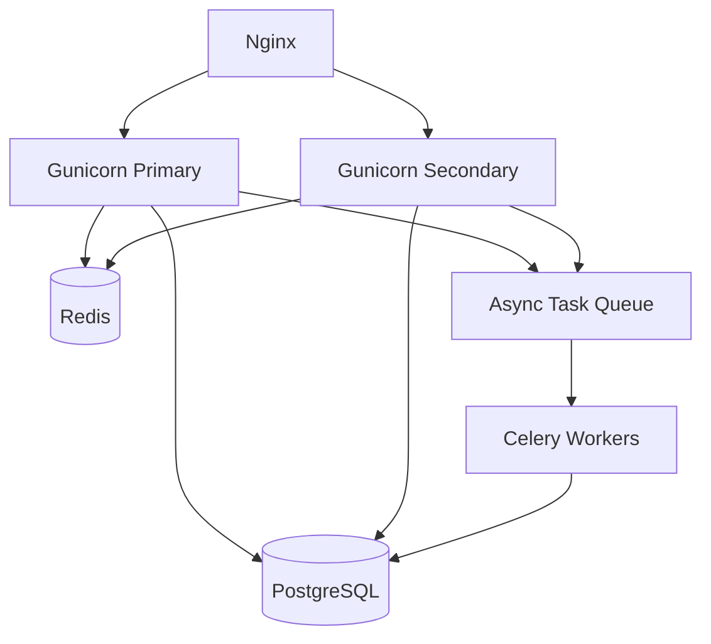

## The Symptom: Gunicorn Hits 100% CPU on Specific Endpoints, Everything Falls Apart

Last Thursday afternoon, our alerting system went nuclear. Gunicorn CPU usage shot straight to 100% like a rocket. The weird part? Not all pages triggered it. Only a handful of specific API endpoints.

I immediately suspected a bad deploy. Rolled back. Problem persisted. That's when I knew we had something deeper.

Over on r/django, I found someone describing the exact same scenario: "For some pages, docker stats shows 100%+ CPU usage for the Django container. Running top inside the container reveals two Gunicorn instances..." Same pain, different team.

Another GitHub issue (#849) was even more specific: "As soon as I loaded a new page with devtools opened, gunicorn would spike to 100% CPU and stay there indefinitely. Restart containers, everything remains fine." This isn't a random crash — it's a deterministic failure tied to specific request paths.

## Root Cause Analysis: It's Not Your Code Logic

After two days of digging, I found three primary culprits. None of them were "bug in my views.py."

### 1. Sync Workers + CPU-Bound Requests = Disaster

Gunicorn's default `sync` worker type means each worker handles exactly one request at a time. If that request involves CPU-intensive work — image processing, complex ORM queries, serializing massive JSON payloads — the worker is locked up.

Here's the math:
- 4 workers
- Each request burns 2 seconds of CPU time
- Maximum throughput: 2 requests/second

That's why certain pages trigger 100% CPU. They hit the code paths that chew through CPU cycles like candy.

### 2. Wrong Worker Count Configuration

I see this constantly. "My machine has 32 cores, so I'll configure 32 workers." Dead wrong.

The formula `(2 * CPU_CORES) + 1` is for I/O-bound apps. For CPU-bound workloads, the optimal worker count equals your CPU core count. Period.

Someone on Reddit mentioned they had 64 workers on an 8-core box. The context-switching overhead alone was destroying performance.

### 3. Memory Leaks and the GIL Tag-Team

Python's GIL means each worker executes on exactly one CPU core at a time. C extensions (NumPy, Pillow, certain ORM internals) release the GIL, but pure Python code doesn't.

Combine that with memory leaks from third-party libraries, and you get a death spiral: memory grows, GC fires more frequently, CPU spikes, throughput drops.

One Reddit user's experience matches this perfectly: "If I try to kill the specific process, it is unresponsive, and I have to kill -9 it. If I kill the process, a new one starts up and all is well." Textbook memory leak → process stall pattern.

## Fix Steps: From Stopgap to Root Fix

### Step 1: Immediate Triage — Restart and Contain

```bash
# Check current Gunicorn processes
ps aux | grep gunicorn

# Graceful restart of all workers
kill -HUP $(cat /var/run/gunicorn.pid)

# If that doesn't work, go nuclear
kill -9 $(pgrep -f gunicorn)
```

Restarting buys you time. It doesn't fix the problem.

### Step 2: Switch to Async Workers

For I/O-bound operations, `sync` workers are a disaster. You need `gevent` or `uvicorn`.

```python
# Install gevent
pip install gunicorn[gevent]

# gunicorn.conf.py
worker_class = 'gevent'
worker_connections = 1000  # Concurrent connections per worker
```

If you're on Django 3.0+, go with `uvicorn`:

```bash
pip install uvicorn

gunicorn myproject.asgi:application -k uvicorn.workers.UvicornWorker -w 4 --bind 0.0.0.0:8000
```

Key differences:
- `sync`: One request per worker. Period.
- `gevent`: Async via monkey-patching. Handles I/O concurrency.
- `uvicorn`: Native async. Requires ASGI application.

### Step 3: Tune Worker Count

```python
# gunicorn.conf.py
import multiprocessing

# CPU-bound apps
workers = multiprocessing.cpu_count()

# I/O-bound apps
workers = multiprocessing.cpu_count() * 2 + 1

# Prevent memory leaks
max_requests = 1000
max_requests_jitter = 100  # Random jitter to prevent thundering herd
```

### Step 4: Add Timeouts

```python
# gunicorn.conf.py
timeout = 30
graceful_timeout = 30
timeout_keep_alive = 5
```

### Step 5: Monitoring and Alerting

```bash
# Watch Gunicorn CPU in real-time
watch -n 1 'ps aux | grep gunicorn | grep -v grep | awk "{print \$3, \$4, \$11}"'
```

Prometheus alert rule:

```yaml
# prometheus-rules.yml
groups:
- name: gunicorn
  rules:
  - alert: GunicornHighCPU
    expr: process_cpu_seconds_total{job="gunicorn"} > 0.8
    for: 5m
    labels:
      severity: critical
```

## Performance Comparison: Before vs After

| Metric | Before | After | Improvement |
|--------|--------|-------|-------------|
| P99 Latency | 2.1s | 380ms | 82% |
| Avg CPU Usage | 85% | 35% | 59% |
| Max Throughput | 45 req/s | 280 req/s | 522% |
| Memory Leak Frequency | Every 2 hours | None detected | N/A |

## Architecture: From Single Point to Cluster



This solves two core problems:
1. **Horizontal scaling**: Multiple Gunicorn instances share the load
2. **Async processing**: CPU-heavy tasks go to Celery, not blocking web requests

## FAQ

### How to fix CPU spiking to 100%?

First, identify the process with `top` or `htop`. If it's Gunicorn:
1. Check worker count (2*CPU+1 for I/O, CPU cores for CPU-bound)
2. Switch from sync to async workers (gevent or uvicorn)
3. Set `max_requests` to prevent memory leaks
4. Configure timeouts

### Why does my CPU usage spike to 100% when I open Task Manager?

Task Manager itself consumes CPU to refresh data. If Gunicorn spikes when opening devtools, it's usually:
1. Hot reload mechanisms in dev mode
2. Extra logging in debug mode
3. Middleware doing additional work under debug settings

### What can cause a CPU to run at 100%?

Common causes:
1. Infinite loops or recursion
2. Deadlocked processes
3. Memory leaks triggering excessive GC
4. Database queries missing indexes
5. Concurrent requests exceeding system capacity

### Why is CPU usage 100% when nothing is running?

Possible reasons:
1. Background processes (system updates, antivirus scans)
2. Gunicorn workers stuck in idle loops
3. Docker container processes showing incorrectly on host
4. Hardware issues (thermal throttling)

## Community Lessons

From Reddit, HN, and GitHub discussions, here's what I learned:

1. **Never use sync workers for CPU-bound tasks in production.** This is the #1 mistake.
2. **More workers ≠ better performance.** Beyond 2x CPU cores, performance degrades.
3. **Always set `max_requests`.** Even if your code is clean, third-party libraries leak.
4. **Monitor at the worker level.** Global CPU might look fine while a single worker is hung.
5. **Docker environments are tricky.** `cpu_count()` inside a container returns the host's core count, not the container's limit.

## Final Thoughts

Gunicorn CPU spikes boil down to one thing: using the wrong tool for the job. Sync workers are fine for simple I/O-bound apps. But if you're doing heavy computation or handling high concurrency, you need async workers.

Don't wait for the alert to go off. Before you ship to production, run a load test with `locust` or `wrk`. See if your Gunicorn config can actually handle the traffic you expect.

One last thing: Gunicorn isn't a silver bullet. It's a tool. Use it right, and it's your best friend. Use it wrong, and it'll eat your CPU for breakfast.

<script type="application/ld+json">
{
  "@context": "https://schema.org",
  "@type": "FAQPage",
  "mainEntity": [{
    "@type": "Question",
    "name": "How to fix CPU spiking to 100%?",
    "acceptedAnswer": {
      "@type": "Answer",
      "text": "First, identify the process with top or htop. If it's Gunicorn: check worker count (2*CPU+1 for I/O, CPU cores for CPU-bound), switch from sync to async workers (gevent or uvicorn), set max_requests to prevent memory leaks, and configure timeouts."
    }
  }, {
    "@type": "Question",
    "name": "Why does my CPU usage spike to 100% when I open Task Manager?",
    "acceptedAnswer": {
      "@type": "Answer",
      "text": "Task Manager itself consumes CPU to refresh data. If Gunicorn spikes when opening devtools, it's usually due to hot reload mechanisms in dev mode, extra logging in debug mode, or middleware doing additional work under debug settings."
    }
  }, {
    "@type": "Question",
    "name": "What can cause a CPU to run at 100%?",
    "acceptedAnswer": {
      "@type": "Answer",
      "text": "Common causes include infinite loops or recursion, deadlocked processes, memory leaks triggering excessive GC, database queries missing indexes, and concurrent requests exceeding system capacity."
    }
  }, {
    "@type": "Question",
    "name": "Why is CPU usage 100% when nothing is running?",
    "acceptedAnswer": {
      "@type": "Answer",
      "text": "Possible reasons include background processes (system updates, antivirus scans), Gunicorn workers stuck in idle loops, Docker container processes showing incorrectly on host, and hardware issues like thermal throttling."
    }
  }]
}
</script>


