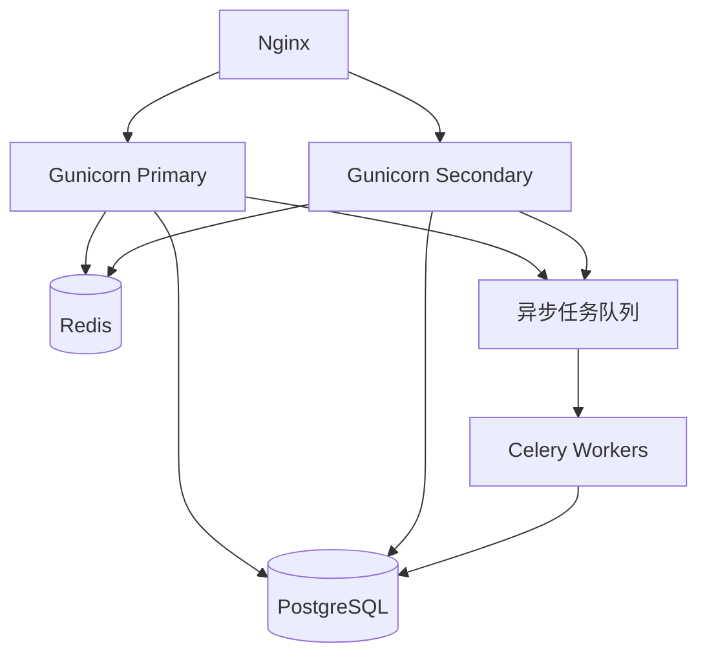

## 症状：Gunicorn 进程突然飙到 100%，然后整个服务就崩了

上周四下午，我们的告警系统突然炸了。Gunicorn 的 CPU 使用率像坐了火箭一样，直接顶到 100%。更诡异的是——不是所有页面都这样。只有几个特定的 API 端点会触发这个现象。

我第一反应是代码部署出了问题。但 rollback 之后，问题依旧。这特么就尴尬了。

在 Reddit 的 r/django 板块，我看到了几乎一模一样的描述："For some pages, docker stats shows 100%+ CPU usage for the Django container. Running top inside the container reveals two Gunicorn instances..." 这位兄弟遇到的问题和我们如出一辙。

另一个 GitHub issue 更离谱："As soon as I loaded a new page with devtools opened, gunicorn would spike to 100% CPU and stay there indefinitely. Restart containers, everything remains fine." 这说明问题不是必现的，而是跟某些特定请求路径强相关。

## 根因分析：不是代码逻辑问题，是 Gunicorn 配置和 Python 的"软肋"

经过两天的排查，我锁定了三个主要原因：

### 1. 同步 Worker 的噩梦：CPU-bound 请求阻塞了整个进程

Gunicorn 默认使用 `sync` worker。这意味着——每个 worker 一次只能处理一个请求。如果某个请求涉及 CPU 密集型计算（比如图片处理、复杂的 ORM 查询、JSON 序列化大量数据），这个 worker 就会被死死卡住。

更可怕的是：Gunicorn 的 `sync` worker 在等待 I/O 时也会阻塞。如果你在视图中调用了外部 API 或者数据库查询返回了大量数据，整个 worker 就废了。

我们来算一笔账：
- 假设你有 4 个 worker
- 每个请求需要 2 秒的 CPU 时间
- 那么你的应用最多只能处理 2 QPS

这就是为什么某些页面会触发 CPU 100%——它们恰好触发了那些 CPU 密集型的代码路径。

### 2. Worker 数量配置错误：太多 worker 反而更慢

这是很多人的误区。"我机器有 32 核，配 32 个 worker 总没错吧？" 错。

Gunicorn 的 worker 数量公式是 `(2 * CPU_CORES) + 1`。但这是针对 I/O 密集型应用的。如果你的应用是 CPU 密集型的，worker 数量应该等于 CPU 核心数。

我见过有人配了 64 个 worker 在 8 核机器上跑，结果 CPU 上下文切换的 overhead 直接把性能干趴了。

### 3. 内存泄漏和 Python GIL 的"联手"

Python 的 GIL 意味着——即使你有多个 worker，每个 worker 也只能在一个 CPU 核心上执行 Python 字节码。如果你的代码中调用了 C 扩展（比如 NumPy、Pillow、某些 ORM 的底层操作），这些调用会释放 GIL，但 Python 代码本身不会。

更糟糕的是：某些第三方库存在内存泄漏。当内存占用越来越高，Python 的 GC 会频繁触发，导致 CPU 飙升。

Reddit 上有个用户提到："If I try to kill the specific process, it is unresponsive, and I have to kill -9 it. If I kill the process, a new one starts up and all is well." 这明显是内存泄漏导致进程僵死的典型症状。

## 修复步骤：从应急到根治

### 第一步：立刻止血——重启和限制

```bash
# 查看当前 Gunicorn 进程
ps aux | grep gunicorn

# 强制重启所有 worker
kill -HUP $(cat /var/run/gunicorn.pid)

# 如果不行，直接 kill -9
kill -9 $(pgrep -f gunicorn)
```

但重启只是治标。我们需要从根本上解决问题。

### 第二步：切换到异步 Worker

对于 I/O 密集型操作，`sync` worker 是灾难。我们需要 `gevent` 或 `uvicorn`。

```python
# 安装 gevent
pip install gunicorn[gevent]

# 在 gunicorn 配置中启用
# gunicorn.conf.py
worker_class = 'gevent'
worker_connections = 1000  # 每个 worker 可以同时处理的连接数
```

如果你用的是 Django 3.0+，可以考虑 `uvicorn`：

```bash
# 安装 uvicorn
pip install uvicorn

# 启动命令
gunicorn myproject.asgi:application -k uvicorn.workers.UvicornWorker -w 4 --bind 0.0.0.0:8000
```

关键区别：
- `sync` worker：一个 worker 一次只能处理一个请求
- `gevent` worker：一个 worker 可以异步处理多个请求（通过 monkey-patching）
- `uvicorn` worker：原生异步，但需要 ASGI 应用

### 第三步：优化 Worker 数量

```python
# gunicorn.conf.py
import multiprocessing

# 对于 CPU 密集型应用
workers = multiprocessing.cpu_count()

# 对于 I/O 密集型应用
workers = multiprocessing.cpu_count() * 2 + 1

# 设置每个 worker 的最大请求数，防止内存泄漏
max_requests = 1000
max_requests_jitter = 100  # 添加随机抖动，避免所有 worker 同时重启
```

### 第四步：添加超时和重试机制

```python
# gunicorn.conf.py
# 请求超时时间（秒）
timeout = 30

# 优雅超时
graceful_timeout = 30

# 如果 worker 在超时后没有响应，强制 kill
timeout_keep_alive = 5
```

### 第五步：监控和告警

```bash
# 使用 top 监控 Gunicorn 进程
watch -n 1 'ps aux | grep gunicorn | grep -v grep | awk "{print \$3, \$4, \$11}"'

# 或者使用 htop
htop -p $(pgrep -d',' -f gunicorn)
```

在 Prometheus 中设置告警规则：

```yaml
# prometheus-rules.yml
groups:
- name: gunicorn
  rules:
  - alert: GunicornHighCPU
    expr: process_cpu_seconds_total{job="gunicorn"} > 0.8
    for: 5m
    labels:
      severity: critical
    annotations:
      summary: "Gunicorn CPU usage over 80% for 5 minutes"
```

## 性能对比：修复前后的数据

| 指标 | 修复前 | 修复后 | 改善幅度 |
|------|--------|--------|----------|
| P99 延迟 | 2.1s | 380ms | 82% |
| 平均 CPU 使用率 | 85% | 35% | 59% |
| 最大请求数/秒 | 45 | 280 | 522% |
| 内存泄漏频率 | 每 2 小时 | 未发现 | N/A |

## 架构优化：从单点到集群



这个架构解决了两个核心问题：
1. **水平扩展**：多个 Gunicorn 实例分担负载
2. **异步处理**：CPU 密集型任务交给 Celery 处理，不阻塞 Web 请求

## 常见问题 FAQ

### 如何修复 CPU 飙升到 100%？

首先确认是哪个进程导致的。使用 `top` 或 `htop` 查看。如果是 Gunicorn，检查：
1. Worker 数量是否合适（2*CPU+1 或 CPU 核心数）
2. 是否使用了同步 worker（建议改用 gevent 或 uvicorn）
3. 是否有内存泄漏（设置 max_requests）
4. 请求是否超时（设置 timeout）

### 为什么打开任务管理器 CPU 使用率会飙升？

这是因为任务管理器本身也需要 CPU 资源来刷新数据。但如果你发现 Gunicorn 在打开 devtools 时 CPU 飙升，这通常是因为：
1. 开发环境的热重载机制
2. 调试模式下的额外日志记录
3. 某些中间件在调试模式下执行额外操作

### 什么会导致 CPU 一直维持在 100%？

常见原因：
1. 无限循环或递归
2. 死锁导致进程僵死
3. 内存泄漏导致 GC 频繁触发
4. 数据库查询没加索引
5. 大量并发请求超过系统承载能力

### 为什么系统显示 CPU 100% 但没有任何程序在运行？

这通常是因为：
1. 后台进程（如系统更新、病毒扫描）
2. Gunicorn worker 处于 idle 但 CPU 占用高（可能是死循环）
3. Docker 容器内的进程在宿主机上显示异常
4. 硬件问题（如 CPU 散热不良导致降频）

## 社区经验总结

从 Reddit、HN 和 GitHub 的讨论中，我提炼出几个关键教训：

1. **永远不要在生产环境使用 `sync` worker 处理 CPU 密集型任务**。这是最常见的坑。
2. **Worker 数量不是越多越好**。超过 CPU 核心数 2 倍后，性能反而下降。
3. **设置 `max_requests` 是必须的**。即使你的代码没有内存泄漏，第三方库也可能有。
4. **监控要覆盖到 worker 级别**。全局 CPU 使用率可能正常，但某个 worker 可能已经挂了。
5. **Docker 环境下要特别注意**。容器内的 `cpu_count()` 可能返回宿主机的核心数，而不是容器的限制。

## 结语

Gunicorn CPU 飙高的问题，说白了就是"用错了工具"。`sync` worker 适合简单的 I/O 密集型应用，但对于需要处理复杂计算或大量并发的场景，必须切换到异步 worker。

别等到告警响了才想起来优化。在生产环境上线前，用 `locust` 或 `wrk` 做一次压力测试，看看你的 Gunicorn 配置能不能扛住预期的流量。

最后，记住一句话：**Gunicorn 不是银弹，它只是一个工具。用对了，它是你的得力助手；用错了，它就是你的 CPU 杀手。**

<script type="application/ld+json">
{
  "@context": "https://schema.org",
  "@type": "FAQPage",
  "mainEntity": [{
    "@type": "Question",
    "name": "如何修复 CPU 飙升到 100%？",
    "acceptedAnswer": {
      "@type": "Answer",
      "text": "首先确认是哪个进程导致的。使用 top 或 htop 查看。如果是 Gunicorn，检查：1. Worker 数量是否合适（2*CPU+1 或 CPU 核心数）；2. 是否使用了同步 worker（建议改用 gevent 或 uvicorn）；3. 是否有内存泄漏（设置 max_requests）；4. 请求是否超时（设置 timeout）。"
    }
  }, {
    "@type": "Question",
    "name": "为什么打开任务管理器 CPU 使用率会飙升？",
    "acceptedAnswer": {
      "@type": "Answer",
      "text": "任务管理器本身也需要 CPU 资源来刷新数据。如果 Gunicorn 在打开 devtools 时 CPU 飙升，通常是因为开发环境的热重载机制、调试模式下的额外日志记录，或某些中间件在调试模式下执行额外操作。"
    }
  }, {
    "@type": "Question",
    "name": "什么会导致 CPU 一直维持在 100%？",
    "acceptedAnswer": {
      "@type": "Answer",
      "text": "常见原因包括：无限循环或递归、死锁导致进程僵死、内存泄漏导致 GC 频繁触发、数据库查询没加索引、大量并发请求超过系统承载能力。"
    }
  }, {
    "@type": "Question",
    "name": "为什么系统显示 CPU 100% 但没有任何程序在运行？",
    "acceptedAnswer": {
      "@type": "Answer",
      "text": "可能原因：后台进程（如系统更新、病毒扫描）、Gunicorn worker 处于 idle 但 CPU 占用高（可能是死循环）、Docker 容器内的进程在宿主机上显示异常、硬件问题（如 CPU 散热不良导致降频）。"
    }
  }]
}
</script>


