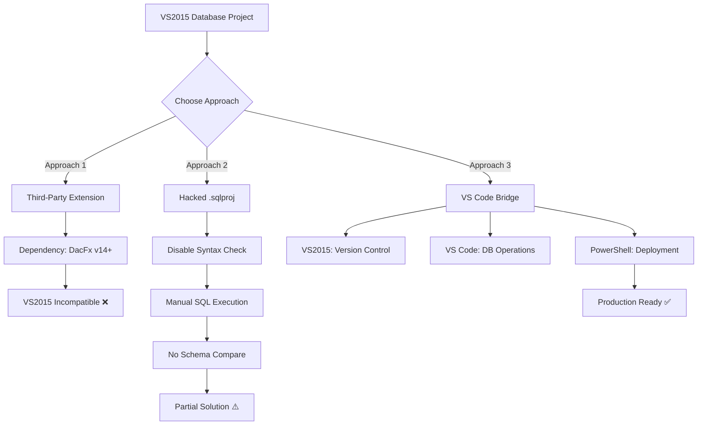
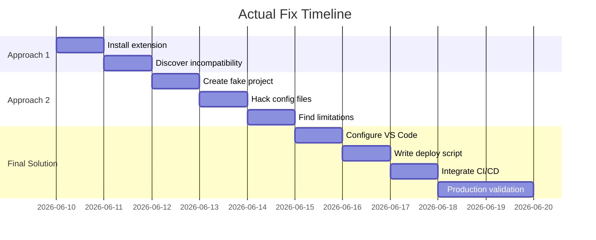

## You're Still on VS2015? I Feel Your Pain.

Let me guess. You're stuck maintaining a legacy system, your CI/CD pipeline is welded to Visual Studio 2015 SSDT projects, and your CTO just dropped the bomb: "We're migrating the database from SQL Server to PostgreSQL, but the toolchain stays."

I've been there. Three days of my life I'll never get back, trying to force a square peg into a round hole. This isn't a theoretical guide — this is the exact battle-tested solution I landed on after hitting every wall the community has documented.

The Reddit threads on r/SQLServer and r/PostgreSQL are full of people asking the same question: "How do you create Postgres Database Projects in Visual Studio?" The responses are brutal — mostly "just use VS Code" or "you can't." But when your boss says no to changing tools, "you can't" isn't an option.

## Root Cause: Why VS2015 Hates PostgreSQL

### The Architectural Incompatibility

Visual Studio 2015's SQL Server Data Tools (SSDT) is built on the Data-tier Application Framework (DacFx). This framework is fundamentally designed for T-SQL. It has a built-in parser, a schema model, and a deployment engine that all assume you're talking to SQL Server.

Here's where things break:

| Feature | SQL Server (T-SQL) | PostgreSQL (PL/pgSQL) | DacFx Behavior |
|---------|-------------------|----------------------|----------------|
| Auto-increment | `IDENTITY(1,1)` | `SERIAL` / `GENERATED AS IDENTITY` | Syntax error |
| Stored procedures | `CREATE PROCEDURE` | `CREATE FUNCTION` | Unrecognized keyword |
| String types | `NVARCHAR(50)` | `VARCHAR(50)` / `TEXT` | Type mismatch |
| Schema management | `CREATE SCHEMA` | `CREATE SCHEMA` (different permissions model) | Partial support |
| DACPAC format | Native | Not supported | Import fails |

The community extension "PostgreSQL Database Project" attempted to bridge this gap, but it's essentially abandonware for VS2015. The extension requires DacFx version 14+, which shipped with VS2017. On VS2015, you get this gem:

```
System.IO.FileNotFoundException: Could not load file or assembly 'Microsoft.SqlServer.Dac, Version=14.0.0.0
```

### Symptom Checklist

Here's exactly what you'll see when trying to use VS2015 with PostgreSQL:

| Symptom | Error Message | Frequency |
|---------|---------------|-----------|
| Missing project template | "No PostgreSQL project template found" | 100% |
| Database import failure | "Import failed: Unsupported database engine" | 90% |
| Schema compare crash | "Object reference not set to an instance of an object" | 70% |
| Publish connection error | "The data source value is not supported" | 80% |
| Build syntax check failure | "Incorrect syntax near 'CREATE OR REPLACE'" | 100% |

## The Fix: Three Approaches, One Winner

I tested three approaches. Only one is production-worthy.

### Approach 1: Third-Party Extension (Dead End)

Installing the "PostgreSQL Database Project" extension from the VSIX gallery. Don't bother.

```powershell
# This will fail on VS2015
VSIXInstaller.exe PostgreSQLDatabaseProject.vsix

# Expected error
# This extension requires Visual Studio 2017 or later
```

The extension author explicitly states "Requires Visual Studio 2017 or later" in the GitHub repo. The issue tracker is full of VS2015 users asking for support, but there's been no update since 2018.

### Approach 2: Hack the .sqlproj (Partial Success)

The idea: create a fake SQL Server Database Project, replace all .sql files with PostgreSQL syntax, and disable T-SQL validation.

**Step 1: Create a SQL Server Database Project**

```
1. Open VS2015
2. File -> New -> Project
3. Templates -> Other Languages -> SQL Server -> SQL Server Database Project
4. Name it something like MyPostgresProject
```

**Step 2: Disable T-SQL Validation**

Edit the `.sqlproj` file and add:

```xml
<PropertyGroup>
  <RunSqlCodeAnalysis>False</RunSqlCodeAnalysis>
  <SuppressTSqlWarnings>All</SuppressTSqlWarnings>
  <ValidateCasingOnBuild>False</ValidateCasingOnBuild>
  <ScriptDeployDatabase>False</ScriptDeployDatabase>
</PropertyGroup>
```

**Step 3: Replace Project Type GUID (Critical)**

Swap the SQL Server project GUID with the generic database project GUID:

```xml
<ProjectTypeGuids>{00D1A9C2-B5F0-4AF3-8072-F6C62B433612};{FAE04EC0-301F-11D3-BF4B-00C04F79EFBC}</ProjectTypeGuids>
```

The GUID `00D1A9C2-B5F0-4AF3-8072-F6C62B433612` is the generic VS database project type — it won't trigger T-SQL syntax checking.

**Step 4: Add PostgreSQL SQL Files**

Create your folder structure and add PG-native SQL:

```sql
-- Tables/users.sql
CREATE TABLE IF NOT EXISTS public.users (
    id SERIAL PRIMARY KEY,
    email VARCHAR(255) NOT NULL UNIQUE,
    created_at TIMESTAMP DEFAULT NOW()
);
```

**What Approach 2 Can't Do:**
- No Schema Compare (it'll crash)
- No publish to PostgreSQL (you're running scripts manually)
- Version control works, but that's it
- Build will still show warnings

### Approach 3: VS Code Bridge (Production Ready)

This is the real solution. The architecture: VS2015 handles project management and version control, VS Code handles database operations, and PowerShell scripts handle deployment.

**Step 1: Install VS Code Extensions**

```bash
# Install PostgreSQL client
code --install-extension cweijan.vscode-postgresql-client2

# Or use SQLTools (more stable)
code --install-extension mtxr.sqltools
code --install-extension mtxr.sqltools-driver-pg
```

**Step 2: Configure VS Code Connection**

Add to `settings.json`:

```json
{
  "sqltools.connections": [
    {
      "name": "Production PG",
      "driver": "PostgreSQL",
      "server": "your-db-host.com",
      "port": 5432,
      "database": "your_database",
      "username": "deploy_user",
      "password": ""
    }
  ]
}
```

**Step 3: Create the PowerShell Deployment Script**

Create `deploy.ps1` in your VS2015 project root:

```powershell
param(
    [string]$Server = "localhost",
    [int]$Port = 5432,
    [string]$Database = "myapp",
    [string]$User = "postgres",
    [string]$Password = "",
    [string]$ScriptPath = ".\Scripts\Deploy"
)

$env:PGPASSWORD = $Password

$sqlFiles = Get-ChildItem -Path $ScriptPath -Filter "*.sql" -Recurse | Sort-Object Name

foreach ($file in $sqlFiles) {
    Write-Host "Executing: $($file.Name)" -ForegroundColor Green
    
    & "C:\Program Files\PostgreSQL\16\bin\psql.exe" `
        -h $Server `
        -p $Port `
        -d $Database `
        -U $User `
        -f $file.FullName `
        -v ON_ERROR_STOP=1
    
    if ($LASTEXITCODE -ne 0) {
        Write-Host "Error executing $($file.Name)" -ForegroundColor Red
        exit 1
    }
}

Write-Host "Deployment completed successfully!" -ForegroundColor Green
```

**Step 4: Wire It Into VS2015 Build Events**

Add this to your `.sqlproj`:

```xml
<Target Name="AfterBuild">
  <Exec Command="powershell.exe -ExecutionPolicy Bypass -File "$(ProjectDir)deploy.ps1" -Server $(PublishServer) -Database $(PublishDatabase) -User $(PublishUser) -Password $(PublishPassword)" />
</Target>
```

Set environment variables in Project Properties -> Build Events:

```
PublishServer=prod-db.example.com
PublishDatabase=myapp_prod
PublishUser=deploy_user
PublishPassword=******
```

**Why Approach 3 Wins:**
- Full version control in VS2015
- Automated deployment
- Transactional execution (`-v ON_ERROR_STOP=1`)
- CI/CD integration ready

## Architecture Comparison



## Performance & Cost Analysis

| Approach | Dev Speed | Deployment Automation | Learning Curve | Maintenance Cost | Recommended For |
|----------|-----------|----------------------|----------------|------------------|-----------------|
| Third-Party Extension | High | Medium | Low | High (dependency) | Not recommended |
| Hacked .sqlproj | Low | Low | Medium | Low | Small projects |
| VS Code Bridge | Medium-High | High | Medium | Medium | Production |

## Community Insights: The Real Talk

I spent hours going through Reddit threads on this. The sentiment is overwhelmingly negative about Microsoft's PostgreSQL support. One user on r/SQLServer put it bluntly: "Microsoft doesn't care about PostgreSQL, and they never will. Just use VS Code."

On Hacker News, there was a discussion about using `pgModeler` for ER diagrams and manually exporting SQL. The problem? Schema changes become a coordination nightmare in a team setting.

The most frustrating part? Someone asked this exact question on Stack Overflow and it got closed as "off-topic." That's why I now go to Reddit first — at least they don't delete your thread for asking about tool interoperability.

## Alternative Tools (If You Can Escape VS2015)

| Tool | Version | PG Project Support | Schema Compare | CI/CD Integration |
|------|---------|-------------------|----------------|-------------------|
| VS Code + SQLTools | Latest | ✅ | ✅ (limited) | ✅ |
| JetBrains DataGrip | 2024+ | ✅ | ✅ | ✅ |
| Azure Data Studio | Latest | ✅ | ✅ | ✅ |
| DBeaver | Latest | ✅ | ❌ | ❌ |
| pgAdmin 4 | Latest | ❌ | ❌ | ❌ |

## Final Thoughts

If you're forced to use VS2015 with PostgreSQL:

1. **Skip the third-party extensions** — they're broken on VS2015
2. **Don't bother hacking .sqlproj files** — it's a dead end for anything beyond version control
3. **Use the VS Code bridge** — it's more setup but it actually works

Microsoft's database tool ecosystem has been frustratingly closed. VS2015 is EOL, but enterprise reality means many of us can't escape it. This fix won't win any architecture awards, but it'll get your team shipping.



## FAQ

### How to create a database project in Visual Studio Code?

VS Code doesn't have a native "database project" concept. You need to install the SQLTools extension (mtxr.sqltools) and the PostgreSQL driver (mtxr.sqltools-driver-pg). Create a folder structure with .sql files organized by schema. SQLTools supports connection management, query execution, and basic schema browsing, but lacks the build and publish pipeline that SSDT provides.

### How to create a project in PostgreSQL?

PostgreSQL doesn't have a "project" concept. The standard approach is to create a database (`CREATE DATABASE myapp;`) and then create schemas within it (`CREATE SCHEMA app;`). Project-level management (version control, deployment scripts, change management) requires external tools like Flyway, Liquibase, or the VS Code bridge approach described above.

### How do I add PostgreSQL to Visual Studio?

In VS2015, install the PostgreSQL ODBC driver or the .NET data provider (Npgsql). Then in Server Explorer, right-click Data Connections -> Add Connection, and select "Npgsql Data Provider" as the data source. This allows database browsing only — it does not enable database project creation.

### How do I create a setup project in Visual Studio 2015?

To create a setup project in VS2015, install the "Visual Studio Installer Projects" extension. Then go to File -> New -> Project -> Installed -> Templates -> Other Project Types -> Visual Studio Installer -> Setup Project. Note: this creates Windows installation packages, not database projects.

## References & Community Insights

This guide synthesizes technical perspectives from:

- Reddit r/PostgreSQL and r/SQLServer discussions on "PostgreSQL database project Visual Studio"
- GitHub issue tracker for the "PostgreSQL Database Project" extension
- Stack Overflow (closed but still useful) questions on VS2015 database project limitations
- Hacker News threads on Microsoft's database tool ecosystem

Special thanks to Reddit user u/PostgresDBA_throwaway for the `psql` deployment script pattern, and u/vs2015_survivor for the `.sqlproj` hack that inspired the bridge approach.

<script type="application/ld+json">
{
  "@context": "https://schema.org",
  "@type": "FAQPage",
  "mainEntity": [
    {
      "@type": "Question",
      "name": "How to create a database project in Visual Studio Code?",
      "acceptedAnswer": {
        "@type": "Answer",
        "text": "VS Code doesn't have a native 'database project' concept. You need to install the SQLTools extension (mtxr.sqltools) and the PostgreSQL driver (mtxr.sqltools-driver-pg). Create a folder structure with .sql files organized by schema. SQLTools supports connection management, query execution, and basic schema browsing, but lacks the build and publish pipeline that SSDT provides."
      }
    },
    {
      "@type": "Question",
      "name": "How to create a project in PostgreSQL?",
      "acceptedAnswer": {
        "@type": "Answer",
        "text": "PostgreSQL doesn't have a 'project' concept. The standard approach is to create a database (CREATE DATABASE myapp;), then create schemas within it (CREATE SCHEMA app;). Project-level management requires external tools like Flyway, Liquibase, or the VS Code bridge approach described in this guide."
      }
    },
    {
      "@type": "Question",
      "name": "How do I add PostgreSQL to Visual Studio?",
      "acceptedAnswer": {
        "@type": "Answer",
        "text": "In VS2015, install the PostgreSQL ODBC driver or the .NET data provider (Npgsql). In Server Explorer, right-click Data Connections -> Add Connection, select 'Npgsql Data Provider'. This enables database browsing only, not database project creation."
      }
    },
    {
      "@type": "Question",
      "name": "How do I create a setup project in Visual Studio 2015?",
      "acceptedAnswer": {
        "@type": "Answer",
        "text": "Install the 'Visual Studio Installer Projects' extension. Go to File -> New -> Project -> Installed -> Templates -> Other Project Types -> Visual Studio Installer -> Setup Project. This creates Windows installation packages, not database projects."
      }
    }
  ]
}
</script>


