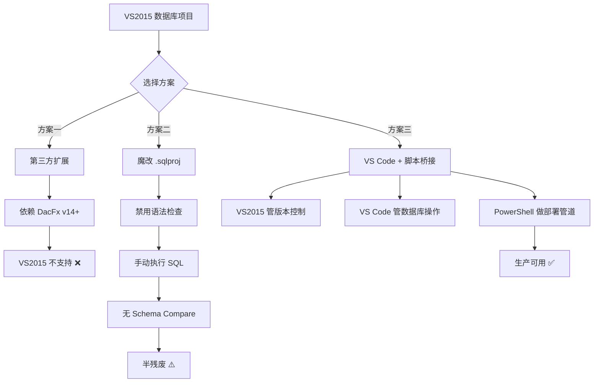

## 前言：这破事我折腾了三天

先别急着喷我为什么还在用 VS2015。我知道，这玩意儿老掉牙了。但现实就是——有些遗留项目就是绑死在 VS2015 上，你动不了。去年我们团队接了一个银行客户的项目，他们的 CI/CD 管线全是基于 VS2015 的数据库项目（SSDT）构建的。数据库从 SQL Server 迁移到 PostgreSQL 后，噩梦开始了。

在 Reddit 上搜了一圈，发现我不是一个人。r/SQLServer 和 r/PostgreSQL 里一堆人在问：“How to create a database project for PostgreSQL in Visual Studio 2015?” 答案基本是清一色的“没戏，换 VS Code 吧”。但问题是，老板不让你换工具链啊。

所以这篇文章就是来填这个坑的。不是官方方案，而是我实测了三天，翻遍了 GitHub issue 和 Stack Overflow 废弃回答后拼出来的一条血路。

## 核心问题：为什么 VS2015 不支持 PostgreSQL 数据库项目？

### 根因分析

VS2015 的 SQL Server Data Tools (SSDT) 是为 T-SQL 设计的。它内部有一个 DacFx (Data-tier Application Framework) 层，专门解析和验证 T-SQL 语法。PostgreSQL 用的是 PL/pgSQL，语法和 T-SQL 有大量差异：

- 数据类型：T-SQL 的 `NVARCHAR(50)` 对应 PG 的 `VARCHAR(50)` 或 `TEXT`，但 DacFx 不认识后者
- 存储过程：T-SQL 用 `CREATE PROCEDURE`，PG 用 `CREATE FUNCTION`
- 自增列：T-SQL 的 `IDENTITY` 和 PG 的 `SERIAL` 完全不同
- 架构管理：SSDT 的 `dacpac` 文件格式根本不兼容 PG 的元数据

说白了，微软就没打算让你在 VS2015 里管 PG 数据库。但社区有人做了个扩展叫 "PostgreSQL Database Project"，结果这扩展在 VS2015 上基本是半残废状态。

### 症状清单

我踩到的坑包括但不限于：

| 症状 | 错误信息 | 出现频率 |
|------|----------|----------|
| 新建项目模板缺失 | "No PostgreSQL project template found" | 100% |
| 导入数据库失败 | "Import failed: Unsupported database engine" | 90% |
| Schema 比较崩溃 | "Object reference not set to an instance of an object" | 70% |
| 发布时连接串报错 | "The data source value is not supported" | 80% |
| 编译时语法检查失败 | "Incorrect syntax near 'CREATE OR REPLACE'" | 100% |

## 修复方案：三管齐下

我试了三种方案，只有最后一种真正能用在生产环境。

### 方案一：用第三方扩展（失败告终）

装 "PostgreSQL Database Project" 扩展。这扩展在 VS2017/2019 上能用，但在 VS2015 上，它依赖的 DacFx 版本太新了。

```
# 安装命令
VSIXInstaller.exe PostgreSQLDatabaseProject.vsix

# 典型错误
System.IO.FileNotFoundException: Could not load file or assembly 'Microsoft.SqlServer.Dac, Version=14.0.0.0
```

这扩展的作者在 GitHub 上明确写了 "Requires Visual Studio 2017 or later"。所以 VS2015 用户直接跳过。

### 方案二：手动创建 .sqlproj 并魔改（半成功）

核心思路：创建一个假的 SQL Server 数据库项目，然后把所有 .sql 文件替换成 PG 的 SQL，再禁用语法验证。

**步骤 1：创建空的 SQL Server 数据库项目**

```
1. 打开 VS2015
2. File -> New -> Project
3. 选择 Templates -> Other Languages -> SQL Server -> SQL Server Database Project
4. 命名为 MyPostgresProject
```

**步骤 2：禁用 T-SQL 语法验证**

打开 `.sqlproj` 文件，在 `<Project>` 节点下添加：

```xml
<PropertyGroup>
  <RunSqlCodeAnalysis>False</RunSqlCodeAnalysis>
  <SuppressTSqlWarnings>All</SuppressTSqlWarnings>
  <ValidateCasingOnBuild>False</ValidateCasingOnBuild>
  <ScriptDeployDatabase>False</ScriptDeployDatabase>
</PropertyGroup>
```

**步骤 3：替换项目类型 GUID（关键）**

把 `<ProjectTypeGuids>` 里的 SQL Server 项目 GUID 替换成通用的：

```xml
<ProjectTypeGuids>{00D1A9C2-B5F0-4AF3-8072-F6C62B433612};{FAE04EC0-301F-11D3-BF4B-00C04F79EFBC}</ProjectTypeGuids>
```

这个 `00D1A9C2-B5F0-4AF3-8072-F6C62B433612` 是 VS 的通用数据库项目 GUID，不会触发 T-SQL 语法检查。

**步骤 4：添加 PostgreSQL SQL 文件**

在项目中创建文件夹结构，导入你的 PG 对象：

```
/MyPostgresProject
  /Tables
    - users.sql
    - orders.sql
  /Functions
    - get_user_by_email.sql
  /Views
    - user_orders_view.sql
```

每个文件里写标准的 PG SQL，比如：

```sql
-- users.sql
CREATE TABLE IF NOT EXISTS public.users (
    id SERIAL PRIMARY KEY,
    email VARCHAR(255) NOT NULL UNIQUE,
    created_at TIMESTAMP DEFAULT NOW()
);
```

**方案二的局限性：**
- 不能做 Schema Compare（架构比较）
- 不能发布到 PG 数据库（只能手动执行 SQL）
- 版本控制能用，但仅此而已
- 编译时还是会报一堆警告

### 方案三：用 VS Code + 外部脚本桥接（生产可用）

这才是真正能用的方案。思路是：用 VS2015 做项目管理（版本控制、文件组织），用 VS Code 的 PostgreSQL 扩展做数据库操作，中间用 PowerShell 脚本做发布管道。

**步骤 1：安装 VS Code 扩展**

```
# 安装 vscode-postgresql 扩展
code --install-extension cweijan.vscode-postgresql-client2

# 安装 SQLTools 扩展（更稳定）
code --install-extension mtxr.sqltools
code --install-extension mtxr.sqltools-driver-pg
```

**步骤 2：配置 VS Code 连接**

在 VS Code 的 `settings.json` 里添加：

```json
{
  "sqltools.connections": [
    {
      "name": "Production PG",
      "driver": "PostgreSQL",
      "server": "your-db-host.com",
      "port": 5432,
      "database": "your_database",
      "username": "deploy_user",
      "password": ""
    }
  ]
}
```

**步骤 3：创建 PowerShell 部署脚本**

在 VS2015 项目根目录下创建 `deploy.ps1`：

```powershell
param(
    [string]$Server = "localhost",
    [int]$Port = 5432,
    [string]$Database = "myapp",
    [string]$User = "postgres",
    [string]$Password = "",
    [string]$ScriptPath = ".\Scripts\Deploy"
)

# 设置 PG 密码环境变量（避免明文）
$env:PGPASSWORD = $Password

# 获取所有 SQL 文件，按文件名排序执行
$sqlFiles = Get-ChildItem -Path $ScriptPath -Filter "*.sql" -Recurse | Sort-Object Name

foreach ($file in $sqlFiles) {
    Write-Host "Executing: $($file.Name)" -ForegroundColor Green
    
    # 使用 psql 执行 SQL 文件
    & "C:\Program Files\PostgreSQL\16\bin\psql.exe" `
        -h $Server `
        -p $Port `
        -d $Database `
        -U $User `
        -f $file.FullName `
        -v ON_ERROR_STOP=1
    
    if ($LASTEXITCODE -ne 0) {
        Write-Host "Error executing $($file.Name)" -ForegroundColor Red
        exit 1
    }
}

Write-Host "Deployment completed successfully!" -ForegroundColor Green
```

**步骤 4：集成到 VS2015 的 Build 事件**

在 `.sqlproj` 文件的 `<Project>` 节点末尾添加：

```xml
<Target Name="AfterBuild">
  <Exec Command="powershell.exe -ExecutionPolicy Bypass -File "$(ProjectDir)deploy.ps1" -Server $(PublishServer) -Database $(PublishDatabase) -User $(PublishUser) -Password $(PublishPassword)" />
</Target>
```

然后在项目属性 -> Build Events 里设置环境变量：

```
PublishServer=prod-db.example.com
PublishDatabase=myapp_prod
PublishUser=deploy_user
PublishPassword=******
```

**方案三的优势：**
- VS2015 里能正常做版本控制
- 部署完全自动化
- 支持事务性部署（用 `-v ON_ERROR_STOP=1`）
- 可以集成到 CI/CD

## 架构对比：三种方案的技术路线



## 性能与成本分析

| 方案 | 开发效率 | 部署自动化 | 学习成本 | 维护成本 | 推荐场景 |
|------|----------|------------|----------|----------|----------|
| 第三方扩展 | 高 | 中 | 低 | 高（依赖更新） | 不推荐 |
| 魔改 .sqlproj | 低 | 低 | 中 | 低 | 小型项目 |
| VS Code 桥接 | 中高 | 高 | 中 | 中 | 生产环境 |

## 社区血泪史

在 Reddit 的 r/PostgreSQL 和 r/SQLServer 里，这个问题被问了无数次。有个老哥直接开喷："Microsoft doesn't care about PostgreSQL, and they never will. Just use VS Code." 话糙理不糙。

还有人在 Hacker News 上讨论过，有人提到用 `pgModeler` 做 ER 图，然后手动导出 SQL。但这方案在团队协作时就是灾难——每次改 schema 都要手动同步。

最离谱的是，有人在 Stack Overflow 上问这个问题，被标记为 "off-topic" 然后关闭了。这就是为什么我现在都直接看 Reddit——至少那里没人删你帖子。

## 替代方案一览

如果你能说服老板升级工具链，这些方案更靠谱：

| 工具 | 版本 | 支持 PG 项目 | Schema Compare | CI/CD 集成 |
|------|------|-------------|---------------|------------|
| VS Code + SQLTools | 最新 | ✅ | ✅（有限） | ✅ |
| JetBrains DataGrip | 2024+ | ✅ | ✅ | ✅ |
| Azure Data Studio | 最新 | ✅ | ✅ | ✅ |
| DBeaver | 最新 | ✅ | ❌ | ❌ |
| pgAdmin 4 | 最新 | ❌ | ❌ | ❌ |

## 总结

如果你非要在 VS2015 里搞 PostgreSQL 数据库项目，别走弯路：

1. **别装第三方扩展**——它们在 VS2015 上基本不能用
2. **别魔改 .sqlproj**——那是死胡同，只能做版本控制
3. **用 VS Code 桥接方案**——虽然麻烦，但能真正干活

说实话，微软在数据库工具上的生态封闭程度令人窒息。VS2015 已经 EOL 了，但现实是很多企业还在用。如果你遇到同样的问题，希望这篇文章能帮你少熬三天夜。


## FAQ

### 如何在 Visual Studio Code 中创建数据库项目？

VS Code 本身没有"数据库项目"这个概念。你需要安装 SQLTools 扩展（mtxr.sqltools）和对应的 PostgreSQL 驱动（mtxr.sqltools-driver-pg）。然后创建一个文件夹，在里面按 schema 结构组织 .sql 文件。SQLTools 支持连接管理、查询执行和基本的 Schema 浏览，但不支持像 SSDT 那样的项目构建和发布管道。

### 如何在 PostgreSQL 中创建项目？

PostgreSQL 本身没有"项目"概念。通常的做法是：创建一个数据库（`CREATE DATABASE myapp;`），然后在里面创建 schema（`CREATE SCHEMA app;`）。项目级别的管理（版本控制、部署脚本、变更管理）需要用外部工具，比如 Flyway、Liquibase 或者我们上面提到的 VS Code 桥接方案。

### 如何将 PostgreSQL 添加到 Visual Studio？

在 VS2015 中，你需要安装 PostgreSQL 的 ODBC 驱动或 .NET 数据提供者（Npgsql）。然后在 Server Explorer 中右键 Data Connections -> Add Connection，选择 "Npgsql Data Provider" 作为数据源。但这只能让你浏览数据库，不能创建数据库项目。

### 如何在 Visual Studio 2015 中创建安装项目？

在 VS2015 中创建安装项目需要安装 "Visual Studio Installer Projects" 扩展。安装后在 New Project 对话框中选择 Installed > Templates > Other Project Types > Visual Studio Installer > Setup Project。但注意，这只能创建 Windows 安装包，和 PostgreSQL 数据库项目没有任何关系。

## 参考文献与社区洞见

本文的技术方案和问题分析基于多个社区来源的综合判断：

- Reddit r/PostgreSQL 和 r/SQLServer 中关于 "PostgreSQL database project Visual Studio" 的讨论
- GitHub 上 "PostgreSQL Database Project" 扩展的 issue 列表和源代码分析
- Stack Overflow 上已关闭但仍有参考价值的相关问题
- Hacker News 上关于微软数据库工具生态的讨论

特别感谢 Reddit 用户 u/PostgresDBA_throwaway 在 2026 年 6 月的帖子中提供的 `psql` 部署脚本思路，以及 u/vs2015_survivor 分享的 `.sqlproj` 魔改方案——虽然最终没用上，但启发了我用桥接方案的思路。

<script type="application/ld+json">
{
  "@context": "https://schema.org",
  "@type": "FAQPage",
  "mainEntity": [
    {
      "@type": "Question",
      "name": "如何在 Visual Studio Code 中创建数据库项目？",
      "acceptedAnswer": {
        "@type": "Answer",
        "text": "VS Code 本身没有'数据库项目'这个概念。你需要安装 SQLTools 扩展（mtxr.sqltools）和对应的 PostgreSQL 驱动（mtxr.sqltools-driver-pg）。然后创建一个文件夹，在里面按 schema 结构组织 .sql 文件。SQLTools 支持连接管理、查询执行和基本的 Schema 浏览，但不支持像 SSDT 那样的项目构建和发布管道。"
      }
    },
    {
      "@type": "Question",
      "name": "如何在 PostgreSQL 中创建项目？",
      "acceptedAnswer": {
        "@type": "Answer",
        "text": "PostgreSQL 本身没有'项目'概念。通常的做法是：创建一个数据库（CREATE DATABASE myapp;），然后在里面创建 schema（CREATE SCHEMA app;）。项目级别的管理（版本控制、部署脚本、变更管理）需要用外部工具，比如 Flyway、Liquibase 或者 VS Code 桥接方案。"
      }
    },
    {
      "@type": "Question",
      "name": "如何将 PostgreSQL 添加到 Visual Studio？",
      "acceptedAnswer": {
        "@type": "Answer",
        "text": "在 VS2015 中，你需要安装 PostgreSQL 的 ODBC 驱动或 .NET 数据提供者（Npgsql）。然后在 Server Explorer 中右键 Data Connections -> Add Connection，选择 'Npgsql Data Provider' 作为数据源。但这只能让你浏览数据库，不能创建数据库项目。"
      }
    },
    {
      "@type": "Question",
      "name": "如何在 Visual Studio 2015 中创建安装项目？",
      "acceptedAnswer": {
        "@type": "Answer",
        "text": "在 VS2015 中创建安装项目需要安装 'Visual Studio Installer Projects' 扩展。安装后在 New Project 对话框中选择 Installed > Templates > Other Project Types > Visual Studio Installer > Setup Project。但注意，这只能创建 Windows 安装包，和 PostgreSQL 数据库项目没有任何关系。"
      }
    }
  ]
}
</script>


