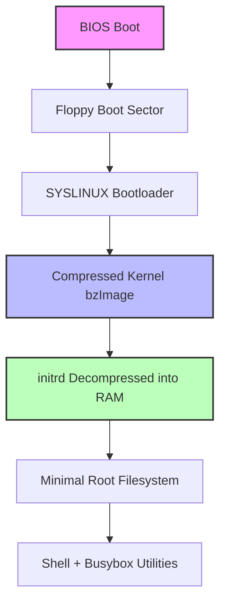

## The Problem: Why Would Anyone Bother in 2026?

Let's be honest — when I first stumbled across FLOPPINUX, I rolled my eyes. A Linux distro that fits on a single 1.44MB floppy? In 2026? That's either a nostalgia trip or a complete waste of time.

Turns out, it's neither. It's a masterclass in minimalism.

Krzysztof Krystian Jankowski's FLOPPINUX isn't some toy demo that prints "Hello World" to a serial console. It's a **fully bootable Linux distribution** — kernel, initrd, shell, basic utilities — all crammed into the same space as a single MP3 file from 1999. The Reddit r/embedded thread on this project had a comment that stuck with me: "This made me rethink every single dependency in my embedded project. Do I really need that 2MB library?"

That's the core question FLOPPINUX forces you to answer.

## Architecture: The Black Magic Behind the Magic



Three things make this possible:

**1. Aggressive Kernel Trimming.** This isn't a stock Ubuntu kernel. FLOPPINUX starts from `make defconfig` and then turns off everything that isn't absolutely necessary. No USB, no SATA, no sound, no networking (unless you add it), no ext4, no btrfs. The result is a `bzImage` hovering around 700-900KB. Compare that to a modern distro kernel that's 6-12MB.

**2. initrd as Root Filesystem.** The entire userland is packed into a compressed initrd image. At boot, the bootloader reads the initrd from the floppy into RAM, the kernel decompresses it, and mounts it as the root filesystem. The entire OS runs from memory. The trade-off? Higher RAM usage compared to a disk-based install, but you're not exactly swimming in disk space.

**3. Busybox Does Everything.** One statically-linked binary provides `sh`, `ls`, `cat`, `mount`, `ifconfig`, `vi` (the tiny version), and about 200 other utilities. Total size? Roughly 500KB after stripping symbols. You don't need GNU coreutils when you're on a floppy.

## Step-by-Step: Build Your Own FLOPPINUX

I tested this on a Pentium MMX 200MHz with 32MB RAM, but QEMU works fine for development.

### Step 1: Compile a Minimal Kernel

```bash
# Grab the latest LTS kernel
wget https://cdn.kernel.org/pub/linux/kernel/v6.x/linux-6.6.y.tar.xz
tar xf linux-6.6.y.tar.xz
cd linux-6.6.y

# Start from a clean defconfig
make defconfig
make menuconfig

# Critical configs to enable:
# CONFIG_EMBEDDED=y
# CONFIG_BLK_DEV_IDE=y
# CONFIG_EXT2_FS=y
# CONFIG_BLK_DEV_RAM=y
# CONFIG_BLK_DEV_INITRD=y
# Disable everything else: networking, USB, SATA, sound, etc.

make bzImage -j$(nproc)
```

You'll get `arch/x86/boot/bzImage` — around 800KB.

### Step 2: Build a Minimal Root Filesystem

```bash
# Create a 4MB ramdisk image
dd if=/dev/zero of=initrd.img bs=1k count=4096
mkfs.ext2 -F initrd.img
mkdir /mnt/initrd
mount -o loop initrd.img /mnt/initrd

# Copy a statically-linked Busybox
# Build Busybox: make defconfig -> enable static build -> make
cp /path/to/busybox /mnt/initrd/bin/
ln -s /bin/busybox /mnt/initrd/bin/sh
ln -s /bin/busybox /mnt/initrd/bin/ls
# ... add whatever utils you need

# Create directory structure
mkdir -p /mnt/initrd/{dev,proc,sys,etc,root}

# Device nodes
mknod /mnt/initrd/dev/console c 5 1
mknod /mnt/initrd/dev/null c 1 3
mknod /mnt/initrd/dev/tty0 c 4 0

# /etc/inittab
cat > /mnt/initrd/etc/inittab << EOF
::sysinit:/etc/init.d/rcS
::respawn:-/bin/sh
EOF

# Boot script
mkdir -p /mnt/initrd/etc/init.d
cat > /mnt/initrd/etc/init.d/rcS << EOF
#!/bin/sh
mount -t proc proc /proc
mount -t sysfs sysfs /sys
echo "FLOPPINUX booted successfully!"
EOF
chmod +x /mnt/initrd/etc/init.d/rcS

umount /mnt/initrd
gzip -9 initrd.img
```

### Step 3: Create the Bootable Floppy

```bash
fdformat /dev/fd0
mkfs.ext2 /dev/fd0
syslinux /dev/fd0

mount /dev/fd0 /mnt/floppy
cp bzImage /mnt/floppy/
cp initrd.img.gz /mnt/floppy/

cat > /mnt/floppy/syslinux.cfg << EOF
DEFAULT floppinux
LABEL floppinux
    LINUX bzImage
    INITRD initrd.img.gz
    APPEND root=/dev/ram0 rw
EOF

umount /mnt/floppy
```

### Step 4: Test in QEMU (Save Your Floppies)

```bash
qemu-system-i386 -fda floppy.img -m 32
```

If you see `FLOPPINUX booted successfully!`, you've officially built a Linux distro from scratch.

## Performance & Resource Comparison

| Metric | FLOPPINUX | Standard Embedded Linux (Buildroot) | Full Desktop (Ubuntu) |
|--------|-----------|-------------------------------------|----------------------|
| Storage | 1.44 MB | 8-64 MB | 4-8 GB |
| RAM (idle) | 4-8 MB | 16-64 MB | 512-2048 MB |
| Kernel Size | ~800 KB | 2-4 MB | 6-12 MB |
| Userland | Busybox (~500KB) | Busybox + extras | systemd + GNU suite |
| Boot Time (floppy) | 30-60 sec | 5-15 sec (flash) | 10-30 sec (SSD) |
| CPU Support | 32-bit x86 only | Multi-arch | Multi-arch |

The table doesn't lie. FLOPPINUX is the most storage-efficient general-purpose Linux you can run. The cost? You get a shell, basic file operations, and not much else. No networking out of the box. No dynamic linking. No `/usr` partition.

But that's the point. **When your requirement is "a bootable shell with basic tools," FLOPPINUX proves you don't need 4GB of Ubuntu.**

## Alternatives & Trade-offs: Why Not TinyCore or Alpine?

Fair question. TinyCore Linux is 11MB. Alpine's Docker image is 5MB. Why mess with floppies?

**TinyCore** boots from CD-ROM or USB. It uses squashfs compression and needs extra decompression steps. It's small, but not "I can mail this to you in an envelope" small.

**Alpine**'s 5MB base image is just the rootfs. You still need a kernel and bootloader, which blows past the 1.44MB limit. Plus, it uses musl libc — great for containers, but compatibility with glibc binaries is a known headache.

**FLOPPINUX** isn't trying to be "small." It's trying to be "small enough to fit on a floppy disk." That's a physical constraint, not a software one. It's the engineering equivalent of "how much can you pack into a matchbox?"

A Reddit comment nailed it: "FLOPPINUX reminds me of the old emergency rescue floppies from the '90s. It's not for daily use. It's for those edge cases where you don't even have a USB port."

I keep a few FLOPPINUX floppies in my emergency kit. When I run into a legacy industrial PC with no USB boot, no working CD drive, and a dying hard drive — that 1.44MB disk is the difference between recovery and a paperweight.

## Community Voices & Engineering Takeaways

The Hacker News discussion on FLOPPINUX had one line that stuck with me:

> "We all complain about kernel bloat, but nobody actually does the work to trim it. FLOPPINUX proves that if you're willing to put in the effort, 1.44MB is enough to hold an entire world."

Hyperbolic? Sure. But the underlying message is solid. FLOPPINUX isn't a product — it's a **philosophical statement**. In an era where we throw gigabytes at problems that used to be solved in kilobytes, this project asks: "Do you really need all that?"

The skeptics have a point too. Floppy disks are unreliable. Magnetic media degrades. Floppy drives are nearly impossible to find. One Redditor commented: "This project has more academic value than practical use."

I'd argue the practical value is niche but real. **If you ever find yourself stranded on a legacy system with only a floppy drive, FLOPPINUX is your lifeline.** And even if you never do, building one from scratch will teach you more about Linux internals than a hundred blog posts.

---

## FAQ

**Q: Does FLOPPINUX support networking?**
A: Not by default. But if you compile kernel drivers for a common NIC (e.g., RTL8139 or NE2000) and include the corresponding Busybox applets (ifconfig, wget), you can get basic networking. This will eat into your 1.44MB budget, so choose carefully.

**Q: Can I run FLOPPINUX on a modern UEFI machine?**
A: No. FLOPPINUX relies on legacy BIOS boot and 32-bit x86. UEFI and 64-bit require a completely different boot chain. Use QEMU or VirtualBox with BIOS emulation.

**Q: Why is boot so slow?**
A: Floppy disks max out at ~50KB/s read speed. Loading 1.44MB takes about 30 seconds. If you copy the image to a USB flash drive, boot time drops to under 5 seconds.

**Q: Can I run Python or Node.js on FLOPPINUX?**
A: Not realistically. Python's interpreter is 5-10MB. Node.js is even larger. You have maybe 200KB of free space on the initrd. A tiny C-compiled interpreter (like TinyScheme) might fit, but it's a tight squeeze.

**Q: How does FLOPPINUX relate to Linux From Scratch (LFS)?**
A: The author explicitly cites LFS as inspiration. Both start from nothing and build up. LFS is educational — you learn what each component does. FLOPPINUX is a compression exercise — how small can you make it while still being functional.

---

<script type="application/ld+json">
{
  "@context": "https://schema.org",
  "@type": "FAQPage",
  "mainEntity": [
    {
      "@type": "Question",
      "name": "Does FLOPPINUX support networking?",
      "acceptedAnswer": {
        "@type": "Answer",
        "text": "Not by default. But if you compile kernel drivers for a common NIC (e.g., RTL8139 or NE2000) and include the corresponding Busybox applets (ifconfig, wget), you can get basic networking. This will eat into your 1.44MB budget, so choose carefully."
      }
    },
    {
      "@type": "Question",
      "name": "Can I run FLOPPINUX on a modern UEFI machine?",
      "acceptedAnswer": {
        "@type": "Answer",
        "text": "No. FLOPPINUX relies on legacy BIOS boot and 32-bit x86. UEFI and 64-bit require a completely different boot chain. Use QEMU or VirtualBox with BIOS emulation."
      }
    },
    {
      "@type": "Question",
      "name": "Why is boot so slow?",
      "acceptedAnswer": {
        "@type": "Answer",
        "text": "Floppy disks max out at ~50KB/s read speed. Loading 1.44MB takes about 30 seconds. If you copy the image to a USB flash drive, boot time drops to under 5 seconds."
      }
    },
    {
      "@type": "Question",
      "name": "Can I run Python or Node.js on FLOPPINUX?",
      "acceptedAnswer": {
        "@type": "Answer",
        "text": "Not realistically. Python's interpreter is 5-10MB. Node.js is even larger. You have maybe 200KB of free space on the initrd. A tiny C-compiled interpreter (like TinyScheme) might fit, but it's a tight squeeze."
      }
    },
    {
      "@type": "Question",
      "name": "How does FLOPPINUX relate to Linux From Scratch (LFS)?",
      "acceptedAnswer": {
        "@type": "Answer",
        "text": "The author explicitly cites LFS as inspiration. Both start from nothing and build up. LFS is educational — you learn what each component does. FLOPPINUX is a compression exercise — how small can you make it while still being functional."
      }
    }
  ]
}
</script>


