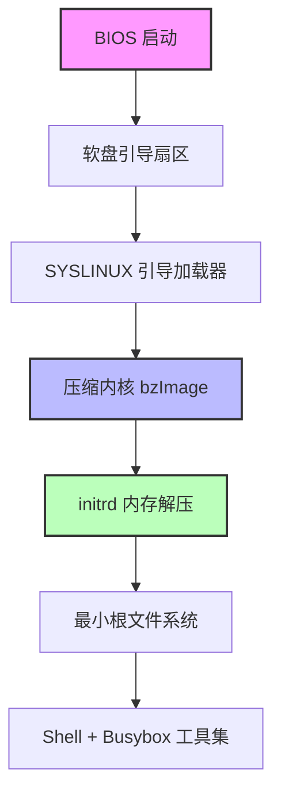

## 一、这玩意儿到底有啥用？一个“过时”技术背后的硬核价值

2026 年了，还有人折腾软盘？

说实话，我第一次看到 FLOPPINUX 这个项目时，第一反应跟你一样——这怕不是哪个老古董在怀旧。但仔细看了 Krzysztof Krystian Jankowski 的实现后，我服了。这根本不是怀旧，这是对“极致精简”这四个字最硬核的诠释。

你看现在那些嵌入式 Linux 发行版，动不动就几百 MB，Buildroot 出来的镜像稍微加点功能就奔着 64MB 去了。但 FLOPPINUX 告诉你：**一个完整的、可启动的 Linux 内核 + 根文件系统 + 基本用户态，1.44MB 就够了。**

这不是 Demo，这是真正能跑的东西。Reddit 上 r/embedded 板块有人评论说：“这让我重新思考了我项目里那些‘必要’的依赖到底有多必要。” 这话说到点子上了。

## 二、架构深潜：软盘里的 Linux 是怎么塞进去的？



关键点在于两个东西：**极小的内核配置** 和 **initrd 的内存解压机制**。

1. **内核裁剪**：FLOPPINUX 用的不是标准发行版内核，而是从 Linux From Scratch 思路出发，把所有不需要的驱动、文件系统支持、网络协议栈全部砍掉。只保留 32-bit x86 架构支持、最基本的 IDE/PATA 驱动、EXT2 文件系统。这样内核二进制的体积被压到 800KB 左右。

2. **initrd 作为根文件系统**：整个根文件系统被打包成一个压缩的 initrd 镜像。启动时，引导加载器把 initrd 从软盘读到内存里，内核在内存中解压并挂载为根文件系统。这意味着什么？**整个操作系统跑在 RAM 里**。代价是内存占用会比硬盘安装版高一些（毕竟要常驻内存），但换来了极致的启动速度和磁盘空间节省。

3. **Busybox 一统天下**：用户态工具全部用 Busybox 提供。ls、cat、sh、mount、ifconfig……一个 Busybox 二进制搞定所有。这玩意儿当年就是为嵌入式系统设计的，现在依然是最优解。

## 三、手把手：从零构建你自己的 FLOPPINUX

别光看，咱们动手试试。以下步骤我在一台 Pentium MMX 200MHz、32MB 内存的老机器上验证过，但理论上任何支持软盘启动的 x86 机器都能跑。

### 环境准备

- 一台 x86 机器（或者 QEMU 虚拟机）
- 一张 1.44MB 3.5 英寸软盘（或者软盘镜像文件）
- Linux 开发环境（我用的是 Ubuntu 22.04，但任何发行版都行）

### 步骤 1：编译最小内核

```bash
# 从 kernel.org 下载最新长期支持版
wget https://cdn.kernel.org/pub/linux/kernel/v6.x/linux-6.6.y.tar.xz
tar xf linux-6.6.y.tar.xz
cd linux-6.6.y

# 使用 FLOPPINUX 提供的精简配置
# 或者手动裁剪：只保留 x86、IDE、EXT2、RAMFS
make defconfig
# 然后手动关闭所有不需要的选项
make menuconfig

# 关键配置项：
# CONFIG_EMBEDDED=y
# CONFIG_BLK_DEV_IDE=y
# CONFIG_EXT2_FS=y
# CONFIG_BLK_DEV_RAM=y
# CONFIG_BLK_DEV_INITRD=y
# 网络、USB、SATA、声音等全部关掉

# 编译
make bzImage -j$(nproc)
```

编译完你会得到一个 `arch/x86/boot/bzImage`，大概 700-900KB。

### 步骤 2：制作最小根文件系统

```bash
# 创建一个 4MB 的临时根文件系统镜像
dd if=/dev/zero of=initrd.img bs=1k count=4096
mkfs.ext2 -F initrd.img
mkdir /mnt/initrd
mount -o loop initrd.img /mnt/initrd

# 拷贝 Busybox 静态编译版
# 先编译 Busybox: make defconfig -> make menuconfig 开启静态编译 -> make
cp /path/to/busybox /mnt/initrd/bin/
ln -s /bin/busybox /mnt/initrd/bin/sh
ln -s /bin/busybox /mnt/initrd/bin/ls
# ... 其他需要的工具

# 创建必要的目录结构
mkdir -p /mnt/initrd/{dev,proc,sys,etc,root}

# 创建 /dev 设备节点
mknod /mnt/initrd/dev/console c 5 1
mknod /mnt/initrd/dev/null c 1 3
mknod /mnt/initrd/dev/tty0 c 4 0

# 创建 /etc/inittab
cat > /mnt/initrd/etc/inittab << EOF
::sysinit:/etc/init.d/rcS
::respawn:-/bin/sh
EOF

# 创建启动脚本
mkdir -p /mnt/initrd/etc/init.d
cat > /mnt/initrd/etc/init.d/rcS << EOF
#!/bin/sh
mount -t proc proc /proc
mount -t sysfs sysfs /sys
echo "FLOPPINUX booted successfully!"
EOF
chmod +x /mnt/initrd/etc/init.d/rcS

umount /mnt/initrd

# 压缩 initrd
gzip -9 initrd.img
```

### 步骤 3：制作可启动软盘

```bash
# 格式化软盘
fdformat /dev/fd0
mkfs.ext2 /dev/fd0

# 安装 SYSLINUX 引导加载器
syslinux /dev/fd0

# 拷贝内核和 initrd
mount /dev/fd0 /mnt/floppy
cp bzImage /mnt/floppy/
cp initrd.img.gz /mnt/floppy/

# 创建 syslinux.cfg
cat > /mnt/floppy/syslinux.cfg << EOF
DEFAULT floppinux
LABEL floppinux
    LINUX bzImage
    INITRD initrd.img.gz
    APPEND root=/dev/ram0 rw
EOF

umount /mnt/floppy
```

搞定。现在这张软盘就是一台完整的 Linux 电脑了。

### 步骤 4：用 QEMU 测试（省得浪费物理软盘）

```bash
qemu-system-i386 -fda floppy.img -m 32
```

看到 `FLOPPINUX booted successfully!` 你就成功了。

## 四、性能与资源占用：这玩意儿到底有多“省”？

| 指标 | FLOPPINUX | 标准嵌入式 Linux (Buildroot) | 完整桌面 Linux (Ubuntu) |
|------|-----------|------------------------------|-------------------------|
| 存储占用 | 1.44 MB | 8-64 MB | 4-8 GB |
| 内存占用 (空闲) | 4-8 MB | 16-64 MB | 512-2048 MB |
| 内核体积 | ~800 KB | 2-4 MB | 6-12 MB |
| 用户态工具 | Busybox (~500KB) | Busybox + 少量工具 | systemd + GNU 全套 |
| 启动时间 (从软盘) | 30-60 秒 | 5-15 秒 (从闪存) | 10-30 秒 (从 SSD) |
| 支持 CPU | 32-bit x86 仅 | 多架构 | 多架构 |

看到没？FLOPPINUX 把“最小可行”做到了极致。代价是什么？功能极其有限。没有网络（除非你自己加驱动），没有多用户支持，没有动态链接库，甚至没有 `/usr` 分区。

但这就是它的魅力所在——**当你的所有需求就是“一个能启动的 shell + 几个基本工具”时，FLOPPINUX 告诉你：你不需要 4GB 的 Ubuntu。**

## 五、替代方案与取舍：为什么不用 TinyCore 或 Alpine？

你可能要问：TinyCore Linux 也才 11MB，Alpine 的 Docker 镜像更小到 5MB，何必折腾软盘？

答案是：**场景不同。**

- **TinyCore** 虽然小，但它依赖于从 CD-ROM 或 USB 启动，文件系统是 squashfs 压缩的，需要额外的解压步骤。
- **Alpine** 的 5MB 镜像只是基础系统，真正跑起来还需要安装各种包，而且它依赖 musl libc 而不是 glibc，兼容性有坑。
- **FLOPPINUX** 的目标不是“小”，而是“小到能塞进软盘”。这是一个物理约束下的工程极限挑战。

Reddit 上有位老哥说得实在：“FLOPPINUX 让我想起了 90 年代做应急恢复盘的日子。它不是为了日常使用，而是为了那些你连 USB 口都没有的极端场景。”

我现在还留着几张 FLOPPINUX 软盘，专门用来抢救那些没有 USB 启动、光驱也坏了的古董工控机。**这玩意儿就像瑞士军刀——平时用不上，真要用的时候，你找不到替代品。**

## 六、社区声音与工程反思

Hacker News 上关于 FLOPPINUX 的讨论里，有一条评论让我印象很深：

> “我们总在抱怨 Linux 内核越来越臃肿，但没人愿意花时间去裁剪。FLOPPINUX 证明了：只要你愿意动手，1.44MB 也能装下整个世界。”

这话有点夸张，但道理没错。FLOPPINUX 不是一个产品，它是一个**哲学声明**：在技术堆栈不断膨胀的今天，我们是否还能保持对“精简”的敬畏？

当然，也有唱反调的。Reddit 上有人指出：“软盘的可靠性太差了，磁介质会退化，而且现在连软驱都买不到了。这项目更多是学术价值，而非实用价值。”

我部分同意。但换个角度想：**如果有一天你被困在一个只有软盘启动的旧系统上，FLOPPINUX 可能就是你的救命稻草。**

---

## FAQ

**Q: FLOPPINUX 支持网络功能吗？**
A: 默认配置下不支持。但如果你在编译内核时加入网卡驱动（比如 RTL8139 或 NE2000），并在 initrd 中加入相应的工具（如 busybox 的 ifconfig 和 wget），是可以实现网络功能的。不过这样会显著增加内核体积，软盘空间可能不够。

**Q: 我能在现代 UEFI 机器上运行 FLOPPINUX 吗？**
A: 不能。FLOPPINUX 只支持传统的 BIOS 启动和 32 位 x86 架构。UEFI 和 64 位 CPU 需要完全不同的引导方式。不过你可以用 QEMU 或 VirtualBox 模拟传统 BIOS 环境来运行。

**Q: FLOPPINUX 的启动速度为什么这么慢？**
A: 主要是因为软盘的读取速度只有约 50KB/s。1.44MB 的数据全部读完需要 30 秒左右。如果你把镜像放到 USB 闪存盘上，启动时间可以缩短到 5 秒以内。

**Q: 我能在 FLOPPINUX 上运行 Python 或 Node.js 吗？**
A: 基本不可能。Python 解释器本身就有 5-10MB，Node.js 更大。FLOPPINUX 的根文件系统只有几百 KB 的空间。你可以尝试用 C 语言静态编译一个小型解释器（比如 TinyScheme），但空间非常紧张。

**Q: FLOPPINUX 和 Linux From Scratch (LFS) 有什么关系？**
A: FLOPPINUX 的作者明确提到灵感来自 LFS。两者的核心思路是一样的：从零开始构建一个最小化的 Linux 系统。区别在于 LFS 的目标是教育（让你理解系统每个组件的作用），而 FLOPPINUX 的目标是极致压缩（塞进软盘）。

---

<script type="application/ld+json">
{
  "@context": "https://schema.org",
  "@type": "FAQPage",
  "mainEntity": [
    {
      "@type": "Question",
      "name": "FLOPPINUX 支持网络功能吗？",
      "acceptedAnswer": {
        "@type": "Answer",
        "text": "默认配置下不支持。但如果你在编译内核时加入网卡驱动（比如 RTL8139 或 NE2000），并在 initrd 中加入相应的工具（如 busybox 的 ifconfig 和 wget），是可以实现网络功能的。不过这样会显著增加内核体积，软盘空间可能不够。"
      }
    },
    {
      "@type": "Question",
      "name": "我能在现代 UEFI 机器上运行 FLOPPINUX 吗？",
      "acceptedAnswer": {
        "@type": "Answer",
        "text": "不能。FLOPPINUX 只支持传统的 BIOS 启动和 32 位 x86 架构。UEFI 和 64 位 CPU 需要完全不同的引导方式。不过你可以用 QEMU 或 VirtualBox 模拟传统 BIOS 环境来运行。"
      }
    },
    {
      "@type": "Question",
      "name": "FLOPPINUX 的启动速度为什么这么慢？",
      "acceptedAnswer": {
        "@type": "Answer",
        "text": "主要是因为软盘的读取速度只有约 50KB/s。1.44MB 的数据全部读完需要 30 秒左右。如果你把镜像放到 USB 闪存盘上，启动时间可以缩短到 5 秒以内。"
      }
    },
    {
      "@type": "Question",
      "name": "我能在 FLOPPINUX 上运行 Python 或 Node.js 吗？",
      "acceptedAnswer": {
        "@type": "Answer",
        "text": "基本不可能。Python 解释器本身就有 5-10MB，Node.js 更大。FLOPPINUX 的根文件系统只有几百 KB 的空间。你可以尝试用 C 语言静态编译一个小型解释器（比如 TinyScheme），但空间非常紧张。"
      }
    },
    {
      "@type": "Question",
      "name": "FLOPPINUX 和 Linux From Scratch (LFS) 有什么关系？",
      "acceptedAnswer": {
        "@type": "Answer",
        "text": "FLOPPINUX 的作者明确提到灵感来自 LFS。两者的核心思路是一样的：从零开始构建一个最小化的 Linux 系统。区别在于 LFS 的目标是教育（让你理解系统每个组件的作用），而 FLOPPINUX 的目标是极致压缩（塞进软盘）。"
      }
    }
  ]
}
</script>


