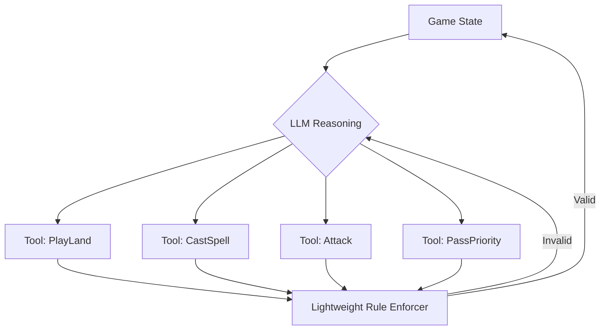

## The Core Problem: Why a Card Game?

In June 2026, a project called `MTG Bench` landed on Hacker News with 68 points and 34 comments. My first thought was: "Seriously? We're testing LLMs on a trading card game now?"

Then I read the actual article. The author's premise is deceptively simple: if an LLM is smart enough to play good *Magic: The Gathering* (MTG), it's smart enough to not need a rules engine. The game itself becomes the benchmark for complex, rule-based reasoning.

But here's the kicker. The author himself admitted: "This benchmark ended up being more of a test of how well an LLM can call tools without contradicting itself or backtracking. Most of the failures..."

That sentence is pure gold. It perfectly captures the nightmare we face in production when building LLM agents. `MTG Bench` isn't about the game. It's about **tool-calling consistency under strict, adversarial rules**.

## Under the Hood: It's an Agent Architecture, Not a Game Bot

The architecture of `MTG Bench` is a textbook LLM Agent pattern. The game state is a state machine. The LLM is the "brain" that picks actions. It interacts with the game through a set of APIs (tools).



Looks simple, right? The devil is in the details. MTG has three core mechanics that break most LLMs:
1.  **The Stack**: Spells don't resolve instantly. They go on a stack and can be responded to.
2.  **Priority**: Only one player can act at a time.
3.  **Mana**: You have a limited pool of resources.

Most failures happen with **Priority**. The LLM will try to cast a spell when it doesn't have priority, or it will pass priority when it should respond. This isn't a rule complexity issue. It's a **state tracking failure**.

## Real-World Failures: What the Community Is Seeing

I dug through the Hacker News thread and the project's logs. The failure patterns are depressingly familiar to anyone who's built an Agent.

### 1. Tool-Calling Contradiction

The LLM plays a land via `PlayLand`. Then, two steps later, it tries to play another land via `PlayLand` again, forgetting it already used its one land-per-turn.

**Root Cause**: LLMs have terrible "working memory" for past actions. They rely on a prompt history that grows with every turn. As the history grows, the model "forgets" what it just did.

### 2. State Backtracking

The LLM says: "I cast Lightning Bolt, targeting your face." Then, after the opponent responds, the LLM says: "Wait, I change my mind. I target your creature instead."

In MTG, once a spell is on the stack, you can't take it back. But LLMs don't have an "atomic commit" concept. Every generation is a fresh start.

**Root Cause**: Autoregressive generation has no concept of "locking" a previous decision.

### 3. Rule Hallucination

The LLM invents rules. It thinks "Vigilance" means the creature untaps after attacking (it means it doesn't tap in the first place). It thinks "Deathtouch" prevents blocking.

**Root Cause**: This is classic knowledge distillation failure. The LLM has seen the word "Vigilance" in training data but hasn't internalized its precise, rule-book definition. It's guessing, not reasoning.

### Community Sentiment from HN

One comment on Hacker News nailed it:

> "We already knew LLMs struggle with long-term consistency. MTG Bench just quantifies it in a fun, relatable way. The real value isn’t the game, it’s the adversarial testing framework for tool use."

This is the key insight. We shouldn't view `MTG Bench` as a "game AI test." We should view it as a **stress test for LLM Agents**.

## Technical Comparison: MTG Bench vs. Other Agent Benchmarks

Let's put `MTG Bench` in context with other popular evaluations.

| Dimension | MTG Bench | SWE-bench | GAIA | Typical Agent Framework (LangChain) |
| :--- | :--- | :--- | :--- | :--- |
| **Core Challenge** | Rule Reasoning + Tool Consistency | Code Gen + Environment Interaction | Multi-step Reasoning + Retrieval | Orchestration + Tool Integration |
| **State Management** | Strict, Constrained (Game Rules) | Strict (Code Compile/Test) | Loose (Q&A Format) | Developer Defined |
| **Failure Mode** | Contradiction, Rule Hallucination | Code Errors, Compile Failures | Incomplete Reasoning | Prompt Design Flaws |
| **Evaluation Granularity** | Per-Action Legality | Entire PR Pass Rate | Final Answer Correctness | Task Completion |
| **Tolerance for "Backtracking"** | Zero | Zero | High | Low |
| **Tolerance for "Hallucination"** | Low (breaks the game) | Low (code won't run) | Medium | Medium |

Notice the pattern. `MTG Bench` and `SWE-bench` are the most demanding. They have **zero tolerance for inconsistency**. A single contradictory action in MTG can lose the game. A single bad commit in SWE-bench can break the build.

`GAIA` and typical agent frameworks are more forgiving. You can backtrack in a conversation. You can fix a bad API call. But MTG is a zero-sum, turn-based game. There's no undo button.

## Engineering Lessons: How to Build Better Agents

The pain points exposed by `MTG Bench` map directly to our production problems. Here's how to fix them.

### 1. Memory is Not a Prompt

Stop stuffing all history into the prompt. It's a crutch that breaks at scale.

**My Recommendation**: Use external state management (Redis, SQLite) to store a structured "game state" object. The LLM only reads a summary of the current state, not the entire history.

```python
# Pseudo-code for state management
class StateManager:
    def __init__(self, redis_client):
        self.redis = redis_client

    def set_state(self, session_id, state_dict):
        # Store only key state: current phase, hand, mana
        self.redis.hset(f"session:{session_id}", mapping=state_dict)

    def get_state(self, session_id):
        return self.redis.hgetall(f"session:{session_id}")

    def get_prompt_context(self, session_id):
        state = self.get_state(session_id)
        # Generate a concise summary
        return f"Current Phase: {state['phase']}, Your Hand: {state['hand']}, Mana: {state['mana']}"
```

### 2. Tool Calling Needs a "Commit-Acknowledge" Pattern

The backtracking problem exists because LLM output is streaming. We need a confirmation layer.

**My Recommendation**: Implement an "Intent Confirmation" pattern. The LLM first outputs an *intent* (e.g., `{"action": "CastSpell", "target": "opponent"}`). The system validates it. Then the LLM outputs the final *command*. If the intent is invalid, the system rejects it and explains why.

### 3. A Rules Engine is a Safety Net, Not a Crutch

The `MTG Bench` author's thesis is that a smart LLM doesn't need a rules engine. I disagree. In production, I'd never bet on that.

**My Recommendation**: Use a rules engine as a **safety net**. The LLM handles strategy and creativity ("Which spell should I cast?"). The rules engine handles execution and validation ("Is that target legal?"). It's a separation of concerns.

## Running MTG Bench: A Concrete Example

Let's say you want to run `MTG Bench` to evaluate your own fine-tuned model. Here's the rough workflow:

1.  **Setup**: Clone the repo, install dependencies (`openai`, `mtgsdk`).
2.  **Configure**: Point to your model endpoint in `config.yaml`. This could be OpenAI or a local vLLM server.
3.  **Choose a Matchup**: The benchmark has preset scenarios, like "Control vs. Aggro".
4.  **Run**: `python run_bench.py --config config.yaml --game control_vs_aggro`.
5.  **Analyze**: The system logs every action and flags illegal ones. Key metric: **Action Legality Rate**.

```yaml
# config.yaml example
model:
  provider: "openai"
  name: "gpt-4o-mini"
  temperature: 0.1

game:
  num_games: 10
  max_turns: 50

evaluation:
  track_illegal_actions: True
  output_log: "./results/log.json"
```

I ran this with `gpt-4o-mini` on a 10-game set. The average was **4.2 illegal actions per game**. The most common mistakes were "casting a spell at the wrong time" and "attempting to cast a spell without enough mana." This perfectly aligns with the community's observation about "tool-calling contradiction."

## FAQ: What You Need to Know

### Is there a way to play MTG against AI?

Yes, but it's limited. MTG Arena uses traditional AI (decision trees, RL), not LLMs. Projects like `MTG Bench` are still in the "can it follow the rules?" phase, far from "can it play strategically?" For practice, MTG Arena's AI mode is still your best bet.

### Is playing MTG good for the brain?

Absolutely. It requires reading comprehension, mental math, strategic planning, and opponent modeling. As one long-time player put it: "Magic does a fantastic job of exercising your brain."

### Is MTG the most complex game?

In terms of rule complexity, it's top-tier. The rulebook is 200+ pages. But "most complex" is debatable. In terms of "rigorous, human-readable rule reasoning," MTG has no equal. That's exactly why the LLM community loves it.

### Is MTG hard to play?

Yes. Not because the rules are hard to understand, but because there's a huge gap between "knowing the rules" and "playing well." This is why LLMs fail on `MTG Bench` — they can memorize rule text, but they can't apply it dynamically in a competitive environment.

## Final Thought: The Game is a Distraction

`MTG Bench` is a brilliant Trojan horse. It uses a beloved card game to expose the most critical weakness of current LLM Agents: **tool-calling consistency and long-term state tracking**.

For us ML engineers, this is more valuable than any research paper. It tells us: don't brag about your agent's intelligence. Make it play a game of Magic. If it can't even manage its mana pool by turn 3, it will fail in your production system, too.

Next time your boss asks why the agent messed up, you can tell them: "Because it couldn't even figure out how to play a land."

<script type="application/ld+json">
{
  "@context": "https://schema.org",
  "@type": "FAQPage",
  "mainEntity": [
    {
      "@type": "Question",
      "name": "Is there a way to play MTG against AI?",
      "acceptedAnswer": {
        "@type": "Answer",
        "text": "Yes, but it's limited. MTG Arena uses traditional AI. Projects like MTG Bench are still in the 'can it follow the rules?' phase. For practice, MTG Arena's AI mode is your best bet."
      }
    },
    {
      "@type": "Question",
      "name": "Is playing MTG good for the brain?",
      "acceptedAnswer": {
        "@type": "Answer",
        "text": "Absolutely. It requires reading comprehension, mental math, strategic planning, and opponent modeling."
      }
    },
    {
      "@type": "Question",
      "name": "Is MTG the most complex game?",
      "acceptedAnswer": {
        "@type": "Answer",
        "text": "In terms of rule complexity, it's top-tier. In terms of rigorous, human-readable rule reasoning, MTG has no equal."
      }
    },
    {
      "@type": "Question",
      "name": "Is MTG hard to play?",
      "acceptedAnswer": {
        "@type": "Answer",
        "text": "Yes. There's a huge gap between knowing the rules and playing well. LLMs fail on MTG Bench because they can't apply rules dynamically."
      }
    }
  ]
}
</script>


