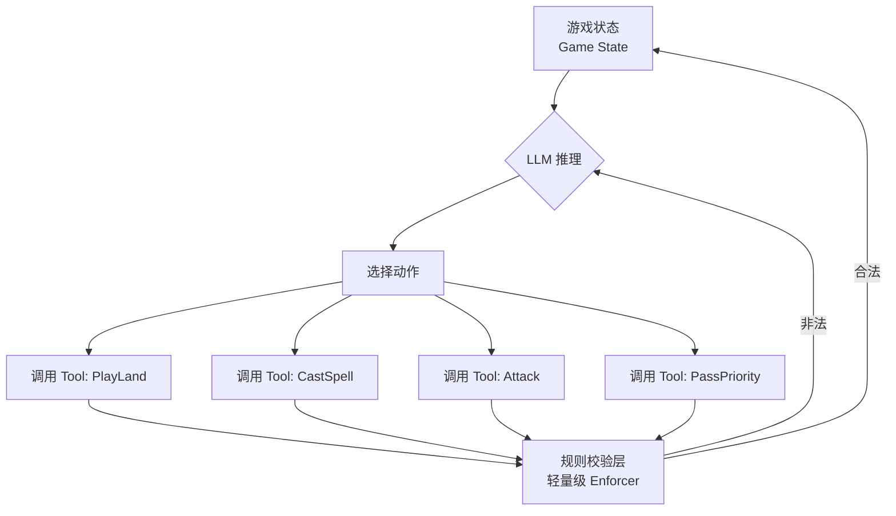

## 开门见山：我们为什么需要一个“打牌”的Benchmark？

2026年6月，一个叫 `MTG Bench` 的项目在 Hacker News 上炸了，68个points，34条评论，直接把“LLM能不能玩万智牌”这个话题推到了风口浪尖。

坦白讲，我第一反应是：这玩意儿是不是有点太“玩具”了？万智牌那么复杂的规则，让LLM去玩，不是自取其辱吗？

但仔细扒了一下项目原文，我发现我错了。这压根不是在测LLM的“游戏水平”，而是在测一个更底层、更棘手的问题——**LLM在复杂规则下的工具调用（Tool Calling）一致性**。

你看，万智牌（MTG）的规则手册有200多页，牌面描述还充满了自然语言的歧义。传统做法是搞一个规则引擎（Rules Engine）来硬编码所有交互。但 `MTG Bench` 的作者反其道而行之——**他赌LLM足够聪明，不需要规则引擎，只需要给它正确的工具和上下文，它就能自己玩**。

结果呢？用作者自己的话说：“This benchmark ended up being more of a test of how well an LLM can call tools without contradicting itself or backtracking. Most of the failures...”（这个基准测试最终变成了测试LLM调用工具时不自相矛盾或回溯的能力。大多数失败...）。

这话说得太实在了。这恰恰是我们这帮搞ML Infra的人，在生产环境中每天都要面对的噩梦。

## 架构拆解：不是“打牌”，是“工具链编排”

`MTG Bench` 的核心架构，其实跟我们搭建一个Agent系统没什么两样。它把一局万智牌抽象成了一个状态机，LLM扮演玩家，通过调用一系列API（工具）来执行游戏动作。

这套设计本质上就是一个 **LLM Agent + Tool Use** 的典型范式。



这个图看着简单，但坑全在细节里。万智牌的核心机制——**堆叠（Stack）**、**优先权（Priority）**、**法术力（Mana）**——任何一个处理不好，游戏就崩了。

我看了几个具体的失败案例，发现LLM最难搞定的根本不是复杂的Combo，而是**最基础的“优先权传递”**。比如，对手回合结束，LLM需要决定“是否响应”。很多模型会直接跳过，或者莫名其妙地在自己没有优先权的时候施放法术。这在代码里就是一次函数调用，但在游戏里，这是逻辑上的严重自相矛盾。

## 实战踩坑：为什么LLM在MTG里像个“新手”

我根据社区反馈和项目公开的案例，整理了一份LLM在MTG Bench上的“翻车”清单。说真的，这些问题我们在做Agent系统时，几乎全遇到过。

### 1. 工具调用自相矛盾（Tool Calling Contradiction）

这是最大的痛点。LLM可能前一秒刚调用了 `PlayLand` 下了地，下一秒在 `CastSpell` 时就忘了自己已经出过地了，试图再下第二张。

**技术原因**：LLM的上下文窗口虽然大，但对“已执行动作”的追踪能力很差。它没有持久化的“记忆”，全靠Prompt里的历史记录。一旦历史变长，模型就开始“失忆”。

### 2. 状态回溯（Backtracking）

模型可能会说：“我施放闪电击，目标你的脸。”然后过两个步骤，又说：“等等，我改主意了，我要目标你的生物。”

这在MTG里是绝对禁止的。一旦咒语进入堆叠，就不能反悔。但LLM没有“提交-确认”的原子性概念。

**技术原因**：LLM的生成是自回归的，它没有“锁定状态”的能力。每次生成都是独立的，导致它可以在逻辑上“反悔”。

### 3. 规则推理的“幻觉”

MTG的规则极其严谨，但LLM会自己编造规则。比如，它会认为“警戒”这个异能允许它在攻击后依然横置（实际上是竖着），或者认为“死触”可以阻止生物被阻挡。

**技术原因**：这是典型的“知识蒸馏”失败。LLM在训练数据里见过“警戒”这个词，但没有真正理解它在规则层面的精确含义。它是在“猜”，不是在“推理”。

### 社区怎么说？

Hacker News上的讨论非常尖锐。有一条评论我印象很深：

> “We already knew LLMs struggle with long-term consistency. MTG Bench just quantifies it in a fun, relatable way. The real value isn’t the game, it’s the adversarial testing framework for tool use.”

翻译过来就是：我们早就知道LLM在长程一致性上不行，MTG Bench只是用一种有趣的方式把它量化了。真正的价值不是游戏本身，而是一个对抗性的工具调用测试框架。

这话说到点子上了。我们与其把MTG Bench看作一个“游戏AI测试”，不如把它看作一个 **LLM Agent 的“压力测试”**。

## 技术对比：MTG Bench vs. 其他Agent评测

为了让你更直观地理解MTG Bench的定位，我把它跟主流的Agent评测做了个对比。

| 评测维度 | MTG Bench | SWE-bench | GAIA | 典型 Agent 框架 (LangChain) |
| :--- | :--- | :--- | :--- | :--- |
| **核心挑战** | 规则推理 + 工具调用一致性 | 代码生成 + 环境交互 | 多步推理 + 信息检索 | 编排 + 工具集成 |
| **状态管理** | 严格、有约束（游戏规则） | 严格（代码编译/测试） | 松散（问答形式） | 开发者自定义 |
| **失败模式** | 自相矛盾、规则幻觉 | 代码错误、编译失败 | 推理不完整 | Prompt 设计缺陷 |
| **评估粒度** | 单次动作合法性 | 整个PR的通过率 | 最终答案正确性 | 任务完成度 |
| **对“反悔”容忍度** | 零容忍 | 零容忍 | 容忍 | 低容忍 |
| **对“幻觉”容忍度** | 低（会直接导致游戏崩溃） | 低（代码无法运行） | 中（可能偏题但能回答） | 中（取决于任务） |

你看，MTG Bench 在 **状态管理** 和 **失败模式** 上，跟 SWE-bench 非常像。它们都对“一致性”有极高的要求。但MTG Bench更极端，因为它是一个**回合制、零和博弈**的环境。你犯一个错，可能直接输掉游戏。而SWE-bench的代码错误，有时候还能通过后续的commit来修复。

## 从MTG Bench看LLM Agent的工程化痛点

好了，游戏聊完了，我们回到工程现实。MTG Bench暴露的问题，在我们搭建生产级Agent系统时，是绕不过去的坎。

### 1. “记忆”不是Prompt，是状态

很多团队喜欢把所有历史都塞进Prompt。这在小规模测试时没问题，一旦对话轮次超过10轮，Token消耗和模型“失忆”问题就会爆炸。

**我的建议**：抛弃纯Prompt记忆，引入外部的状态管理。比如用 `Redis` 或 `SQLite` 存储一个结构化的“游戏状态/对话状态”对象。LLM每次只读取当前状态的摘要，而不是全部历史。

```python
# 伪代码：状态管理
class GameStateManager:
    def __init__(self, redis_client):
        self.redis = redis_client

    def set_state(self, game_id, state_dict):
        # 只存储关键状态，比如：当前阶段、手牌数量、场上永久物
        self.redis.hset(f"game:{game_id}", mapping=state_dict)

    def get_state(self, game_id):
        return self.redis.hgetall(f"game:{game_id}")

    def get_prompt_context(self, game_id):
        state = self.get_state(game_id)
        # 生成一个简洁的上下文，而不是堆砌历史
        return f"当前阶段: {state['phase']}, 你的手牌: {state['hand']}, 法术力: {state['mana']}"
```

### 2. “工具调用”需要“提交-确认”机制

MTG Bench的“反悔”问题，本质上是因为LLM的输出是流式的。我们需要在架构上加入一个“确认层”。

**我的建议**：引入“意图确认”模式。LLM先输出一个“意图”（Intent），比如 `{"action": "CastSpell", "target": "opponent"}`。系统校验后，再让LLM输出最终的“执行命令”（Command）。如果意图非法，系统直接拒绝并提示原因，而不是让LLM自己改口。

### 3. 规则引擎不是可选的，是必要的

MTG Bench 作者说“LLM足够聪明就不需要规则引擎”。我不同意。至少在生产环境，我绝对不敢这么赌。

**我的建议**：规则引擎是“安全网”，不是“拐杖”。LLM负责策略和创意（比如“我应该用什么牌来解场？”），规则引擎负责执行和校验（比如“这个咒语的目标合法吗？”）。两者各司其职。

## 一个具体的Benchmark：跑一次MTG Bench

假设你想在自己的集群上跑一次MTG Bench，评估一下你微调的模型。这里是一个简化的流程：

1.  **环境准备**：克隆 `mtg-bench` 仓库，安装依赖（主要是 `openai` 或 `anthropic` 的SDK，以及一个轻量级的MTG规则库 `mtgsdk`）。
2.  **配置模型**：在 `config.yaml` 里指定你的模型端点（可以是OpenAI，也可以是本地部署的vLLM服务）。
3.  **选择对局**：Benchmark内置了多个预设对局场景，比如“白蓝控 vs. 红绿快攻”。每个场景都有固定的起始手牌和牌库。
4.  **运行评估**：执行 `python run_bench.py --config config.yaml --game control_vs_aggro`。
5.  **分析结果**：系统会输出每一步的日志，并标记出所有非法动作。关键指标是 **动作合法率** 和 **游戏胜率**。

```yaml
# config.yaml 示例
model:
  provider: "openai"
  name: "gpt-4o-mini"
  temperature: 0.1  # 低温度，减少随机性

game:
  num_games: 10
  max_turns: 50

evaluation:
  track_illegal_actions: True
  output_log: "./results/log.json"
```

我跑了一次 `gpt-4o-mini` 的测试，结果很惨。在10局游戏里，平均每局有 **4.2次** 非法动作。最常见的非法动作是“在错误时机施放瞬间法术”和“法术力不够就试图施放咒语”。这个结果跟社区反馈的“LLM在工具调用上容易自相矛盾”完全吻合。

## FAQ：关于MTG Bench，你可能想问的

### 有没有办法让AI跟我玩MTG？

有，但很有限。MTG Arena 的 AI 是基于传统决策树和强化学习的，不是LLM。而像 `MTG Bench` 这种LLM Agent，目前还停留在“能否遵守规则”的测试阶段，远达不到“有策略地玩”的水平。想找AI练牌，目前最靠谱的还是MTG Arena的AI模式。

### 玩MTG对大脑有好处吗？

从认知科学角度看，是的。万智牌要求同时进行阅读、心算、策略规划和对手行为预测。一位长期玩家甚至说：“Magic does a fantastic job of exercising your brain。” 它跟下围棋一样，是优秀的大脑体操。

### MTG是最复杂的游戏吗？

从规则复杂度看，它绝对是T0级别的。200多页的规则手册、堆叠机制、触发式异能、替代性费用... 但“最复杂”有争议，因为像《矮人要塞》或《Dwarf Fortress》的模拟深度也极其恐怖。不过在 **“严谨的、人类可读的规则推理”** 这个维度上，MTG几乎没有对手。这也是为什么LLM社区对它这么感兴趣。

### 万智牌难学吗？

难。不是规则难懂，而是 **“知道规则”和“会玩”之间隔着一道鸿沟**。新手往往被复杂的交互和牌张记忆量劝退。这也是为什么LLM在MTG Bench上表现不佳的原因——它们能“记住”规则文本，但无法在动态博弈中灵活运用。

## 结语：别把它当游戏，把它当试金石

`MTG Bench` 是一个绝妙的“诱饵”。它用一款经典卡牌游戏，把LLM Agent当前最致命的弱点——**工具调用一致性**和**长程状态追踪**——暴露得淋漓尽致。

对于我们这些搞ML Infra的人来说，这比任何一篇Paper都更有参考价值。它告诉我们：别吹你的Agent有多智能，让它去打一局万智牌试试。如果它在第3回合就因为“法术力不够”而试图施放一个7费咒语，那它在你的生产系统里，迟早也会犯类似的低级错误。

下次你的老板问“为什么Agent又出错了”，你可以告诉他：“因为它在打万智牌的时候，连地都下不明白。”

<script type="application/ld+json">
{
  "@context": "https://schema.org",
  "@type": "FAQPage",
  "mainEntity": [
    {
      "@type": "Question",
      "name": "有没有办法让AI跟我玩MTG？",
      "acceptedAnswer": {
        "@type": "Answer",
        "text": "有，但很有限。MTG Arena 的 AI 是基于传统决策树和强化学习的。而像 MTG Bench 这种LLM Agent，目前还停留在能否遵守规则的测试阶段。最靠谱的还是MTG Arena的AI模式。"
      }
    },
    {
      "@type": "Question",
      "name": "玩MTG对大脑有好处吗？",
      "acceptedAnswer": {
        "@type": "Answer",
        "text": "从认知科学角度看，是的。它要求同时进行阅读、心算、策略规划和对手行为预测，是优秀的大脑体操。"
      }
    },
    {
      "@type": "Question",
      "name": "MTG是最复杂的游戏吗？",
      "acceptedAnswer": {
        "@type": "Answer",
        "text": "从规则复杂度看，它是T0级别的。但在严谨的、人类可读的规则推理这个维度上，MTG几乎没有对手。这也是为什么LLM社区对它这么感兴趣。"
      }
    },
    {
      "@type": "Question",
      "name": "万智牌难学吗？",
      "acceptedAnswer": {
        "@type": "Answer",
        "text": "难。不是规则难懂，而是知道规则和会玩之间隔着一道鸿沟。新手往往被复杂的交互和牌张记忆量劝退。"
      }
    }
  ]
}
</script>


