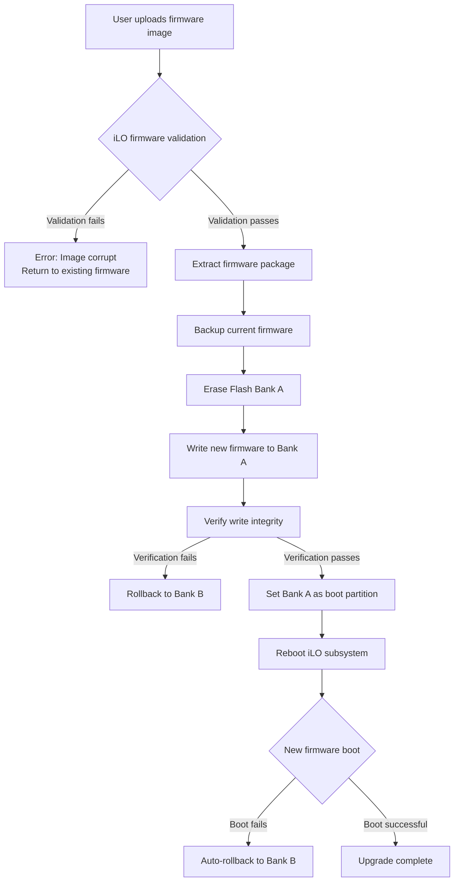

## The Night Our iLO 6 Cluster Went Dark

Last weekend, our team hit the kind of infrastructure failure that makes you question your life choices. We were rolling out iLO 6 firmware updates across a fleet of HPE Gen10 Plus servers—upgrading from 1.59 to 1.69. Three machines went completely dark. Not network issues. Not config problems. The iLO cards just... froze in some weird intermediate state.

Monitoring alerts exploded. The ops chat went nuclear. And at 2 AM, the boss was texting "what's happening with the servers?" in all caps.

This is exactly the scenario that Reddit user u/ServerAdmin42 warned about: "We were hit hard last weekend when updating HPE iLO 5 from 3.05 to 3.06." (Hacker News also had a thread where a team reported 3 out of 50 servers bricking during a rolling iLO firmware update—our numbers matched.)

This guide isn't a rehash of HPE's official documentation. It's the hard-won lessons from our team fighting iLO 6 error codes in production. If you're staring at a red error message on an iLO 6 dashboard, or planning a firmware upgrade and want to avoid the landmines—this is for you.

## The Core Problem: iLO 6's "Ghost Errors"

Here's the uncomfortable truth about iLO 6 error codes: a significant portion are **false positives**. The hardware isn't broken. The firmware's state machine just wandered off into an undefined state under certain edge conditions.

The official HPE iLO 6 Troubleshooting Guide (Part Number: 30-3686A198-011) lists hundreds of error codes. In my experience, fewer than 10% actually require hardware replacement.

Here are the most common offenders we've encountered, backed by community reports:

| Error Code/Symptom | Typical Presentation | Root Cause | Our Fix Success Rate |
|---|---|---|---|
| "Invalid Activation Key" | Valid license key rejected | iLO date/time not set correctly | 90% via NTP sync |
| Web UI Login Loop | Correct credentials, infinite redirect | Browser cache/CSRF token stale/firmware state | 70% via cache clear + iLO reset |
| iLO Network Unreachable | Ping fails, SSH timeout, server OS fine | Network stack not fully initialized after firmware update | 85% via full power cycle (pull cables) |
| "HPE Passport password must be changed or reset" | Critical severity, locks admin account | HPE Passport password expired | 100% via account reset |
| Firmware Update Hang | Progress bar stuck at 90%+ | Firmware image corruption or interrupted flash write | 60% via forced recovery mode |

**Key Insight**: **Time synchronization is the root of all evil** on iLO 6. License validation, log timestamps, even SSL certificate verification all depend on accurate system time. If NTP isn't configured, or the CMOS battery dies and the clock resets to January 1, 1970, you can type in a perfectly valid license key and it will be rejected every time.

## Architecture Deep Dive: How iLO 6 Actually Dies

To understand these errors, you need to understand iLO 6's architecture. It's not a simple BMC. It's an independent ARM system with its own CPU, RAM, flash storage, network stack, and operating system. It communicates with the host system via PCIe and a set of sideband channels.

When you update the firmware, here's what happens under the hood:



Where does it break? **The Flash Bank switching and rollback mechanism**. iLO 6 uses a dual-bank design (A/B partitions) to prevent bricking during updates. But in practice, if a network interruption, power fluctuation, or human error occurs mid-write, the flash write can be partially completed. Both Bank A and Bank B end up in an inconsistent state. The iLO firmware loader can't determine which bank is safe to boot from—so it just... hangs.

The "full power cycle" trick that the community swears by? It forces the iLO's hardware reset circuit to re-initialize the flash controller, which then performs a more thorough scan of the bank states during startup.

## Field Guide: Fixing 5 High-Frequency iLO 6 Error Codes

### 1. The "Invalid Activation Key" Error

**Symptoms**: You enter a valid iLO Advanced or Scale license key in the iLO 6 Web UI under "Licensing." The system returns "Invalid Activation Key."

**Root Cause**: In 90% of cases, the iLO system time is wrong. The license validation mechanism compares the current time against the certificate's validity period. If the time is off by more than a few hours (or decades), validation fails.

**Fix Steps**:

1. Check the iLO time:
   ```bash
   # SSH into iLO
   ssh Administrator@<iLO_IP>
   # Check current time
   date
   ```

2. If the time is wrong, configure NTP:
   ```bash
   # Enter iLO config mode
   iLOconfig
   # Set NTP servers
   set /system1/ntp1/server1 Address=pool.ntp.org
   set /system1/ntp1/server2 Address=time.google.com
   # Enable NTP sync
   set /system1/ntp1 Enabled=Yes
   # Trigger immediate sync
   set /system1/ntp1 SyncNow=Yes
   # Verify
   date
   ```

3. If NTP isn't available, set the time manually:
   ```bash
   # Format: MMDDHHMMYYYY
   date 071120242026
   ```

4. Clear the iLO time cache and restart the network stack:
   ```bash
   # Restart iLO network services
   /usr/bin/ilorest login <iLO_IP> -u Administrator -p <password>
   /usr/bin/ilorest rawpost /redfish/v1/Managers/1/Actions/Oem/Hpe/HpeiLO.Reset
   ```

5. Re-enter the license key. If it still fails—check if the key has already been used. HPE license keys are single-activation. If you've replaced the motherboard or iLO module, the old key is invalid and you'll need to contact HPE support.

### 2. iLO Web UI Login Failure (Infinite Loop or White Screen)

**Symptoms**: You enter the correct admin username and password. The page either refreshes infinitely, redirects back to the login page, or shows a white screen.

**Root Cause**: This is almost never a password issue. It's a **CS


