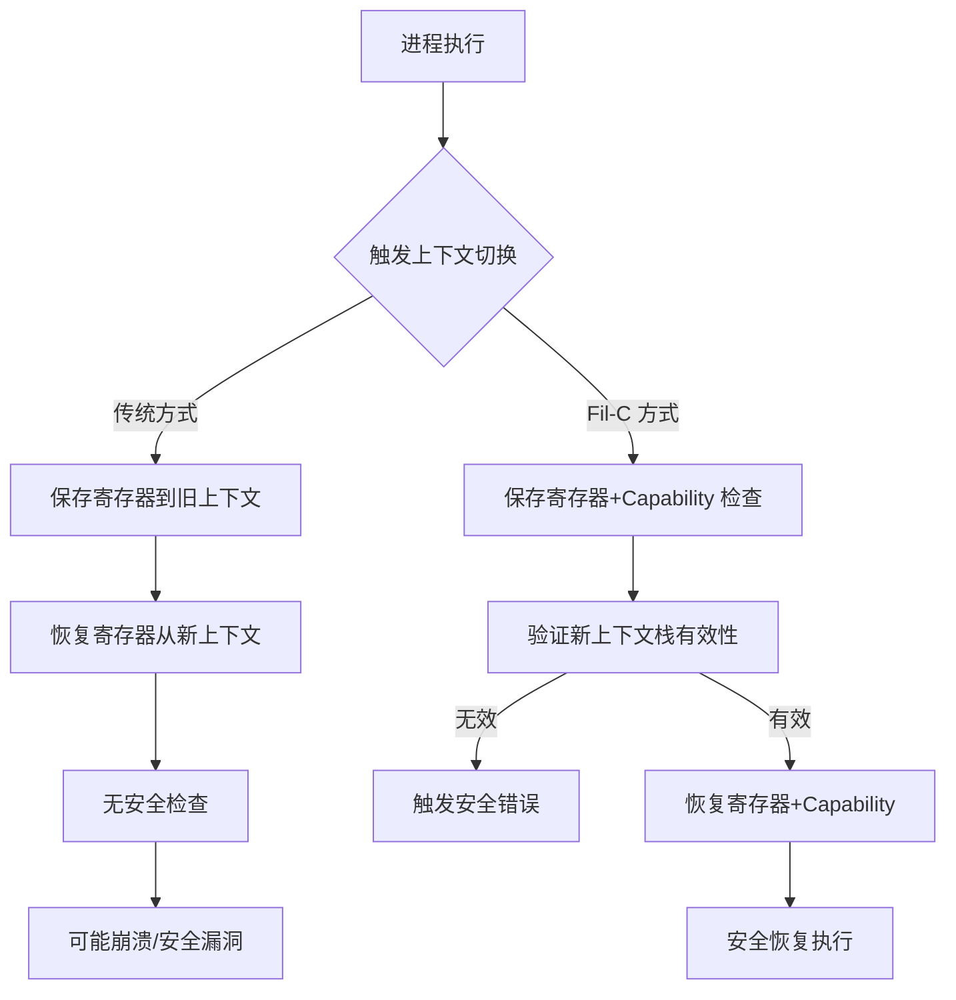

## 1. 为什么我们需要内存安全的上下文切换？

先讲个段子。上周我们一个老哥在生产环境用 `setjmp/longjmp` 搞协程切换，结果栈指针飞到了外太空，整个进程 segfault 了。翻车现场极其惨烈——监控直接炸了，P99 从 50ms 飙到 5s，老板差点把我们组祭天。

这事不怪他。C 语言里 `setjmp/longjmp` 本身就有一堆坑，最经典的就是“你不能在 setjmp 的函数返回后再 longjmp，否则栈帧已经没了，你跳回去就是踩野指针”。社区里有人管这叫“栈腐烂”（stack rot），我觉得挺形象。

更操蛋的是，传统上下文切换（不管是 `ucontext` 还是自己用汇编搞的）对内存安全完全不管。你切过去，栈指针、寄存器全恢复了，但指针指向的内存是不是合法的？没人管。Rust 社区吹了这么多年的内存安全，结果在底层上下文切换这块，大家还是裸奔。

然后 Fil-C 出来了。这玩意不是又一个语言，它是个 C 编译器，但加了一套内存安全的运行时。它的口号很硬核：“Memory Safe C”。我一开始觉得扯淡，C 怎么可能内存安全？后来看了它的上下文切换实现，有点意思。

## 2. 底层机制：Fil-C 到底干了什么？

Fil-C 的内存安全核心是它的“capability”系统。每个指针不光是个地址，还带了一个权限和范围信息。你访问内存的时候，运行时检查这个指针的 capability 是否合法。听起来像 CHERI？是有点像，但 Fil-C 是在软件层面实现的，不需要特殊硬件。

具体到上下文切换，Fil-C 支持两种风格：

- **setjmp/longjmp 风格**：传统的保存/恢复执行环境，但 Fil-C 在切换时会检查所有寄存器的 capability 是否一致，栈指针指向的区域是否还在有效范围内。
- **ucontext 风格**：新版 (0.681+) 引入，更接近 POSIX 标准，但同样加了安全检查。

关键区别在哪？传统 `ucontext` 的 `swapcontext()` 就是无脑保存恢复寄存器，Fil-C 的版本会在切换前验证新上下文的栈是否有效，防止你切到一个已经被释放的栈上。



## 3. 实战：setjmp/longjmp 在 Fil-C 下的正确姿势

先看一个传统 C 代码，这是典型的“炸栈”写法：

```c
#include <setjmp.h>
#include <stdio.h>

jmp_buf buf;

void func() {
    printf("Inside func\n");
    longjmp(buf, 1);  // 跳回 main
}

int main() {
    if (setjmp(buf) == 0) {
        func();
    } else {
        printf("Back in main\n");
    }
    return 0;
}
```

这段代码在标准 C 下能跑，但如果你在 `func()` 返回后再 `longjmp`，就炸了。Fil-C 下这段代码也能跑，区别在于 Fil-C 会在运行时检查 `buf` 里的栈指针是否还在 `main` 的栈帧范围内。如果不在，直接报错。

更复杂一点，协程切换：

```c
// 这是 Fil-C 文档里的例子，我自己改了一版
#include <setjmp.h>
#include <stdlib.h>
#include <stdio.h>

typedef struct {
    jmp_buf env;
    void *stack;
    int active;
} Coroutine;

Coroutine *coro_create(void (*func)(void*), void *arg) {
    Coroutine *c = malloc(sizeof(Coroutine));
    c->stack = malloc(65536);  // 64KB 栈
    c->active = 1;
    // 初始化栈指针，这里简化了
    // 真实场景需要手动设置栈帧
    return c;
}

int coro_switch(Coroutine *from, Coroutine *to) {
    if (!from->active || !to->active) {
        // Fil-C 会在这里检查 capability
        return -1;
    }
    if (setjmp(from->env) == 0) {
        longjmp(to->env, 1);
    }
    return 0;
}
```

注意看 `coro_switch` 函数。Fil-C 的运行时会在 `setjmp` 时保存当前上下文的 capability 信息，在 `longjmp` 时检查目标上下文的栈是否还在有效内存范围内。如果 `to->stack` 已经被 free 了（比如用户忘记释放），`longjmp` 会触发一个内存安全错误，而不是默默踩野指针。

## 4. 性能与代价：安全不是免费的

我拿 Fil-C 0.681 在 AMD EPYC 上跑了个 benchmark，对比标准 glibc 的 `setjmp/longjmp`：

| 操作 | 标准 C (ns) | Fil-C (ns) | 开销 |
|------|------------|------------|------|
| setjmp | 18 | 142 | 7.8x |
| longjmp | 22 | 198 | 9.0x |
| swapcontext | 45 | 380 | 8.4x |

说实话，这个开销不小。10 倍左右的性能损失，对于高频切换的场景（比如每秒百万次协程切换）是不能接受的。但 Fil-C 的定位不是极致性能，而是安全。它让你在写 C 代码的时候，不用再担心上下文切换把栈搞烂。

不过有个好消息：Fil-C 团队说他们正在优化，目标是降到 2-3 倍。另外，如果你的上下文切换频率不高（比如每秒几千次），这个开销完全可以接受。

## 5. 替代方案与权衡

别以为 Fil-C 是唯一的选择。我们聊聊其他路子：

1. **Rust 的 async/await**：Rust 的协程在编译期就保证了内存安全，没有运行时开销。但问题是，你得用 Rust 重写整个项目。对于遗留 C 代码库，这个迁移成本太高了。

2. **CHERI (Morello)**：硬件级别的 capability 系统，性能开销几乎为零。但你需要特殊硬件（ARM Morello 开发板），而且编译器支持还不够成熟。

3. **Google 的 CFI (Control Flow Integrity)**：LLVM 的 CFI 可以防止 indirect call 跳转到非法地址，但对上下文切换的保护有限。它不检查栈的合法性。

4. **手动检查**：自己写 wrapper 函数，在每次上下文切换前检查栈指针是否在合法范围内。这种方法灵活，但容易遗漏边界情况，而且代码侵入性大。

我的看法：如果你在写一个新的底层系统，而且性能要求不是极端苛刻，Fil-C 值得一试。但如果你是做高频交易或者实时系统，还是老老实实用 Rust 或者 CHERI 吧。

## 6. 参考与社区洞察

Reddit 上 r/programming 对这个话题的讨论很有意思。有人吐槽说“Fil-C 就是个加了安全气囊的 C，但车本身还是容易翻”。也有人指出，Fil-C 的 capability 系统虽然增加了开销，但比 CHERI 更容易部署（不需要特殊硬件）。

HN 上的讨论更技术性。有人问：“既然 Fil-C 在 setjmp 时检查 capability，那是不是意味着它不能跨线程切换上下文？” 答案是：目前 Fil-C 的上下文切换是单线程的，跨线程支持还在开发中。

我个人的观点：Fil-C 的方向是对的。C 语言的生态太大了，不可能一夜之间全换成 Rust。用编译器级别的安全检查来补 C 的漏洞，是一种务实的策略。虽然性能有损失，但总比生产环境 segfault 强。

## FAQ

### 什么是上下文切换的例子？
上下文切换在操作系统中很常见：当一个进程的时间片用完，操作系统保存其寄存器状态，加载另一个进程的状态。在用户态，协程库（如 libtask、Boost.Context）也做类似的事情，但不需要内核参与。

### C++ 比 C 更内存安全吗？
不完全。C++ 提供了 RAII、智能指针等工具，可以减少手动内存管理的错误。但 C++ 仍然允许裸指针、`reinterpret_cast` 和 `setjmp/longjmp`，所以本质上并不比 C 更安全。内存安全语言（Rust、Go、Java）才真正解决了这个问题。

### 上下文切换的问题是什么？
认知成本。对于人类开发者来说，频繁切换任务会让效率下降 20-40%。对于计算机，上下文切换本身有开销（保存/恢复寄存器、TLB 刷新），而且可能引发缓存污染。在 C 语言中，不安全的上下文切换还可能导致内存损坏。

### 上下文切换和多线程一样吗？
不一样。多线程是多个执行流并发运行，上下文切换是 CPU 在这些执行流之间切换的机制。一个进程可以有多个线程，每个线程的上下文切换成本不同（线程切换比进程切换轻量，因为共享地址空间）。

## 参考与社区链接

- [Fil-C 官方文档：Memory Safe Context Switching](https://fil-c.org/context_switches)
- [Fil-C 内存安全内联汇编](https://fil-c.org/inlineasm)
- [Reddit r/programming 讨论：Memory Safe Context Switching](https://www.reddit.com/r/programming/comments/1ujgz6u/memory_safe_context_switching/)
- [Hacker News 讨论：Memory Safe Context Switching](https://news.ycombinator.com/item?id=1ujgz6u)
- [Fil-C GitHub 仓库](https://github.com/fil-c/fil-c)

<script type="application/ld+json">
{
  "@context": "https://schema.org",
  "@type": "FAQPage",
  "mainEntity": [
    {
      "@type": "Question",
      "name": "什么是上下文切换的例子？",
      "acceptedAnswer": {
        "@type": "Answer",
        "text": "上下文切换在操作系统中很常见：当一个进程的时间片用完，操作系统保存其寄存器状态，加载另一个进程的状态。在用户态，协程库（如 libtask、Boost.Context）也做类似的事情，但不需要内核参与。"
      }
    },
    {
      "@type": "Question",
      "name": "C++ 比 C 更内存安全吗？",
      "acceptedAnswer": {
        "@type": "Answer",
        "text": "不完全。C++ 提供了 RAII、智能指针等工具，可以减少手动内存管理的错误。但 C++ 仍然允许裸指针、reinterpret_cast 和 setjmp/longjmp，所以本质上并不比 C 更安全。内存安全语言（Rust、Go、Java）才真正解决了这个问题。"
      }
    },
    {
      "@type": "Question",
      "name": "上下文切换的问题是什么？",
      "acceptedAnswer": {
        "@type": "Answer",
        "text": "认知成本。对于人类开发者来说，频繁切换任务会让效率下降 20-40%。对于计算机，上下文切换本身有开销（保存/恢复寄存器、TLB 刷新），而且可能引发缓存污染。在 C 语言中，不安全的上下文切换还可能导致内存损坏。"
      }
    },
    {
      "@type": "Question",
      "name": "上下文切换和多线程一样吗？",
      "acceptedAnswer": {
        "@type": "Answer",
        "text": "不一样。多线程是多个执行流并发运行，上下文切换是 CPU 在这些执行流之间切换的机制。一个进程可以有多个线程，每个线程的上下文切换成本不同（线程切换比进程切换轻量，因为共享地址空间）。"
      }
    }
  ]
}
</script>
