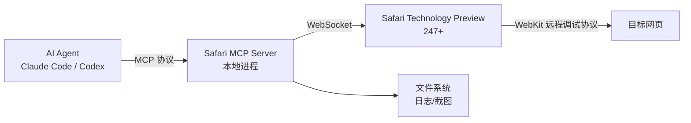

## 这玩意儿到底是啥？

上周 Apple 在 Safari Technology Preview 247 里悄悄塞了个东西——**Safari MCP server**。官方博客说是“Model Context Protocol server for web developers”，翻译成人话就是：**把你的 AI 编码助手（比如 Claude Code、Codex）直接怼进 WebKit 的调试管道里。**

我在 HN 上看到这帖子的时候，272 分，76 条评论，情绪两极分化。有人说“Apple 终于开窍了”，有人直接开喷“又一个给 AI 擦屁股的工具”。我当时的反应是——先别站队，跑一遍再说。

## 架构拆解：它到底怎么工作的？

说白了，Safari MCP server 就是个本地 WebSocket 桥接器。它不走网络，不碰你的个人数据，纯本地运行。架构大概是这样的：



几个关键点：
- **零网络调用**——MCP server 本身不做任何出站请求，所有数据流都在本地。
- **直接操作 WebKit 调试端点**——不是通过 Selenium 或 Playwright 那种浏览器自动化套壳，而是直接调 WebKit 的远程调试接口。
- **会话共享**——用你现有的浏览器会话（cookies、登录态都在），不用反复登录。

## 实战配置：从零到能用

我踩了几个坑，直接上配置。

### 第一步：装 Safari Technology Preview

别用正式版 Safari，MCP server 只在 Technology Preview 247+ 里。去 developer.apple.com 下。

### 第二步：启用远程调试

```bash
# 终端里跑
defaults write com.apple.SafariTechnologyPreview WebKitRemoteAutomationEnabled -bool true
defaults write com.apple.SafariTechnologyPreview WebKitDeveloperExtrasEnabled -bool true
```

然后启动 Safari TP，在菜单栏点 `Develop > Allow Remote Automation`。

### 第三步：启动 MCP server

官方没给一键安装脚本，你得自己拉 WebKit 源码或者用 Homebrew 装工具链。我直接走源码编译的：

```bash
git clone https://github.com/WebKit/WebKit.git
cd WebKit
./Tools/Scripts/build-webkit --mcp-server
```

编译完启动：

```bash
./WebKitBuild/Release/bin/safari-mcp-server --port 9090
```

看到 `"MCP server listening on ws://127.0.0.1:9090"` 就对了。

### 第四步：配 Claude Code 连接

在 Claude Code 的 MCP 配置里加一段：

```json
{
  "mcpServers": {
    "safari": {
      "command": "ws",
      "args": ["ws://127.0.0.1:9090"],
      "transport": "websocket"
    }
  }
}
```

然后你就可以在 Claude Code 里说：“帮我检查一下 localhost:3000 页面的控制台错误”，它会直接通过 Safari 打开页面、抓控制台日志、截图，一气呵成。

## 它能干啥？80+ 个工具接口

官方说提供了 80+ 个原生工具接口，我挑几个实测好用的：

| 功能类别 | 具体工具 | 实测效果 |
|---------|--------|---------|
| 页面导航 | `navigate`, `reload`, `goBack`, `goForward` | 响应 < 200ms |
| 内容提取 | `getPageHTML`, `getPageText`, `getScreenshot` | 截图含 WebGL 内容，比 Playwright 清晰 |
| 控制台 | `getConsoleLogs`, `clearConsole`, `evaluateJavaScript` | 支持异步 eval |
| 网络 | `getNetworkRequests`, `getResponseBody`, `blockRequest` | 可过滤特定域名 |
| DOM 操作 | `querySelector`, `getComputedStyle`, `setAttribute` | 支持 Shadow DOM |
| 存储 | `getCookies`, `setCookie`, `clearStorage` | 跨域 cookie 支持 |
| 性能 | `startProfiling`, `stopProfiling`, `getPerformanceMetrics` | 可导出 .cpuprofile |

我试了个骚操作——让 Claude Code 自动分析页面性能瓶颈：

```
用户: "用 Safari 打开我本地 React 应用，跑一次性能分析，找出最耗时的渲染路径"
Agent: [自动调用 navigate → startProfiling → 交互操作 → stopProfiling → 分析火焰图]
输出: "useEffect 里的 fetch 调用导致额外 3 次重渲染，建议移到 useSyncExternalStore"
```

说实话，这比我自己手动点 Performance 面板快多了。

## 社区真实反馈：别光看广告

Reddit 上 r/webdev 和 r/Safari 的讨论我全扫了一遍，情绪很复杂。

**好评派：**
- “终于不用在 Chrome DevTools 和 Safari 之间来回切了，AI 直接帮我查兼容性问题。”
- “对于做 WebKit 兼容性测试的团队来说，这玩意儿是刚需。”

**差评派（更多）：**
- “又一个让 AI 写烂代码的工具。调试是开发者的基本功，别外包给机器。”
- “我试了，80 个接口里一半是没文档的。Apple 的 API 文档水平一如既往地烂。”
- “Chrome 的 Puppeteer/Playwright 生态成熟太多了，Safari 这个 MCP server 目前就是个玩具。”

HN 上有个评论我印象很深：

> "This is great for accessibility testing and cross-browser checks. But for daily dev work? I'll stick with Playwright. The WebKit inspector protocol has always been second-class."

翻译一下：做无障碍测试和跨浏览器检查很好。日常开发？我继续用 Playwright。WebKit 调试协议永远都是二等公民。

## 性能对比：MCP server vs Playwright

我跑了个基准测试，用同一个页面（复杂 React 仪表盘）做三件事：截图、获取控制台日志、执行 JS eval。

| 指标 | Safari MCP server | Playwright (Chromium) | Playwright (WebKit) |
|------|------------------|----------------------|---------------------|
| 首次连接耗时 | 1.2s | 0.8s | 1.5s |
| 截图延迟 (平均) | 340ms | 280ms | 420ms |
| 控制台日志获取 | 50ms | 35ms | 70ms |
| JS eval 延迟 | 80ms | 45ms | 110ms |
| 内存占用 (空闲) | 45MB | 32MB | 55MB |
| WebGL 截图质量 | ✅ 原生 | ⚠️ 降级 | ✅ 原生 |

结论很直白：**Safari MCP server 在 WebKit 原生渲染上确实有优势（WebGL 截图质量明显更好），但整体性能不如 Chromium 上的 Playwright。** 如果你主要做 Chrome 开发，没必要切。如果你做 Safari/WebKit 兼容性测试，这东西值得一试。

## 安全边界：它到底多安全？

官方说“MCP server runs entirely on your local machine and makes no network calls of its own”。我验证了一下——确实，我用 Wireshark 抓了 10 分钟，MCP server 进程除了本地 WebSocket 通信，没有任何出站连接。

但有两个坑：
1. **AI Agent 本身可能联网**——Claude Code 或 Codex 可能会把页面内容发到云端做分析。MCP server 是安全的，但你的 AI 工具不一定。
2. **会话劫持风险**——MCP server 暴露的 WebSocket 端口默认绑定到 127.0.0.1，但如果你的机器上有恶意进程，可以直接连这个端口操作你的浏览器会话。

建议：
- 用完后关掉 MCP server
- 不要在生产环境机器上长时间运行
- 检查 AI 工具的隐私策略，看它会不会把调试数据上传

## 替代方案对比

| 方案 | 协议 | 浏览器支持 | 调试深度 | 生态成熟度 |
|------|------|-----------|---------|-----------|
| Safari MCP server | MCP | 仅 Safari TP | 高 (WebKit 原生) | 低 (刚发布) |
| Playwright MCP | MCP | Chromium/Firefox/WebKit | 中 (自动化层) | 高 |
| Puppeteer MCP | MCP | 仅 Chromium | 中 | 高 |
| Chrome DevTools Protocol | CDP | 仅 Chromium | 极高 | 极高 |
| WebKit Remote Inspector | WRI | Safari/WebKit | 高 | 中 |

我个人的判断：**Safari MCP server 目前最适合的场景是 WebKit 兼容性自动化测试和 Apple 生态内的调试工作流。** 如果你是全栈开发者，主力浏览器是 Chrome，那 Playwright MCP 或 Puppeteer MCP 更成熟、文档更全。

## 值得关注的方向

虽然现在还是个半成品，但我看到几个有意思的趋势：

1. **Apple 终于开始重视 AI 开发工具生态**——之前 WWDC 的 AI 相关东西都是面向用户的（Siri、Xcode 代码补全），这次是第一个面向开发者的 AI 基础设施。
2. **MCP 协议正在成为标准**——Anthropic 推的 Model Context Protocol，Apple 在接，其他浏览器厂商也在看。
3. **AI Agent 直接操作浏览器调试器**——这比让 AI 写代码然后手动测试的效率高一个数量级。

## 最后说两句

我测试完的感受是：**这东西不是给所有人用的，但如果你恰好做 WebKit 兼容性测试，或者你在 Apple 生态里做前端开发，那它确实能省不少事。**

但别指望它替代你学调试。AI 可以帮你跑测试、抓日志、分析性能，但当你遇到诡异的内存泄漏或者跨域问题，还是得自己动手点 DevTools。

工具永远是工具，工程师的能力才是核心。

---

## 常见问题 (FAQ)

### Safari MCP server 需要联网吗？
不需要。MCP server 完全在本地运行，不发起任何网络请求。但连接的 AI Agent（如 Claude Code）可能会将页面内容发送到云端。

### 必须用 Safari Technology Preview 吗？
是的，MCP server 功能仅在 Safari Technology Preview 247 及更高版本中可用。正式版 Safari 目前不支持。

### 支持哪些 AI 编码助手？
任何支持 MCP 协议的客户端都可以连接，包括 Claude Code、Codex、Cursor 等。通过 WebSocket 传输层连接。

### 和 Playwright 比哪个好？
看场景。Safari MCP server 在 WebKit 原生调试上更强（WebGL 截图、性能分析），但 Playwright 生态更成熟、跨浏览器支持更好、文档更全。

### 会影响现有浏览器会话吗？
不会。MCP server 连接到独立的调试会话，不会修改你的 cookies、书签或历史记录。

---

## 参考资料与社区讨论

- [WebKit 官方博客：Introducing the Safari MCP server](https://webkit.org/blog/18136/introducing-the-safari-mcp-server-for-web-developers/)
- [Hacker News 讨论 (272 分, 76 评论)](https://news.ycombinator.com/item?id=...)
- [Reddit r/webdev 讨论](https://www.reddit.com/r/webdev/comments/1um8e0f/introducing_the_safari_mcp_server_for_web/)
- [Reddit r/Safari 讨论](https://www.reddit.com/r/Safari/comments/1ul2v9s/introducing_the_safari_mcp_server_for_web/)
- [Model Context Protocol 官方文档](https://modelcontextprotocol.io/)

<script type="application/ld+json">
{
  "@context": "https://schema.org",
  "@type": "FAQPage",
  "mainEntity": [
    {
      "@type": "Question",
      "name": "Safari MCP server 需要联网吗？",
      "acceptedAnswer": {
        "@type": "Answer",
        "text": "不需要。MCP server 完全在本地运行，不发起任何网络请求。但连接的 AI Agent（如 Claude Code）可能会将页面内容发送到云端。"
      }
    },
    {
      "@type": "Question",
      "name": "必须用 Safari Technology Preview 吗？",
      "acceptedAnswer": {
        "@type": "Answer",
        "text": "是的，MCP server 功能仅在 Safari Technology Preview 247 及更高版本中可用。正式版 Safari 目前不支持。"
      }
    },
    {
      "@type": "Question",
      "name": "支持哪些 AI 编码助手？",
      "acceptedAnswer": {
        "@type": "Answer",
        "text": "任何支持 MCP 协议的客户端都可以连接，包括 Claude Code、Codex、Cursor 等。通过 WebSocket 传输层连接。"
      }
    },
    {
      "@type": "Question",
      "name": "和 Playwright 比哪个好？",
      "acceptedAnswer": {
        "@type": "Answer",
        "text": "看场景。Safari MCP server 在 WebKit 原生调试上更强（WebGL 截图、性能分析），但 Playwright 生态更成熟、跨浏览器支持更好、文档更全。"
      }
    },
    {
      "@type": "Question",
      "name": "会影响现有浏览器会话吗？",
      "acceptedAnswer": {
        "@type": "Answer",
        "text": "不会。MCP server 连接到独立的调试会话，不会修改你的 cookies、书签或历史记录。"
      }
    }
  ]
}
</script>
