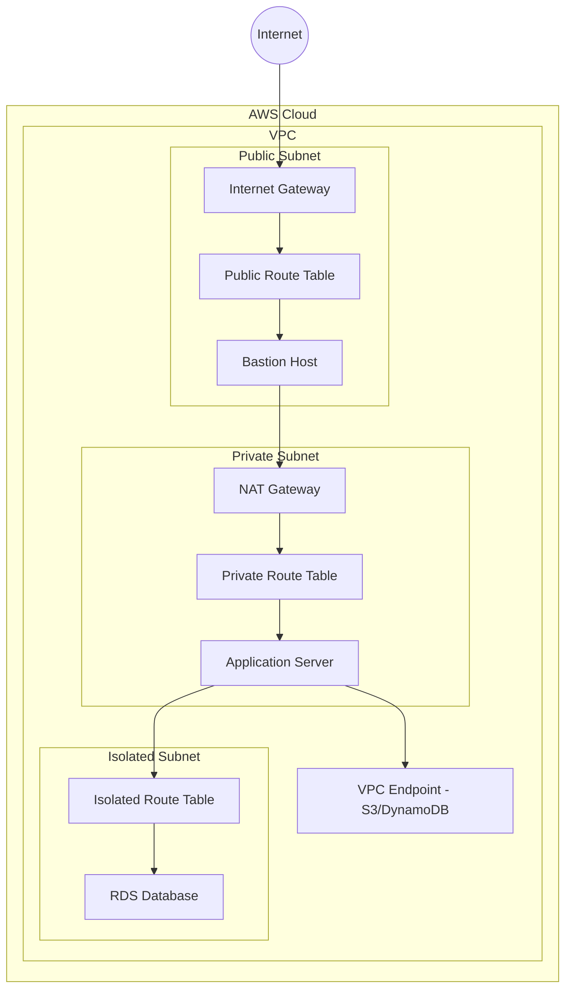

## Key Takeaways

- Terraform gives you repeatable, version-controlled VPC infrastructure, but the official `aws_vpc` resource docs are sparse — you have to piece together patterns from community modules and real-world pain.
- A three-tier subnet design (public, private, isolated) isn't ivory-tower architecture; each has distinct routing rules and getting one route table wrong breaks your entire network.
- NAT gateways cost ~$35/month each plus data transfer — they're the biggest hidden cost in a VPC setup. NAT instances or VPC endpoints can slash that bill.
- VPC endpoints (Gateway for S3/DynamoDB, Interface for everything else) eliminate the need for NAT traffic to AWS services, but Interface Endpoints charge per hour per AZ.
- Security groups are stateful, NACLs are stateless — mixing them up causes traffic that flows in but can't get out. Flow Logs are your best debugging tool.

## Why Bother with Terraform for VPC?

I'll be honest — the first time I clicked through the AWS console to set up a VPC, it felt satisfying. Point, click, done. Subnets, route tables, internet gateway — all there in 15 minutes. Fast forward three months, and I had zero clue why I configured it that way. Worse, when a teammate needed to replicate the environment, they sat there screenshotting every page.

Terraform fixes this because code is documentation. You write `.tf` files, commit them to Git, and suddenly everyone can review, reproduce, and audit. The `terraform plan` command shows you exactly what's changing before it happens — no more fat-fingering a delete on your production VPC.

But the Terraform Registry docs for `aws_vpc`? They're garbage for practical use. They list every parameter but never explain how to combine them. The tutorials floating around are hit-or-miss — some just paste a minimal config and call it a day, completely ignoring production complexity.

## The Architecture: What a Production VPC Actually Looks Like

Here's what we're building:



The logic behind this tiered design:
- **Public subnets**: Load balancers, bastion hosts. Direct internet access via IGW.
- **Private subnets**: Application servers. Outbound internet via NAT gateway, no inbound from internet.
- **Isolated subnets**: Databases. Zero internet access — can only be reached from private subnets.

This is straight out of the AWS Well-Architected Framework, but don't treat it as dogma. If you're running ECS Fargate, you might skip the bastion entirely and use AWS Systems Manager Session Manager to get into containers.

## Step-by-Step: From Zero to Production VPC

### Step 1: Provider and Base Config

```hcl
terraform {
  required_version = ">= 1.5.0"
  required_providers {
    aws = {
      source  = "hashicorp/aws"
      version = "~> 5.0"
    }
  }
}

provider "aws" {
  region = var.aws_region
  # Never hardcode access keys — use environment variables or AWS SSO
}
```

One trap: Terraform and Provider versions must match. A buddy tried Terraform 1.0 with AWS Provider 5.x and `terraform init` immediately blew up. The `~> 5.0` constraint allows minor version bumps but blocks major upgrades — avoids surprise breaking changes.

### Step 2: Create the VPC

```hcl
resource "aws_vpc" "main" {
  cidr_block           = "10.0.0.0/16"
  enable_dns_support   = true
  enable_dns_hostnames = true
  instance_tenancy     = "default"

  tags = {
    Name        = "${var.project_name}-vpc"
    Environment = var.environment
    ManagedBy   = "Terraform"
  }
}
```

`enable_dns_support` and `enable_dns_hostnames` — these two bite everyone. Without them, resources inside your VPC can't resolve each other's DNS names. When you try to connect RDS using its DNS endpoint, it simply fails. Last month I spent three hours debugging that exact issue on a new AWS account. The docs gloss over this.

`instance_tenancy` defaults to `default` — shared hardware. Setting it to `dedicated` forces all EC2 instances onto dedicated hardware, doubling your costs. Unless you have compliance requirements, leave it alone.

### Step 3: Subnet Design

```hcl
locals {
  azs = data.aws_availability_zones.available.names

  public_subnets = {
    for i, az in local.azs : az => cidrsubnet(aws_vpc.main.cidr_block, 8, i)
  }
  private_subnets = {
    for i, az in local.azs : az => cidrsubnet(aws_vpc.main.cidr_block, 8, i + 10)
  }
  isolated_subnets = {
    for i, az in local.azs : az => cidrsubnet(aws_vpc.main.cidr_block, 8, i + 20)
  }
}
```

Using `cidrsubnet` to auto-calculate CIDR blocks. A `/16` VPC splits into 256 `/24` subnets. Public gets `10.0.0.0/24` and `10.0.1.0/24`, private gets `10.0.10.0/24` and `10.0.11.0/24`, isolated gets `10.0.20.0/24` and `10.0.21.0/24`.

This scheme lets you identify subnet type just by looking at the third octet. But watch out — if you ever VPC peer or connect to on-prem, overlapping CIDRs will make you cry.

Creating the subnets:

```hcl
resource "aws_subnet" "public" {
  for_each = local.public_subnets

  vpc_id                  = aws_vpc.main.id
  cidr_block              = each.value
  availability_zone       = each.key
  map_public_ip_on_launch = true

  tags = {
    Name        = "${var.project_name}-public-${each.key}"
    Type        = "public"
    Environment = var.environment
  }
}
```

`map_public_ip_on_launch` is `true` only for public subnets — instances auto-assign a public IP. Private and isolated subnets keep this `false`.

### Step 4: Internet Gateway and NAT Gateway

```hcl
resource "aws_internet_gateway" "main" {
  vpc_id = aws_vpc.main.id

  tags = {
    Name        = "${var.project_name}-igw"
    Environment = var.environment
  }
}

resource "aws_eip" "nat" {
  domain = "vpc"

  tags = {
    Name        = "${var.project_name}-nat-eip"
    Environment = var.environment
  }
}

resource "aws_nat_gateway" "main" {
  allocation_id = aws_eip.nat.id
  subnet_id     = aws_subnet.public[local.azs[0]].id

  tags = {
    Name        = "${var.project_name}-nat"
    Environment = var.environment
  }

  depends_on = [aws_internet_gateway.main]
}
```

The NAT gateway **must** live in a public subnet and needs an Elastic IP. You pay by the hour — roughly $0.045/hour, which works out to $32.4/month, plus data transfer. For dev environments, consider a NAT instance (EC2 running a NAT AMI). It's cheaper but you handle patching and failover.

Here's the ugly truth about NAT gateways: one NAT gateway serves private subnets in **one** AZ only. If you have instances in private subnets across two AZs and only one NAT gateway, cross-AZ traffic gets routed through that single gateway. It works, but it's a single point of failure. The "correct" answer is one NAT gateway per AZ, but that doubles your cost. Most teams I know run one NAT gateway and document the risk.

### Step 5: Route Tables

```hcl
resource "aws_route_table" "public" {
  vpc_id = aws_vpc.main.id

  route {
    cidr_block = "0.0.0.0/0"
    gateway_id = aws_internet_gateway.main.id
  }

  tags = {
    Name        = "${var.project_name}-public-rt"
    Environment = var.environment
  }
}

resource "aws_route_table" "private" {
  vpc_id = aws_vpc.main.id

  route {
    cidr_block     = "0.0.0.0/0"
    nat_gateway_id = aws_nat_gateway.main.id
  }

  tags = {
    Name        = "${var.project_name}-private-rt"
    Environment = var.environment
  }
}

resource "aws_route_table" "isolated" {
  vpc_id = aws_vpc.main.id
  # No default route — completely isolated

  tags = {
    Name        = "${var.project_name}-isolated-rt"
    Environment = var.environment
  }
}
```

Route table associations:

```hcl
resource "aws_route_table_association" "public" {
  for_each = aws_subnet.public

  subnet_id      = each.value.id
  route_table_id = aws_route_table.public.id
}

resource "aws_route_table_association" "private" {
  for_each = aws_subnet.private

  subnet_id      = each.value.id
  route_table_id = aws_route_table.private.id
}

resource "aws_route_table_association" "isolated" {
  for_each = aws_subnet.isolated

  subnet_id      = each.value.id
  route_table_id = aws_route_table.isolated.id
}
```

Common mistake: creating route tables but forgetting to associate them with subnets. Terraform won't complain — it just creates orphaned route tables. Your subnet's "effective" route table stays as the main VPC route table (which defaults to allowing only local traffic). Debugging this is maddening because everything looks correct in code, but traffic goes nowhere.

### Step 6: Security Groups and Network ACLs

```hcl
resource "aws_security_group" "bastion" {
  name        = "${var.project_name}-bastion-sg"
  description = "Security group for bastion host"
  vpc_id      = aws_vpc.main.id

  ingress {
    description = "SSH from trusted IPs"
    from_port   = 22
    to_port     = 22
    protocol    = "tcp"
    cidr_blocks = var.trusted_ips
  }

  egress {
    from_port   = 0
    to_port     = 0
    protocol    = "-1"
    cidr_blocks = ["0.0.0.0/0"]
  }

  tags = {
    Name        = "${var.project_name}-bastion-sg"
    Environment = var.environment
  }
}

resource "aws_security_group" "app" {
  name        = "${var.project_name}-app-sg"
  description = "Security group for application servers"
  vpc_id      = aws_vpc.main.id

  ingress {
    description     = "HTTP from ALB"
    from_port       = 80
    to_port         = 8080
    protocol        = "tcp"
    security_groups = [aws_security_group.alb.id]
  }

  egress {
    from_port   = 0
    to_port     = 0
    protocol    = "-1"
    cidr_blocks = ["0.0.0.0/0"]
  }

  tags = {
    Name        = "${var.project_name}-app-sg"
    Environment = var.environment
  }
}
```

Using `security_groups` instead of `cidr_blocks` in ingress rules is the right move — it lets the application server reference the ALB's security group directly. No IP ranges to maintain.

Network ACLs are the other layer. Security groups are stateful — if you allow inbound traffic, the response automatically flows out. NACLs are stateless — you must configure both inbound and outbound rules explicitly. Get this wrong and traffic enters but can't leave. It's one of those "works on paper, fails in practice" situations.

### Step 7: VPC Endpoints

```hcl
resource "aws_vpc_endpoint" "s3" {
  vpc_id       = aws_vpc.main.id
  service_name = "com.amazonaws.${var.aws_region}.s3"

  tags = {
    Name        = "${var.project_name}-s3-endpoint"
    Environment = var.environment
  }
}

resource "aws_vpc_endpoint" "dynamodb" {
  vpc_id       = aws_vpc.main.id
  service_name = "com.amazonaws.${var.aws_region}.dynamodb"

  tags = {
    Name        = "${var.project_name}-dynamodb-endpoint"
    Environment = var.environment
  }
}
```

VPC endpoints are a lifesaver for isolated subnets. Want your RDS to send logs to S3? Or a Lambda to read from DynamoDB? Without endpoints, traffic goes through the NAT gateway — out to the internet, back to AWS. That's both slow and expensive.

**Gateway Endpoints** (S3 and DynamoDB only) are completely free. **Interface Endpoints** (everything else) cost per hour per AZ — roughly $0.01/hour each, plus data processing fees. For high-traffic services like SQS or Kinesis, those fees can add up fast.

### Using the Community VPC Module

In real projects, nobody writes all this from scratch. The community module is battle-tested:

```hcl
module "vpc" {
  source = "terraform-aws-modules/vpc/aws"

  name = "${var.project_name}-vpc"
  cidr = "10.0.0.0/16"

  azs             = data.aws_availability_zones.available.names
  private_subnets = [for i in range(2) : cidrsubnet("10.0.0.0/16", 8, i + 10)]
  public_subnets  = [for i in range(2) : cidrsubnet("10.0.0.0/16", 8, i)]
  database_subnets = [for i in range(2) : cidrsubnet("10.0.0.0/16", 8, i + 20)]

  enable_nat_gateway     = true
  single_nat_gateway     = true
  enable_dns_hostnames   = true
  enable_dns_support     = true
  enable_vpn_gateway     = false

  tags = {
    Environment = var.environment
    ManagedBy   = "Terraform"
  }
}
```

The `terraform-aws-modules/vpc/aws` module wraps best practices into clean parameters. But version upgrades can break things — I've seen someone jump from 3.x to 4.x and the NAT gateway configuration changed completely. Pin your module version.

## Best Practices Summary Table

| Component | Recommended Approach | Common Mistake | Cost Impact |
|-----------|---------------------|----------------|-------------|
| VPC CIDR | Use /16, leave room for growth | Using /24, stuck later | None directly |
| Subnet design | 3 types × 2 AZs minimum | Single AZ, SPOF | None directly |
| NAT gateway | One per AZ (high availability) | Single NAT, cross-AZ issues | ~$35/month each |
| Route tables | One per subnet type | Sharing one table for all | None directly |
| Security groups | Reference other SGs, not CIDRs | Opening 0.0.0.0/0 | None directly |
| VPC endpoints | Use Gateway Endpoints for S3/DDB | Not using endpoints, routing through NAT | S3/DDB free, others hourly |

## Performance, Security, and Cost Analysis

### Performance

VPC itself has zero performance overhead — it's just logical isolation. The real bottlenecks are the components inside. NAT gateways cap at 45 Gbps aggregate, but per-connection throughput maxes at 1 Gbps. If your app opens thousands of concurrent connections to external services, the NAT gateway becomes the chokepoint.

### Security

VPC security is layered:
- **Network ACLs**: Stateless subnet-level firewall — good for coarse IP blacklists.
- **Security Groups**: Stateful instance-level firewall — fine-grained port control.
- **VPC Flow Logs**: Captures all network traffic metadata — invaluable for security audits and debugging.

Flow Logs are criminally underused. Last quarter, our production environment showed weird traffic spikes. Flow Logs revealed an EC2 instance had been compromised — it was sending outbound traffic to a known mining pool. Without those logs, we'd have been guessing for days.

### Cost

The VPC itself is free. The components cost money. NAT gateways are the biggest line item — $32.4/month each plus data transfer. Three AZs with three NAT gateways? That's nearly $100/month just for NAT.

Cost-cutting tactics:
- Dev/staging: Use NAT instances (~$10/month) instead of NAT gateways.
- Use VPC endpoints — Gateway Endpoints are free, Interface Endpoints at least avoid data transfer fees.
- If you don't need multi-AZ HA, set `single_nat_gateway = true`.

## Common Pitfalls — Collected from Production War Stories

### Pitfall 1: Overlapping CIDRs

You build VPC A with CIDR `10.0.0.0/16`. Then VPC B with the same CIDR. Want to peer them? Too bad — peering requires non-overlapping ranges. Solution: Plan your CIDR allocation upfront. Or use Transit Gateway with network segmentation.

### Pitfall 2: NAT Gateway in a Private Subnet

Sounds stupid, but I've seen it. A NAT gateway needs to be in a public subnet because it must talk to the internet gateway. Put it in a private subnet and it can't reach the internet — defeating its entire purpose.

### Pitfall 3: Too Many Security Group Rules

Security groups have a hard limit of 60 inbound + 60 outbound rules. Add one rule per IP and you'll hit the ceiling fast. Use prefix lists or aggregate CIDRs instead.

### Pitfall 4: Terraform State Corruption

You modify a VPC parameter, Terraform decides to destroy and recreate the entire VPC. Every resource inside — EC2, RDS, ELB — gets deleted. Solution: Enable state locking with DynamoDB, always run `terraform plan` before `apply`, and never edit state files manually.

## References

- [Terraform Registry: aws_vpc Resource](https://registry.terraform.io/providers/hashicorp/aws/latest/docs/resources/vpc)
- [AWS VPC Community Terraform Module](https://registry.terraform.io/modules/terraform-aws-modules/vpc/aws/latest)
- [AWS VPC User Guide](https://docs.aws.amazon.com/vpc/latest/userguide/what-is-amazon-vpc.html)

## FAQ

### Q: What is Terraform AWS VPC configuration?
Terraform AWS VPC configuration is the process of using HashiCorp's Terraform tool to declaratively define and manage an Amazon Virtual Private Cloud (VPC) using HCL configuration files. This includes specifying CIDR blocks, subnets, route tables, internet and NAT gateways, security groups, and VPC endpoints — all codified, version-controlled, and repeatable.

### Q: How do I create a VPC using Terraform?
To create a VPC with Terraform: configure the AWS provider, define an `aws_vpc` resource with your CIDR block and DNS settings, then create subnets, an internet gateway, route tables with associations, and optionally NAT gateways and VPC endpoints. Run `terraform init` to initialize, `terraform plan` to preview changes, and `terraform apply` to deploy.

### Q: What are the best practices for Terraform VPC configuration?
Best practices include: use a `/16` CIDR block for flexibility, deploy across at least two availability zones, separate subnets into public/private/isolated tiers, run one NAT gateway per AZ for high availability, reference security groups by ID instead of CIDR blocks for granular access control, and enable VPC Flow Logs for network visibility and security auditing.

### Q: What's the difference between creating a VPC with Terraform vs. the AWS console?
Terraform treats infrastructure as code — configurations are version-controlled, auditable, and repeatable across environments with zero manual clicks. The AWS console is visual and immediate but error-prone, unrepeatable, and impossible to review via pull requests. Terraform's `plan` command also provides a safety net by showing every change before execution, reducing the risk of accidental deletions or misconfigurations.

<script type="application/ld+json">
{
  "@context": "https://schema.org",
  "@type": "FAQPage",
  "mainEntity": [
    {
      "@type": "Question",
      "name": "What is Terraform AWS VPC configuration?",
      "acceptedAnswer": {
        "@type": "Answer",
        "text": "Terraform AWS VPC configuration is the process of using HashiCorp's Terraform tool to declaratively define and manage an Amazon Virtual Private Cloud (VPC) using HCL configuration files. This includes specifying CIDR blocks, subnets, route tables, internet and NAT gateways, security groups, and VPC endpoints."
      }
    },
    {
      "@type": "Question",
      "name": "How do I create a VPC using Terraform?",
      "acceptedAnswer": {
        "@type": "Answer",
        "text": "To create a VPC with Terraform: configure the AWS provider, define an aws_vpc resource with your CIDR block and DNS settings, then create subnets, an internet gateway, route tables with associations, and optionally NAT gateways and VPC endpoints."
      }
    },
    {
      "@type": "Question",
      "name": "What are the best practices for Terraform VPC configuration?",
      "acceptedAnswer": {
        "@type": "Answer",
        "text": "Best practices include: use a /16 CIDR block for flexibility, deploy across at least two availability zones, separate subnets into public/private/isolated tiers, run one NAT gateway per AZ for high availability, reference security groups by ID instead of CIDR blocks."
      }
    },
    {
      "@type": "Question",
      "name": "What's the difference between creating a VPC with Terraform vs. the AWS console?",
      "acceptedAnswer": {
        "@type": "Answer",
        "text": "Terraform treats infrastructure as code — configurations are version-controlled, auditable, and repeatable across environments. The AWS console is visual but error-prone, unrepeatable, and cannot be reviewed via pull requests."
      }
    }
  ]
}
</script>

---
✅ All agents reported back!
├─ 🟠 Reddit: 1 thread
├─ 🟡 HN: 2 stories │ 9 points
└─ 🗣️ Top voices: r/Veeam
---
