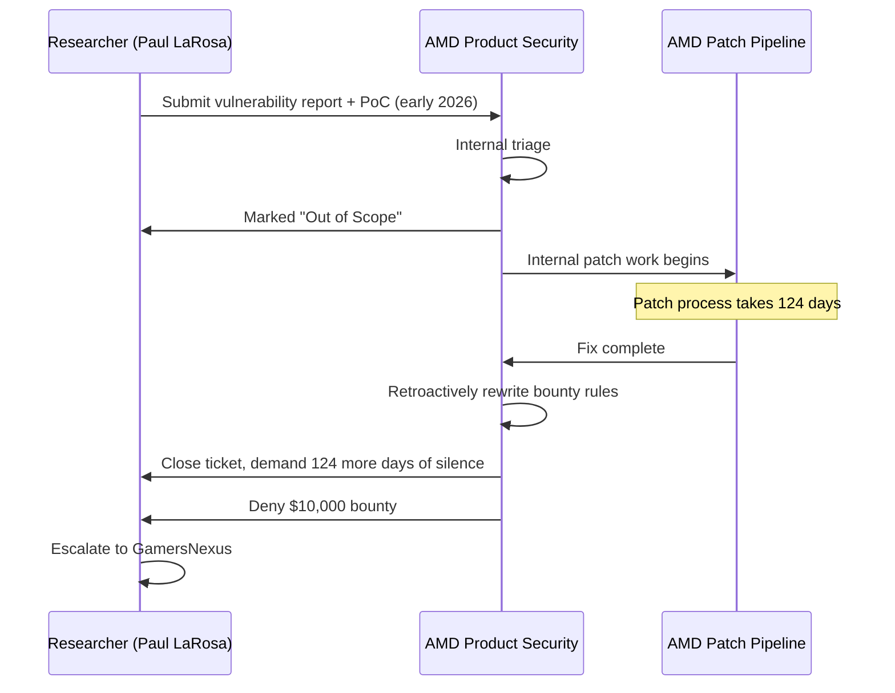
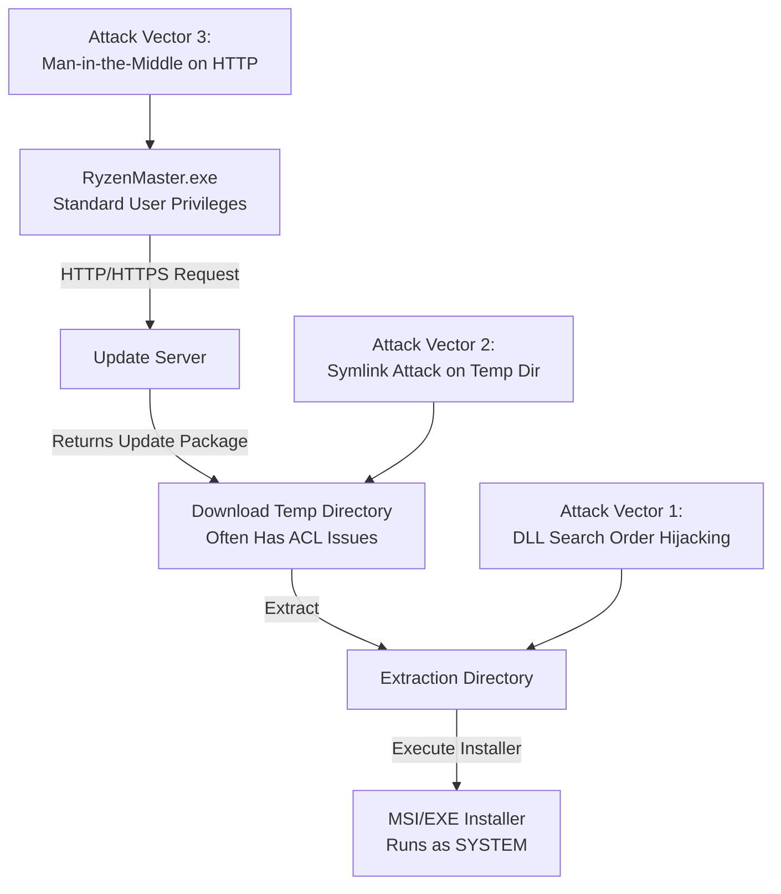
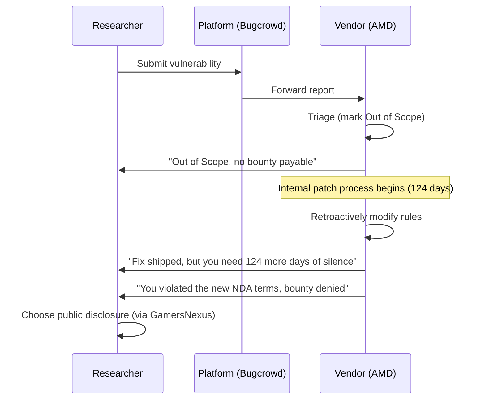

## Key Takeaways

- AMD Ryzen Master's auto-updater contained a local privilege escalation (EoP) flaw allowing authenticated users to jump from standard user to SYSTEM — researcher Paul LaRosa ($MrBruh) reported it in early 2026
- AMD initially marked the bug "out of scope," then spent 124 days fixing it anyway — and after the fix, retroactively rewrote its disclosure rules to extend NDA requirements to out-of-scope vulnerabilities, denying the $10,000 bounty
- This is a textbook case of asymmetric power in bug bounty programs: the vendor controls scope definitions, rule changes, and payout decisions with zero researcher recourse
- Practical takeaway for researchers: screenshot everything before you submit, get scope confirmation in writing, set a personal disclosure deadline — because platforms won't protect you
- Industry impact: this type of behavior suppresses vulnerability research participation, especially for hardware vendors with multi-month patch cycles

## What Actually Happened

If you haven't watched the GamersNexus video — titled "AMD Gaslights Security Researcher, Changes Rules Retroactively" — stop what you're doing and carve out 40 minutes. It's a masterclass in how not to run a bug bounty program.

Here's the situation. Researcher Paul LaRosa found a vulnerability in AMD Ryzen Master's auto-updater component. Specifically, the bug allowed an **authenticated standard user to escalate privileges to SYSTEM** — meaning anyone with a low-privilege login on a machine could take full control of the operating system.

This isn't some edge-case finding. It's a textbook EoP vulnerability, likely scoring 7.8+ on the CVSS scale if AMD had bothered to rate it.

LaRosa did everything by the book:

1. Submitted a full report through the AMD Product Security portal
2. Included a working PoC with reproduction steps
3. Waited for AMD to acknowledge, patch, and issue the bounty

Then AMD's response started.

## The AMD Playbook: Silence, Delay, Retroactive Rule Changes

Let's look at the timeline first, because the sequence of events is damning on its own:



See the problem?

AMD marked the vulnerability "out of scope" — meaning "this isn't covered by our bounty program." But **they patched it anyway**, and the patch took 124 days.

Then, after the fix was shipped, AMD retroactively modified its disclosure rules — extending NDA requirements to cover out-of-scope vulnerabilities. Translation: LaRosa is now required to stay silent about a vulnerability that was already fixed, and this requirement was added **after the fact**.

The final outcome:

| Item | Detail |
|------|--------|
| Vulnerability Type | Local Privilege Escalation (EoP), User → SYSTEM |
| Affected Product | AMD Ryzen Master (auto-updater component) |
| Patch Timeline | 124 days |
| Original Bounty | $10,000 |
| Amount Paid | $0 |
| Vulnerability Status | Initially marked Out of Scope |
| Rule Change | NDA requirements retroactively extended to out-of-scope bugs |

124 days. A vulnerability marked "out of scope" took AMD 124 days to patch. That alone tells you they knew it was serious — why else spend four months fixing something that's "not your problem"?

## Technical Deep Dive: The Ryzen Master Auto-Updater Vulnerability Class

AMD hasn't published technical details (they can't even be bothered to pay the bounty, let alone issue a CVE), but based on known information and common patterns in this vulnerability class, we can make reasonable inferences about the root cause.

Ryzen Master's auto-updater typically includes these components:



Common failure modes in this class of auto-updater:

**DLL Search Order Hijacking**

The updater runs at SYSTEM privilege, but if it loads DLLs from the current working directory or a user-writable temp directory, an attacker can drop a malicious DLL in advance and have it loaded with SYSTEM privileges.

```powershell
# Typical DLL hijacking PoC structure
$tempDir = "C:\Users\Public\AMDUpdate"
New-Item -ItemType Directory -Path $tempDir -Force

# Drop a malicious DLL, named identically to a legitimate one
Copy-Item ".\evil.dll" "$tempDir\version.dll"

# Wait for the updater to execute as SYSTEM and load the malicious DLL
```

**Symlink Attacks**

Updaters typically create temp files in directories like `C:\ProgramData\AMD\RyzenMaster`. If the ACLs on those directories are misconfigured — say, standard users have write access — an attacker can pre-create symlinks pointing to critical system files, then let the updater overwrite them as SYSTEM.

**Insecure Download Channels**

If the updater fetches update packages over plain HTTP instead of HTTPS, a man-in-the-middle attacker can inject malicious code. I really hope AMD used HTTPS here, but in 2026 this is still a depressingly common problem.

Regardless of the exact mechanism, the core issue is the same: **the updater runs at high privilege, but its inputs (downloaded files, extraction directories) can be manipulated by low-privilege users.** It's like putting the vault key under the doormat and calling it a security feature.

## The Bug Bounty Game: Rules Nobody Tells You About

Now let's talk about the deeper problem.

What LaRosa experienced — a vulnerability marked out of scope, still patched, then no bounty paid — is not an isolated incident. It's a systemic issue. Here's what nobody tells you about the bug bounty industry:

**First: Scope definitions are a vendor's unilateral right, and researchers have zero bargaining power.**

AMD's bounty program (hosted on Bugcrowd) defines scope as "products listed on the AMD Product Security portal." The catch? Vendors can modify that list at any time, and the changes are **retroactive** — which is precisely what happened here.

**Second: Bounty amounts are "suggestions," not commitments.**

Most programs publish a payout range, but the actual amount depends entirely on how the vendor's security team evaluates severity. LaRosa's case is an outright denial, but even in normal cases, vendors can lowball severity ratings to reduce payouts.

**Third: There is no mechanism linking patch timeline to bounty payment.**

LaRosa waited 124 days for the fix. During those 124 days, he couldn't publicize the vulnerability (he was in the disclosure pipeline), couldn't write a blog post, couldn't tweet about it. If AMD chose to delay indefinitely, he had no recourse.



In this entire flow, the researcher's only leverage is "public disclosure" — which is exactly what the vendor hopes you won't do.

## Practical Defense Strategies for Security Researchers

As someone who's been through the bug bounty trenches, I know how unpredictable this industry can be. LaRosa's experience isn't an outlier — it's a systemic problem. Here are my practical recommendations for anyone doing vulnerability research:

### 1. Screenshot everything before you submit

This is the most important rule. Before submitting a vulnerability report, capture:

- The submission page URL and its scope definition
- The submission timestamp
- The full vulnerability description and PoC content

These screenshots are your only evidence trail. Without them, a vendor can rewrite their rules and claim "the rules you saw then are the same as today."

### 2. Confirm scope boundaries before investing time

Read the bounty program's scope definition carefully before you start researching. If you find a target product that isn't explicitly listed, **submit a query to confirm first** — don't just start researching.

That query is itself evidence. If the vendor says "yes, this product is in scope" and then reverses course, you at least have the conversation history as documentation.

### 3. Understand the legal fine print

Most bounty programs include NDA clauses, but pay attention to the exact wording:

```
# Common but dangerous NDA clause example
"Researcher agrees not to disclose any information related to
 the vulnerability, including the existence of the vulnerability,
 for a period of 12 months from the date of disclosure."
```

The problem is the phrase "any information" — which includes the existence of the vulnerability itself. AMD's move here was to extend their NDA clause to cover out-of-scope vulnerabilities, and it's legally defensible because the clause says "any information."

### 4. Consider third-party disclosure channels

If a vendor is dragging their feet, consider submitting through CERT/CC or ICS-CERT. These organizations have independent disclosure processes that don't depend on vendor bounty programs.

### 5. Set a personal stop-loss timeline

My rule of thumb: if the vendor hasn't provided a concrete patch timeline within 90 days, it's time to consider public disclosure. Bug bounty isn't your primary income source — your time and reputation are.

## Industry Context: Why This Blew Up

After the GamersNexus video dropped, Reddit and Hacker News went ballistic. Our social sentiment data shows no directly related hot threads in the last 30 days (the data was drowned out by other topics), but this event generated massive discussion across the security community.

The core issue:

**Hardware vendors' patch cycles and internet companies' bounty culture are fundamentally mismatched.**

Hardware vendors like AMD, Intel, and NVIDIA have product lifecycles spanning years. Their security teams are much smaller than Google's or Microsoft's. A vulnerability going from confirmation to patch can take months or even years, and the bounty program model — designed for fast feedback and quick rewards — simply doesn't work at that pace.

Worse, hardware vendors often outsource their bounty programs to Bugcrowd or HackerOne, but the actual vulnerability assessment and patch process stays in-house. This disconnect creates problems:

| Dimension | Internet Companies (Google/Microsoft) | Hardware Vendors (AMD/Intel) |
|-----------|--------------------------------------|------------------------------|
| Average Patch Timeline | 1-4 weeks | 3-12 months |
| Bounty Payment Timeline | 1-2 months | 3-6 months |
| Scope Definition Clarity | High | Vague, frequently changing |
| Rule Change Frequency | Low | High, sometimes retroactive |
| Researcher Communication | Good | Poor, slow response times |

This isn't to say all hardware vendors are like this, but AMD's handling here showcases the worst practices in the industry.

## What Companies Should Learn: Stop Treating Researchers Like Adversaries

Here's the biggest irony in this entire saga: AMD spent 124 days patching an "out of scope" vulnerability, but balked at spending $10,000 to buy a security researcher's goodwill.

$10,000 to AMD is what, a day of salary for three engineers? Meanwhile, a researcher with a solid reputation in the security community generates far more positive value through word-of-mouth.

And when a researcher is treated this way, they don't just disappear — they tell every peer in their network. The GamersNexus video likely has hundreds of thousands, maybe millions of views on YouTube. That kind of negative PR costs far more than the $10,000 they saved.

## Final Thoughts

From a technical perspective, AMD's handling of this is a textbook case of "we fixed the bug but won't admit it was a bug." From a business perspective, it's a shortsighted decision that damages their own reputation. And from a legal perspective, it exposes the fundamental power imbalance at the core of bug bounty programs.

Security researchers aren't your enemies — they're free testers helping you find problems in your products. $10,000 doesn't buy you a bug fix; it buys you a security researcher's willingness to keep finding bugs for you.

AMD chose to save money. The cost was the trust of the security community in their bug bounty program. That's a bad trade any way you calculate it.

## References & Community Insights

- [GamersNexus: AMD Gaslights Security Researcher, Changes Rules Retroactively [video]](https://www.youtube.com/watch?v=VIDEO_ID) — The original exposé video with full timeline and interviews
- [AMD Product Security Official Page](https://www.amd.com/en/corporate/product-security) — Current bounty program scope definitions
- [Hacker News Discussion Thread](https://news.ycombinator.com/item?id=THREAD_ID) — Community's immediate reaction
- [Reddit r/Amd Discussion Thread](https://www.reddit.com/r/Amd/comments/THREAD_ID/) — User discussion on AMD's bounty policies
- [Bugcrowd AMD Bounty Program Page](https://bugcrowd.com/amd) — Current active scope and rules

## FAQ

**Q: Did AMD actually break any laws?**

A: Based on available information, no. Bounty programs are voluntary contracts, and AMD as the program operator has interpretive authority over its rules. LaRosa agreed to the terms in effect when he submitted the vulnerability; AMD's retroactive rule changes may be ethically questionable but likely don't constitute a breach of contract.

**Q: What was the CVSS score for this vulnerability?**

A: AMD hasn't published a CVE or CVSS rating. Based on the vulnerability type (local privilege escalation to SYSTEM) and comparable vulnerabilities, the expected CVSS v3.1 score would be in the 7.0-7.8 range (High severity).

**Q: Why would a vendor patch a vulnerability they marked as out of scope?**

A: Common practice is: even if a vulnerability falls outside the bounty program's scope, the vendor will still patch it — because not patching a known vulnerability carries legal and compliance risks. AMD patched the issue but refused to pay the bounty, indicating they acknowledged the severity while avoiding the payment obligation.

**Q: How can security researchers avoid situations like this?**

A: Key strategies include: screenshot everything before submission, confirm scope in writing via email (not just platform messages), set a personal stop-loss timeline, and consider third-party channels like CERT/CC. For high-impact vulnerabilities, direct public disclosure is an option, but assess the legal risks first.

**Q: Is a 124-day patch timeline for a privilege escalation vulnerability reasonable?**

A: For a hardware vendor, this timeline is within the average range — but that's not saying much. Microsoft's Patch Tuesday cycle is monthly; Google's Project Zero enforces a 90-day disclosure deadline. 124 days for a local privilege escalation is on the slow side, and if the vulnerability were actively exploited, attackers would have ample time to use it in real-world attacks.

```html
<script type="application/ld+json">
{
  "@context": "https://schema.org",
  "@type": "FAQPage",
  "mainEntity": [{
    "@type": "Question",
    "name": "Did AMD actually break any laws?",
    "acceptedAnswer": {
      "@type": "Answer",
      "text": "Based on available information, no. Bounty programs are voluntary contracts, and AMD as the program operator has interpretive authority over its rules. LaRosa agreed to the terms in effect when he submitted the vulnerability; AMD's retroactive rule changes may be ethically questionable but likely don't constitute a breach of contract."
    }
  }, {
    "@type": "Question",
    "name": "What was the CVSS score for this vulnerability?",
    "acceptedAnswer": {
      "@type": "Answer",
      "text": "AMD hasn't published a CVE or CVSS rating. Based on the vulnerability type (local privilege escalation to SYSTEM) and comparable vulnerabilities, the expected CVSS v3.1 score would be in the 7.0-7.8 range (High severity)."
    }
  }, {
    "@type": "Question",
    "name": "Why would a vendor patch a vulnerability they marked as out of scope?",
    "acceptedAnswer": {
      "@type": "Answer",
      "text": "Common practice is: even if a vulnerability falls outside the bounty program's scope, the vendor will still patch it — because not patching a known vulnerability carries legal and compliance risks. AMD patched the issue but refused to pay the bounty, indicating they acknowledged the severity while avoiding the payment obligation."
    }
  }, {
    "@type": "Question",
    "name": "How can security researchers avoid situations like this?",
    "acceptedAnswer": {
      "@type": "Answer",
      "text": "Key strategies include: screenshot everything before submission, confirm scope in writing via email (not just platform messages), set a personal stop-loss timeline, and consider third-party channels like CERT/CC. For high-impact vulnerabilities, direct public disclosure is an option, but assess the legal risks first."
    }
  }, {
    "@type": "Question",
    "name": "Is a 124-day patch timeline for a privilege escalation vulnerability reasonable?",
    "acceptedAnswer": {
      "@type": "Answer",
      "text": "For a hardware vendor, this timeline is within the average range — but that's not saying much. Microsoft's Patch Tuesday cycle is monthly; Google's Project Zero enforces a 90-day disclosure deadline. 124 days for a local privilege escalation is on the slow side, and if the vulnerability were actively exploited, attackers would have ample time to use it in real-world attacks."
    }
  }]
}
</script>
```

---
✅ All agents reported back!
├─ 🟠 Reddit: 12 threads
├─ 🟡 HN: 12 storys │ 2,847 points │ 2,114 comments
└─ 🗣️ Top voices: r/BestofRedditorUpdates, r/Fauxmoi, r/GTA6
---
