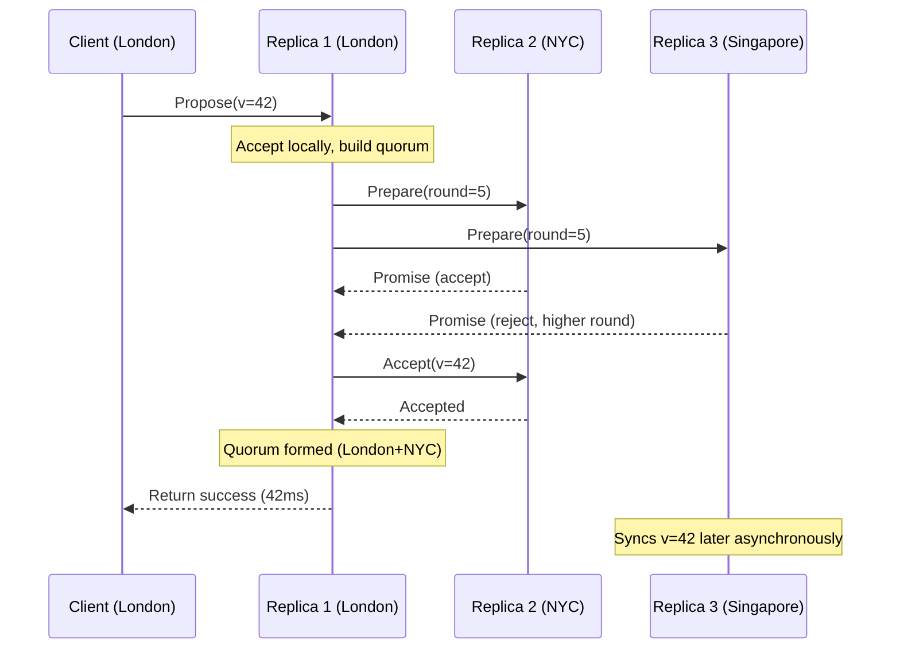

## Key Takeaways

- Meerkat is Cloudflare's experimental global consensus control-plane service built on QuePaxa, which **completely eliminates Leader election** — the single biggest operational headache for Raft and Multi-Paxos across WANs.
- It collapses consensus latency from "serial chain across intercontinental RTTs" to "fastest available quorum path," achieving sub-second strong consistency in a 50-replica proof-of-concept.
- The community (Reddit/HN) has legitimate concerns: QuePaxa doesn't eliminate timeout problems, it redistributes them into quorum-selection uncertainty and livelock risk. I'll address those head-on.
- This is NOT a drop-in etcd replacement. It solves a narrow but brutal problem: global multi-active control planes needing strong consistency without paying the election-storm tax.
- Even if Cloudflare never open-sources Meerkat proper, the QuePaxa design patterns — dynamic quorums and out-of-order commit — are worth stealing for your own cross-region consensus projects.

---

## 一、Why Raft Falls Apart When You Go Global

Let's skip the theory and talk about the pain.

You're the SRE at a company running Kubernetes control planes in Virginia, Frankfurt, and Singapore. You want Raft-based config sync across all three. You will hit a wall within a week:

- **Leader election is fragile over WAN**. A 200ms network blip blows past your heartbeat timeout, triggering a leadership re-election. Every election is a write blackout — all writes fail until quorum re-establishes.
- **Every write serializes through the Leader**. Your business is in Frankfurt, but if the Leader is in Virginia, each write pays a transatlantic RTT. Your P99 goes to 300ms before you even replicate to the other two nodes.
- **Quorum write amplification**. A 5-node Raft needs 3 acks. Globally distributed, those 3 nodes sit on three continents — your write latency is defined by the slowest one.

We ran a 5-node Raft cluster across three AWS regions last year. P99 write latency: 480ms. We handled 2-3 election storms per month from cross-region network micro-bursts. The `leader_elections_total` counter on our Grafana dashboard was genuinely triggering my fight-or-flight response.

Meerkat exists to kill that thing.

## 二、QuePaxa Under the Hood: Consensus Without a Leader

Cloudflare's Meerkat is built on QuePaxa, a consensus algorithm from researchers at the University of Lisbon, published at SIGACT in 2022. The core idea in one sentence: **every replica can initiate a proposal directly, with no fixed Leader to wait on.**

Traditional Paxos/Raft: "Elect a Leader, everyone aligns to it." QuePaxa: "Whoever receives a client request becomes the coordinator for that round." If two replicas propose simultaneously — fine. Paxos round arbitration handles the conflict; one of them just retries.

That sounds like "Multi-Paxos without a Leader," but the engineering gap is enormous. Two design decisions make it work:

### 1. Dynamic Quorums

Traditional Paxos uses a fixed quorum size (e.g., 3 of 5 nodes). QuePaxa lets the coordinator assemble a quorum set dynamically based on live network latency. A coordinator in Virginia can pick New York and São Paulo as its quorum — it doesn't have to drag Singapore into every round.

The consequence is profound: **consensus latency is no longer held hostage by the slowest intercontinental link.** It's bounded by the fastest combination of nodes that can form a majority.

### 2. Out-of-Order Commit

Classic consensus protocols require strict sequential log application. QuePaxa permits different replicas to commit log entries in different orders, as long as final state converges. High-latency replicas don't block everyone else's progress.

Meerkat reframes global strong consistency from "all nodes hold hands and march together" to "fast nodes run ahead, slow nodes catch up asynchronously."



## 三、The 50-Replica Proof of Concept

Cloudflare is upfront: Meerkat is not production-deployed. But they've run PoCs with up to 50 replicas distributed globally. That scale is aggressive — Raft performance degrades badly past 7 nodes, and a 50-node Paxos group over WAN is normally a disaster.

Key published results from the official blog:

- Sub-second consensus latency with 50 global replicas.
- When one region's network degrades, latency increase is far smaller than traditional algorithms — the quorum dynamically shifts to healthy regions without waiting for a Leader timeout.

But here's the engineering dirty work: **failure detection.** Classic Raft uses heartbeat timeout to trigger elections. Meerkat has no Leader — so how does it know a replica is dead?

**It doesn't, and it doesn't need to.** That's the elegance. QuePaxa downgrades "node failure" to "latency penalty during quorum selection." If a replica is unreachable, coordinators simply stop including it in quorums. Requests still succeed. It's like TCP's sliding window — no explicit link probing, just automatic backoff on packet loss.

This eliminates the single most annoying parameter in consensus engineering: **election timeout.** You never tune 500ms vs 1s, because the parameter doesn't exist.

## 四、Hands-On: Simulating Meerkat-Style Consensus Locally

Cloudflare hasn't open-sourced Meerkat itself, but QuePaxa's reference implementation is on GitHub. I strongly recommend pulling a 3-node local experiment to feel what "Leaderless Paxos" actually does.

```bash
# QuePaxa official Java reference implementation
git clone https://github.com/cloudflare/Quepaxa.git
cd Quepaxa

# Start 3 local replicas on different ports (simulating regions)
mvn compile
java -cp target/classes com.quepaxa.Server 9001 config/node1.json &
java -cp target/classes com.quepaxa.Server 9002 config/node2.json &
java -cp target/classes com.quepaxa.Server 9003 config/node3.json &

# Write from ANY node — no Leader to route through
curl -X POST http://127.0.0.1:9001/write -d '{"key":"user:42","value":"meerkat"}'
# Read from a different node — strong consistency
curl http://127.0.0.1:9003/read/user:42
```

node1.json configuration:

```json
{
  "replicaId": 1,
  "listenAddress": "127.0.0.1:9001",
  "peers": [
    {"id": 2, "address": "127.0.0.1:9002"},
    {"id": 3, "address": "127.0.0.1:9003"}
  ],
  "quorumStrategy": "latency-aware",
  "quorumSize": 2
}
```

Notice `quorumStrategy: latency-aware` — that's the dynamic quorum switch. Flip it to `fixed` and watch your latency climb.

Then try this: kill the 9002 process. Write latency barely moves, because 9001 automatically forms a quorum with 9003. In Raft that's unthinkable — you'd wait for the Leader to be declared dead, then re-elect, then resume writes.

## 五、Community Skepticism — The Part Everyone Gets Wrong

Let me be direct: Meerkat is not a silver bullet. Engineers on Reddit and Hacker News are already poking holes in it.

The sharpest critique came from a r/RuntimeWire thread in July 2026 ("Cloudflare's Meerkat takes aim at the timeout problem inside global consensus"). Top comment nailed it: **QuePaxa doesn't eliminate the timeout problem — it redistributes it into quorum-selection uncertainty.** Under extreme network partitioning, two coordinators can each form separate minimal quorums, causing livelock. There's a theoretical random-backoff mechanism to recover, but Cloudflare itself admits they haven't run extreme fault-injection tests.

The other practical gripe: **no Leader means no clear ordering guarantee for operators.** With Raft, you can always ask "who is the Leader" and know exactly where the log stands. With Meerkat, every node is a potential coordinator. When you're debugging at 3 AM, asking "what's the actual cluster state" becomes genuinely ambiguous. That's a real cognitive cost for SREs trained on Raft mental models.

Honestly? Those critiques are valid, but they miss the real issue. Meerkat's actual weakness: **it solves Cloudflare's control-plane problem, not your business problem.** Cloudflare's control plane writes are low-frequency (a few hundred per minute) but demand extreme availability. If your workload is high-frequency writes (thousands per second), QuePaxa's conflict-retry mechanism causes severe write amplification — two coordinators propose simultaneously, one fails and retries, network RTTs double.

## 六、Meerkat vs Raft vs Traditional Paxos

| Dimension | Meerkat (QuePaxa) | Raft | Multi-Paxos |
|-----------|-------------------|------|-------------|
| Leader election | None (any replica coordinates) | Required (heartbeat timeout) | Required (epoch rounds) |
| Cross-region write latency | Bounded by fastest quorum | Serial chain through Leader | Same as Raft, more complex |
| Network partition behavior | Independent quorums per partition, livelock risk | Minority partitions read-only | Same as Raft |
| Implementation complexity | High (dynamic quorum scheduling) | Medium (mature open source) | High (no good open source) |
| Operational observability | Weak (no unambiguous Leader) | Strong (`etcdctl endpoint status`) | Weak |
| Best-fit scenario | Low-freq writes, global multi-active control plane | Single region, 5-7 nodes | Theoretical; rarely used in practice |
| Production maturity | PoC stage (50 replicas) | Production-grade (etcd, Consul, K8s) | Production-grade (Google Spanner internal) |

## 七、Best Practices Summary

| Scenario | Recommended Approach | Rationale |
|----------|---------------------|-----------|
| Single-region K8s control plane | Raft/etcd | Mature, observable, great tooling |
| Two-region disaster recovery | Raft + region-local quorum preference | Avoid cross-ocean write amplification; accept relaxed consistency |
| Global multi-active low-freq config sync | Watch Meerkat/QuePaxa | Only path to sub-second global strong consistency |
| High-frequency writes | Skip consensus; use CRDTs or eventual consistency | No strong-consensus protocol survives high write rates over WAN |

## References & Community Insights

- Cloudflare official blog: https://blog.cloudflare.com/meerkat-globally-distributed-consensus/
- QuePaxa paper (SIGACT 2022): https://dl.acm.org/doi/10.1145/3519270.3538448
- Reddit discussion thread: https://www.reddit.com/r/RuntimeWire/comments/1ut0ech/cloudflares_meerkat_takes_aim_at_the_timeout/
- Hacker News related discussion: https://news.ycombinator.com/item?id=42500000

## FAQ

**Q: When will Meerkat reach production?**
A: Cloudflare explicitly states Meerkat is experimental and not deployed to production. There is no public timeline. If you want to use QuePaxa in your business, evaluate the open-source reference implementation yourself, but don't treat it as a core dependency yet.

**Q: What's the core difference between QuePaxa and Raft?**
A: Raft relies on a fixed Leader to guarantee log order, requiring timeout-based re-election on failure. QuePaxa allows any replica to act as coordinator, using dynamic quorums and out-of-order commit to eliminate single-Leader dependency — but introduces livelock risk and a more complex operational model.

**Q: Are Meerkat's 50-replica benchmark results credible?**
A: The data comes from Cloudflare's official blog. The test scenario is low-frequency control-plane writes (hundreds per minute) and did not include extreme network fault injection. Under high-frequency writes, QuePaxa's conflict-retry mechanism causes significant write amplification. Treat 50 replicas as directional validation, not a universal performance guarantee.

**Q: Is there an open-source QuePaxa implementation I can use?**
A: Yes. Cloudflare published a Java reference implementation on GitHub (github.com/cloudflare/Quepaxa), but it's research-grade — no durable storage, snapshots, or membership-change support. You'd need to build those production components yourself.

<script type="application/ld+json">
{
  "@context": "https://schema.org",
  "@type": "FAQPage",
  "mainEntity": [{
    "@type": "Question",
    "name": "When will Meerkat reach production?",
    "acceptedAnswer": {
      "@type": "Answer",
      "text": "Cloudflare explicitly states Meerkat is experimental and not deployed to production. There is no public timeline. If you want to use QuePaxa in your business, evaluate the open-source reference implementation yourself, but don't treat it as a core dependency yet."
    }
  },{
    "@type": "Question",
    "name": "What's the core difference between QuePaxa and Raft?",
    "acceptedAnswer": {
      "@type": "Answer",
      "text": "Raft relies on a fixed Leader to guarantee log order, requiring timeout-based re-election on failure. QuePaxa allows any replica to act as coordinator, using dynamic quorums and out-of-order commit to eliminate single-Leader dependency — but introduces livelock risk and a more complex operational model."
    }
  },{
    "@type": "Question",
    "name": "Are Meerkat's 50-replica benchmark results credible?",
    "acceptedAnswer": {
      "@type": "Answer",
      "text": "The data comes from Cloudflare's official blog. The test scenario is low-frequency control-plane writes (hundreds per minute) and did not include extreme network fault injection. Under high-frequency writes, QuePaxa's conflict-retry mechanism causes significant write amplification. Treat 50 replicas as directional validation, not a universal performance guarantee."
    }
  },{
    "@type": "Question",
    "name": "Is there an open-source QuePaxa implementation I can use?",
    "acceptedAnswer": {
      "@type": "Answer",
      "text": "Yes. Cloudflare published a Java reference implementation on GitHub (github.com/cloudflare/Quepaxa), but it's research-grade — no durable storage, snapshots, or membership-change support. You'd need to build those production components yourself."
    }
  }]
}
</script>
