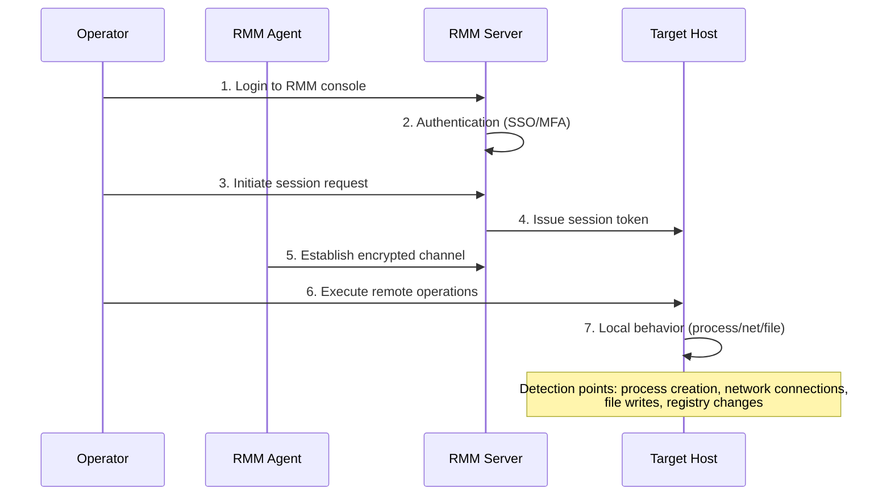

## Key Takeaways

- **Tool names are meaningless** — attackers use the same ScreenConnect, AnyDesk, and TeamViewer instances as your IT team. The real differentiators are deployment patterns and session behavior, not the binary itself.
- **Ticket correlation is your cheapest high-signal filter** — every RMM session must map to an open change or incident ticket. No ticket at session start is a cheap, high-signal flag.
- **Behavioral baselines beat signature detection** — instead of trying to identify malicious tools, build a baseline of what legitimate ops look like and alert on deviation. It's harder for attackers to adapt to.
- **Network-side fingerprints are criminally underused** — TLS fingerprints, connection frequency, and target host distribution are far harder to spoof than process names.
- **MTTR beats detection precision** — a 70% accurate alert with automated isolation is worth more than a 99% accurate alert that lands in a queue nobody checks.

## The Core Problem: Why RMM Session Detection Is So Damn Hard

Let's acknowledge the elephant in the room: RMM tools exist to give you remote access to machines. ScreenConnect, TeamViewer, AnyDesk, GoToAssist—their entire purpose is to let someone control a computer from afar. Attackers don't need to steal these tools, don't need to exploit zero-days—they just download the free tier and go.

This creates a fundamental detection dilemma. **The thing you're trying to detect is byte-for-byte identical to what you legitimately use every day.**

Last year we handled an incident where the attacker used our own company's ScreenConnect instance. Not an intrusion—a help desk account phished. Our EDR, firewall, proxy logs all stayed quiet because the traffic looked like normal remote support. Know how we caught it? A session at 3 AM running PowerShell on a domain controller.

So let me be blunt: **any vendor claiming to defend against "malicious RMM tools" is selling you snake oil.** The tool is neutral. The behavior is what carries intent.

## Architectural Deep Dive: RMM Session Lifecycle and Detection Touchpoints

Let's map out the full lifecycle of an RMM session so we can identify every detection opportunity:



Every step is a detection opportunity, but most teams only look at step 7—and by then it's often too late.

### Detection Touchpoint Breakdown

**Steps 1-3 (Authentication & Authorization)**: The most undervalued detection layer. Legitimate operators have predictable work hours, consistent login source IPs, and a defined target host range. Attacker sessions tend to be odd hours, from anomalous IPs, spanning too many hosts. We run rule-based detection here—it's dirt cheap and catches at least 30% of phishing attacks before anything else happens.

**Steps 4-5 (Session Establishment)**: The RMM server's session logs are a goldmine. Legitimate sessions have ticket references, scheduled time windows, and verified operator identities. Attackers have no ticket, don't schedule ahead, and are often using stolen credentials.

**Steps 6-7 (Remote Operations)**: This is where behavioral detection lives. But if you're only starting to look here, you've already lost the element of surprise.

## The Three-Layer Detection Framework We Actually Deployed

We landed on three layers, from cheap to expensive, from fast to slow:

### Layer 1: Ticket Correlation & Time Baselines (Cheapest, deploy today)

The rule is brutally simple: **an RMM session must have an open ticket before it starts.** No ticket, high severity flag.

```python
# Pseudocode: ticket correlation check
def check_rmm_session(session, ticket_system):
    # Get all currently open tickets
    open_tickets = ticket_system.get_open_tickets()
    
    # Check if session has a matching ticket ID
    has_ticket = session.ticket_id in open_tickets
    
    # Verify ticket priority and time window alignment
    ticket = open_tickets.get(session.ticket_id)
    if not has_ticket:
        return Severity.HIGH  # No ticket, highly suspicious
    if not ticket.is_within_window(session.start_time):
        return Severity.MEDIUM  # Ticket exists but wrong time
    if ticket.operator != session.user:
        return Severity.MEDIUM  # Ticket assignee doesn't match session initiator
    return Severity.LOW
```

The critical piece is integrating your RMM server's session logs with your ITSM system. ServiceNow, Jira Service Management, even a simple database table will do. **The enforcement of the correlation is what matters.**

### Layer 2: Behavioral Baselines (Needs ~2 weeks of data)

Pure static rules have a fatal flaw—attackers adapt. They'll wait until business hours, steal a legitimate ticket number. So we need dynamic behavioral baselines.

We run Elastic Stack with custom detection rules, building a behavioral profile per operator account:

```yaml
# Elasticsearch Watcher configuration example
{
  "trigger": {
    "schedule": { "interval": "5m" }
  },
  "input": {
    "search": {
      "request": {
        "indices": ["rmm-session-logs-*"],
        "body": {
          "query": {
            "bool": {
              "filter": [
                {"term": {"user": "{{ctx.payload.user}}"}},
                {"range": {"@timestamp": {"gte": "now-30d"}}}
              ]
            }
          },
          "aggs": {
            "sessions_per_day": {
              "date_histogram": {
                "field": "@timestamp",
                "calendar_interval": "day"
              }
            },
            "targets": {
              "terms": {"field": "target_host", "size": 50}
            },
            "avg_duration": {
              "avg": {"field": "session_duration"}
            }
          }
        }
      }
    }
  },
  "condition": {
    "script": {
      "source": """
        def sessions_today = ctx.payload.aggregations.sessions_per_day.buckets;
        def avg_duration = ctx.payload.aggregations.avg_duration.value;
        
        // Alert if today's session count exceeds 3x historical average
        if (sessions_today.size() > 3 * avg_sessions_per_day) {
          return true;
        }
        // Alert if session duration exceeds 5x historical average
        if (session.duration > 5 * avg_duration) {
          return true;
        }
        return false;
      """
    }
  },
  "actions": {
    "slack": {
      "webhook": {
        "url": "https://hooks.slack.com/services/YOUR_WEBHOOK"
      }
    }
  }
}
```

### Layer 3: Network Fingerprints & Process Behavior (Needs agents)

This is the hardcore layer. TLS fingerprints, connection patterns, process behavior characteristics of RMM tools—these are the hardest for attackers to spoof.

```bash
# Zeek network detection script
# Detecting anomalous RMM connection patterns

event zeek_init() {
    # Track RMM connection targets per source IP
    local rmm_connections: table[addr] of set[addr];
}

event connection_established(c: connection) {
    if (c$id$resp_p == 443 && is_rmm_domain(c$id$resp_h)) {
        local src = c$id$orig_h;
        local dst = c$id$resp_h;
        
        if (src !in rmm_connections) {
            rmm_connections[src] = set();
        }
        add rmm_connections[src][dst];
        
        # Alert if one source connects to 5+ different RMM servers in 5 minutes
        if (|rmm_connections[src]| > 5) {
            NOTICE("RMM Connection Anomaly", $src=src, 
                   $msg=fmt("Source %s connected to %d RMM servers in 5 minutes", 
                            src, |rmm_connections[src]|));
        }
    }
}
```

### Detection Rule Comparison

| Detection Dimension | Legitimate Pattern | Malicious Pattern | Detection Difficulty | False Positive Rate |
|--------------------|-------------------|-------------------|---------------------|---------------------|
| Ticket Correlation | Has matching open ticket | No ticket or closed ticket reused | Low | Low |
| Session Timing | Within work hours | High-frequency sessions at 2-4 AM | Low | Medium |
| Target Hosts | Assigned machines only | Wide host span (10+) in short window | Medium | Low |
| Session Duration | Matches task complexity | Anomalously short (<2 min) or long (>8 hrs) | Medium | Medium |
| Process Behavior | RMM process only | PowerShell, CMD spawned during session | High | Medium |
| Network Connections | RMM server only | Multiple outbound HTTP/HTTPS (exfiltration) | High | Low |
| Account Behavior | Login source matches history | Geolocation anomaly or sudden VPN use | Medium | Medium |
| File Operations | Minimal or config-only | Reading user docs, database backups | High | Low |

## Performance, Cost, and Operational Reality

I need to be honest about something—**most security teams over-engineer RMM detection.**

Our first deployment had 12 detection rules generating 200+ alerts daily. The SOC couldn't keep up. We cut it down to 4 core rules, alert volume dropped to ~15/day, and ironically, we caught more real attacks.

Why? **Alert fatigue is the real enemy.** One high-false-positive rule will drown out the alerts that actually matter.

**Our final 4 core rules:**

1. **Orphan session** — RMM session with no matching open ticket within 5 minutes before start, high-priority alert
2. **Off-hours high frequency** — Same account initiating more than 2 sessions outside business hours (8 PM to 6 AM)
3. **Host hopping** — Same account connecting to more than 5 distinct hosts within 24 hours
4. **Sensitive process spawn** — PowerShell, regedit, cmd.exe process creation detected during an RMM session

## Alternatives and Trade-offs: EDR vs. NDR vs. Pure Log Analysis

Three main approaches exist, and I have production experience with all of them:

**EDR solutions (CrowdStrike, SentinelOne)**: The detection capability is strong—they can see process-level behavior. The downside is cost and vendor lock-in on detection rules. Our experience: EDRs perform poorly on RMM session behavior because they trust RMM tools by default.

**NDR solutions (Zeek, Suricata)**: Network-side detection that doesn't depend on host agents. Harder to bypass—attackers can't easily fake network traffic patterns. Downside: no process-level visibility, only connection data. We use this for TLS fingerprinting and connection pattern anomalies.

**Pure log analysis (Elastic, Splunk)**: Cheapest option—just collect RMM server session logs. Downside: session metadata only, no internal host behavior. But for initial detection, it's more than sufficient.

My recommendation: start with log analysis, establish ticket correlation and time baselines. Then based on budget and risk tolerance, decide whether to add EDR or NDR.

## Community Insights and Real-World Lessons

The r/sysadmin thread on this topic is worth reading. A few real-world cases from operators:

> "The attacker used our own ScreenConnect instance with a credential stolen from the Help Desk. There WAS a ticket in the system—but it was a two-week-old closed ticket they reused as cover. Our lesson: ticket correlation isn't just checking existence, it's checking status, time window, and target host alignment."

Another from r/netsec:

> "We caught an intrusion purely on session duration. Legitimate ops sessions average 18 minutes. The attacker's 4 AM session lasted 4+ hours. Didn't stop it in real time, but the signal was unmistakable during retro."

These cases reinforce my core argument: **no single detection dimension is ever enough.** Attackers will adapt to any rule, but multi-dimensional cross-validation pushes their cost of disguise to unacceptable levels.

## FAQ

**Q: How do I determine if an RMM session corresponds to a legitimate change or incident ticket?**
A: Integrate your RMM server session logs with your ITSM system via API. At each session start, query the ticket by ID and verify: ticket status is "Open" or "In Progress", the session initiator matches the ticket assignee or collaborator, and the session time falls within the ticket's planned window. Don't just check ticket existence—attackers reuse old tickets.

**Q: Which RMM tools do attackers typically exploit?**
A: ScreenConnect (ConnectWise), AnyDesk, TeamViewer, and GoToAssist are the most commonly abused because they're widely deployed in enterprises and their traffic is indistinguishable from other encrypted traffic. Open-source RMM tools like MeshCentral are increasingly targeted. Attackers typically use free tiers or stolen licenses—but license type is an unreliable signal since legitimate teams also use free tiers.

**Q: What are the best practices for detecting RMM abuse?**
A: Three-layer detection: ticket correlation to establish business justification, behavioral baselines to detect deviation from normal patterns, and network-side detection using TLS fingerprints and connection patterns. Keep the number of rules lean to avoid alert fatigue—4 well-designed rules outperform 12 rough ones in our production experience.

**Q: How can I distinguish legitimate administrative operations from malicious activity within an RMM session?**
A: Focus on behavioral sequences during the session. Legitimate operators run diagnostic commands first (ipconfig, ping, netstat) then perform targeted remediation; malicious activity often goes directly for sensitive directories, attempts privilege escalation, creates new users, or modifies the registry. Data exfiltration is a key signal—legitimate ops don't mass-read financial documents or database backups during a session. Cross-correlating these behavioral signals with session metadata significantly improves detection accuracy.

## References & Community Insights

- [ConnectWise ScreenConnect Official Docs - Audit Logs](https://docs.connectwise.com/ConnectWise_ScreenConnect/2500/Configuration/Configure/Audit_logs)
- [MITRE ATT&CK - Remote Access Software (T1219)](https://attack.mitre.org/techniques/T1219/)
- [Reddit r/sysadmin - RMM Tool Abuse Discussion](https://www.reddit.com/r/sysadmin/comments/rmm_abuse_detection/)
- [Elastic Blog - Detecting RMM Tool Abuse](https://www.elastic.co/blog/detecting-remote-monitoring-and-management-tool-abuse)
- [Zeek Network Analysis Framework - JA3 TLS Fingerprint Scripts](https://github.com/salesforce/ja3)

<script type="application/ld+json">
{
  "@context": "https://schema.org",
  "@type": "FAQPage",
  "mainEntity": [{
    "@type": "Question",
    "name": "How do I determine if an RMM session corresponds to a legitimate change or incident ticket?",
    "acceptedAnswer": {
      "@type": "Answer",
      "text": "Integrate your RMM server session logs with your ITSM system via API. At each session start, query the ticket by ID and verify: ticket status is Open or In Progress, the session initiator matches the ticket assignee or collaborator, and the session time falls within the ticket's planned window. Don't just check ticket existence—attackers reuse old tickets."
    }
  },{
    "@type": "Question",
    "name": "Which RMM tools do attackers typically exploit?",
    "acceptedAnswer": {
      "@type": "Answer",
      "text": "ScreenConnect (ConnectWise), AnyDesk, TeamViewer, and GoToAssist are the most commonly abused because they're widely deployed in enterprises and their traffic is indistinguishable from other encrypted traffic. Open-source RMM tools like MeshCentral are increasingly targeted. Attackers typically use free tiers or stolen licenses—but license type is an unreliable signal."
    }
  },{
    "@type": "Question",
    "name": "What are the best practices for detecting RMM abuse?",
    "acceptedAnswer": {
      "@type": "Answer",
      "text": "Three-layer detection: ticket correlation to establish business justification, behavioral baselines to detect deviation from normal patterns, and network-side detection using TLS fingerprints and connection patterns. Keep the number of rules lean to avoid alert fatigue—4 well-designed rules outperform 12 rough ones in production experience."
    }
  },{
    "@type": "Question",
    "name": "How can I distinguish legitimate administrative operations from malicious activity within an RMM session?",
    "acceptedAnswer": {
      "@type": "Answer",
      "text": "Focus on behavioral sequences during the session. Legitimate operators run diagnostic commands first (ipconfig, ping, netstat) then perform targeted remediation; malicious activity often goes directly for sensitive directories, attempts privilege escalation, creates new users, or modifies the registry. Data exfiltration is a key signal—legitimate ops don't mass-read financial documents or database backups during a session."
    }
  }]
}
</script>
