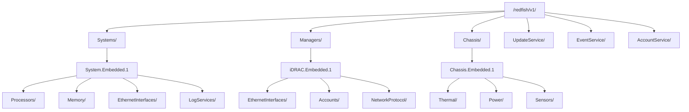
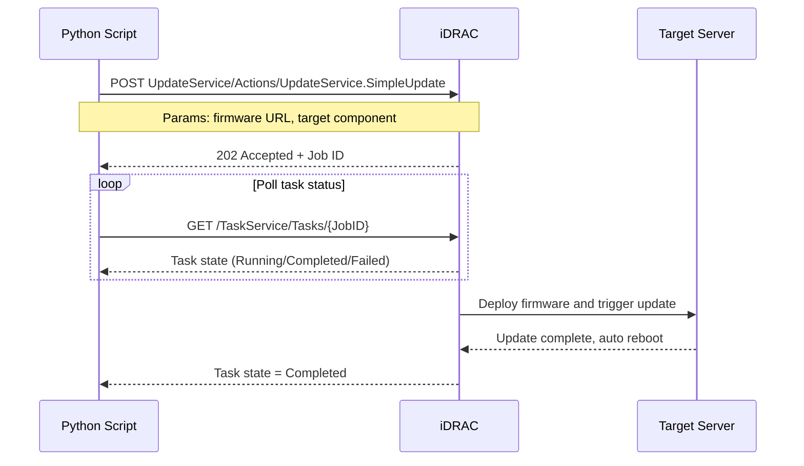

## Key Takeaways

- The iDRAC 9 Redfish API exposes a full resource tree — confusing `Systems`, `Managers`, and `Chassis` is the #1 beginner mistake that costs you hours of debugging.
- Session-based authentication with `X-Auth-Token` is the only production-safe option; Basic Auth is a security nightmare waiting to happen.
- A Python `requests`-based client gives you more control than Dell's official `redfish` library, especially when you need custom error handling and retry logic.
- Five endpoints cover 80% of real-world automation: power control, sensor telemetry, firmware update, boot configuration, and log export.
- Your iDRAC license tier directly gates API functionality — Express licenses silently cripple Redfish features that Enterprise customers take for granted.

---

## Why I Should've Started Using Redfish API Years Ago

Let me paint a picture. Last month we had a datacenter maintenance window — 200+ PowerEdge servers needed batch firmware upgrades. Our old process? Log into each iDRAC web UI, click through a dozen menus, upload firmware, stage it, reboot, verify. Two engineers, a full day, and we barely covered half the fleet.

I got fed up. Spent an evening reading Dell's Redfish docs, wrote a Python script that pushed firmware to a hundred machines, polled task states, and logged everything automatically. The next 100 servers took one script run. I sat there drinking coffee while the script did the work.

That's what the iDRAC 9 REST API buys you — **it turns server hardware management from a click-through chore into programmable infrastructure**. This is infrastructure-as-code applied to bare metal.

Dell started shipping Redfish support on iDRAC 8, but iDRAC 9 has it fully matured. The GitHub repo `iDRAC-Redfish-Scripting` has a solid collection of Python and PowerShell examples, and the community around it is active enough that you'll find answers to most edge cases.

But honestly? The official documentation is dense, jargon-heavy, and poorly organized. This article is what I wish I had when I started — real code, real pitfalls, production-verified workflows.

---

## What Redfish Actually Is — Don't Let DMTF Scare You Off

Redfish is a management standard from DMTF (Distributed Management Task Force). It uses a RESTful interface with JSON payloads to manage datacenter hardware. iDRAC 9 implements a large portion of the spec, so you can control servers using standard HTTP methods — GET, POST, PATCH, DELETE.

The key to understanding Redfish is its **resource tree model**. Every Redfish service exposes a root entry, typically:

```
https://<iDRAC-IP>/redfish/v1/
```

From the root, you'll find collections that map to different hardware domains:

| Resource Path | What It Controls | Analogy |
|--------------|-----------------|---------|
| `/redfish/v1/Systems/` | Compute node (CPU, memory, power state) | The "host" itself |
| `/redfish/v1/Managers/` | Management controller (BMC/iDRAC) | The "out-of-band management card" |
| `/redfish/v1/Chassis/` | Physical enclosure (fans, temperature, PSUs) | The "physical box" |
| `/redfish/v1/EventService/` | Event subscription service | Alert push notifications |
| `/redfish/v1/UpdateService/` | Firmware update service | Firmware upgrade entry point |
| `/redfish/v1/AccountService/` | User account management | Local user database |

The three top-level resources — `Systems`, `Managers`, `Chassis` — are where everyone gets confused. I've seen colleagues mix up `Systems` and `Managers` and spend hours wondering why sensor data wasn't coming back.

**Here's the mnemonic: `Systems` handles compute resources (CPU, memory, power state), `Managers` handles management functions (iDRAC's own network, users, time settings), `Chassis` handles physical hardware (fans, temperature, power modules).**

Here's a simplified resource tree diagram to help you keep the mental model straight:



**Every resource has an `@odata.id` property** pointing to its own URL. That's Redfish's hypermedia-driven design — you don't hardcode paths, you follow `@odata.id` links. I wrote a recursive traversal function in my script that follows these links automatically. Saved me from a mountain of hardcoded URLs.

---

## Authentication & Authorization — Stop Sending Passwords in Plaintext

The iDRAC 9 Redfish API supports three auth methods:

1. **Basic Auth**: Simplest, but the password is Base64-encoded, not encrypted. Test environments only.
2. **Session Auth**: POST to create a session, get an `X-Auth-Token`, include it in subsequent requests. This is what you should use in production.
3. **Direct X-Auth-Token**: Some firmware versions support specifying a token directly, but this requires additional configuration.

Use Session auth. The reason is simple — your iDRAC password typically has admin privileges, and if it gets sniffed on the wire, an attacker owns your server's out-of-band management. Session tokens expire, limiting the blast radius.

### Creating a Session — The Complete Flow

```python
import requests
import json

# Disable SSL warnings (iDRAC default certs are self-signed)
import urllib3
urllib3.disable_warnings(urllib3.exceptions.InsecureRequestWarning)

IDRAC_IP = "192.168.1.100"
IDRAC_USER = "root"
IDRAC_PASS = "your_password"

BASE_URL = f"https://{IDRAC_IP}/redfish/v1"

# Step 1: Create a session to get X-Auth-Token
session_url = f"{BASE_URL}/SessionService/Sessions"
headers = {"Content-Type": "application/json"}
payload = {
    "UserName": IDRAC_USER,
    "Password": IDRAC_PASS
}

try:
    response = requests.post(session_url, json=payload, headers=headers, verify=False, timeout=10)
    response.raise_for_status()
    
    # The token lives in the response HEADERS, not the body
    auth_token = response.headers.get("X-Auth-Token")
    if not auth_token:
        print("Error: No X-Auth-Token in response headers")
        print(f"Response headers: {dict(response.headers)}")
        exit(1)
    
    print(f"Session created, Token: {auth_token[:20]}...")
    
    # Subsequent requests carry the token
    auth_headers = {"X-Auth-Token": auth_token}
    
    # Example: Get system information
    system_url = f"{BASE_URL}/Systems/System.Embedded.1"
    sys_response = requests.get(system_url, headers=auth_headers, verify=False, timeout=10)
    sys_response.raise_for_status()
    
    system_info = sys_response.json()
    print(f"Model: {system_info.get('Model', 'Unknown')}")
    print(f"Serial: {system_info.get('SerialNumber', 'Unknown')}")
    print(f"Power State: {system_info.get('PowerState', 'Unknown')}")
    print(f"BIOS Version: {system_info.get('BiosVersion', 'Unknown')}")
    
except requests.exceptions.RequestException as e:
    print(f"Request failed: {e}")
    exit(1)
finally:
    # Always delete the session when done
    if auth_token:
        try:
            requests.delete(session_url + "/" + auth_token, headers=auth_headers, verify=False, timeout=10)
            print("Session deleted")
        except:
            pass
```

Here's a trap I fell into: **the `X-Auth-Token` lives in the response headers, not the JSON body**. I spent twenty minutes digging through the response JSON, completely missing the header. Don't make my mistake.

Another gotcha: **sessions expire by default after 30 minutes of inactivity**. If you're running long batch operations, watch for 401 responses and re-authenticate when they appear.

### Role-Based Access — Least Privilege Actually Matters

iDRAC 9 user roles:
- **Administrator**: Full access to everything
- **Operator**: Most operations, but can't modify users or security settings
- **ReadOnly**: View-only access
- **None**: No permissions

For automation, **don't run scripts with an administrator account**. We created a dedicated "automation service account" with only Operator privileges in production. If a script goes rogue, it can't destroy the iDRAC user configuration.

---

## Python Scripting in the Real World — From Simple Queries to Batch Firmware Updates

### Environment Setup

I'm using Python 3.10+, and the only dependency is `requests`. Skip the fancy Redfish wrapper libraries — they abstract away the API's flexibility, and when something breaks, you're reading their source code instead of debugging your own.

```bash
pip install requests
```

### A Reusable Client Module

I wrapped all common operations into a small module that every script reuses:

```python
# idrac_client.py
import requests
import urllib3
import time
from typing import Dict, Any, Optional

urllib3.disable_warnings(urllib3.exceptions.InsecureRequestWarning)

class IDRACClient:
    def __init__(self, ip: str, username: str, password: str, timeout: int = 30):
        self.base_url = f"https://{ip}/redfish/v1"
        self.timeout = timeout
        self.session = requests.Session()
        self.session.verify = False
        self.auth_token = None
        self._login(username, password)
    
    def _login(self, username: str, password: str):
        """Create a session and get X-Auth-Token"""
        url = f"{self.base_url}/SessionService/Sessions"
        payload = {"UserName": username, "Password": password}
        
        response = self.session.post(url, json=payload, timeout=self.timeout)
        response.raise_for_status()
        
        self.auth_token = response.headers.get("X-Auth-Token")
        if not self.auth_token:
            raise RuntimeError("Failed to obtain X-Auth-Token")
        
        self.session.headers.update({"X-Auth-Token": self.auth_token})
        print(f"[INFO] Login successful, Token: {self.auth_token[:16]}...")
    
    def get(self, path: str) -> Dict[str, Any]:
        """GET request"""
        url = f"{self.base_url}/{path.lstrip('/')}"
        response = self.session.get(url, timeout=self.timeout)
        response.raise_for_status()
        return response.json()
    
    def post(self, path: str, payload: Dict[str, Any]) -> requests.Response:
        """POST request (returns raw Response to capture Location header)"""
        url = f"{self.base_url}/{path.lstrip('/')}"
        response = self.session.post(url, json=payload, timeout=self.timeout)
        response.raise_for_status()
        return response
    
    def patch(self, path: str, payload: Dict[str, Any]) -> Dict[str, Any]:
        """PATCH request"""
        url = f"{self.base_url}/{path.lstrip('/')}"
        response = self.session.patch(url, json=payload, timeout=self.timeout)
        response.raise_for_status()
        return response.json()
    
    def delete(self, path: str):
        """DELETE request"""
        url = f"{self.base_url}/{path.lstrip('/')}"
        response = self.session.delete(url, timeout=self.timeout)
        response.raise_for_status()
    
    def logout(self):
        """Delete the session"""
        if self.auth_token:
            try:
                url = f"{self.base_url}/SessionService/Sessions/{self.auth_token}"
                self.session.delete(url, timeout=self.timeout)
                print("[INFO] Session logged out")
            except:
                pass
```

### Real-World Use Case 1: Batch Server Health Monitoring

We run a weekly health check script that pulls CPU temperature, fan speed, and power status from every server and feeds it into our monitoring system. Used to be a manual walkthrough — now it's one script:

```python
# health_check.py
from idrac_client import IDRACClient
import json

servers = [
    {"ip": "192.168.1.101", "name": "web-01"},
    {"ip": "192.168.1.102", "name": "web-02"},
    {"ip": "192.168.1.103", "name": "db-01"},
    # ... more servers
]

def get_sensor_readings(client, chassis_path="/Chassis/Chassis.Embedded.1"):
    thermal = client.get(f"{chassis_path}/Thermal")
    power = client.get(f"{chassis_path}/Power")
    
    sensors = {}
    for temp in thermal.get("Temperatures", []):
        sensors[f"temp_{temp['Name']}"] = {
            "reading": temp.get("ReadingCelsius"),
            "status": temp.get("Status", {}).get("Health"),
            "threshold": temp.get("UpperThresholdNonCritical")
        }
    
    for fan in thermal.get("Fans", []):
        sensors[f"fan_{fan['Name']}"] = {
            "reading": fan.get("Reading"),
            "status": fan.get("Status", {}).get("Health"),
            "threshold": fan.get("UpperThresholdNonCritical")
        }
    
    for psu in power.get("PowerSupplies", []):
        sensors[f"psu_{psu['Name']}"] = {
            "output_watts": psu.get("PowerOutputWatts"),
            "status": psu.get("Status", {}).get("Health")
        }
    
    return sensors

for server in servers:
    try:
        client = IDRACClient(server["ip"], "monitor_user", "password")
        
        system = client.get("/Systems/System.Embedded.1")
        sensors = get_sensor_readings(client)
        
        health = system.get("Status", {}).get("Health")
        power = system.get("PowerState")
        
        print(f"[{server['name']}] Power: {power}, Health: {health}")
        
        # Flag any critical or warning sensors
        for sensor_name, data in sensors.items():
            if data.get("status") in ("Critical", "Warning"):
                print(f"  ⚠️ {sensor_name}: {data['reading']} (Status: {data['status']})")
        
        client.logout()
    except Exception as e:
        print(f"[{server['name']}] Check failed: {e}")
```

This script covers the entire fleet in about five minutes. The old manual process took half a day.

### Real-World Use Case 2: Remote Power Control — The Most-Used Operation

Remote power control is probably the #1 use case for the Redfish API. Restarting a server used to mean logging into the iDRAC web UI and hunting through menus. Now it's a single API call:

```python
import requests
import urllib3
import time

urllib3.disable_warnings(urllib3.exceptions.InsecureRequestWarning)

IDRAC_IP = "192.168.1.100"
IDRAC_USER = "admin"
IDRAC_PASS = "password"

BASE_URL = f"https://{IDRAC_IP}/redfish/v1"

# Login and get token
login_url = f"{BASE_URL}/SessionService/Sessions"
response = requests.post(login_url, json={"UserName": IDRAC_USER, "Password": IDRAC_PASS}, verify=False)
token = response.headers.get("X-Auth-Token")
headers = {"X-Auth-Token": token}

# Graceful restart
action_url = f"{BASE_URL}/Systems/System.Embedded.1/Actions/ComputerSystem.Reset"
payload = {"ResetType": "GracefulRestart"}

# Available ResetType values:
# On                  - Power on
# ForceOff            - Hard shutdown (like holding the power button)
# GracefulShutdown    - Graceful shutdown (notify OS first)
# GracefulRestart     - Graceful restart (like running `reboot`)
# ForceRestart        - Hard restart
# PowerCycle          - Power off then on

try:
    response = requests.post(action_url, json=payload, headers=headers, verify=False, timeout=10)
    response.raise_for_status()
    print("Restart command sent, waiting for server to come back...")
    
    # Poll until the server is back online
    system_url = f"{BASE_URL}/Systems/System.Embedded.1"
    for i in range(30):
        time.sleep(10)
        sys_response = requests.get(system_url, headers=headers, verify=False, timeout=10)
        power_state = sys_response.json().get("PowerState")
        print(f"  Poll {i+1}: PowerState = {power_state}")
        if power_state == "On":
            print("✅ Server is back online")
            break
    else:
        print("❌ Server did not come back after 30 polls, manual check needed")
except requests.exceptions.RequestException as e:
    print(f"Request failed: {e}")
```

One detail worth noting: **the difference between `GracefulRestart` and `ForceRestart`**. `GracefulRestart` notifies the OS and does a clean shutdown first — like running `reboot`. `ForceRestart` cuts power immediately, like pressing the physical reset button. Always use `GracefulRestart` in production; `ForceRestart` can corrupt databases.

### Real-World Use Case 3: Batch Firmware Updates via UpdateService

This is the most complex scenario and the one that saved us an entire day of manual work. The workflow looks like this:



```python
# firmware_update.py
import requests
import urllib3
import time
import json

urllib3.disable_warnings(urllib3.exceptions.InsecureRequestWarning)

IDRAC_IP = "192.168.1.100"
IDRAC_USER = "admin"
IDRAC_PASS = "password"
BASE_URL = f"https://{IDRAC_IP}/redfish/v1"

# Login
login_url = f"{BASE_URL}/SessionService/Sessions"
response = requests.post(login_url, json={"UserName": IDRAC_USER, "Password": IDRAC_PASS}, verify=False)
token = response.headers.get("X-Auth-Token")
headers = {"X-Auth-Token": token}

# Firmware update parameters
update_url = f"{BASE_URL}/UpdateService/Actions/UpdateService.SimpleUpdate"
payload = {
    "ImageURI": "http://192.168.1.200/firmware/BIOS_XXXX.exe",
    "Targets": ["/redfish/v1/Systems/System.Embedded.1/Bios"],
    "@Redfish.OperationApplyTime": "OnReset"  # Apply on next reboot
}

try:
    # Initiate the update task
    response = requests.post(update_url, json=payload, headers=headers, verify=False, timeout=30)
    response.raise_for_status()
    
    # Extract task ID from the Location header
    location = response.headers.get("Location", "")
    task_id = location.split("/")[-1]
    print(f"Firmware update task created: {task_id}")
    
    # Poll task status
    task_url = f"{BASE_URL}/TaskService/Tasks/{task_id}"
    while True:
        time.sleep(15)
        task_response = requests.get(task_url, headers=headers, verify=False, timeout=10)
        task_status = task_response.json()
        
        state = task_status.get("TaskState")
        percent = task_status.get("PercentComplete", 0)
        print(f"  Task state: {state}, Progress: {percent}%")
        
        if state == "Completed":
            print("✅ Firmware update complete")
            break
        elif state in ("Exception", "Killed"):
            print("❌ Firmware update failed")
            messages = task_status.get("Messages", [])
            for msg in messages:
                print(f"  Error: {msg.get('Message', 'Unknown error')}")
            break
    
except requests.exceptions.RequestException as e:
    print(f"Request failed: {e}")
```

Big pitfall I hit here: **iDRAC firmware update tasks can be lost after the server reboots**. If the server restarts mid-update, the task might show as `Exception` or simply disappear. My polling loop checks whether the server is back online; if it is and the task is gone, I verify the firmware version directly to confirm whether the update actually applied.

---

## Security Hardening — The Most Boneheaded Vulnerabilities I've Seen

The Redfish API is a double-edged sword. It gives you powerful management capabilities, but it also expands the attack surface. Here are four security issues I've encountered in real environments:

### 1. Default certificates never get replaced

The self-signed HTTPS certificate on a factory iDRAC has a publicly known private key. If you don't replace it, an attacker can MITM the connection and steal your admin password. **First task in production: install your own certificate.**

### 2. Weak passwords

`root/calvin` is embarrassingly common on Dell servers. Once Redfish is exposed, attackers can brute-force passwords because the API has no built-in rate limiting.

### 3. Network exposure

The iDRAC management port **must never be directly on your office network or the internet**. We put iDRAC on a dedicated VLAN with firewall rules that only allow access from a jump host. The jump host runs an API proxy for all Redfish requests — this gives us audit logging and access control in one place.

### 4. Excessive privileges

As I said earlier, don't run automation scripts with an admin account. iDRAC supports custom roles — you can create a user that can call power control APIs but cannot touch user management.

### Security Configuration Checklist

| Setting | Recommended | Risk Level |
|---------|------------|------------|
| HTTPS certificate | Replace with enterprise CA-signed cert | High |
| Password policy | Min 12 chars, enable expiration | High |
| Session timeout | 15 minutes or shorter | Medium |
| Network isolation | Dedicated VLAN + firewall rules | High |
| User permissions | Least privilege; Operator role for scripts | Medium |
| Audit logging | Enable iDRAC logs, export regularly | Medium |
| Firmware version | Keep current to patch known CVEs | High |
| Default port | Change from 443 if possible | Low |

---

## Alternatives Compared — Redfish vs. Everything Else

Redfish isn't the only way to manage iDRAC. Here's a comparison table based on what we actually use:

| Approach | Automation Level | Learning Curve | Best For | Drawbacks |
|---------|-----------------|---------------|----------|-----------|
| iDRAC Web UI | Low | Low | Single-server quick tasks | No batch, error-prone |
| Redfish API | High | Medium | Batch ops, IaC, automation | Requires coding skills |
| RACADM CLI | Medium | Medium | SSH command-line management | Older interface, less complete |
| Dell OpenManage Enterprise | High | High | Large-scale centralized management | Separate deployment, expensive licensing |
| Ansible + Redfish modules | Very High | Medium | Configuration management & orchestration | Depends on Ansible ecosystem |

My take: **if you have more than 10 Dell servers, invest the time to learn the Redfish API**. It's cleaner than Ansible's abstraction layer — you're working directly with the resource tree, so debugging is straightforward.

But if you're managing hundreds of servers, Dell's OpenManage Enterprise is probably a better fit — it has a GUI, auto-discovery, batch firmware updates, and other enterprise features. Redfish is better suited for custom automation workflows.

---

## FAQ

**Q1: What's the difference between the iDRAC 9 Redfish API and RACADM?**

The Redfish API is a RESTful, JSON-based standard interface that follows DMTF specifications and is cross-vendor compatible — HPE iLO and Lenovo XClarity also support Redfish. RACADM is Dell's proprietary CLI tool that only works on Dell products. If you have heterogeneous hardware, Redfish is the better choice. Redfish is also easier to call from modern languages like Python, Go, or JavaScript.

**Q2: What's the minimum license for iDRAC 9? Does Express support the Redfish API?**

The Express license only provides basic server management. Many Redfish API features are restricted — you can't configure virtual console via API, can't export full system configuration (SCP), and some sensor data is unavailable. Full Redfish API functionality requires the Enterprise license. Check your license status on the iDRAC License page.

**Q3: How do I get all sensor data through the Redfish API?**

Sensor data lives in `/redfish/v1/Chassis/Chassis.Embedded.1/Thermal` (temperature, fans) and `/redfish/v1/Chassis/Chassis.Embedded.1/Power` (power supplies). You can also use the `SensorCollection` endpoint at `/redfish/v1/Chassis/Chassis.Embedded.1/Sensors` for a more detailed list. Note that different iDRAC firmware versions may return slightly different JSON structures — print the raw response first to inspect it.

**Q4: Does the Redfish API support event subscriptions — like proactive alerts when a server overheats?**

Yes. iDRAC 9 implements the Redfish EventService. You create a subscription, and when specific events occur (temperature threshold exceeded, power supply failure), iDRAC sends a POST request to your webhook URL. Configure it with `POST /redfish/v1/EventService/Subscriptions/`, specifying `Destination` (your callback URL) and `EventTypes`. In production, I recommend this over polling — it's more efficient and faster to respond.

**Q5: Any best practices for managing multiple servers with the Redfish API?**

First, use a dedicated automation service account with minimal privileges. Second, wrap common operations in a shared client library to avoid code duplication. Third, log every operation for audit purposes. Fourth, mind concurrency — iDRAC has limits on concurrent requests, and too many parallel requests will return 503 or time out. Fifth, build in error handling and retries — network blips, session expirations, and server reboots all cause failures.

---

## References & Community Insights

- [Dell iDRAC-Redfish-Scripting (GitHub)](https://github.com/dell/iDRAC-Redfish-Scripting) — Dell's official Python and PowerShell script library covering nearly every common operation. Start here before writing your own code.
- [DMTF Redfish Official Documentation](https://redfish.dmtf.org/) — The authoritative Redfish standard docs with the complete resource model and API definitions.
- [Dell iDRAC9 Redfish API Guide](https://www.dell.com/support/manuals/en-us/idrac9-lifecycle-controller-v5.x-series/idrac9_5.00.00.00_redfishapi-pub/) — Dell's official iDRAC9 Redfish API guide. The documentation is dense and poorly organized, but the information is all there.

From the community side, Reddit's r/homelab and r/sysadmin frequently discuss iDRAC and Redfish usage. I recently noticed a thread about someone migrating from x86 to Ampere ARM servers — because the Redfish API is vendor-neutral, their management scripts carried over to the new hardware without modification. That's a strong argument for investing in Redfish skills. That said, deep technical discussions about iDRAC Redfish are surprisingly rare on Reddit — most people are still at the "can I remotely power cycle" level. For serious learning, the GitHub repos and official Dell docs are where you'll find the real substance.

---

<script type="application/ld+json">
{
  "@context": "https://schema.org",
  "@type": "FAQPage",
  "mainEntity": [{
    "@type": "Question",
    "name": "What's the difference between the iDRAC 9 Redfish API and RACADM?",
    "acceptedAnswer": {
      "@type": "Answer",
      "text": "The Redfish API is a RESTful, JSON-based standard interface that follows DMTF specifications and is cross-vendor compatible. RACADM is Dell's proprietary CLI tool that only works on Dell products. Redfish is easier to call from modern programming languages and supports heterogeneous hardware environments."
    }
  },{
    "@type": "Question",
    "name": "What's the minimum license for iDRAC 9? Does Express support the Redfish API?",
    "acceptedAnswer": {
      "@type": "Answer",
      "text": "The Express license only provides basic server management and many Redfish API features are restricted, including virtual console configuration, full system configuration export, and some sensor data. Full Redfish API functionality requires the Enterprise license."
    }
  },{
    "@type": "Question",
    "name": "How do I get all sensor data through the Redfish API?",
    "acceptedAnswer": {
      "@type": "Answer",
      "text": "Sensor data lives in /redfish/v1/Chassis/Chassis.Embedded.1/Thermal for temperature and fans, and /redfish/v1/Chassis/Chassis.Embedded.1/Power for power supplies. The SensorCollection endpoint at /redfish/v1/Chassis/Chassis.Embedded.1/Sensors provides a more detailed list. Different iDRAC firmware versions may return slightly different JSON structures."
    }
  },{
    "@type": "Question",
    "name": "Does the Redfish API support event subscriptions?",
    "acceptedAnswer": {
      "@type": "Answer",
      "text": "Yes. iDRAC 9 implements the Redfish EventService. You create a subscription and when specific events occur, iDRAC sends a POST request to your webhook URL. Configure it with POST /redfish/v1/EventService/Subscriptions/, specifying Destination and EventTypes."
    }
  },{
    "@type": "Question",
    "name": "Any best practices for managing multiple servers with the Redfish API?",
    "acceptedAnswer": {
      "@type": "Answer",
      "text": "Use a dedicated automation service account with minimal privileges; wrap common operations in a shared client library; log every operation; mind concurrency limits on iDRAC; and build in error handling with retry mechanisms for network blips, session expirations, and server reboots."
    }
  }]
}
</script>
