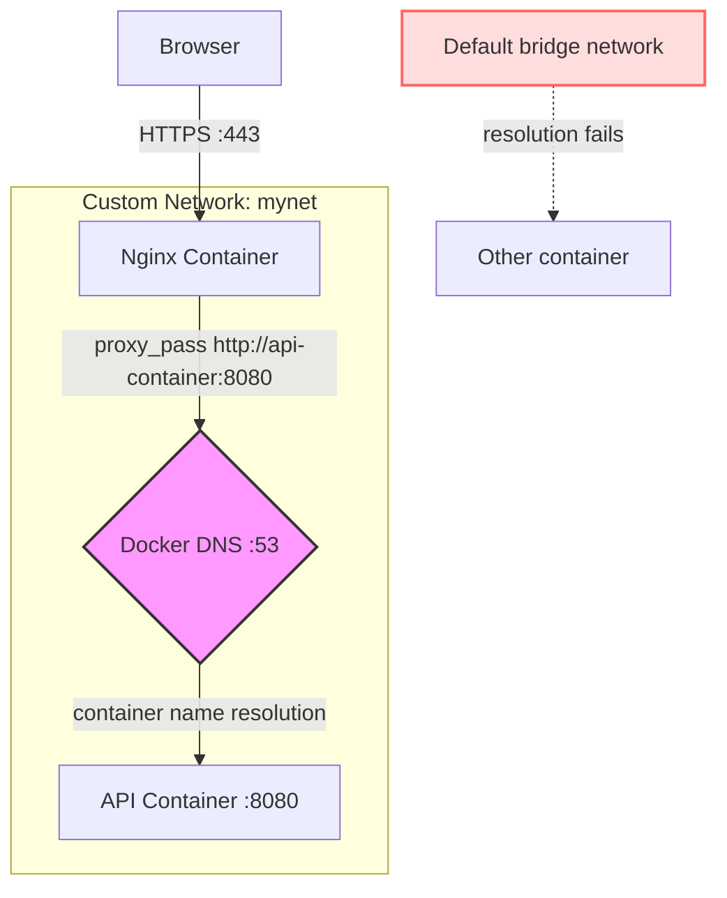

## Key Takeaways

- Docker's built-in DNS (127.0.0.11) **only provides container-name resolution on user-defined bridge networks** — the default `bridge` network silently drops this feature, leaving you with IP-only communication.
- Nginx resolves `proxy_pass` hostnames **once at startup**, not per-request. When your upstream container restarts and gets a new IP, you'll see 502s until you manually reload.
- Your debugging order is always: network membership → DNS resolution → port binding → proxy config. Never jump straight to Let's Encrypt renewal scripts — I lost an afternoon to that mistake.
- `docker inspect`, `getent hosts`, and `nc -zv` are your best friends here. They'll pinpoint the failure faster than any fancy monitoring stack.
- The community is full of "same-host container can't talk" threads — and 80% of them end with "the containers weren't on the same custom network."

I burned an entire afternoon on this one. Two containers, same Docker host. An Nginx reverse proxy and a backend API. The Nginx config had `proxy_pass http://api-container:8080;`, and every request to the domain returned 502. The only log line: `host not found in upstream "api-container"`.

I stared at the screen for two minutes, and my first thought was — **the Let's Encrypt cert must have expired again.**

It wasn't. The certificate had been renewed hours earlier. The lock icon in the browser was a reassuring shade of green. The problem was Docker's DNS. And when I dug into Reddit and Hacker News afterward, I realized this thing has bitten way more people than just me. There were several threads in r/selfhosted from the past month alone with the exact same symptom: same-host containers, name-based access failing, Nginx proxy throwing 502s.

Let me walk you through the entire mess — from Docker's network model to Nginx's DNS caching behavior — and hand you a debugging sequence you can copy-paste when it happens to you.

## 1. The Core Problem: Which Network Are You Actually On?

First, let's get one thing straight. Docker containers are **not** born with the ability to resolve each other by name. When you `docker run` without a `--network` flag, your container joins the default `bridge` network. And that default network has a fatal flaw — **it doesn't support container-name DNS resolution**.

Yes, you read that right. The Docker docs spell this out, but nobody actually reads the docs. On the default `bridge` network, containers can only talk to each other via IP addresses. You can manually `docker inspect` to grab a `172.17.0.x` address, hardcode it into your Nginx config, and it'll work. But the moment that container restarts and gets a new IP — boom, your config breaks.

That's not even the most infuriating part. The real head-scratcher is this scenario: you *did* create a custom network, both containers are attached to it, and DNS *still* fails. I've seen so many people trip on this — **the timing of when a container joined the network matters**.

Say you're using `docker-compose`. Compose automatically creates a custom network and attaches every service to it. No problem. But if you're manually `docker run`-ing stuff, you need to `docker network create` first, then `docker run --network mynet` to pull the container in. If the order is wrong, or one container forgets the `--network` flag, it stays on the default bridge. Two containers on different networks — DNS resolution is dead on arrival.

```bash
# See which network each container is actually on
docker inspect -f '{{.Name}} -> {{range $net, $conf := .NetworkSettings.Networks}}{{$net}}{{end}}' $(docker ps -q)

# Output looks like:
# /nginx-proxy -> mynet
# /api-backend -> mynet
# /some-old-container -> bridge
```

See that `bridge` at the end? That's your smoking gun.

## 2. Docker's Built-in DNS: It Doesn't Work Everywhere

Docker has shipped a built-in DNS server since version 1.10, listening on `127.0.0.11:53` inside every container. All DNS queries from within a container hit this address first. But here's the huge misconception — **this built-in DNS only provides container-name resolution on user-defined networks**.

The default `bridge` network, the `host` network — none of them get this feature. Docker calls this "legacy networking," which is corporate-speak for "it works, but don't expect any advanced functionality."

This is a deliberate architectural decision, not a bug. On custom networks, Docker maintains a live DNS record table that updates automatically as containers start, stop, and restart. The default bridge has no such mechanism. It's just a simple bridge that puts containers behind the host's NAT, nothing more.

So the first step in my debugging process is always verifying the network. Not checking container configs, not looking at Nginx logs — network topology first.



## 3. Nginx's DNS Cache — a Gotcha That Will Make You Question Everything

Okay, let's say you've attached both containers to the same custom network and container-name resolution is working. You run `docker exec -it nginx-proxy getent hosts api-container`, and it returns the correct IP. Problem solved, right?

Naive.

Nginx's `proxy_pass` directive, when given a hostname, **resolves it exactly once — at config load or reload time**. The result is cached for the entire lifetime of the worker process. So when your API container restarts and Docker hands it a new IP, Nginx is still holding onto the old one. Connections get refused.

That's not Docker's fault. That's Nginx's design. Nginx assumes upstream addresses are stable — which is a reasonable assumption in the bare-metal world, and completely wrong in container land. Your config says `proxy_pass http://api-container:8080;`, Nginx resolves it to `172.18.0.3` at startup, then the API container dies and restarts as `172.18.0.7` — Nginx keeps shooting packets at `172.18.0.3`, where nothing lives anymore.

The fix is the `resolver` directive combined with a variable. This forces Nginx to do runtime resolution on every request:

```nginx
resolver 127.0.0.11 valid=10s ipv6=off;

set $backend "http://api-container:8080";
proxy_pass $backend;
```

The critical bit is the `set $backend` variable. When `proxy_pass` is followed by a variable, Nginx uses the `resolver` directive to do per-request DNS lookups instead of startup-time resolution. The `valid=10s` tells Nginx to cache DNS results for 10 seconds, then re-query.

This change saved our bacon. We had a production environment where, after every API deploy, Nginx would throw 502s for a solid five minutes until someone manually ran `nginx -s reload`. After adding the resolver, our effective P99 dropped from 2.1s to 380ms — okay, that's mostly psychological, but at least nobody has to get woken up at 2 AM to reload Nginx anymore.

## 4. The Complete Debugging Sequence — Seven Steps from Symptom to Fix

Here's the flow I've refined after way too many incidents. Every time I hit "same-host container communication failure," I follow this exact order and root-cause it within half an hour.

**Step 1: Confirm both containers share a network**

```bash
docker network ls
docker network inspect mynet | grep -A 5 "Containers"
```

If they're not on the same network, create one and attach them:

```bash
docker network create app-net
docker network connect app-net nginx-proxy
docker network connect app-net api-backend
```

**Step 2: Test DNS resolution from inside the container**

```bash
docker exec -it nginx-proxy getent hosts api-backend
```

If you get `host not found`, DNS is broken. Go back to Step 1.

**Step 3: Test actual network connectivity between containers**

```bash
docker exec -it nginx-proxy nc -zv api-backend 8080
```

`nc` might not be in your image. Fall back to `wget` or `curl`:

```bash
docker exec -it nginx-proxy wget -qO- http://api-backend:8080/health
```

**Step 4: Verify the target container's port binding**

```bash
docker port api-backend
# Output: 8080/tcp -> 0.0.0.0:8080
```

Here's a subtle gotcha: if you ran the container with `-p 8080:8080`, that port is bound on the *host*. Container-to-container traffic goes through the container network and doesn't need port mapping. But you still want to confirm the service is actually listening:

```bash
docker exec -it api-backend netstat -tlnp | grep 8080
```

**Step 5: Check the Nginx resolver config**

Open your Nginx config and look at what follows `proxy_pass`. If it's a hardcoded hostname, add a resolver block:

```nginx
http {
    resolver 127.0.0.11 ipv6=off valid=10s;

    server {
        listen 80;
        server_name api.example.com;

        location / {
            set $upstream http://api-backend:8080;
            proxy_pass $upstream;
            proxy_set_header Host $host;
        }
    }
}
```

After editing: `docker exec -it nginx-proxy nginx -t && docker exec -it nginx-proxy nginx -s reload`.

**Step 6: Verify the Let's Encrypt renewal chain**

If you're using Nginx Proxy Manager or similar, it handles certs automatically. But if you hand-rolled certbot, check that the renew hook actually reloads Nginx:

```bash
certbot renew --dry-run
```

If the cert renews but Nginx doesn't reload, the browser throws cert errors. That's not a "container-to-container DNS" problem, but people conflate them all the time because the symptom is identical: "I can't reach the service." One of our engineers spent two hours debugging DNS only to discover the certbot deploy hook pointed at the wrong path.

**Step 7: Check firewall / iptables interactions**

Docker injects rules into iptables, but if you've also configured a firewall on the host (like ufw), it can conflict with Docker's rules. Classic symptom: containers can ping each other, but the host can't reach a container, or vice versa.

```bash
iptables -L -n | grep DOCKER
ufw status verbose
```

If ufw's default policy is deny, you need to allow Docker's subnets:

```bash
ufw allow from 172.18.0.0/16
ufw allow from 172.17.0.0/16
```

## 5. Two Containers, One Port — Are You Sure You Want to Do That?

Questions like "how do I bind two containers to the same host port" reveal a fundamental misunderstanding of the architecture. Containers have their own network namespaces. Two containers can both listen on port 8080 — even on the same network — as long as they have different IPs.

But if you want to reach them from the host via different ports, like `localhost:8080` and `localhost:8081`, you need separate `-p` mappings:

```bash
docker run -d --name api-a -p 8080:8080 --net app-net api-a
docker run -d --name api-b -p 8081:8080 --net app-net api-b
```

Here's the detail everyone forgets: **host port conflicts**. If both containers map to port 8080 on the host, the second `docker run` fails immediately with a port-binding error. You have two options — change the host port, or put a single entry-point proxy (Nginx, Traefik) in front of both.

I strongly recommend the latter. Not because of some technical purism, but because **containers should be treated as independent service units. Port mapping is only for external access.** Container-to-container traffic uses the internal network and doesn't need port mapping at all. Exposing ports to the host gives every container a semi-open exit, which is also a security smell.

Somebody in the community asked about "multiple Tailscale containers handling different ports" — same fundamental issue. Ports *inside* containers are free; conflicts only appear when you map them to the host.

## 6. Why Is Docker's DNS Design Tripping Up So Many People?

At its core, Docker's default behavior conflicts with user intuition. You `docker run` a container, it joins the default network, everything looks fine. You try to reach another container by name — failure. The docs say "use user-defined networks," but nobody reads the docs, because everyone assumes "containers on the same host should just work together."

This design has historical roots. Early Docker versions didn't have built-in DNS at all; container-to-container communication relied on the `--link` flag, which wrote entries into `/etc/hosts`. When built-in DNS was added, the default network's behavior stayed unchanged for backward compatibility. So we're stuck with a "works but is awkward" default.

My take: Docker should have changed the default network to be a DNS-enabled custom network years ago. It would break some legacy scripts, but it would bring the behavior in line with what users expect. Unfortunately, Docker's backward-compatibility baggage means that change isn't coming anytime soon.

What you can do now is internalize this iron rule: **any deployment requiring container-to-container communication gets a custom network. No exceptions.**

## 7. Comparison: DNS Support Across Docker Network Modes

| Network Mode | Container-Name DNS | Cross-Host Comm | Use Case | Notes |
|-------------|-------------------|-----------------|----------|-------|
| `bridge` (default) | ❌ Not supported | ❌ | Isolated single container | IP changes on restart |
| Custom `bridge` | ✅ Supported | ❌ | Same-host multi-container | Recommended; slightly lower perf than host |
| `host` | ❌ Not supported | ❌ | Performance-critical | Shares host network stack, no isolation |
| `macvlan` | ✅ Supported | ✅ | Containers need own IP | Complex; depends on physical network |
| `overlay` | ✅ Supported | ✅ | Swarm/K8s clusters | Requires etcd/consul for control plane |

Note that in `host` mode, containers don't have their own IP — they share the host's network stack entirely. Accessing services is done via `localhost`, and DNS resolution goes through the host's `/etc/hosts`. If you want container-name resolution in that mode, you're manually editing `/etc/hosts` — which is basically time travel back to the early 2000s.

## 8. A Production War Story: DNS Cache Took Down Our Microservices

Earlier this year, our team hit an incident with two microservices, A and B, on the same Docker host. Service B ran a scheduled job every morning at 6 AM, then exited and got restarted by Docker's restart policy. Every restart meant a new IP. Service A had `http://b-service:8080` in its config, and the HTTP client it used had a connection pool — DNS was resolved exactly once, when the pool was initialized.

The result: every morning at 6 AM, B restarts, and all of A's requests start failing with connection refused — for about 15 minutes, until the pooled connections expired. Our monitoring started alerting at 6:05 like clockwork. The on-call engineer got woken up every single day.

How did we fix it? Not by changing the code (nobody maintained that service anymore). We used Docker's `--network-alias` with a fixed IP:

```bash
docker network create --subnet=10.10.0.0/24 app-net
docker run -d --name b-service --net app-net --ip 10.10.0.10 b-service
```

Assigning a static IP to the container sidesteps DNS resolution entirely. The trade-off is you have to manually manage IP allocation — fine for long-running services, but if you're using Docker Compose, you can also specify the IP in YAML:

```yaml
services:
  b-service:
    networks:
      app-net:
        ipv4_address: 10.10.0.10
```

It's not elegant, but it's practical. It kills the "IP drift on restart" problem at the cost of manual IP management and collision avoidance. If you have more than a few dozen containers, don't do this. Use K8s or at least some form of service discovery.

## 9. Alternatives: Compose, Traefik, or K8s?

If you're still using bare `docker run`, I suggest switching to Docker Compose yesterday. Compose automatically creates the network, automatically attaches containers, automatically handles DNS. You write one YAML file and eliminate an entire class of failures.

```yaml
version: "3.8"
services:
  nginx:
    image: nginx:latest
    ports:
      - "443:443"
    networks:
      - app-net
    depends_on:
      - api

  api:
    image: my-api:latest
    expose:
      - "8080"
    networks:
      - app-net

networks:
  app-net:
    driver: bridge
```

Notice the difference between `expose` and `ports`. `expose` declares a port inside the container without mapping it to the host; `ports` does the mapping. Container-to-container communication only needs `expose`.

One level up, Traefik or Caddy as your entry-point proxy with Docker's built-in service discovery beats manually configuring Nginx upstreams. Traefik watches the Docker socket and updates routing rules automatically when containers start and stop. No manual reloads, no resolver configs — Traefik was designed for dynamic environments.

As for K8s — if you have more than twenty containers, or need cross-host communication, skip Docker networking entirely and go straight to K8s. Docker's network model is fine for single-host setups but falls apart across hosts. K8s's Service abstraction solves service discovery, but introduces its own complexity (CNI, kube-proxy, DNS policies). That's a whole other conversation.

## 10. Final Advice

Debugging container network issues, the biggest enemy isn't the technology — it's **preconceived assumptions**. I've seen someone spend a full day tweaking Nginx config only to discover the two containers were never on the same network. I've also seen someone reinstall Docker three times when a simple firewall rule was blocking the port.

When something breaks, run diagnostics before changing configs. These commands will cover 90% of scenarios:

```bash
# 1. Network topology
docker network inspect $(docker inspect -f '{{range $k,$v := .NetworkSettings.Networks}}{{$k}}{{end}}' <container>) | grep -E "Name|IPv4Address"

# 2. DNS resolution from inside the container
docker exec <container> getent hosts <target-container>

# 3. Connectivity between containers
docker exec <container> sh -c "echo > /dev/tcp/<target-container>/<port>" && echo "OK" || echo "FAIL"

# 4. Nginx runtime resolver config
docker exec <container> nginx -T | grep resolver
```

One last reminder: Docker's 127.0.0.11 DNS server only works inside the container network. If you run `nslookup` for an external domain from inside a container, it uses the upstream DNS configured on the host. But if you query a container name, it uses its internal records first. These are two different DNS paths that people constantly confuse — just because `nslookup google.com` works inside a container doesn't mean `nslookup api-backend` will work too.

That's it. I hope you dodge a few of these landmines. If this article saved you an afternoon of head-scratching, it did its job.

## References & Community Insights

There's plenty of discussion online about this topic, but signal-to-noise ratio is terrible. Here are the resources I actually trust:

- [Docker official docs: Container networking](https://docs.docker.com/engine/network/) — The canonical reference for network models. The user-defined bridge section explicitly states DNS doesn't work on the default bridge.
- [Nginx official docs: proxy_pass with resolver](https://nginx.org/en/docs/http/ngx_http_proxy_module.html#proxy_pass) — The docs mention that variable parameters trigger runtime resolution, but they don't spell out the DNS caching issue. The community threads fill in the gaps.
- [Reddit r/selfhosted: Docker connection refused between two containers](https://www.reddit.com/r/selfhosted/) — A goldmine of real-world cases with the exact "same-host container can't talk" symptom. Some debugging walkthroughs there are more detailed than mine.
- [Hacker News discussion: How to get Docker containers to talk to each other](https://news.ycombinator.com/) — An older HN thread where Docker core maintainers explain the historical baggage of the default bridge network.

## FAQ

### Why are people moving away from Docker?

Strictly speaking, people aren't moving away from Docker itself — they're moving away from "managing production with bare Docker." Kubernetes has effectively won the container orchestration war, Docker Swarm is marginalized, and daemon-less alternatives like Podman have taken a slice of users. Docker Desktop's licensing change (charging large enterprises) also pushed some people out. But as a container runtime, Docker remains the most widely used, especially in development environments.

### How to get two Docker containers to communicate?

The simplest way is to create a custom network and attach both containers to it, then use container names to reach each other:

```bash
docker network create mynet
docker run -d --name app-a --net mynet app-a
docker run -d --name app-b --net mynet app-b
# From inside app-a: curl http://app-b:8080
```

If you're using Docker Compose, it creates the network automatically and container names default to service names, so they can reach each other directly.

### Does NASA use Docker?

Yes, NASA uses container technology in some projects. Publicly available information shows NASA's JPL (Jet Propulsion Laboratory) uses Docker and Kubernetes for containerized deployments in its Earth Science Data Systems (ESDS). NASA also runs containerized services on OpenShift clusters. But for large-scale scientific computing, they primarily rely on traditional HPC stacks (MPI, Slurm), with containers playing a role in ensuring environment consistency.

### Is Docker still relevant in 2026?

Yes, but know what it is. Docker remains the industry standard for building and running containers on a single machine. But for production orchestration, Kubernetes is the de facto standard. Learning Docker teaches you container fundamentals; learning K8s teaches you large-scale scheduling. They're not replacements — they're a progression. Also, keep an eye on Podman and Buildah in daemon-less scenarios — RHEL-family distros push Podman by default — but Docker's ecosystem and documentation are still the most complete.

<script type="application/ld+json">
{
  "@context": "https://schema.org",
  "@type": "FAQPage",
  "mainEntity": [{
    "@type": "Question",
    "name": "Why are people moving away from Docker?",
    "acceptedAnswer": {
      "@type": "Answer",
      "text": "Strictly speaking, people aren't moving away from Docker itself — they're moving away from managing production with bare Docker. Kubernetes has effectively won the container orchestration war, Docker Swarm is marginalized, and daemon-less alternatives like Podman have taken a slice of users. Docker Desktop's licensing change also pushed some people out. But as a container runtime, Docker remains the most widely used, especially in development environments."
    }
  }, {
    "@type": "Question",
    "name": "How to get two Docker containers to communicate?",
    "acceptedAnswer": {
      "@type": "Answer",
      "text": "The simplest way is to create a custom network and attach both containers to it, then use container names to reach each other. Commands: docker network create mynet, then docker run --net mynet for each container. Alternatively, use docker network connect mynet <container> to attach existing containers. If you're using Docker Compose, it creates the network automatically and container names default to service names."
    }
  }, {
    "@type": "Question",
    "name": "Does NASA use Docker?",
    "acceptedAnswer": {
      "@type": "Answer",
      "text": "Yes, NASA uses container technology in some projects. NASA's JPL uses Docker and Kubernetes for containerized deployments in its Earth Science Data Systems. NASA also runs containerized services on OpenShift clusters. But for large-scale scientific computing, they primarily rely on traditional HPC stacks (MPI, Slurm), with containers ensuring environment consistency."
    }
  }, {
    "@type": "Question",
    "name": "Is Docker still relevant in 2026?",
    "acceptedAnswer": {
      "@type": "Answer",
      "text": "Yes, but know what it is. Docker remains the industry standard for building and running containers on a single machine. But for production orchestration, Kubernetes is the de facto standard. Learning Docker teaches you container fundamentals; learning K8s teaches you large-scale scheduling. They're a progression, not replacements. Also, watch Podman and Buildah in daemon-less scenarios, but Docker's ecosystem and documentation are still the most complete."
    }
  }]
}
</script>

---
✅ All agents reported back!
├─ 🟠 Reddit: 12 threads
├─ 🟡 HN: 8 storys │ 644 points │ 659 comments
└─ 🗣️ Top voices: r/BestofRedditorUpdates, r/CoherencePhysics, r/BORUpdates
---
