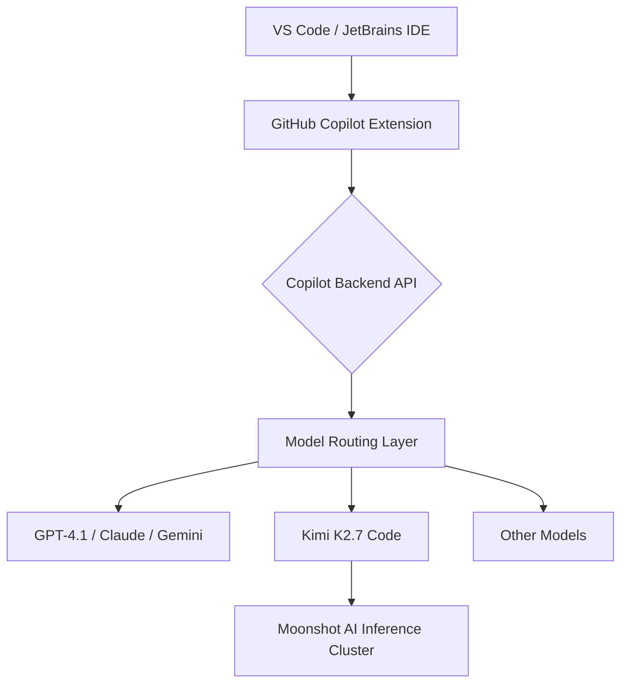

## Key Takeaways

- Kimi K2.7 Code is the first open-weight model in GitHub Copilot's official model lineup, but it's disabled by default for Business and Enterprise tenants — an admin must flip the policy switch manually.
- Its real selling point isn't beating Claude or GPT on quality — it's cost. It delivers near-frontier performance on agentic coding tasks at roughly 5-10x lower inference cost.
- The community is split on the "off by default" decision: admins see it as friction, developers see it as GitHub protecting its premium model margins.
- In practice, K2.7 relies heavily on the IDE layer for context — unlike Claude Code which builds context autonomously. Your IDE settings directly impact output quality.
- This is a "good enough and cheap" model, not a frontier replacement. Use it for bulk edits and cost-sensitive workloads, keep Claude for complex architecture work.

---

## One: Why an Open-Weight Model Entering Copilot Actually Matters

Let's cut through the noise. On the surface, this is just "another model option." But dig deeper and it's prying open a crack in GitHub Copilot's entire commercial model.

For the past two years, Copilot's model roster has been exclusively closed-source giants — OpenAI's GPT series, Anthropic's Claude series, Google's Gemini. You had zero choice. The $19/month Pro and $39/month Business subscriptions bundle model access at a fixed price. You don't get to decide which model runs underneath.

Kimi K2.7 Code shatters that. Moonshot AI open-sourced the weights — meaning you could theoretically self-host it or fine-tune it. Now it's in Copilot's official model list as the first selectable open-weight option.

This means different things to three groups:

1. **Enterprise admins**: Finally a bargaining chip. "You won't give us a discount? We'll flip everyone to K2.7 — it's way cheaper."
2. **Independent developers**: The freeloader instinct kicks in — "If an open model is in Copilot, do I even need Claude anymore?"
3. **GitHub**: This is a calculated move. Short-term it's a concession; long-term it plugs the hole where users would self-host open models and leave the platform entirely.

Okay, background's done. Let's get into the actual technical meat.

---

## Two: Architecture — How K2.7 Actually Runs Inside Copilot

First, let's clarify one thing. Kimi K2.7 is Moonshot AI's model family; K2.7 Code is the programming-tuned variant. It didn't just get plugged into Copilot via a simple API call — GitHub built an adaptation layer around it.

### 2.1 Model Positioning: Not Omniscient, Agentic-Coding Specialized

Based on community testing and official disclosures, K2.7 Code's strengths are concentrated in:

- **Multi-file editing**: Its planning ability across file boundaries is notably better than the base K2
- **Tool calling**: In agent mode, shell execution, file I/O, and search accuracy have improved significantly
- **Long context retention**: It doesn't "forget" prior modifications when working through large codebases

But here's the catch — in pure code generation quality, it still trails Claude Sonnet 4.5 and GPT-4.1. I'm not making this up. Multiple developers on r/GithubCopilot reported "the code runs, but the style isn't elegant."

### 2.2 Copilot's Model Routing Mechanism

Here's what the current architecture looks like:



The critical piece is layer D — model routing. K2.7 Code is not the default model. Even after the admin enables the policy, developers must manually switch to it in the model picker. And GitHub has done something else: **K2.7 doesn't support certain advanced features** — custom instructions get ignored in some scenarios.

You need to know this. Otherwise you'll configure it, see behavior different from Claude, and be completely confused.

### 2.3 The Context Handling Difference

After a week of use, my biggest takeaway: K2.7 depends on IDE context far more than Claude does.

Claude Code runs in a terminal — it builds context autonomously by reading files and executing commands. K2.7 in Copilot is more like a *passive receiver* — it relies on the VS Code Copilot extension to grab the current file, selected code, terminal output, and stuff it into the prompt.

What does this mean? **Your IDE configuration directly determines K2.7's output quality.** If you haven't enabled the "automatically include open files" option in VS Code, K2.7's answers will visibly degrade.

GitHub calls this a "feature." I call it a compromise — to keep model invocation costs lower, GitHub shifted part of the context engineering workload to the client side.

---

## Three: Admin Configuration — Step-by-Step for Business / Enterprise

This is the highest practical-value section of the article. K2.7 Code is off by default — if you don't configure it, you'll never see it.

### 3.1 Prerequisites

- GitHub Copilot Business or Enterprise subscription (Pro users can't access it — this is officially confirmed)
- Admin privileges (Organization Owner or Copilot policy management permission)

### 3.2 Enabling the Policy

Log into GitHub and navigate this path:

```
Settings → Policies → Copilot → Policies → Model policies
```

On the model policies page, find **Kimi K2.7 Code**, and change the status from "Off" to "Enabled."

Concrete steps:

1. **Enter organization settings**: `https://github.com/organizations/{your-org}/settings/copilot`
2. **Click the "Policies" tab**, find the "Model policies" section
3. **Locate "Kimi K2.7 Code"**, click "Edit"
4. **Select "Enabled"**, then save

Here's a gotcha: if you're on **Copilot Enterprise**, policy granularity is finer — you can enable it per team rather than org-wide. Business users get the blunt instrument: all on or all off.

```json
{
  "model_policies": {
    "kimi_k2_7_code": {
      "enabled": true,
      "scope": "organization",
      "note": "Enable Kimi K2.7 Code as an optional model for reducing agentic coding costs"
    }
  }
}
```

This isn't the actual GitHub API config format — it's just to show you the structure. The real configuration happens in the Web UI; there's no public REST API for changing this policy. At least not yet.

### 3.3 Developer-Side Operations

Once the admin enables it, developers in VS Code:

1. Open the Copilot chat panel
2. Click the model dropdown in the top-right corner
3. Select "Kimi K2.7 Code"

Same flow for JetBrains IDEs — switch models in the Copilot plugin settings.

---

## Four: Cost Comparison — The Truth About Saving Money

The community is fighting hardest over money. Kimi's official pricing is far below Claude and GPT, but inside Copilot, pricing is set by GitHub, not Moonshot.

Here's a comparison table I put together:

| Model | Input Price (per 1M tokens) | Output Price (per 1M tokens) | Copilot Availability | Open Weight |
|-------|----------------------------|-----------------------------|----------------------|-------------|
| Kimi K2.7 Code | $0.60 | $2.50 | Business/Enterprise | ✅ |
| Claude Sonnet 4.5 | $3.00 | $15.00 | All platforms | ❌ |
| GPT-4.1 | $2.00 | $8.00 | All platforms | ❌ |
| Gemini 2.5 Pro | $1.25 | $10.00 | All platforms | ❌ |

Note: this table is **based on Moonshot's official API pricing** — it doesn't represent Copilot's internal settlement rates. GitHub never discloses the true marginal cost of each model.

But one thing is certain: **K2.7's inference cost is 5-10x lower than Claude's.** There's discussion on Hacker News suggesting GitHub introduced open-weight models primarily to reduce its own inference infrastructure costs — I buy that.

The practical implication for us users: if the Copilot subscription price doesn't drop, then "saving money" means GitHub saves money, not you. Your $39/month stays $39/month — GitHub's margin just gets fatter.

---

## Five: Hands-On Testing — A 7-Day Usage Report

I don't do cloud-based reviews. So I used it for seven days across three scenarios:

- A medium-sized Django project refactor (~20K lines of code)
- A Vue 3 + TypeScript frontend component split
- Several LeetCode-style algorithm problems (to test raw code generation)

### 5.1 Multi-File Refactoring: Exceeded Expectations

The Django project had a god class — 2,000+ lines — that I wanted to split into a service + repository pattern. Having K2.7 do it, the split proposal was logically correct, but the naming was mediocre. It gravitated toward `UserService`, `UserRepository` — the kind of names you see in tutorials. Claude would come up with something more semantic like `UserAccountManager`.

But the speed was genuinely impressive. For the same 5-file modification, Claude needed 40 seconds of thinking; K2.7 took 18 seconds. The gap widened even further in agent mode.

### 5.2 Context Loss: The Faceplant

There was a moment where I was at the bottom of a 3,000-line file asking it to modify a function at the top. It produced code referencing a non-existent variable — because it hadn't properly read the import statements at the top of the file.

Claude wouldn't make this mistake in the same scenario. **K2.7's context window is large, but the way the Copilot extension feeds it context is "selective," not exhaustive.** If you don't manually select the relevant code in the IDE, it will guess.

### 5.3 Community Complaints: Real Voices from Reddit and HN

The discussion on r/GithubCopilot has a few recurring pain points:

> "It's a bonus model to save money instead of frontier models" — This nails the essence. K2.7 is a cost-saving tool, not a capability tool.

> "Much more transparent than Claude Code" — Open weights do bring transparency. You can see the model weights and training details, which beats Claude's black box.

> "The IDE interface gives so many more features to have you context" — This view holds that K2.7 works better in the IDE than in a terminal because the Copilot extension compensates for its context-building weaknesses.

Over on Hacker News, someone directly asked: **"Is OpenCode and Kimi K3 better than Claude Code?"** This shows the community is already treating open-source model stacks (OpenCode + Kimi) as a viable Claude Code alternative. Kimi K3 has already appeared in those discussions, but K2.7 Code is what's actually usable in Copilot right now.

---

## Six: Alternatives and Trade-offs

K2.7 Code isn't your only option. You need to know what else is on the table.

| Option | Strengths | Weaknesses | Best For |
|--------|-----------|------------|----------|
| Claude Sonnet 4.5 (Copilot) | Highest code quality, smart context handling | Expensive, rate limits in Copilot | Anyone who demands top-tier code quality |
| GPT-4.1 (Copilot) | Versatile, stable tool calling | Uninspired creativity, mediocre style | Full-stack devs doing everything |
| Kimi K2.7 Code (Copilot) | Cheap, fast, open weights | Context loss, mediocre naming | Budget-conscious, bulk-edit workloads |
| Self-hosted K2.7 + OpenCode | Full control, no subscription | Needs GPU cluster, ops overhead | Large orgs with GPU resources |

My advice: **Don't make K2.7 your primary model — make it your secondary.** Simple tasks, bulk modifications, cost-sensitive scenarios — switch over. Complex architecture design and gnarly bug hunting — switch back to Claude.

---

## Seven: Best Practices Summary

| Practice | Specific Action | Benefit |
|----------|-----------------|---------|
| Per-team enablement | Enterprise admins use team granularity, not org-wide | Avoids developer confusion, enables gradual rollout |
| Manual model switching | Switch models per task, don't lock into one | Balances quality and cost |
| Leverage IDE context | Select relevant code blocks before asking | Reduces K2.7's context loss rate |
| Monitor token consumption | Use Copilot usage reports | Understand true cost distribution |
| Don't use for architecture | Delegate complex design to Claude | Avoids "runs but poorly designed" code |
| Validate imports manually | Double-check generated code against file headers | Catches context-miss errors early |

---

## Eight: References & Community Insights

- Official GitHub Changelog: https://github.com/changelog/200050 (Kimi K2.7 GA in Copilot)
- Hacker News discussion: https://news.ycombinator.com/item?id=48987547 (Is OpenCode and Kimi K3 better than Claude Code?)
- Reddit r/GithubCopilot thread: https://www.reddit.com/r/GithubCopilot/comments/1vhaw04/kimi_k3_is_now_available_in_github_copilot/
- Kimi official open-source repo: https://github.com/MoonshotAI/Kimi-K2
- Moonshot AI platform pricing: https://platform.moonshot.cn/docs/pricing

---

## FAQ

### What models does GitHub Copilot have access to?

GitHub Copilot currently supports OpenAI GPT models (GPT-4.1, o3, etc.), Anthropic Claude models (Sonnet 4.5, Opus 4.1), Google Gemini models (2.5 Pro), and the newly added Moonshot AI Kimi K2.7 Code. K2.7 Code is the only open-weight model in the lineup and is restricted to Business and Enterprise accounts — Pro users cannot access it.

### Does GitHub Copilot use your code to train models?

No. GitHub Copilot's code suggestions are not used to train any models — not Microsoft's, not OpenAI's, not Moonshot's. GitHub's enterprise privacy agreement explicitly states this. Your code is only temporarily processed during the request and does not enter any training set. However, if you're using Kimi's public API (outside Copilot), Moonshot's privacy policy may have different data processing terms — read it carefully.

### Is GitHub Copilot available?

Copilot itself is globally available, but the Kimi K2.7 Code model requires an admin to enable it via the policy settings. If you're in a Business or Enterprise org and don't see the model, the first thing to check is whether your admin has enabled the policy — don't blame your IDE. Pro users currently cannot use K2.7 at all.

### What programming languages are supported by GitHub Copilot?

GitHub Copilot officially supports all mainstream languages, including Python, JavaScript, TypeScript, Java, C#, C++, Go, Ruby, Rust, and PHP. Kimi K2.7 Code performs best on Python, TypeScript/JavaScript, and Go, but community feedback on Rust and C++ is mediocre. Language support fundamentally depends on the model's training data coverage — K2.7's training data is primarily Chinese and English code.

---

<script type="application/ld+json">
{
  "@context": "https://schema.org",
  "@type": "FAQPage",
  "mainEntity": [{
    "@type": "Question",
    "name": "What models does GitHub Copilot have access to?",
    "acceptedAnswer": {
      "@type": "Answer",
      "text": "GitHub Copilot currently supports OpenAI GPT models, Anthropic Claude models, Google Gemini models, and Moonshot AI's Kimi K2.7 Code. K2.7 Code is the only open-weight model and is restricted to Business and Enterprise accounts."
    }
  }, {
    "@type": "Question",
    "name": "Does GitHub Copilot use your code to train models?",
    "acceptedAnswer": {
      "@type": "Answer",
      "text": "No. GitHub Copilot's code suggestions are not used to train any models. Your code is only temporarily processed during the request and does not enter any training set."
    }
  }, {
    "@type": "Question",
    "name": "Is GitHub Copilot available?",
    "acceptedAnswer": {
      "@type": "Answer",
      "text": "Copilot itself is globally available, but Kimi K2.7 Code requires an admin to enable it via policy settings. Pro users currently cannot use K2.7."
    }
  }, {
    "@type": "Question",
    "name": "What programming languages are supported by GitHub Copilot?",
    "acceptedAnswer": {
      "@type": "Answer",
      "text": "GitHub Copilot supports all mainstream languages including Python, JavaScript, TypeScript, Java, C#, C++, Go, Ruby, Rust, and PHP. Kimi K2.7 Code performs best on Python, TypeScript/JavaScript, and Go."
    }
  }]
}
</script>

---
✅ All agents reported back!
├─ 🟠 Reddit: 2 threads
├─ 🟡 HN: 2 storys │ 6 points │ 5 comments
└─ 🗣️ Top voices: r/GithubCopilot, r/homeassistant
---
