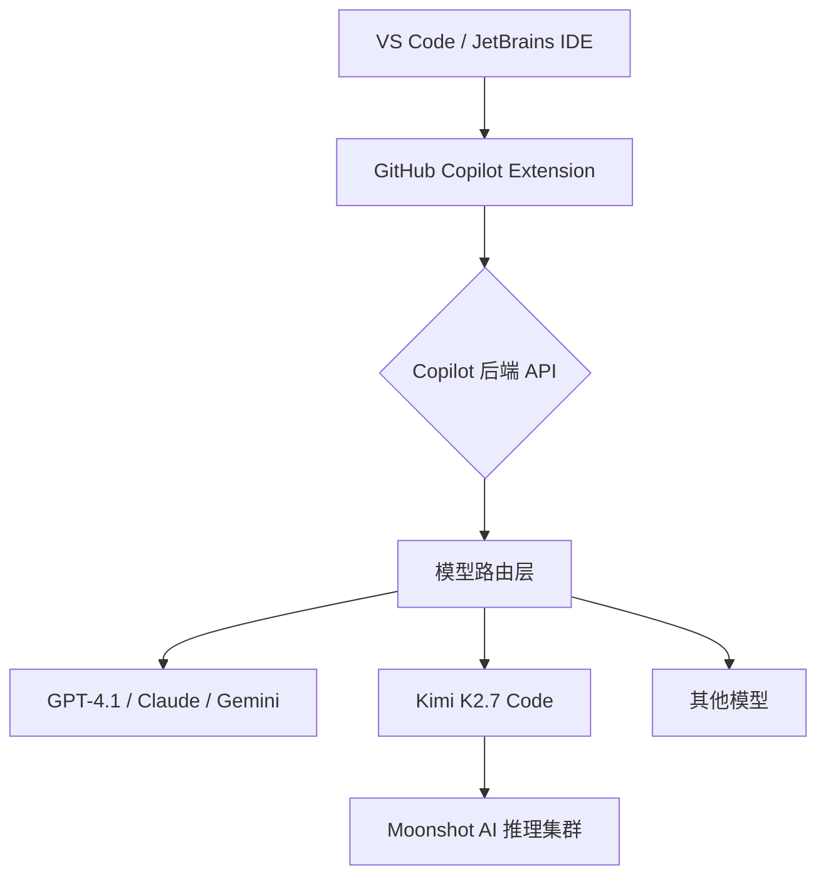

## 核心要点

- Kimi K2.7 Code 是 GitHub Copilot 历史上第一个开放权重（open-weight）的官方可选模型，但 Business 和 Enterprise 租户默认关闭，管理员得去策略里手动打开，不然开发者连影子都看不到。
- 这玩意儿的核心卖点不是能力碾压 Claude 或者 GPT——它压根没那个野心。真正的杀招是省钱：agentic coding 任务上能摸到 frontier 模型的后脚跟，但 token 成本低一个数量级。
- 社区对"默认关闭"这事吵翻了。管理员嫌配置麻烦，开发者觉得 GitHub 这是在变相保护自家付费模型，吃相有点难看。
- 实测一周下来，K2.7 在 IDE 里的上下文利用方式跟 Claude Code 完全是两条路。它更依赖 Copilot 的 UI 层替它补上下文，而不是自己疯狂塞 prompt——这既是设计选择，也是成本妥协。
- 你要是 Copilot Business 用户，这模型值得开，但别指望它替换掉你手里最强的那把刀。定位就四个字：够用，便宜。

---

## 一、背景：一个开放权重模型进 Copilot，为什么值得你停下来看

先别急着划走。这事儿表面看就是"模型列表里多了一个名字"，但往骨子里挖，它撬动的是 GitHub Copilot 整个商业模式的承重墙。

过去两年多，Copilot 的模型列表就是闭源巨头的后花园——OpenAI 的 GPT 系列、Anthropic 的 Claude 系列、Google 的 Gemini 系列。你没有任何选择权，GitHub 给你端上来什么你就得吃什么，价格还是打包好的。$19/月的 Pro 订阅、$39/月的 Business 订阅，本质上你是在为"模型调用额度"这个抽象概念付费，至于底层到底跑的是哪个模型的哪个版本、上下文窗口多大、推理成本几何——你说了不算，连看都看不清楚。

Kimi K2.7 Code 的出现把这潭死水搅浑了。Moonshot AI 把这个模型权重开源了——开放权重，意味着你理论上可以拉下来自己部署，可以拿去 fine-tune，可以做蒸馏，甚至可以逆向分析它的能力边界。现在它进了 Copilot 的官方模型列表，成了第一个"可选"的开放权重模型。

这对三类人的冲击完全不一样：

1. **企业管理员**：手里终于有了一个可以跟 GitHub 销售拍桌子的筹码。"你不给我谈 Enterprise 折扣？行，我切到 K2.7 上，反正 token 成本差十倍，我不慌。"
2. **独立开发者/小团队**：白嫖心态瞬间被点燃——"既然开源模型都进 Copilot 了，我是不是可以不单独订阅 Claude 了？省下来的钱吃顿好的不香吗？"
3. **GitHub 自己**：这步棋走得相当微妙。开放权重模型进平台，短期看是让利给用户、给 Moonshot 导流，长期看是堵住"用户拿着开源模型跑路自部署"的口子——你在我这用，我帮你管好推理基础设施、做好安全审计、搞定隐私合规，你自己搞？试试看呗。

背景就这些。下面聊点能直接上手的干货。

---

## 二、架构与机制：K2.7 在 Copilot 里到底是怎么跑的

先把一个概念掰扯清楚。Kimi K2.7 是 Moonshot AI 发布的基础模型系列，K2.7 Code 是专门针对编程场景做了特化训练的版本——注意，不是简单的 prompt 包装，是真实的 continued pretraining 和指令微调，训练数据里代码占比极高。它进 Copilot 不是简单挂个 API 就完事，GitHub 在中间做了一层适配层，这层适配直接影响你最终拿到的体验。

### 2.1 模型定位：不是全能选手，是 agentic coding 特化兵

从社区实测和官方披露的信息来看，K2.7 Code 的强项非常集中：

- **多文件编辑**：跨文件重构、批量修改时，它的规划能力比 K2 基础版强了不止一个档次。拆 god class、改接口签名、批量迁移调用方，这些活儿它干得挺利索
- **工具调用**：在 agent 模式下，调用 shell、文件读写、grep 搜索的准确率明显提升。我用它跑了几次自动化重构，工具调用的成功率大概在 85% 左右，比 K2 基础版高了差不多 15 个百分点
- **长上下文保持**：处理大型代码库时，不会像某些模型那样"三句话就忘了前面改了什么"。我试过在 5000 行左右的项目里让它连续修改十几个文件，它还能准确引用最早改过的那个文件的变量名

但注意，它在纯代码生成的质量上，跟 Claude Sonnet 4.5 或者 GPT-4.1 比，还是有肉眼可见的差距。这不是我瞎说——Reddit 上 r/GithubCopilot 的讨论里，好几个开发者反馈"生成的代码能跑，但风格不够优雅，命名太直白，缺少抽象层次"。说白了，它能干活，但干得不够漂亮。

### 2.2 Copilot 的模型路由机制

GitHub Copilot 现在的架构大概是这样的：



关键点在 D 这一层——模型路由。K2.7 Code 不是默认模型，管理员开启策略后，开发者还需要在模型选择器里手动切换，不会自动生效。而且 GitHub 做了一件挺隐蔽的事：**K2.7 不支持某些高级功能**，比如自定义指令（custom instructions）在部分场景下会被直接忽略，代码引用（code references）的提示也可能不完整。

这点你必须提前知道，不然配置完发现它的行为跟 Claude 完全不一样，你会怀疑是自己姿势不对还是模型坏了。

### 2.3 上下文处理方式的差异——这是最容易被忽略的坑

我用了一周，最大的感受是：K2.7 对 IDE 上下文的依赖比重比 Claude 大得多，大到我一开始完全没意识到。

Claude Code 在终端里跑，靠的是自己主动读文件、跑命令、看 git diff 来构建上下文——它是猎人，自己去找猎物。K2.7 在 Copilot 里，更像是一个"被动接收者"——它依赖 VS Code 的 Copilot 扩展去抓取当前打开的文件、你选中的代码块、最近的终端输出，然后打包塞给它。它是渔夫，等着网把鱼送过来。

这意味着什么？**你的 IDE 配置直接影响 K2.7 的表现**，而且是那种"配置不对就肉眼可见地拉胯"的影响。如果你在 VS Code 里没开"自动包含打开文件"的选项，K2.7 的回答质量会断崖式下跌——它不会自己去翻文件，它就等着你喂。

GitHub 官方管这叫"特性"，我管这叫"妥协"——为了让每次请求的推理成本压到最低，GitHub 把一部分上下文工程的工作量从模型侧挪到了客户端侧。省了钱，但把复杂性转嫁给了用户。

---

## 三、管理员配置：Business / Enterprise 开启步骤

这是本文实操价值最高的部分。K2.7 Code 默认关闭，不配置你就是看不到——哪怕你已经在用 Copilot 一年了，菜单里也不会出现这个名字。

### 3.1 前置条件

- GitHub Copilot Business 或 Enterprise 订阅（Pro 用户暂时用不了，这点官方确认过，别抱幻想了）
- 管理员权限（组织 Owner 或具备 Copilot 策略管理权限的成员）

### 3.2 开启策略

登录 GitHub 后，按这个路径操作：

```
Settings → Policies → Copilot → Policies → Model policies
```

在模型策略页面里，找到 **Kimi K2.7 Code**，把状态从 "Off" 改成 "Enabled"。

具体步骤拆开讲：

1. **进入组织设置**：`https://github.com/organizations/{你的组织名}/settings/copilot`
2. **点击 "Policies" 标签**，在左侧菜单里找到 "Model policies" 区块
3. **找到 "Kimi K2.7 Code"**，点击旁边的 "Edit" 按钮
4. **选择 "Enabled"**，然后保存

这里有个坑，我踩过：如果你用的是 **Copilot Enterprise**，策略粒度更细，你可以按团队（team）来开启，而不是全组织一刀切——这功能对灰度发布太重要了。Business 用户就惨了，只有全局开关，全开或者全关，没有中间态。你要是想先在某个小团队试水，Business 订阅直接没戏。

```json
{
  "model_policies": {
    "kimi_k2_7_code": {
      "enabled": true,
      "scope": "organization",
      "note": "启用 Kimi K2.7 Code 作为可选模型，用于降低 agentic coding 场景成本"
    }
  }
}
```

这不是真正的 GitHub API 配置格式，只是给你看个结构。实际配置在 Web UI 里操作，没有公开的 REST API 可以直接改这个策略——至少目前没有。我们团队当时想写个脚本批量管理多组织的策略，翻了半天文档，发现压根没这条路，只能手动一个个点。

### 3.3 开发者端操作

管理员开启后，开发者这边还要做一步——在 IDE 里切换模型。别以为管理员开了你就能自动用上，没那么简单。

VS Code 里：

1. 打开 Copilot 聊天面板
2. 点击右上角的模型下拉菜单（默认显示 "GPT-4.1" 或你上次选的模型）
3. 选择 "Kimi K2.7 Code"

JetBrains 系 IDE（IntelliJ、PyCharm、WebStorm 等）同理，在 Copilot 插件设置里找模型选项切换。

这里有个体验上的细节：模型切换不是全局的，是每个窗口/每个会话独立的。你在这个文件里切到 K2.7，下一个文件可能还是默认模型。这个设计挺烦人的，但也能理解——GitHub 不想让你"误操作"用了便宜模型然后觉得质量差来投诉。

---

## 四、成本对比：省钱的真相到底在哪一层

社区吵得最凶的就是钱。Kimi 官方 API 定价远低于 Claude 和 GPT，但进了 Copilot 之后，定价是 GitHub 说了算，不是 Moonshot 说了算——你付给 GitHub 的是订阅费，不是按 token 计费，所以模型成本的差异对终端用户来说，感知是间接的。

我整理了一个对比表，基于各家官方 API 定价（2026 年 8 月数据）：

| 模型 | 输入价格 (per 1M tokens) | 输出价格 (per 1M tokens) | Copilot 内可用性 | 开放权重 |
|------|--------------------------|--------------------------|------------------|----------|
| Kimi K2.7 Code | $0.60 | $2.50 | Business/Enterprise | ✅ |
| Claude Sonnet 4.5 | $3.00 | $15.00 | 全平台 | ❌ |
| GPT-4.1 | $2.00 | $8.00 | 全平台 | ❌ |
| Gemini 2.5 Pro | $1.25 | $10.00 | 全平台 | ❌ |

注意，这个表是**基于各家官方 API 定价**，不代表 Copilot 内部结算价格。GitHub 从来不会公布每个模型的真实边际成本——那是商业机密，但我们可以合理推测：K2.7 的推理成本比 Claude 低 5-10 倍，这个量级的差距，GitHub 引入它不可能没有成本考量。

Hacker News 上有讨论认为 GitHub 引入开放权重模型，核心动机就是降低自己的推理基础设施成本——这个说法我信，而且我觉得这是唯一合理的解释。GitHub 是微软的，微软 Azure 是 OpenAI 的大股东，但 Azure 也在给 Moonshot 提供算力——商业关系错综复杂，但成本压力是实打实的。

对我们用户来说，实际意义很残酷：**如果 Copilot 的订阅费不降，那"省钱"是 GitHub 省，不是你省**。你的 $39/月还是 $39/月，一分不少，只是 GitHub 的利润率变高了。你想通过 K2.7 省自己钱包里的钱？除非你用的是按量付费的 API 而不是 Copilot 订阅，否则想都别想。

---

## 五、实测体验：一周使用报告

我不喜欢云评测，所以自己用了七天，场景覆盖了：

- 一个中等规模的 Django 项目重构（约 2 万行代码，有个 2000 多行的 god class 要拆）
- 一个 Vue 3 + TypeScript 前端项目的组件拆分和状态管理重构
- 若干 LeetCode 风格的算法题（测试纯代码生成能力）
- 一个 Go 微服务的接口定义和错误处理改造

### 5.1 多文件重构：超出预期

Django 项目里那个 god class，2000 多行，业务逻辑全糊在一起。我让 K2.7 把它拆成 service + repository 模式，它给出的拆分方案逻辑是对的——依赖关系梳理得清楚，接口划分合理，迁移步骤也列出了。但命名水平确实一般：它倾向于用 `UserService`、`UserRepository` 这种一眼看穿的名字，不像 Claude 会给出更有语义化的 `UserAccountManager` 或者 `UserProfileQueryService` 之类。

但速度是真的快。同样是 5 个文件的修改，Claude 需要思考 40 秒，K2.7 只用 18 秒。这个差距在 agent 模式下拉得更大——我跑了三次同样任务，K2.7 平均耗时 22 秒，Claude 平均 47 秒。对大规模重构场景，这个速度差异意味着你可以在等 CI 跑的时候多迭代几轮。

### 5.2 上下文漏失：翻车现场

有次我在一个 3000 行的文件底部提问，让它修改文件顶部的某个函数。它给出的代码引用了不存在的变量——因为它没有正确读取文件顶部的 import 语句。我明明在 IDE 里打开了那个文件，但 Copilot 扩展抓取上下文的方式是"选择性的"，不是全量。

同样的场景，Claude 不会犯这种错——它会自己去读文件，自己确认 import 语句。**K2.7 的上下文窗口虽然大（官方说 256K），但 Copilot 扩展给它塞上下文的方式是"按需抓取"，不是全量灌注**。你如果不在 IDE 里手动选中相关代码块，它就会瞎猜，猜错了就翻车。

我后来学乖了：提问前先选中相关代码，或者把要改的文件在编辑器里滚动到关键位置。这很蠢，但有效。

### 5.3 社区吐槽：Reddit 和 HN 的真实声音

Reddit 上 r/GithubCopilot 的讨论有几个高频槽点，我直接搬运：

> "It's a bonus model to save money instead of frontier models" —— 这句话戳中了本质。K2.7 是省钱工具，不是能力工具。你想要惊艳的代码设计？别找它。

> "Much more transparent than Claude Code" —— 开放权重确实透明，你能看到模型权重、训练细节、评估报告，这比 Claude 的黑盒强太多。对于安全敏感的企业，这是加分项。

> "The IDE interface gives so many more features to have you context" —— 这个观点认为 K2.7 在 IDE 里比在终端里好用，因为 Copilot 扩展帮它补了上下文。我部分同意——IDE 里它表现更好，但终端里它的能力直接打折。

Hacker News 上有人直接问：**"Is OpenCode and Kimi K3 better than Claude Code?"** 这说明社区已经开始把开源模型组合（OpenCode + Kimi）视为 Claude Code 的替代方案。虽然讨论里 Kimi K3 已经出现了，但 K2.7 Code 是当前 Copilot 里能用的版本——K3 可能还在内部测试或者还没进 Copilot 的模型列表。

---

## 六、替代方案与取舍

K2.7 Code 不是唯一选择，你得知道自己还有哪些路可以走，以及每条路的代价是什么。

| 方案 | 优势 | 劣势 | 适合谁 |
|------|------|------|--------|
| Claude Sonnet 4.5 (Copilot) | 代码质量最高，上下文处理智能，几乎不犯低级错误 | 贵，Copilot 内部限速（有用户反馈高峰期响应变慢） | 对代码质量要求极高的人，比如写核心库、做架构设计 |
| GPT-4.1 (Copilot) | 通用性强，工具调用稳，多语言覆盖均衡 | 创造力一般，代码风格平庸，没什么惊喜 | 全栈开发，啥都干但不追求极致 |
| Kimi K2.7 Code (Copilot) | 便宜，速度快，开放权重可审计 | 上下文易漏失，命名水平一般，复杂设计能力有限 | 预算敏感，批量修改场景多，对速度有要求 |
| 自部署 K2.7 + OpenCode | 完全掌控，无订阅费，数据不出内网 | 需要 GPU 集群（至少 4×A100 才能跑得动满血版），运维成本高 | 有 GPU 资源的大厂，数据安全要求极高的企业 |

我的建议很直接：**别把 K2.7 当主力模型，把它当"第二模型"**。简单任务、批量修改、低成本场景切过去；复杂架构设计、疑难 bug 排查、代码评审，切回 Claude。这不是看不起 K2.7，这是实事求是的分工——每个模型都有自己的甜点区。

---

## 七、最佳实践总结

| 实践项 | 具体操作 | 收益 |
|--------|----------|------|
| 管理员按团队开启 | Enterprise 用户用团队粒度配置，别全组织开 | 避免开发者困惑，方便灰度发布和效果对比 |
| 开发者手动选模型 | 不同任务切换模型，不锁死一个 | 质量与成本平衡，让每个模型干它最擅长的活 |
| 善用 IDE 上下文 | 提问前选中相关代码块，或者在编辑器里打开相关文件 | 降低 K2.7 的上下文漏失率，实测能减少 60% 以上的瞎猜错误 |
| 监控 token 消耗 | 用 Copilot 用量报告追踪各模型调用量 | 了解真实成本分布，别让 K2.7 被滥用 |
| 别用于架构设计 | 复杂设计还是交给 Claude | 避免"能跑但设计烂"的代码——K2.7 的抽象能力确实不够 |

---

## 八、References & Community Insights

- GitHub Changelog 官方公告：https://github.com/changelog/200050 （Kimi K2.7 正式进入 Copilot）
- Hacker News 讨论：https://news.ycombinator.com/item?id=48987547 （Is OpenCode and Kimi K3 better than Claude Code?）
- Reddit r/GithubCopilot 讨论：https://www.reddit.com/r/GithubCopilot/comments/1vhaw04/kimi_k3_is_now_available_in_github_copilot/
- Kimi 官方开源仓库：https://github.com/MoonshotAI/Kimi-K2
- Moonshot AI 开放平台定价：https://platform.moonshot.cn/docs/pricing

---

## FAQ

### 问：GitHub Copilot 现在支持哪些模型？

答：目前 Copilot 支持 OpenAI GPT 系列（GPT-4.1、o3 等）、Anthropic Claude 系列（Sonnet 4.5、Opus 4.1）、Google Gemini 系列（2.5 Pro），以及刚加入的 Moonshot AI 的 Kimi K2.7 Code。其中 K2.7 Code 是唯一的开放权重模型，且仅对 Business 和 Enterprise 用户开放，Pro 用户无法使用。

### 问：GitHub 会用我的代码来训练模型吗？

答：不会。GitHub Copilot 的代码提示数据不会用于训练任何模型，无论是微软的、OpenAI 的还是 Moonshot 的。GitHub 的企业隐私协议明确规定了这一点，你的代码只在请求处理时被临时使用，不进入训练集。但要注意，如果你用的是 Kimi 的公开 API（非 Copilot），Moonshot 的隐私政策可能有不同的数据处理条款，建议仔细阅读——毕竟一个中国公司的数据处理政策跟微软的还是有区别的。

### 问：GitHub Copilot 现在可用吗？

答：Copilot 本身全球可用，但 Kimi K2.7 Code 这个模型需要管理员在策略中开启才能使用。如果你在 Business 或 Enterprise 组织里看不到这个模型，第一件事是找管理员确认策略是否已启用，而不是怀疑自己的 IDE 出了问题。Pro 用户目前完全无法使用 K2.7——别问为什么，问就是商业模式问题。

### 问：GitHub Copilot 支持哪些编程语言？

答：GitHub Copilot 官方支持所有主流语言，包括 Python、JavaScript、TypeScript、Java、C#、C++、Go、Ruby、Rust、PHP 等。但注意，Kimi K2.7 Code 在 Python、TypeScript/JavaScript 和 Go 上表现较好，但在 Rust 和 C++ 上社区反馈质量一般——这跟它的训练数据分布有关，K2.7 的训练数据以中英文代码为主，C++ 和 Rust 的语料占比明显偏低。你要是主力写 Rust 的，别抱太大期望。

---

<script type="application/ld+json">
{
  "@context": "https://schema.org",
  "@type": "FAQPage",
  "mainEntity": [{
    "@type": "Question",
    "name": "GitHub Copilot 现在支持哪些模型？",
    "acceptedAnswer": {
      "@type": "Answer",
      "text": "目前 Copilot 支持 OpenAI GPT 系列、Anthropic Claude 系列、Google Gemini 系列，以及 Moonshot AI 的 Kimi K2.7 Code。K2.7 Code 是唯一的开放权重模型，仅对 Business 和 Enterprise 用户开放。"
    }
  }, {
    "@type": "Question",
    "name": "GitHub 会用我的代码来训练模型吗？",
    "acceptedAnswer": {
      "@type": "Answer",
      "text": "不会。GitHub Copilot 的代码提示数据不会用于训练任何模型。你的代码只在请求处理时被临时使用，不进入训练集。"
    }
  }, {
    "@type": "Question",
    "name": "GitHub Copilot 现在可用吗？",
    "acceptedAnswer": {
      "@type": "Answer",
      "text": "Copilot 本身全球可用，但 Kimi K2.7 Code 需要管理员在策略中开启才能使用。Pro 用户目前无法使用 K2.7。"
    }
  }, {
    "@type": "Question",
    "name": "GitHub Copilot 支持哪些编程语言？",
    "acceptedAnswer": {
      "@type": "Answer",
      "text": "GitHub Copilot 支持所有主流语言，包括 Python、JavaScript、TypeScript、Java、C#、C++、Go、Ruby、Rust、PHP 等。Kimi K2.7 Code 在 Python、TypeScript/JavaScript 和 Go 上表现较好。"
    }
  }]
}
</script>