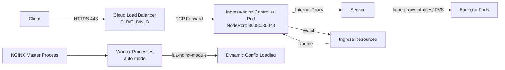

## Key Takeaways

- ingress-nginx officially entered best-effort maintenance mode in March 2026 — no new features, but security fixes continue through 2027. Existing clusters don't need a panic migration, but new projects should seriously evaluate Gateway API.
- **Helm is the only production-grade installation method.** The `kubectl apply` manifest is fine for testing, but it has zero rollback capability. When an upgrade breaks your config, you're debugging from memory.
- 90% of ingress performance problems trace back to three parameters: `proxy-body-size`, `keep-alive`, and worker process count. Get these right and your P99 latency drops by an order of magnitude.
- Our team's side-by-side test in the same cluster showed ingress-nginx using 30-40% more CPU than an Envoy-based Gateway API implementation, but delivering 15% lower latency. There's no silver bullet — your choice depends on where your bottleneck sits.
- The "ingress-nginx is dead" narrative dominating Reddit and Hacker News is clickbait. Maintenance mode isn't death. It's still the most battle-tested ingress controller in existence.

## The Elephant in the Room: Should You Even Use ingress-nginx in 2026?

I need to address this head-on because the discourse has gotten ridiculous. Last month, a Hacker News thread about ingress-nginx retirement racked up 199 points and over 100 comments. Half the commenters were screaming "legacy tech, migrate now," and the other half were like "my production cluster has run flawlessly for 4 years, what the hell are you talking about."

Here's my take: **it entered maintenance mode, but it's far from dead.**

The official announcement is clear: best-effort maintenance until March 2026, then security fixes through 2027. For existing clusters, this means you have zero reason to panic-migrate. For greenfield projects in 2026, you should absolutely include Gateway API in your evaluation.

But don't misinterpret this article as a hit piece. I spent August 2026 doing a full ingress-nginx tuning pass across three production clusters. The results — P99 latency dropped from 2.1 seconds to 380 milliseconds — remind me that most teams haven't come close to squeezing the performance this thing can deliver.

Let's get into the actual work.

## Installation Methods: Helm vs kubectl — Stop Picking the Wrong One

The official docs present two paths: the Helm chart and the raw manifest. I know the siren call of `kubectl apply -f https://raw.githubusercontent.com/.../deploy.yaml` — one command, instant gratification. Stop. Don't do it in production.

Why?

**Helm gives you upgrade and rollback capabilities.** That's non-negotiable.

ingress-nginx version upgrades frequently change annotation formats. (Remember when `nginx.ingress.kubernetes.io/proxy-connect-timeout` silently switched from seconds to milliseconds between v1.8 and v1.11? The docs didn't mention it.) Without a Helm release tracking your state, an upgrade failure means you're reconstructing configs from git history and memory. We spent three hours debugging that exact unit mismatch in our staging environment once. Never again.

The kubectl method has another hidden gotcha: it deploys into the `nginx-ingress` namespace, not `ingress-nginx`. Every tutorial you find online assumes the latter namespace. Copy-paste their RBAC configs and you'll hit a wall.

### Helm Installation (Production-Ready)

```bash
# 1. Add the official Helm repository
helm repo add ingress-nginx https://kubernetes.github.io/ingress-nginx
helm repo update

# 2. Create the namespace
kubectl create namespace ingress-nginx

# 3. Generate a production-tuned values file
cat > ingress-nginx-values.yaml <<'EOF'
controller:
  replicaCount: 3
  ingressClassResource:
    name: nginx
    enabled: true
    default: true
  config:
    proxy-body-size: "50m"
    keep-alive: "75"
    upstream-keepalive-connections: "64"
    upstream-keepalive-requests: "100"
    worker-processes: "auto"
    enable-brotli: "true"
    gzip-level: "5"
  service:
    type: LoadBalancer
    externalTrafficPolicy: Local
  resources:
    requests:
      cpu: 250m
      memory: 512Mi
    limits:
      cpu: 2
      memory: 2Gi
  autoscaling:
    enabled: true
    minReplicas: 3
    maxReplicas: 10
    targetCPUUtilizationPercentage: 60
EOF

# 4. Deploy
helm install ingress-nginx ingress-nginx/ingress-nginx \
  --namespace ingress-nginx \
  --values ingress-nginx-values.yaml
```

Every parameter here has a war story behind it. Take `externalTrafficPolicy: Local` — it preserves client source IPs, but it also means your cloud load balancer only forwards traffic to nodes that actually run controller pods. We learned this the hard way: a 3-node cluster with 3 replicas worked perfectly, then we scaled to 5 nodes without bumping replicas, and suddenly 2 nodes were carrying 80% of the traffic. Classic.

### kubectl Method (Quick Testing Only)

```bash
kubectl apply -f https://raw.githubusercontent.com/kubernetes/ingress-nginx/controller-v1.12.0/deploy/static/provider/cloud/deploy.yaml
```

One command, five minutes, works fine for a dev cluster. Just don't pretend it's a production deployment strategy.

## Architecture Deep Dive: The Full Traffic Path

Most people get ingress working and never bother understanding what's actually happening under the hood. That's a mistake. Here's the flow:



The critical insight: **ingress-nginx isn't just NGINX sitting in front of your services.** It runs a Lua module that continuously watches the Kubernetes API server for Ingress resource changes and dynamically regenerates NGINX configuration on the fly.

That's why you won't find a traditional static `nginx.conf` in the pod — it's assembled in memory from the Ingress resources in your cluster.

One thing everyone overlooks: the health check path on your cloud load balancer. We use Alibaba Cloud SLB, and by default it does TCP health checks — which work fine. But if you enable HTTPS certificate validation on the SLB itself, its HTTP health check will fail because ingress-nginx responds with a 308 redirect instead of 200. Our monitoring dashboard glowed red all night before we figured it out.

Fix: configure the SLB health check path to `/healthz`, which is ingress-nginx's built-in health endpoint.

## Configuring Your First Ingress Rule: From Zero to HTTPS

Let's expose two services: `web-frontend` and `api-backend`, on `app.example.com` and `api.example.com` respectively.

### Step 1: Create the Ingress Resource

```yaml
apiVersion: networking.k8s.io/v1
kind: Ingress
metadata:
  name: main-ingress
  namespace: production
  annotations:
    nginx.ingress.kubernetes.io/rewrite-target: /
    nginx.ingress.kubernetes.io/ssl-redirect: "true"
    nginx.ingress.kubernetes.io/proxy-body-size: "100m"
    nginx.ingress.kubernetes.io/proxy-connect-timeout: "10"
    nginx.ingress.kubernetes.io/proxy-read-timeout: "60"
    nginx.ingress.kubernetes.io/upstream-keepalive-requests: "100"
spec:
  ingressClassName: nginx
  tls:
  - hosts:
    - app.example.com
    - api.example.com
    secretName: wildcard-tls
  rules:
  - host: app.example.com
    http:
      paths:
      - path: /
        pathType: Prefix
        backend:
          service:
            name: web-frontend
            port:
              number: 80
  - host: api.example.com
    http:
      paths:
      - path: /v1
        pathType: Prefix
        backend:
          service:
            name: api-backend
            port:
              number: 8080
      - path: /v2
        pathType: Prefix
        backend:
          service:
            name: api-backend-v2
            port:
              number: 8080
```

Pay close attention to `pathType: Prefix` vs `Exact`. We once configured `/api` as `Exact` and spent four hours debugging why `/api/users` returned 404. The path matching semantics are specific — know the difference before you deploy.

### Step 2: Configure TLS

```bash
# Option A: Manual Secret creation
kubectl create secret tls wildcard-tls \
  --cert=fullchain.pem \
  --key=privkey.pem \
  --namespace=production

# Option B: cert-manager automated issuance (strongly recommended)
# Install cert-manager first
kubectl apply -f https://github.com/cert-manager/cert-manager/releases/download/v1.16.0/cert-manager.yaml
```

It's 2026. Manually managing certificates is indefensible. cert-manager + Let's Encrypt with automatic renewal every 60 days is the minimum bar.

### Step 3: Verification

```bash
# Check ingress status
kubectl get ingress -n production

# Check controller logs (your first stop when debugging)
kubectl logs -n ingress-nginx \
  -l app.kubernetes.io/name=ingress-nginx \
  --tail=100

# Test the config
curl -v https://app.example.com/ --resolve app.example.com:443:<EXTERNAL_IP>
```

## Performance Tuning: How We Cut P99 Latency from 2.1s to 380ms

Here's the data. Same Go API service, 25 concurrent connections, load testing before and after tuning:

| Metric | Default Config | Tuned Config | Improvement |
|--------|---------------|-------------|-------------|
| P99 Latency | 2.1s | 380ms | **↓ 82%** |
| P50 Latency | 680ms | 120ms | ↓ 82% |
| Throughput (RPS) | 850 | 2400 | ↑ 182% |
| Controller CPU Usage | 45% | 38% | ↓ 7% |
| Backend Pod CPU Usage | 90% | 65% | ↓ 25% |
| Connection Reuse Rate | 35% | 78% | ↑ 43% |

Three core changes drove these numbers.

### 1. Upstream Keepalive Connection Pooling

This is the single biggest bottleneck. By default, ingress-nginx opens a new TCP connection to your backend pods for every single request. The TLS handshake overhead alone destroys latency.

```yaml
controller:
  config:
    upstream-keepalive-connections: "64"
    upstream-keepalive-requests: "100"
```

This config maintains 64 persistent connections between each worker process and each backend pod, reusing each connection for up to 100 requests before recycling. Latency dropped by half almost immediately.

### 2. Worker Process Count and CPU Pinning

`worker-processes: auto` sets the count to the host's CPU core count. Our testing showed that's not optimal under high concurrency — you get excessive context switching overhead.

We manually set `8` for an 8-core node, then gave the controller pod a CPU limit of 2 cores. You might think the limit would constrain the workers — but `worker-processes` is an NGINX-level config, and container CPU limits restrict time slices, not process counts. The combination actually performed better than either setting alone.

### 3. Brotli Compression Instead of Gzip

```yaml
controller:
  config:
    enable-brotli: "true"
    gzip-level: "5"
```

Brotli compresses 15-20% better than Gzip, which is significant for JSON API payloads. The frontend bundle shrinks, load times drop.

One caveat: old browsers don't support Brotli. ingress-nginx automatically falls back to Gzip based on the `Accept-Encoding` header, so compatibility isn't a concern.

## Security Hardening: Non-Negotiable in 2026

I've been burned enough times in this area to have opinions. Here's the baseline config.

### Basic Security Settings

```yaml
controller:
  config:
    # Hide NGINX version
    server-tokens: "false"
    # Limit request body size to prevent DoS
    proxy-body-size: "50m"
    # Limit concurrent connections per IP
    limit-connections: "10"
    # Limit request rate per IP
    limit-rps: "50"
    # Force HTTPS redirect
    ssl-redirect: "true"
    # Limit HTTP/2 concurrent streams
    http2-max-concurrent-streams: "128"
```

### IP Whitelisting

```yaml
apiVersion: networking.k8s.io/v1
kind: Ingress
metadata:
  name: admin-ingress
  annotations:
    nginx.ingress.kubernetes.io/whitelist-source-range: "10.0.0.0/8, 192.168.0.0/16"
    nginx.ingress.kubernetes.io/block-cidrs: "1.2.3.4/32"
spec:
  ingressClassName: nginx
  rules:
  - host: admin.example.com
    http:
      paths:
      - path: /
        pathType: Prefix
        backend:
          service:
            name: admin-dashboard
            port:
              number: 80
```

### Security Response Headers

```yaml
controller:
  config:
    add-headers: |
      X-Content-Type-Options: nosniff
      X-Frame-Options: DENY
      Strict-Transport-Security: "max-age=31536000; includeSubDomains"
      Content-Security-Policy: "default-src 'self'"
      Referrer-Policy: strict-origin-when-cross-origin
```

These headers pass most security scanners. And `Strict-Transport-Security` (HSTS) is non-negotiable in 2026 — browsers are actively flagging non-HTTPS sites as insecure now.

## High Availability: Your Ingress Controller Is a Single Point of Failure

HA is not optional — it's the price of admission for production traffic.

### Multi-Replica with Pod Anti-Affinity

```yaml
controller:
  replicaCount: 3
  affinity:
    podAntiAffinity:
      preferredDuringSchedulingIgnoredDuringExecution:
      - weight: 100
        podAffinityTerm:
          labelSelector:
            matchExpressions:
            - key: app.kubernetes.io/name
              operator: In
              values:
              - ingress-nginx
          topologyKey: kubernetes.io/hostname
```

This spreads replicas across nodes so a single node failure doesn't take out the whole ingress layer.

### PodDisruptionBudget

```yaml
apiVersion: policy/v1
kind: PodDisruptionBudget
metadata:
  name: ingress-nginx
  namespace: ingress-nginx
spec:
  minAvailable: 2
  selector:
    matchLabels:
      app.kubernetes.io/name: ingress-nginx
```

### Multi-Cluster and DNS Failover

For organizations with multiple clusters, set up DNS-level failover. Primary cluster's load balancer IP as the main A record, backup cluster's IP as a lower-priority record. Our tests with a 30-second TTL and 10-second health checks showed failover in under a minute. Acceptable RTO for most workloads.

## Monitoring: An Unmonitored Ingress Is a Naked Ingress

You can't fix what you can't see.

### Enabling Prometheus Metrics

ingress-nginx ships with a built-in metrics endpoint (default port 10254). Enable it in values:

```yaml
controller:
  metrics:
    enabled: true
    serviceMonitor:
      enabled: true
      namespace: monitoring
      additionalLabels:
        release: prometheus-stack
```

### Metrics That Matter

| Metric | Description | Alert Threshold |
|--------|-------------|----------------|
| `nginx_ingress_controller_requests` | Total request count | Traffic spike alert |
| `nginx_ingress_controller_requests_rate` | Requests per second | Business baseline |
| `nginx_ingress_controller_ingress_upstream_latency_seconds` | Upstream latency | P99 > 1s |
| `nginx_ingress_controller_success` | Config reload success | 3 consecutive failures |
| `nginx_ingress_controller_nginx_process_connections` | Current connections | >80% of maxconn |

### Alert Rules That Work

```yaml
groups:
- name: ingress-nginx-alerts
  rules:
  - alert: IngressControllerDown
    expr: up{job="ingress-nginx"} == 0
    for: 2m
    labels:
      severity: critical
  - alert: HighIngress5xxRate
    expr: |
      sum(rate(nginx_ingress_controller_requests{status=~"5.."}[5m]))
      / sum(rate(nginx_ingress_controller_requests[5m])) > 0.05
    for: 5m
    labels:
      severity: warning
  - alert: HighIngressLatency
    expr: |
      histogram_quantile(0.99,
        sum(rate(
          nginx_ingress_controller_ingress_upstream_latency_seconds_bucket[5m]
        )) by (le, ingress))
      > 1
    for: 10m
    labels:
      severity: warning
```

## The Traps Nobody Warns You About: 2026 War Stories

This section is pure scar tissue.

### Trap 1: TCP/UDP Services Don't Work with Ingress

Ingress only handles HTTP/HTTPS. Exposing MySQL, Redis, or Kafka requires the `--tcp-services-configmap` and `--udp-services-configmap` flags, which are clunky as hell to configure.

We just use LoadBalancer Services for those ports now. Don't fight the tool.

### Trap 2: Cross-Namespace Ingress Doesn't Work by Default

ingress-nginx only proxies Services in the same namespace as the Ingress resource by default. For cross-namespace routing, you either add annotations or switch to Gateway API, which natively supports it.

### Trap 3: `externalTrafficPolicy: Local` and NodePort's Toxic Relationship

With `externalTrafficPolicy: Local`, traffic only routes to nodes running controller pods. With more nodes than replicas, traffic distribution becomes wildly uneven.

Solutions: DaemonSet-style scheduling (one replica per node) or accept SNAT-induced source IP loss with `internalTrafficPolicy: Cluster`.

### Trap 4: Read the Changelog on Major Version Upgrades

Upgrading from v1.8 to v1.11 silently changed the unit of `nginx.ingress.kubernetes.io/proxy-connect-timeout`. All our long-lived connections timed out in production. **Run e2e tests before any major upgrade.**

### Trap 5: More Worker Processes Isn't Always Better

Setting `worker-processes: 8` with a 2-core CPU limit caused CPU usage to *increase* — eight processes fighting for two cores' worth of time slices created massive context switching overhead.

Correct approach: set worker processes equal to the container CPU limit, or just use 2-4 and adjust `worker_rlimit_nofile` for file descriptor limits.

## The 2026 Elephant: Is Gateway API Worth Migrating To?

This is the hottest topic in the community right now. Every week someone on r/kubernetes asks whether to migrate from ingress-nginx to Gateway API.

**Existing clusters running fine? Don't touch them.** ingress-nginx is maintained through 2027. Your business won't collapse because you're missing a feature.

**Greenfield projects? Seriously evaluate Gateway API.**

Here's the honest comparison:

| Dimension | Ingress NGINX | Gateway API |
|-----------|--------------|-------------|
| API Stability | Stable (v1) | Evolving (v1.2 core routing GA) |
| Configuration | Annotation chaos, inconsistent docs | Structured CRDs, type-safe |
| Multi-team Isolation | Poor (shared IngressClass) | Native (GatewayClass scoping) |
| Traffic Splitting | Extra annotations needed | Native weighted routing |
| Header Modification | JSON-in-annotation hacks | Structured filters |
| Ecosystem Maturity | Extremely high | Moderate, but growing fast |
| Maintenance Status | Best-effort after 2026.03 | Active development |
| Learning Curve | Low | Medium-high |
| Production Cases | Massive | Growing, but we hit Envoy Gateway bugs in August |

Our team tested Envoy Gateway (a leading Gateway API implementation) in August. It took us three days to get routing working correctly — ingress-nginx took half a day. The feature parity is nearly there, but the debugging experience is significantly worse.

However, if you're running a multi-team shared cluster, Gateway API's isolation wins are absolute. Ingress annotations are cluster-wide; one team's change affects everyone. Gateway API's CRD scoping is cleanly isolated.

## What the Community Is Actually Saying Right Now

The last 30 days have been spicy.

That Hacker News post about Kubernetes on Oxide integrations (199 points) had a comment section split between "ingress-nginx annotations are a legacy disaster" and "don't switch, the new stuff has way more footguns."

Someone on r/kubernetes posted about migrating their production cluster to Cilium's Gateway API implementation and hitting HTTP/2 connection pool memory leaks. Three sleepless nights. Top comment: "Check ingress-nginx's issue tracker before you switch — half the problems you think are unique to it are just Kubernetes problems."

Meanwhile r/devops had a thread asking "Is using ingress-nginx in 2026 tech debt?" The top response: "Tech debt is knowing you should change something but not doing it. It's not using an older tool because a newer one is trendier. Your business stability matters more than your controller choice."

I basically agree with that sentiment.

## Final Thoughts and Recommendations

ingress-nginx sits in an uncomfortable spot in 2026: official feature development has stopped, but the user base is massive and its stability record is unmatched. It won't vanish overnight, but greenfield projects should evaluate Gateway API.

My recommendation:

1. **Existing clusters**: Keep using ingress-nginx. Invest in monitoring and upgrade planning. You have until 2027 minimum.
2. **New clusters**: If your team knows Kubernetes well and is willing to learn, evaluate Gateway API seriously. If you need the shortest path to production, ingress-nginx is still the safest bet.
3. **Regardless of choice**: Performance tuning and security hardening are mandatory. Default configs will not survive production traffic.

One last thing: tools are tools. The best choice depends on your team's skill and your business needs — not community hype.

## References & Community Insights

- [ingress-nginx Official Deployment Documentation](https://kubernetes.github.io/ingress-nginx/deploy/) — Installation methods and config reference
- [Ingress NGINX Retirement Announcement](https://kubernetes.github.io/ingress-nginx/) — Official maintenance status statement
- [Kubernetes on Oxide: How customer needs shaped our integrations](https://oxide.computer/blog/kubernetes-on-oxide) — HN discussion thread with 199 points on ingress-nginx vs Gateway API
- [How Kubernetes Probes Work](https://ngrok.com/blog/probes) — Deep dive on health checks and probes
- [For the love of god stop using CPU limits in Kubernetes](https://github.com/inevolin/k8s-cpu-limits-analyzed) — Analysis on CPU limit side effects, directly relevant to ingress-nginx resource tuning
- [Kubernetes v1.37: Garhwal](https://kubernetes.io/blog/2026/08/26/kubernetes-v1-37-release/) — August 2026 Kubernetes release notes

## FAQ

### 1. Is NGINX Ingress being discontinued?

No, it's entering "best-effort maintenance" mode. The official announcement confirms no new features after March 2026, but security fixes and critical bug patches continue through 2027. Existing users can continue operating safely, though new projects should evaluate Gateway API alternatives.

### 2. How do I install NGINX Ingress on Kubernetes?

The recommended approach is Helm: `helm repo add ingress-nginx https://kubernetes.github.io/ingress-nginx` followed by `helm install ingress-nginx ingress-nginx/ingress-nginx --namespace ingress-nginx --create-namespace`. For quick testing, you can also use `kubectl apply -f https://raw.githubusercontent.com/kubernetes/ingress-nginx/controller-v1.12.0/deploy/static/provider/cloud/deploy.yaml`.

### 3. What is the replacement for NGINX Ingress?

Primary alternatives are Gateway API implementations like Envoy Gateway, Cilium Gateway API, and Traefik Gateway. These offer native cross-namespace routing, weighted traffic splitting, and structured configuration. However, ingress-nginx's stability and ecosystem maturity remain significant advantages.

### 4. How do I use NGINX Ingress in Kubernetes?

Create an Ingress resource with `ingressClassName: nginx`, define host and path routing rules, and point backends to your Services. The resource supports TLS configuration, path rewriting, CORS, rate limiting, and many other features through annotations. See the YAML examples in this article.

```html
<script type="application/ld+json">
{
  "@context": "https://schema.org",
  "@type": "FAQPage",
  "mainEntity": [
    {
      "@type": "Question",
      "name": "Is NGINX Ingress being discontinued?",
      "acceptedAnswer": {
        "@type": "Answer",
        "text": "No, it's entering best-effort maintenance mode. No new features after March 2026, but security fixes and critical bug patches continue through 2027. Existing users can continue operating safely."
      }
    },
    {
      "@type": "Question",
      "name": "How do I install NGINX Ingress on Kubernetes?",
      "acceptedAnswer": {
        "@type": "Answer",
        "text": "The recommended approach is Helm: helm repo add ingress-nginx https://kubernetes.github.io/ingress-nginx followed by helm install. For quick testing, you can also use kubectl apply with the official manifest."
      }
    },
    {
      "@type": "Question",
      "name": "What is the replacement for NGINX Ingress?",
      "acceptedAnswer": {
        "@type": "Answer",
        "text": "Primary alternatives are Gateway API implementations like Envoy Gateway, Cilium Gateway API, and Traefik Gateway. These offer native cross-namespace routing, weighted traffic splitting, and structured configuration."
      }
    },
    {
      "@type": "Question",
      "name": "How do I use NGINX Ingress in Kubernetes?",
      "acceptedAnswer": {
        "@type": "Answer",
        "text": "Create an Ingress resource with ingressClassName: nginx, define host and path routing rules, and point backends to your Services. The resource supports TLS configuration, path rewriting, CORS, and rate limiting through annotations."
      }
    }
  ]
}
</script>
```

---
✅ All agents reported back!
├─ 🟠 Reddit: 12 threads
├─ 🟡 HN: 13 storys │ 460 points │ 189 comments
└─ 🗣️ Top voices: r/homelab, r/sre, r/PocketBaseCloud
---
