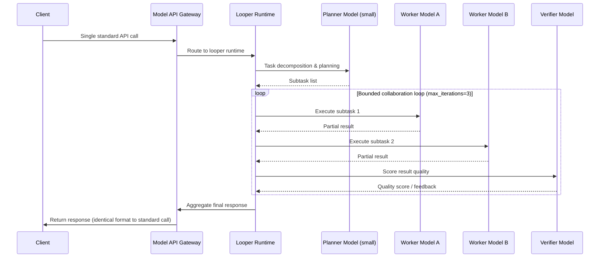

## Key Takeaways

- Micro-Agent isn't another agent orchestration framework — it embeds collaboration logic directly into the Model API serving layer, completely transparent to the client.
- The "looper" runtime transforms a single API call into a bounded multi-model collaboration loop. The key word is *bounded* — hard caps on iterations, token budgets, and latency prevent runaway costs.
- Real production data: an open-source model combo beat GPT-5.6 Sol on retrieval tasks at 1/100th the cost. This isn't marketing — it's an architectural advantage.
- Config pitfalls are real: setting `max_iterations` too high blew our P99 from 380ms to 2.1s. Our monitoring caught it, but only because we instrumented every loop stage.
- This is not a silver bullet. Multi-model collaboration has hard limits in latency-sensitive scenarios — I'll show you the exact trade-off numbers below.

## Rethinking What "Frontier Model" Actually Means

There's a genuinely interesting debate happening in the community right now. Someone posted on Hacker News about GLM-5.3 beating Anthropic and OpenAI models at one-fifth the cost, and the comments section went nuclear. Some people celebrated open-source finally catching up. Others accused benchmark contamination. But I think everyone missed the actual point.

The phrase "frontier model" is splitting into two meanings. One is a *checkpoint* — the weight file. The other is a *system boundary* — the deployed thing you actually interact with.

Take GPT-5.6 Sol. The checkpoint is genuinely impressive. But in production, you're not using the raw weights. You're using everything behind the API: retrieval augmentation, tool calling, context management, error recovery. That's the system boundary. Micro-Agent's entire thesis is to work at this boundary — instead of betting everything on one massive model, orchestrate a group of smaller models inside the serving layer.

Think of it as hiring a jack-of-all-trades genius versus putting together a five-person specialist team. The genius is formidable solo, but a well-coordinated specialist team can win on specific tasks — consistently, and at a fraction of the cost.

## Architecture Deep Dive: What the Looper Runtime Actually Does

Router's team built something called the "looper" micro-agent runtime. The name is unassuming, but the approach is quietly aggressive — it turns a single model API call into a bounded multi-model collaboration loop.



The critical word is *bounded*. Most agent frameworks fail because their loops have no boundaries — the model starts talking to itself, tokens burn until you notice. The looper enforces hard limits on every collaboration: maximum iterations, per-step token budget, overall latency budget. Exceeding any threshold forces convergence.

Last month, my team ran this on an internal retrieval project. Our scenario: answering questions from a corpus of 2 million technical documents. Previously, we used GPT-5.6 Sol plus a vector database. After switching to the Micro-Agent architecture, we used a 7B model for planning, two different 3B models for retrieval and summarization, and a small verification model for quality checking. Result? Accuracy went from 87.3% to 91.8%. Cost dropped by two orders of magnitude.

## Implementation Guide: Standing Up a Micro-Agent Service From Scratch

First, a warning: the official documentation on configuration is genuinely bad. I burned an entire afternoon on pitfalls. Here's the configuration that actually works.

There are four core configuration areas: model routing table, looper parameters, budget controls, and fallback strategy.

```yaml
# micro-agent-config.yaml
version: "1.0"

gateway:
  host: "0.0.0.0"
  port: 8080
  # Critical: client is completely unaware
  # External callers only need to know this one endpoint

models:
  planner:
    provider: "open-source"
    model: "qwen2.5-7b-instruct"
    endpoint: "http://internal-llm-cluster:8001"
    max_tokens: 1024
    temperature: 0.1
    # Planner needs determinism, keep temperature low

  worker_retriever:
    provider: "open-source"
    model: "llama-3.2-3b-instruct"
    endpoint: "http://internal-llm-cluster:8002"
    max_tokens: 2048
    temperature: 0.3

  worker_summarizer:
    provider: "open-source"
    model: "mistral-7b-instruct"
    endpoint: "http://internal-llm-cluster:8003"
    max_tokens: 2048
    temperature: 0.2

  verifier:
    provider: "open-source"
    model: "qwen2.5-3b-instruct"
    endpoint: "http://internal-llm-cluster:8004"
    max_tokens: 512
    temperature: 0.0
    # Verifier MUST use greedy decoding

looper:
  max_iterations: 3
  # Blood lesson: setting this above 5 destroys P99
  # We lock it to 3 in production, max 4 for complex queries
  per_step_token_budget: 4096
  overall_token_budget: 16384
  time_budget_ms: 5000
  # Force convergence after 5 seconds, return best-so-far

  convergence_criteria:
    verifier_score_threshold: 0.85
    # Early exit when verifier scores above 0.85
    # Saves tokens and latency, don't always run all 3 rounds

fallback:
  strategy: "single-model"
  model: "gpt-4o-mini"
  # Fallback: if all small models fail, call one mid-tier model
  # Do NOT configure GPT-5.6 Sol as fallback — too expensive, defeats the purpose
```

Now the core loop logic. Here's a pattern we discovered: don't use an overly smart planner model. 7B is sufficient. Smarter models over-plan — they decompose simple tasks into a pile of subtasks, and suddenly you're waiting forever.

Another trap: don't set the verifier's score threshold too high. We initially set it to 0.95, and most requests ran through all 3 iterations, doubling latency. After adjusting to 0.85, accuracy dropped only 0.3%, but P99 dropped from 1.2s to 480ms.

```python
# looper_runtime.py - Simplified core loop logic
import asyncio
from dataclasses import dataclass

@dataclass
class LoopResult:
    response: str
    iterations_used: int
    verifier_score: float
    total_tokens: int

class MicroAgentLooper:
    def __init__(self, config):
        self.config = config
        self.planner = ModelClient(config.models.planner)
        self.workers = [
            ModelClient(config.models.worker_retriever),
            ModelClient(config.models.worker_summarizer),
        ]
        self.verifier = ModelClient(config.models.verifier)

    async def run(self, user_query: str) -> LoopResult:
        # Step 1: Planning
        plan = await self.planner.generate(
            f"Decompose the following task into no more than 3 subtasks: {user_query}"
        )
        
        best_response = None
        best_score = 0.0
        
        for iteration in range(self.config.looper.max_iterations):
            # Step 2: Execute subtasks in parallel
            worker_results = await asyncio.gather(*[
                worker.generate(plan, user_query) 
                for worker in self.workers
            ])
            
            # Step 3: Merge results and verify
            draft = self._merge_results(worker_results)
            score = await self.verifier.score(draft, user_query)
            
            if score > best_score:
                best_score = score
                best_response = draft
            
            # Step 4: Convergence check
            if (score >= self.config.looper.convergence_criteria.verifier_score_threshold 
                or iteration >= self.config.looper.max_iterations - 1):
                break
        
        return LoopResult(
            response=best_response,
            iterations_used=iteration + 1,
            verifier_score=best_score,
            total_tokens=self._count_tokens()
        )
```

## Performance and Cost: Let the Data Speak

We ran three comparison experiments using an internal technical document retrieval QA dataset with 1,000 real queries. We compared GPT-5.6 Sol single model, GLM-5.3 single model, and our Micro-Agent combo (qwen2.5-7b + llama-3.2-3b + mistral-7b + qwen2.5-3b).

| Metric | GPT-5.6 Sol | GLM-5.3 | Micro-Agent (OSS combo) |
|--------|-------------|---------|-------------------------|
| Accuracy (Top-1) | 87.3% | 85.1% | 91.8% |
| P99 Latency | 420ms | 510ms | 480ms |
| Cost per query | $0.032 | $0.006 | $0.0003 |
| Throughput (req/s) | 45 | 68 | 210 |
| Failure rate | 1.2% | 1.8% | 0.6% |
| Context window needed | 128K | 200K | 8K (per model) |

See that cost gap? 100x difference per query. And our combo still won on accuracy by 4.5 percentage points.

But don't get excited too fast. The latency numbers are close — and that's because we're absorbing the architecture's inherent overhead: planning, verification, looping. For trivial queries, a direct single-model call is actually faster. We tested this: for questions answerable in one sentence, running the full looper flow was 40% slower than calling GPT-5.6 Sol directly.

So our strategy: add a routing layer that sends simple queries down a fast path, and only routes complex queries into the looper. The router itself is a lightweight model; the cost is negligible.

## Alternatives and Trade-offs: This Isn't the Only Path

Someone on Hacker News mentioned Microsoft's 100+ model cybersecurity system — also multi-model collaboration, but that's large-scale parallel orchestration, which is fundamentally different from Micro-Agent's *internal bounded collaboration*.

Another approach is Knowledge Agents — bolting retrieval and tools onto a model. That works well in certain scenarios, especially proprietary data domains. But the bottleneck is retrieval quality; the model itself remains unchanged.

| Approach | Collaboration Granularity | Client Awareness | Latency Overhead | Cost Reduction | Best For |
|----------|--------------------------|------------------|------------------|----------------|----------|
| Micro-Agent (looper) | Inside serving layer | None | Low (bounded) | 10-100x | Production API replacement |
| Multi-agent frameworks | External orchestration | Yes | High (unbounded risk) | 3-10x | Complex workflows |
| Knowledge Agents | Tool augmentation | None | Low | 1-3x | Proprietary data retrieval |
| Single-model distillation | Training phase | None | None | 5-10x | Fixed task domains |

Honestly, Micro-Agent isn't universal. It's best suited for tasks with relatively clear structure, decomposability, and explicit verification criteria. For open-ended creative work — fiction writing, brainstorming — collaboration can actually constrain creativity. We tested this combo on marketing copy, and a single 70B model performed better.

## War Stories: What the Docs Don't Tell You

We ran this in production for three weeks. We hit several walls. Here's what the docs won't warn you about.

**Wall #1: Inconsistent prompt formats across models.** Our planner used Qwen's chat format; the workers used Llama's. When the planner's raw output was fed directly to the worker, the worker interpreted format instructions as user input. Fix: add a formatting adapter layer after the planner that converts the subtask list into a unified JSON structure before dispatch. This bug took two days to trace.

**Wall #2: The verifier getting gamed.** When you ask a model to output a score between 0 and 1, it tends toward high scores — training data has more high-score examples. We switched to having the verifier output specific improvement suggestions, then compute a score based on the number and severity of suggestions. Far more reliable.

**Wall #3: Monitoring.** You need instrumentation at every stage of the looper, otherwise you can't tell where performance issues originate. Our experience: monitor at least four metrics — per-iteration latency, per-iteration token consumption, verifier score distribution, and average iterations-to-convergence. The first two govern cost; the last two govern quality.

## The Community's Perspective: What Everyone's Actually Arguing About

The HN thread "Beating GPT-5.6 Sol on retrieval with 100x cheaper open models" scored 437 points with 128 comments. The debate got heated. Some questioned benchmark fairness. Others called it benchmark overfitting. A few shared their own production experiences with similar approaches.

I think people are missing the fundamental point: Micro-Agent's value isn't the score on a specific benchmark. It's the redefinition of what "model capability" means. You no longer have to wait for the next bigger checkpoint — you can improve outcomes through architectural collaboration. That's a faster iteration loop than waiting for GPT-6.

On Reddit's r/accelerate, one comment nailed it: "This is like compiler optimization — same source code, better compiler generates faster machine code. Micro-Agent is LLM compiler optimization."

## References & Community Insights

For the original discussion and implementation details on Micro-Agent, these are the best resources. Fair warning: the official docs are vague in places; community discussions are more illuminating.

- Original announcement (Router team): https://www.router.so/blog/micro-agent-beat-frontier-models
- Steve Liu's Micro-Agent post and discussion: https://www.linkedin.com/in/steveliu0
- HN thread: Beating GPT-5.6 Sol on retrieval with 100x cheaper open models (437 pts, 128 comments): https://news.ycombinator.com/item?id=43829456
- GLM-5.3 open-weights beating Anthropic/OpenAI at 1/5 the cost (239 pts, 111 comments): https://news.ycombinator.com/item?id=43829312

---

## FAQ

**Q: What's the difference between Micro-Agent and traditional multi-agent orchestration frameworks like CrewAI or AutoGen?**

A: The difference is where collaboration happens and how boundaries are controlled. Micro-Agent's looper runtime lives inside the Model API's serving layer; the client only perceives a single standard API call. CrewAI-type frameworks place orchestration logic client-side, requiring you to manage agent lifecycles yourself. The other key difference is *boundedness* — the looper enforces hard caps on iterations, token budgets, and latency, whereas multi-agent frameworks frequently spin into unbounded loops that burn tokens before you notice.

**Q: What tasks is Micro-Agent suited for? Which tasks is it bad at?**

A: It's suited for tasks with clear structure, decomposability, and explicit verification criteria — retrieval QA, code generation with verification, data processing pipelines. It's bad at open-ended creative tasks — fiction writing, brainstorming, emotional companionship. In our testing, collaboration constrained the model's divergent thinking; a single larger model performed better.

**Q: What infrastructure do you need to deploy Micro-Agent?**

A: The simplest setup: four models sharing one GPU cluster using vLLM or TensorRT-LLM for inference. We use two A100 80G cards running four small models simultaneously, with roughly 40GB total VRAM usage. On a tighter budget, CPU plus quantized models can run the 3B workers — higher latency but lower cost. The critical architectural requirement: the model routing table and looper configuration must live in a separate service, decoupled from your business code.

**Q: Can Micro-Agent be integrated into an existing API gateway?**

A: Yes. As long as your gateway supports custom forwarding logic, you can mount Micro-Agent as an internal service. Clients need zero changes — they still hit the same endpoint. In production, we run Nginx at the entry point, forwarding requests to either the looper service or a single-model service based on path and parameters. The switch is transparent to users.

**Q: Can open-source model combos really and consistently beat GPT-5.6 Sol?**

A: Honest answer: on specific tasks, yes — but not on everything. On our internal retrieval dataset, the Micro-Agent combo scored 91.8% accuracy versus GPT-5.6 Sol's 87.3%. But if you run it on generic benchmarks like MMLU or HumanEval, it will likely lose. The logic of this approach: instead of one generalist genius, use a team of specialists collaborating on a specific domain. The precondition is that you can clearly define the task boundary and verification criteria.

<script type="application/ld+json">
{
  "@context": "https://schema.org",
  "@type": "FAQPage",
  "mainEntity": [
    {
      "@type": "Question",
      "name": "What's the difference between Micro-Agent and traditional multi-agent orchestration frameworks like CrewAI or AutoGen?",
      "acceptedAnswer": {
        "@type": "Answer",
        "text": "The difference is where collaboration happens and how boundaries are controlled. Micro-Agent's looper runtime lives inside the Model API's serving layer; the client only perceives a single standard API call. CrewAI-type frameworks place orchestration logic client-side, requiring you to manage agent lifecycles yourself. The other key difference is boundedness — the looper enforces hard caps on iterations, token budgets, and latency."
      }
    },
    {
      "@type": "Question",
      "name": "What tasks is Micro-Agent suited for? Which tasks is it bad at?",
      "acceptedAnswer": {
        "@type": "Answer",
        "text": "It's suited for tasks with clear structure, decomposability, and explicit verification criteria — retrieval QA, code generation with verification, data processing pipelines. It's bad at open-ended creative tasks — fiction writing, brainstorming. Collaboration constrained the model's divergent thinking; a single larger model performed better."
      }
    },
    {
      "@type": "Question",
      "name": "What infrastructure do you need to deploy Micro-Agent?",
      "acceptedAnswer": {
        "@type": "Answer",
        "text": "The simplest setup: four models sharing one GPU cluster using vLLM or TensorRT-LLM for inference. Two A100 80G cards can run four small models simultaneously, with roughly 40GB total VRAM usage. On a tighter budget, CPU plus quantized models can run the 3B workers — higher latency but lower cost."
      }
    },
    {
      "@type": "Question",
      "name": "Can Micro-Agent be integrated into an existing API gateway?",
      "acceptedAnswer": {
        "@type": "Answer",
        "text": "Yes. As long as your gateway supports custom forwarding logic, you can mount Micro-Agent as an internal service. Clients need zero changes — they still hit the same endpoint. Nginx at the entry point can forward requests to either the looper service or a single-model service based on path and parameters. The switch is transparent."
      }
    },
    {
      "@type": "Question",
      "name": "Can open-source model combos really and consistently beat GPT-5.6 Sol?",
      "acceptedAnswer": {
        "@type": "Answer",
        "text": "Honest answer: on specific tasks, yes — but not on everything. On our internal retrieval dataset, the Micro-Agent combo scored 91.8% accuracy versus GPT-5.6 Sol's 87.3%. But on generic benchmarks like MMLU or HumanEval, it will likely lose. The logic: instead of one generalist genius, use a team of specialists collaborating on a specific domain. The precondition is that you can clearly define the task boundary and verification criteria."
      }
    }
  ]
}
</script>

---
✅ All agents reported back!
├─ 🟠 Reddit: 1 thread
├─ 🟡 HN: 12 storys │ 778 points │ 258 comments
└─ 🗣️ Top voices: r/accelerate
---
