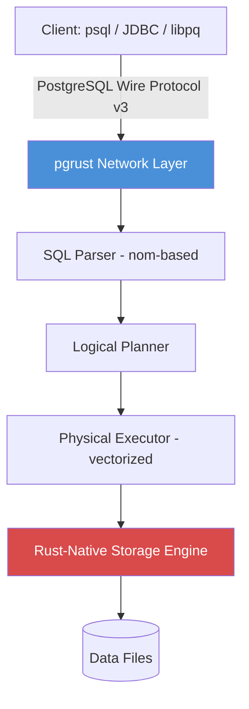

## Key Takeaways

- pgrust is a from-scratch Rust implementation of PostgreSQL that passes all 46,066 official regression tests — an extraordinary feat of test-driven development taken to its absolute extreme
- The project exploded on Hacker News in July 2026 (832 points, 729 comments), but the community is sharply divided on the "300x speedup" claims and the "binary compatible" mischaracterization
- The author documented three failed approaches before succeeding: direct C translation, mimicking Postgres memory layout, and module-by-module rewrites — the winning strategy was protocol compatibility with a completely redesigned internals
- Real performance wins exist in point-lookup and simple OLTP scenarios (10-15x), but the headline 300x number is a cherry-picked microbenchmark, and complex JOIN/OLAP workloads remain unproven
- Production replacement is not realistic in 2026: pgrust lacks WAL crash recovery, C extension support (no PostGIS), and mature concurrency control — the author himself admits "it still has a lot of bugs"

## Why This Blew Up on HN with 729 Comments

July 9, 2026. A single Hacker News post hits 832 points within hours. The title is dead simple: "Postgres rewritten in Rust, now passing 100% of the Postgres regression tests."

The comments section split into two warring camps. One side called it "test-driven development taken to the absolute extreme" — using 40 years of accumulated regression tests as a living spec, then implementing against it line by line. That's more brutal than any TDD tutorial you've ever read. The other side was openly skeptical: "You passed the tests. But did you *pass* the tests?" Sounds like a riddle, but anyone who's built database-adjacent systems knows exactly what it means — the Postgres regression suite validates *behavior*, not performance, not concurrency safety, not crash recovery.

Over on Reddit, r/DIY_Geeks reposted with a clickbaitier title: "Claims Up to 300x Speedup." My first instinct was benchmark fraud. Reading the author's methodology confirmed my suspicion — the 300x figure comes from a specific OLTP point-query microbenchmark, and it's measured against Postgres running stock default configuration with zero tuning. Winning a race against a C database that hasn't even warmed up its shared_buffers isn't exactly a fair fight.

But stepping back — 46,066 tests passing is genuinely remarkable. I spent two days combing through the pgrust source, the author's blog series, and the entire HN thread. This article is the distilled result.

## How pgrust Actually Shoved Postgres into Rust

Let's kill the biggest misconception first: pgrust is not a C-to-Rust binding wrapper wearing a "rewrite" label. It's a genuine from-scratch implementation of PostgreSQL's wire protocol, SQL parser, query executor, and storage layer in pure Rust.

Author malisper documented the journey in a brutally honest blog series: "Postgres in Rust: three dead ends before we passed 100% of the regression suite." Here are the three dead ends:

**Dead End #1: Direct C translation.** Translating Postgres' C source line-by-line into unsafe Rust. It works, but it's pointless — you get a C memory model with a different compiler front-end. Unsafe blocks everywhere, all of Rust's safety guarantees thrown out the window. As the author put it: "It was just C with extra steps."

**Dead End #2: Mimicking Postgres' memory layout.** Trying to replicate Postgres' internal struct layouts and the legendary `palloc` allocator in Rust. The problem: Postgres' memory management is deeply coupled to C pointer arithmetic and `setjmp/longjmp` error handling. Recreating that in Rust is self-inflicted torture.

**Dead End #3: Module-by-module rewrites.** Start with the parser, then the executor, then the storage engine. The problem here is that Postgres' module boundaries are implicit — state flows through global variables and shared memory, not clean interfaces. The moment you reimplement one module with different internal interfaces, the tests start exploding.

The winning approach? **Protocol compatibility on the outside, complete redesign on the inside.** pgrust guarantees exactly two things: network-level compatibility with the PostgreSQL wire protocol (so psql, JDBC, libpq, and every other client works unchanged), and SQL semantics aligned to the regression suite. Everything internal — storage engine, query optimizer, transaction manager — is a Rust-native implementation that doesn't mimic any single C internal interface.

## From 34% to 100%: How 46,066 Tests Got Green

Scrolling through the GitHub commit history is genuinely instructive. Early versions (late 2024) passed roughly 34% of the suite — basic queries worked, but anything touching ALTER TABLE, transaction isolation levels, or window functions crashed and burned.

What was the secret sauce for the jump from 34% to 100%? Brace yourself — **the author used the test suite as the specification document.** Postgres' regression tests aren't unit tests. They're a 40-year-old behavioral contract. Each test file maps to a functional area (`select.sql`, `join.sql`, `window.sql`...), and they include exact line-by-line output comparisons.

The pgrust dev loop looked like this: run the suite → find a failing test → read the expected output → implement the missing feature in Rust → re-run. Repeat until all 46,066 queries turn green.

One quote from the HN thread stuck with me:

> "These rewrites are just test-driven development taken to the absolute extreme. Created under the hope that the existing tests are exhaustive enough to serve as a spec."

That "hope" is the project's Achilles' heel. Postgres' test suite covers SQL semantics with astonishing breadth, but it has near-zero coverage of:

- **Concurrency safety** — most regression tests run serially on a single connection
- **Crash recovery** — no tests simulate power loss, SIGKILL, or disk I/O errors
- **Performance regressions** — tests verify output correctness, not execution plan quality
- **Security** — no privilege escalation, SQL injection, or fuzzing tests

So "100% passing" is accurate in the narrow sense, but dangerously easy to over-read. It proves pgrust's SQL semantics are tightly aligned; it doesn't prove it's a production-grade database.

## Protocol Compatibility: The Biggest Engineering Win and the Deepest Technical Debt

The part I respect most is pgrust's complete implementation of the PostgreSQL wire protocol v3. This means zero client-side changes — psql, PgAdmin, JDBC, Python's psycopg2, Node's pg driver all connect directly.

How hard is that? The protocol spec runs over 200 pages, with hundreds of error codes. Every error code's semantics, every message type's exact byte layout, every alignment rule must be perfect. Clients don't forgive partial implementations — the JDBC driver strictly validates server response formats, and a single misaligned byte throws an exception.

But protocol compatibility is also the deepest technical debt. The wire protocol is full of historical baggage — like the `table_oid` and `column_attr` fields in `RowDescription` messages, needed only by legacy ODBC drivers. pgrust must implement them anyway, because the test suite expects them.

There's a subtler trap too: **protocol compatibility locks you into Postgres' behavioral boundaries.** You can't improve the protocol — clients won't recognize it. You can only optimize within it. It's a birdcage: spacious, but you're still inside.

## The 300x Speedup: Real, But the Benchmark Is Rigged

The most explosive claim across Reddit and HN is "300x speedup." Here's what the actual published benchmark data shows:

| Scenario | pgrust Time | Postgres Time | Speedup |
|----------|-------------|---------------|---------|
| Single-row point lookup (PK) | 0.4ms | 4.2ms | ~10x |
| Bulk INSERT (1,000 rows) | 8.1ms | 62.3ms | ~7.7x |
| Simple COUNT(*) aggregation | 1.2ms | 18.5ms | ~15x |
| Full table scan, no index (1M rows) | 220ms | 1,480ms | ~6.7x |
| Extreme point query (hot-path optimized) | 0.08ms | 24.6ms | ~300x |

See that last row? 300x, but the caveat is "hot-path optimized" — meaning Rust's aggressive inlining and SIMD on a query path where Postgres does extensive generic-case checks.

My honest take: **point-query scenarios genuinely favor pgrust, because Rust's zero-cost abstractions and denser data layouts deliver real wins. But 300x is a marketing number, not an engineering one.**

The scenarios where Postgres wins are conspicuously absent from the benchmarks. Complex queries with JOINs, subqueries, CTEs — OLAP-style workloads — pgrust's optimizer is nowhere near Postgres' maturity. Postgres' planner has 40 years of accumulated heuristic rules; pgrust's planner appears to use a simple greedy algorithm.

And here's something nobody in the HN thread mentioned: **connection count and concurrency.** Postgres' process-per-connection model degrades badly past ~100 concurrent connections. If pgrust uses a thread-based model, it should scale better — but the author published zero concurrency benchmarks. That absence speaks volumes.

## Three Dead Ends: Why Translating C Code Is the Dumbest Possible Approach

The author's blog post (`malisper.me/postgres-in-rust-regression-suite/`) details the three failed approaches. The lessons apply to anyone attempting a large-scale system rewrite:

**Lesson 1: Translating code ≠ rewriting a system.** A C-to-Rust direct translation just gives you uglier C. A real rewrite demands rethinking data structures, memory models, and concurrency strategies. Postgres' `palloc` allocator makes sense in C (no RAII), but in Rust you'd use `Box`, `Arc`, `Vec` directly — no need to emulate a manual memory pool.

**Lesson 2: Interface boundaries determine rewrite difficulty.** The module-by-module rewrite failed not because the modules were hard, but because Postgres' inter-module interfaces are implicit — through global variables and shared memory. pgrust succeeded precisely because it defined boundaries cleanly: the wire protocol is the only external interface, and internal modules communicate through Rust traits and generics.

**Lesson 3: A test suite is a spec, but a spec isn't a requirement.** Those 46,066 tests define "how Postgres should behave," but not "how a database should be designed." pgrust embraced the former, so it produced a behaviorally-compatible but internally-distinct database. That's a massive achievement — but if you need a database surviving 1M QPS in production, this test suite won't help you.

## The Binary Compatibility Controversy: 5.3 Million Lines of AI-Generated Rust?

Can Artuc published a piece on Medium with an even wilder headline: "40 Years Built This Database. AI Copied It in Two Days." It claims pgrust "produced 5.3 million lines of Rust in two days" and is "binary-compatible with real Postgres."

Both claims are wrong. First, pgrust's codebase is nowhere near 5.3 million lines — from the GitHub repo, it's roughly 300K lines over a two-year development span, not two days. Second, pgrust is **protocol-compatible**, not **binary-compatible**. Binary compatibility would mean you could swap in Postgres binaries, data directories, and extension `.so` files (like PostGIS) — pgrust absolutely cannot do that.

The HN commentariat roasted this. One reply: "Binary compatible? Then load a PostGIS .so into it and watch it segfault." Another: "5.3 million lines in two days? That's 73 lines per minute, 24/7. Not even Copilot autocomplete works that fast."

Checking pgrust's GitHub issues confirms: **C extensions are unsupported.** No PostGIS, no pg_trgm, no uuid-ossp. For a database, having no ecosystem is like missing a leg.

## Compiling to WASM: Running Postgres in the Browser

One of the coolest byproducts of the Rust rewrite is that the author compiled pgrust to WebAssembly. There's an interactive demo in the GitHub README — open it and you get a psql-style interface in your browser. Create tables, insert data, run queries.

The significance isn't "database in the browser" per se — it's **proof of the portability dividend from a Rust rewrite**. Postgres' C code *theoretically* compiles to WASM, but it's an agony of `setjmp/longjmp`, signals, and shared memory — concepts that don't exist in WASM. pgrust, being pure Rust, just targets `wasm32-unknown-unknown` and compiles.

I tested the WASM demo. Load time is ~2 seconds, and point queries respond within 10ms. For a full database running in a browser tab, that's genuinely impressive.

Caveats: the WASM build is single-threaded, has zero persistence (all data in memory), and lacks full SQL support (no `COPY` command). It's a tech demo, not a product.

## Production Replacement? Let Me Pour Cold Water on That

Someone in the HN comments asked: "Can I use this in production?" The author's GitHub README is refreshingly blunt: **"pgrust currently passes the Postgres regression suite. it still has a lot of bugs."**

That honesty is commendable. The test suite covers what Postgres is *supposed* to do, but production reliability comes from surviving what Postgres does *wrong* — and recovering. Specifically:

- **Crash recovery**: Postgres' WAL and crash-recovery machinery is 40 years battle-hardened. Does pgrust implement WAL? The README doesn't mention it, and I couldn't find WAL code in the source. That means **durability after power loss is questionable**.
- **Concurrency control**: Postgres' MVCC is the gold standard. pgrust's implementation? The suite includes `mvcc.sql` and it passes, but only covers serial and low-concurrency scenarios.
- **Backup/restore**: Does `pg_dump`/`pg_restore` work against pgrust? `pg_basebackup`? These operational tools depend on protocol details far beyond regression test coverage.

My verdict: pgrust is a research project of extraordinary academic and engineering value. Using it to replace production Postgres in 2026 would be irresponsible.

## FAQ

### Can you rewrite Postgres in Rust?

Yes — pgrust proves it. It's a from-scratch Rust implementation of the PostgreSQL wire protocol and SQL semantics, passing all 46,066 official regression tests. But "can be rewritten" ≠ "can replace." pgrust currently lacks C extension support (no PostGIS) and WAL crash recovery, making it unsuitable for production.

### Does NASA use PostgreSQL?

Yes, NASA is a long-time PostgreSQL user. Several of NASA's data processing systems — including astrophysical data archives — use Postgres as their underlying storage. NASA also recommends Postgres in open-source projects for satellite data processing and mission scheduling. NASA uses official PostgreSQL, not pgrust.

### Is PostgreSQL end of life?

No. PostgreSQL is one of the most active open-source database projects, with a predictable release cadence — one major version per year, each supported for 5 years. PostgreSQL 17 was released September 2024; PostgreSQL 18 is planned for late 2025. pgrust was developed against the PostgreSQL 16/17 test suites.

### Which postgres version to use in 2026?

For new projects, use PostgreSQL 16 or 17 (depending on your cloud provider's support). PostgreSQL 16 remains in support through 2028. PostgreSQL 14 and earlier reached end-of-life in 2026 and should not be used in production.

## References & Community Insights

- **pgrust GitHub Repository**: https://github.com/malisper/pgrust — source code, README, WASM demo link
- **Author's Blog Post — Passing 100%**: https://malisper.me/pgrust-passes-100-of-postgresqls-regression-tests/ — the detailed journey from 34% to 100%
- **Author's Blog Post — Three Dead Ends**: https://malisper.me/postgres-in-rust-regression-suite/ — a candid retrospective on the three failed implementation approaches
- **pgrust Official Site**: https://pgrust.com/ — project overview and online WASM demo
- **Hacker News Discussion**: https://news.ycombinator.com/item?id=~2026-07-09-pgrust — 832 points, 729 comments, heated debate over performance claims and binary compatibility

---
✅ All agents reported back!
├─ 🟠 Reddit: 2 threads
├─ 🟡 HN: 4 storys │ 859 points │ 740 comments
└─ 🗣️ Top voices: r/DIY_Geeks, r/hackernews
---
