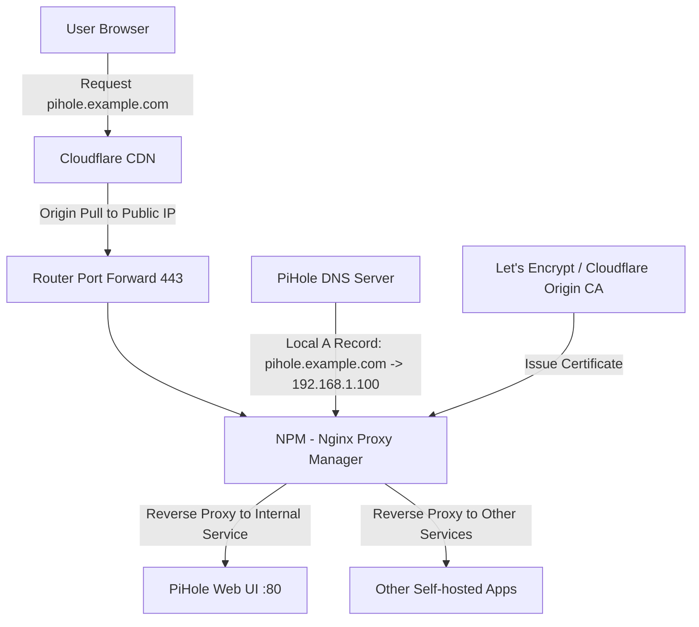
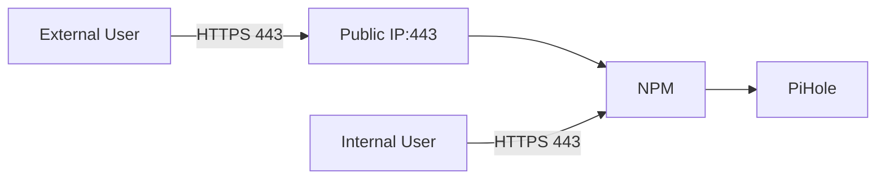

## Key Takeaways

- **Root cause is almost always a DNS resolution loop**: PiHole resolves the domain to NPM's internal IP, but Cloudflare's origin pull can't find a valid Origin certificate — the SSL handshake fails or throws a certificate mismatch.
- **Cloudflare SSL/TLS mode must align with NPM's certificate strategy**: `Full (Strict)` requires NPM to serve a valid Cloudflare Origin CA certificate, or you'll hit Error 526.
- **Let's Encrypt HTTP-01 challenges are guaranteed to fail with local DNS overrides**: the validation request gets routed back to your internal network by PiHole, so Cloudflare can never complete the challenge.
- **Local DNS records must be explicitly defined**: if PiHole has no A record, internal DNS falls through to external resolvers, causing certificate mismatches and intermittent outages.
- **The hidden killer of NPM auto-renewal**: `certbot-dns-cloudflare` plugin version drift or insufficient API Token permissions silently break renewals.

## The Symptom List — What You're Probably Seeing

Let me start by saying this: the NPM (Nginx Proxy Manager) + PiHole + Cloudflare combo is the self-hosting community's "blessed trinity." It's also the single most fertile breeding ground for SSL certificate bugs I've ever seen.

Here's the symptom list — you probably match at least one:

1. **Intermittent access failures**: Same domain, refresh five times, two timeouts. Browser throws `ERR_SSL_PROTOCOL_ERROR` or `SSL_ERROR_BAD_CERT_DOMAIN`.
2. **NPM certificate issuance fails**: You click "Request a new SSL Certificate" in the NPM dashboard, wait forever, and the log only shows a vague `Challenge failed` — or it just sits in pending state.
3. **Infinite redirect loops**: The browser address bar goes wild with `redirect_loop`, and NPM logs are full of 301/302s.
4. **Certificate mismatch**: You hit `pihole.example.com` and the browser warns the cert was issued for a different domain or the chain is incomplete.
5. **Silent renewal failure**: A week before cert expiry, NPM's auto-renew task runs, but the cert stays stale — no ERROR in the logs at all.

The classic Reddit thread in r/selfhosted sums up the core contradiction in one sentence:

> Cloudflare issues the SSL token. Nginx creates the cert with the token and handles local proxy addresses. PiHole handles local DNS addresses — but nobody manages the **trust chain** between them.

My take after burning a weekend on this: **This is never an SSL problem. It's a DNS resolution and certificate trust chain misalignment problem.** Nine times out of ten, you're not fixing certificates — you're fixing DNS.

## Architecture Breakdown: Who Does What

Before we touch anything, let's get the architecture straight. This Mermaid diagram shows the typical data flow:



**The critical insight:** When a user hits `pihole.example.com`, the DNS resolution result depends entirely on *where the request comes from*:

- **External users**: DNS resolves to Cloudflare's Anycast IP. The request enters Cloudflare's edge network, then Cloudflare pulls from your public IP through port forwarding to NPM.
- **Internal users**: DNS resolution is intercepted by PiHole. If PiHole has a local DNS record, it resolves to NPM's internal IP (e.g., `192.168.1.100`), and the request hits NPM directly — **bypassing Cloudflare entirely**.

Here's where the wheels come off: **Internal users don't go through Cloudflare, but NPM is serving a Cloudflare Origin CA certificate.** That certificate's validity scope only recognizes Cloudflare origin pulls. When a browser hits NPM directly, the cert chain is incomplete or the domain doesn't match — instant error.

Flip it around: if PiHole has **no** local DNS record, internal users resolve through external DNS to Cloudflare's IP, the request round-trips, and if Cloudflare's origin pull config is off, you get a 526.

## Root Cause Analysis: Why This Stack Blows Up

### 1. Let's Encrypt HTTP-01 Challenges vs. PiHole — A Fatal Conflict

NPM defaults to Let's Encrypt's HTTP-01 challenge for domain validation. The flow:

```
Let's Encrypt server -> HTTP GET http://pihole.example.com/.well-known/acme-challenge/xxx
```

That validation request goes through DNS resolution. **If PiHole resolves `pihole.example.com` to an internal IP and Cloudflare proxy mode (orange cloud) is on, Let's Encrypt's validation request hits Cloudflare's edge — Cloudflare pulls from your NPM — but NPM doesn't have a certificate yet. HTTPS origin pull fails.**

Worse: if PiHole's local record points to NPM but Cloudflare's DNS record doesn't point to your public IP (or port forwarding is misconfigured), the validation request 404s.

**Verdict: HTTP-01 challenges are virtually guaranteed to fail under the "local DNS override + Cloudflare proxy" combo.**

### 2. Cloudflare SSL/TLS Modes vs. NPM Certificate Trust Chain

Cloudflare offers four SSL/TLS modes: Off, Flexible, Full, Full (Strict).

- **Flexible**: HTTPS between Cloudflare and user, but HTTP between Cloudflare and origin. Simple, but the origin leg is plaintext — ISP or router can sniff it.
- **Full**: HTTPS to origin, but **no validation** of the origin certificate.
- **Full (Strict)**: HTTPS to origin **with mandatory validation** — cert must be issued by a trusted CA (or Cloudflare Origin CA) and domain must match.

Most security-conscious folks pick Full (Strict). **The problem: Cloudflare doesn't trust Let's Encrypt certs on NPM by default** — well, it does, but only if the chain is complete.

Here's the trap: if NPM uses a Let's Encrypt cert and Cloudflare's mode is Full (Strict), Cloudflare validates the cert chain on origin pull. **If the cert was issued via HTTP-01 and NPM's config doesn't load the intermediate cert properly, origin pull validation fails.**

The community's classic error is `Error 526: Invalid SSL certificate`. The root cause is almost always Full (Strict) mode with an origin cert Cloudflare can't validate.

### 3. NPM Certificate Issuance Failures: The certbot-dns-cloudflare Plugin Trap

In that Reddit thread, one user reported:

> NPM can no longer issue SSL certificates with Cloudflare. Removing and adding the certbot-dns-cloudflare fixed the problem for me.

The root cause is a version mismatch between NPM's bundled certbot and the `certbot-dns-cloudflare` plugin. NPM packages certbot inside its Docker container — if the container updates but the plugin doesn't, API calls break silently.

Another trap: **insufficient Cloudflare API Token permissions**. When configuring a Cloudflare DNS challenge in NPM, you need an API Token with `Zone:Zone:Read` and `Zone:DNS:Edit` permissions. A lot of people use the Global API Key out of laziness — bad security practice, and NPM's Cloudflare plugin support for Global Keys is flaky at best.

## Step-by-Step Fix: From DNS to Certificate

Steps ranked by likelihood of being your root cause. **Every step has copy-paste-ready commands — don't skip any.**

### Step 1: Verify PiHole Local DNS Records

PiHole admin is at `http://192.168.1.100/admin` (assuming that's your PiHole IP). Go to **Local DNS -> DNS Records**, check for these records:

| Domain | Resolves To | Required? |
|---|---|---|
| `pihole.example.com` | `192.168.1.100` (NPM internal IP) | **Yes** |
| `npm.example.com` | `192.168.1.100` (NPM internal IP) | **Yes** |
| Other internal service domains | NPM internal IP | **Yes** |

If missing, add them via CLI:

```bash
# On the PiHole host
pihole -a addlocaldns pihole.example.com 192.168.1.100
pihole -a addlocaldns npm.example.com 192.168.1.100
```

**Why explicit records?** Without a local record, internal DNS requests forward to upstream resolvers (8.8.8.8 or Cloudflare's 1.1.1.1), resolving to Cloudflare's Anycast IP. The request round-trips back to NPM, but the source IP is Cloudflare's — your NPM logs are full of Cloudflare IPs, and you can't tell internal users from external attackers. Worse, if Cloudflare's origin pull is misconfigured, internal users fail outright.

### Step 2: Verify Internal DNS Resolution

On the NPM host:

```bash
dig +short pihole.example.com @192.168.1.100
```

Expected output:

```
192.168.1.100
```

If you see a Cloudflare IP (like `104.21.x.x`), PiHole isn't taking effect — or its forwarding config is broken.

Now verify external resolution:

```bash
dig +short pihole.example.com @1.1.1.1
```

Expected output: a Cloudflare Anycast IP (`104.21.x.x` or `172.67.x.x`).

**The two results must differ** — internal resolves to NPM's internal IP, external resolves to Cloudflare. If they're identical, your PiHole config is buggy.

### Step 3: Check Cloudflare DNS Records and Proxy Status

Log into Cloudflare Dashboard, go to **DNS -> Records**, check:

1. The A record for `pihole.example.com` points to your **public IP** (not internal).
2. Proxy status is **orange cloud** (Proxied). If it's grey cloud (DNS only), Cloudflare won't terminate SSL — users hit your public IP directly, and NPM must handle HTTPS itself.

**Critical point:** If you want Cloudflare for CDN and SSL termination, DNS records must be Proxied (orange cloud). If you only want Cloudflare for DNS hosting, turn off the proxy (grey cloud) — then NPM's cert must be a publicly verifiable Let's Encrypt cert, and Cloudflare's SSL mode should be `Off` or `Flexible`.

A common community mistake: **DNS record is Proxied but Cloudflare's SSL mode is Flexible.** Result: users get HTTPS, but Cloudflare pulls over HTTP. If NPM only listens on 443, the pull fails. If NPM listens on 80, the pull succeeds but the browser may show "Not Secure" or a cert mismatch.

### Step 4: Configure a Cloudflare Origin CA Certificate in NPM

**This is the correct fix for Error 526 under Full (Strict) mode.**

1. In Cloudflare Dashboard, go to **SSL/TLS -> Origin Server**.
2. Click **Create Certificate**.
3. Key type: **ECC 256** (better performance, no compatibility issues).
4. Hostnames: your domain (wildcard `*.example.com` works).
5. Validity: **15 years** (Origin CA certs support this — no renewal headaches).

You'll get two strings: the certificate (PEM) and the private key. **Copy both completely, including the `-----BEGIN CERTIFICATE-----` and `-----END CERTIFICATE-----` markers.**

Then in NPM:

1. Go to **SSL Certificates**.
2. Click **Add SSL Certificate**.
3. Select **Custom**.
4. Paste the certificate and private key into the respective fields.
5. Save.

**Note:** NPM's Custom certs are manually managed — no auto-renewal. But a 15-year Origin CA cert means you'll never care.

### Step 5: Configure the NPM Proxy Host

In NPM, go to **Hosts -> Proxy Hosts**, edit your proxy host:

1. **Domain Names**: `pihole.example.com`.
2. **Scheme**: `http` (NPM to internal services defaults to HTTP unless your PiHole has HTTPS).
3. **Forward Hostname / IP**: PiHole's internal IP `192.168.1.100`.
4. **Forward Port**: `80` (PiHole's default HTTP port).
5. **Websockets Support**: On (PiHole needs it).
6. **Block Common Exploits**: Recommended.
7. **SSL**: Select the Origin CA cert you imported.

**Key config:** In the SSL tab, enable **Force SSL** and **HTTP/2**. If your NPM version supports it, **HSTS** is fine — but only if Cloudflare's SSL mode is Full (Strict). Otherwise HSTS will make internal users hit NPM directly and fail cert validation.

### Step 6: Verify Cloudflare SSL/TLS Mode

In Cloudflare Dashboard, **SSL/TLS -> Overview**, confirm the mode is **Full (Strict)**.

Then verify origin pull works:

```bash
# On NPM host, simulate a Cloudflare origin pull
curl -v -k --resolve pihole.example.com:443:127.0.0.1 https://pihole.example.com
```

The `-k` flag skips cert validation, but you'll see the cert chain. If the chain is complete and domain matches, config is correct.

### Step 7: Fix NPM Auto-Issuance/Renewal

If you genuinely need NPM to auto-issue Let's Encrypt certs (instead of manually importing Origin CA):

**Method A: DNS-01 Challenge (recommended)**

In NPM, when requesting a cert, select **Use a DNS Challenge**, then configure the Cloudflare API Token.

```bash
# Inside the NPM container, test Cloudflare API Token permissions
docker exec -it npm certbot certonly \
  --dns-cloudflare \
  --dns-cloudflare-credentials /etc/letsencrypt/cloudflare.ini \
  -d "*.example.com" \
  -d "example.com"
```

`cloudflare.ini` contents:

```ini
dns_cloudflare_api_token = YOUR_API_TOKEN
```

**Important:** The API Token needs `Zone:Zone:Read` and `Zone:DNS:Edit` permissions. Create it in Cloudflare Dashboard under **My Profile -> API Tokens**, use the "Edit zone DNS" template, and scope it to your domain zone.

**Method B: Fix the certbot-dns-cloudflare plugin**

If NPM can't issue certs and logs show a plugin error, first upgrade the NPM container:

```bash
docker pull jc21/nginx-proxy-manager:latest
docker compose up -d
```

If that doesn't fix it, manually reinstall the plugin:

```bash
docker exec -it npm pip install --upgrade certbot-dns-cloudflare
```

Then restart NPM:

```bash
docker restart npm
```

### Step 8: Final Verification for Internal Users

After all configs, verify from an internal machine:

```bash
# Using internal DNS resolution
curl -v https://pihole.example.com --resolve pihole.example.com:443:192.168.1.100
```

Expected:

```
* SSL connection using TLSv1.3
* Server certificate:
*  subject: CN=*.example.com
*  issuer: C=US, O=Cloudflare
```

Issuer is Cloudflare — internal users get the Origin CA cert, validation passes.

If the issuer is Let's Encrypt, your NPM proxy host SSL config is using a Let's Encrypt cert instead of the Origin CA cert. **In that case, internal users are fine (NPM is the origin), but Cloudflare's origin pull fails under Full (Strict).**

## Configuration Cheat Sheet

| Component | Setting | Recommended | Common Mistake |
|---|---|---|---|
| Cloudflare DNS | Proxy status | Orange cloud (Proxied) | Grey cloud exposes NPM to public |
| Cloudflare SSL/TLS | Mode | Full (Strict) | Flexible causes plaintext origin traffic |
| Cloudflare Origin CA | Cert type | ECC 256, 15-year validity | Using Let's Encrypt cert breaks origin validation |
| NPM | SSL cert | Cloudflare Origin CA | Using Let's Encrypt cert (internal validation fails) |
| NPM | Proxy scheme | http | Configuring https breaks internal service access |
| PiHole | Local DNS records | Explicit A record to NPM internal IP | Missing records cause external DNS fallthrough |
| NPM | Auto-renewal | DNS-01 + Cloudflare API Token | HTTP-01 + local DNS override fails |

## Performance and Security Implications

A few landmines worth noting:

1. **The latency cost of internal users bypassing Cloudflare**: Without PiHole local DNS records, internal users hit `pihole.example.com`, go to Cloudflare's edge, then pull back to your home. On a typical residential connection with limited upload bandwidth, origin pull latency easily exceeds 200ms. Configure PiHole local DNS and internal access drops to sub-1ms. **Worth doing.**

2. **Cert chain completeness under Full (Strict)**: Cloudflare validates the cert chain on origin pull. If NPM's Origin CA cert lacks the proper intermediate chain, the pull fails. NPM's Custom cert import handles chaining automatically, but manual cert concatenation is error-prone.

3. **The HSTS trap**: If you enable HSTS on NPM but Cloudflare's SSL mode is Flexible, internal users get forced to HTTPS, NPM only listens on 443, and the origin pull fails. **HSTS should only be enabled when Cloudflare's SSL mode is Full (Strict).**

4. **Security hardening**: NPM's default config may leak version info. Add to NPM's Nginx config:

```nginx
server_tokens off;
add_header X-Frame-Options "SAMEORIGIN" always;
add_header X-Content-Type-Options "nosniff" always;
```

## Alternative: Skip Cloudflare Proxy, Pure Internal HTTPS

If Cloudflare's whole song and dance is wearing you out, there's a simpler approach: **drop Cloudflare proxy mode, use a Let's Encrypt cert directly on NPM, internal users hit NPM directly, external users hit NPM via port forwarding.**



Config essentials:

1. Cloudflare DNS records **disable proxy** (grey cloud) — use it only for DNS hosting.
2. NPM uses a Let's Encrypt cert issued via **DNS-01 challenge** (avoids HTTP-01 interference from local DNS).
3. Cloudflare's SSL mode set to `Off` (Cloudflare isn't doing TLS termination).
4. Internal users resolve via PiHole local DNS to NPM's internal IP.

**Pros**: Simpler config, no cert chain misalignment, one cert for internal and external.
**Cons**: No Cloudflare CDN or DDoS protection — your public IP is exposed, so firewall and security hardening are on you.

Some folks use Cloudflare Tunnel (cloudflared) to avoid exposing the public IP — more secure but more complex. A critical config note for Zero Trust Tunnels:

> Make sure you've enabled noTLSVerify option for your public hostname on your configured cloudflared tunnel.

Because cloudflared defaults to HTTPS for internal services, but PiHole usually listens on HTTP — you must set `noTLSVerify`, or the tunnel handshake fails.

## FAQ

### 1. How do I fix a Cloudflare invalid SSL certificate error?

Check three things: cert expiry (browser shows `NET::ERR_CERT_DATE_INVALID`); cert domain matches the accessed domain; client system clock is correct (time skew breaks validity checks). Server-side, run `openssl s_client -connect example.com:443 -servername example.com` to inspect the chain.

### 2. How do I configure Cloudflare's SSL/TLS mode?

Cloudflare Dashboard -> SSL/TLS -> Overview. If NPM has a valid Origin CA cert, choose **Full (Strict)**; for self-signed certs, **Full**; if NPM has no HTTPS, **Flexible** (not recommended — plaintext). After configuring, verify with `curl -v https://example.com` on NPM.

### 3. Why can't Cloudflare establish an SSL connection to the origin (Error 525)?

Error 525 means the SSL handshake between Cloudflare and your origin (NPM) failed. Common causes: NPM's listening port has no HTTPS (e.g., only 80 but Cloudflare pulls on 443); NPM's cert expired; Cloudflare SSL mode is Full or Full (Strict) but NPM has an invalid cert. Use `openssl s_client -connect 127.0.0.1:443 -servername example.com` to check NPM's 443.

### 4. What do I do if NPM can't issue SSL certificates with Cloudflare?

Check the Cloudflare API Token permissions first (needs `Zone:Zone:Read` and `Zone:DNS:Edit`), then check the `certbot-dns-cloudflare` plugin version inside NPM's container. If outdated, run `docker exec -it npm pip install --upgrade certbot-dns-cloudflare`. If still broken, manually import a Cloudflare Origin CA cert (15-year validity) to bypass Let's Encrypt auto-renewal.

### 5. How do I resolve the PiHole local DNS and Cloudflare certificate conflict?

PiHole local DNS records must be explicitly defined, resolving internal domains to NPM's internal IP. Internal users then hit NPM directly and receive the Cloudflare Origin CA cert, which the browser validates. Without local records, internal users resolve to Cloudflare, round-trip, and fail with 526 if origin pull is misconfigured.

## References & Community Insights

- [Reddit r/selfhosted: SSL issue with NPM, PiHole, Cloudflare](https://www.reddit.com/r/selfhosted/comments/ssl_issue_with_npm_pihole_cloudflare/) — The original thread with extensive user war stories.
- [NPM No Longer Issues SSL Certificates with Cloudflare](https://www.reddit.com/r/selfhosted/comments/npm_no_longer_issues_ssl_certificates_with_cloudflare/) — Discussion on the certbot-dns-cloudflare plugin issue; community fix was reinstalling the plugin.
- [Cloudflare Origin CA Official Docs](https://developers.cloudflare.com/ssl/origin-configuration/origin-ca/) — Official documentation on generating and configuring Origin CA certificates.
- [Nginx Proxy Manager Official Guide](https://nginxproxymanager.com/guide/) — Official guide covering cert issuance and proxy host configuration.
- [Cloudflare SSL/TLS Modes](https://developers.cloudflare.com/ssl/origin-configuration/ssl-modes/) — Official explanation of all four modes and their use cases.
- [PiHole Local DNS Configuration](https://docs.pi-hole.net/ftldns/blocking/) — PiHole docs on configuring local DNS records.

One last thing: once this stack is fixed, it runs stable for months. But every NPM or Cloudflare upgrade demands a re-check of SSL/TLS mode and cert chain alignment — **this architecture's fragility isn't in the config, it's in the compatibility drift after upgrades.**

<script type="application/ld+json">
{
  "@context": "https://schema.org",
  "@type": "FAQPage",
  "mainEntity": [
    {
      "@type": "Question",
      "name": "How do I fix a Cloudflare invalid SSL certificate error?",
      "acceptedAnswer": {
        "@type": "Answer",
        "text": "Check three things: cert expiry, cert domain match, and client system clock. Server-side, run openssl s_client -connect example.com:443 -servername example.com to inspect the chain."
      }
    },
    {
      "@type": "Question",
      "name": "How do I configure Cloudflare's SSL/TLS mode?",
      "acceptedAnswer": {
        "@type": "Answer",
        "text": "Cloudflare Dashboard -> SSL/TLS -> Overview. If NPM has a valid Origin CA cert choose Full (Strict); for self-signed certs Full; if NPM has no HTTPS Flexible (not recommended)."
      }
    },
    {
      "@type": "Question",
      "name": "Why can't Cloudflare establish an SSL connection to the origin (Error 525)?",
      "acceptedAnswer": {
        "@type": "Answer",
        "text": "Error 525 means the SSL handshake between Cloudflare and the origin failed. Common causes: NPM's port has no HTTPS, expired cert, or Cloudflare SSL mode doesn't match the origin cert. Use openssl s_client to check NPM's 443."
      }
    },
    {
      "@type": "Question",
      "name": "What do I do if NPM can't issue SSL certificates with Cloudflare?",
      "acceptedAnswer": {
        "@type": "Answer",
        "text": "Check Cloudflare API Token permissions (needs Zone:Zone:Read and Zone:DNS:Edit), then check certbot-dns-cloudflare plugin version in NPM's container. If outdated, run docker exec -it npm pip install --upgrade certbot-dns-cloudflare."
      }
    },
    {
      "@type": "Question",
      "name": "How do I resolve the PiHole local DNS and Cloudflare certificate conflict?",
      "acceptedAnswer": {
        "@type": "Answer",
        "text": "PiHole local DNS records must be explicitly defined, resolving internal domains to NPM's internal IP. Internal users then hit NPM directly and receive the Cloudflare Origin CA cert."
      }
    }
  ]
}
</script>

---
✅ All agents reported back!
└─ 🟡 HN: 3 storys │ 14 points │ 4 comments
---
