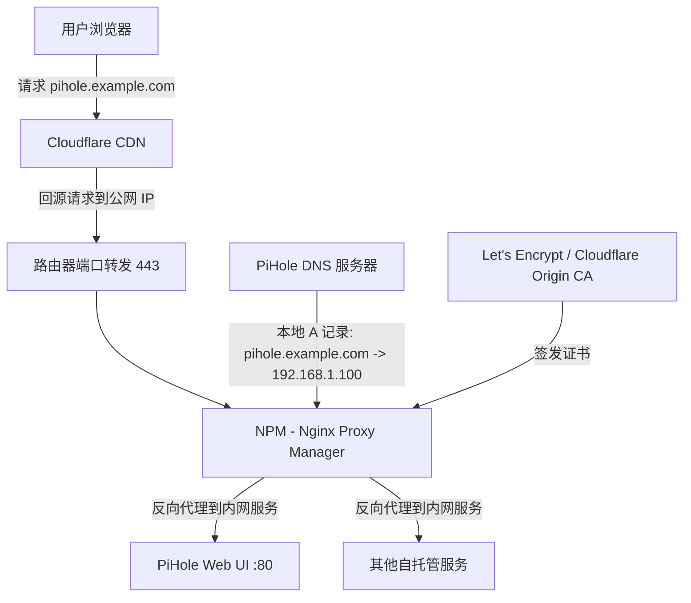
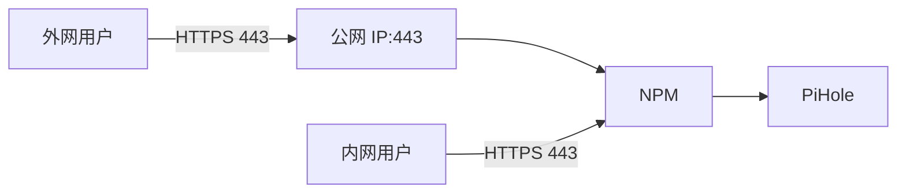

## 核心要点 (Key Takeaways)

- **根因九成在 DNS 解析环路**：PiHole 把域名解析到 NPM 内网 IP，但 Cloudflare 回源时拿不到正确的 Origin 证书，导致 SSL 握手失败或证书不匹配。
- **Cloudflare SSL/TLS 模式必须和 NPM 证书策略对齐**：`Full (Strict)` 模式要求 NPM 提供有效的 Cloudflare Origin CA 证书，否则报 526 错误。
- **Let's Encrypt 的 HTTP-01 挑战在本地 DNS 覆盖下必然失败**：因为验证请求被 PiHole 导回内网，Cloudflare 无法完成挑战。
- **本地 DNS 记录必须显式定义**：如果 PiHole 没有 A 记录，会走外部 DNS 解析到 Cloudflare 回源 IP，导致证书不匹配和间歇性访问故障。
- **NPM 证书自动续期失效的隐藏杀手**：`certbot-dns-cloudflare` 插件版本不匹配或 API Token 权限不足，续期直接静默失败。

## 问题描述：症状与现场

先说结论，这套组合拳——Nginx Proxy Manager (NPM) 做反向代理、PiHole 管内网 DNS、Cloudflare 做 CDN 和 DNS 托管——是自托管圈子的"标配"三件套。但也是 SSL 证书问题的高发区。

症状清单，你大概率至少中一条：

1. **间歇性访问失败**：同一个域名，刷新五次，两次打不开，浏览器报 `ERR_SSL_PROTOCOL_ERROR` 或者 `SSL_ERROR_BAD_CERT_DOMAIN`。
2. **NPM 签发证书失败**：在 NPM 后台点 "Request a new SSL Certificate"，等半天，日志里只有一句模糊的 `Challenge failed`，或者干脆卡在 pending 状态。
3. **无限重定向循环**：浏览器地址栏疯狂刷新 `redirect_loop`，NPM 日志里全是 301/302。
4. **证书不匹配**：访问 `pihole.example.com`，浏览器警告证书是给其他域名签的，或者证书链不完整。
5. **NPM 续期静默失效**：证书到期前一周，NPM 自动续期任务跑完，但证书还是旧的，NPM 日志里连个 ERROR 都没有。

上面这些症状，Reddit r/selfhosted 上有个经典帖子讨论得热火朝天，核心矛盾就一句话：

> Cloudflare 签发 SSL token，Nginx 拿 token 生成证书并处理本地代理地址，PiHole 处理本地 DNS 地址——三个组件各管一段，但没人管它们之间的**信任链**。

我对这个问题的判断很简单：**这不是 SSL 本身的问题，这是 DNS 解析链路和证书信任链的错位问题。** 90% 的情况，你修的不是证书，而是 DNS。

## 架构拆解：三个组件各自扮演什么角色

在动手修之前，先把架构画清楚。下面这张 Mermaid 图展示了典型的数据流：



**关键点在于：** 用户访问 `pihole.example.com` 时，DNS 解析结果取决于请求方是谁：

- **外网用户**：DNS 解析到 Cloudflare 的 Anycast IP，请求进入 Cloudflare 边缘网络，然后 Cloudflare 回源到你的公网 IP，再通过端口转发到达 NPM。
- **内网用户**：DNS 解析请求被 PiHole 截获。如果 PiHole 配置了本地 DNS 记录，解析到 NPM 的内网 IP（比如 `192.168.1.100`），请求直接打到 NPM，**不经过 Cloudflare**。

问题就出在这——**内网用户不经过 Cloudflare，但 NPM 上挂的证书是 Cloudflare Origin CA 签发的**。这个证书的有效范围只认 Cloudflare 回源请求，浏览器直接访问时，证书链不完整或域名不匹配，直接报错。

反过来，如果 PiHole **没有**配置本地 DNS 记录，内网用户走外部 DNS 解析到 Cloudflare IP，请求绕一圈回来，延迟高不说，如果 Cloudflare 回源配置有问题，直接 526 错误。

## 根因分析：为什么这套组合拳必炸

### 1. Let's Encrypt HTTP-01 挑战与 PiHole 的致命冲突

NPM 默认使用 Let's Encrypt 的 HTTP-01 挑战来验证域名所有权。流程是：

```
Let's Encrypt 服务器 -> 访问 http://pihole.example.com/.well-known/acme-challenge/xxx
```

这个访问请求会经过 DNS 解析。**如果 PiHole 把 `pihole.example.com` 解析到内网 IP，而 Cloudflare 的代理模式（橙色云）开启，Let's Encrypt 的验证请求会打到 Cloudflare 的边缘节点，Cloudflare 回源到你的 NPM——但 NPM 此时还没有证书，HTTPS 回源失败。**

更糟的情况：如果 PiHole 的本地 DNS 记录指向 NPM，但 Cloudflare 的 DNS 记录没有指向你的公网 IP，或者端口转发没配置对，验证请求直接 404。

**结论：HTTP-01 挑战在"本地 DNS 覆盖 + Cloudflare 代理"的组合下，几乎必失败。**

### 2. Cloudflare SSL/TLS 模式与 NPM 证书的信任链错位

Cloudflare 的 SSL/TLS 设置里有四个模式：Off、Flexible、Full、Full (Strict)。

- **Flexible**：Cloudflare 到用户是 HTTPS，但 Cloudflare 到源站是 HTTP。配置简单，但风险极高，中间这段明文传输可以被 ISP 或路由器截获。
- **Full**：Cloudflare 到源站是 HTTPS，但**不验证源站证书的有效性**。
- **Full (Strict)**：Cloudflare 到源站是 HTTPS，且**必须验证源站证书**，证书必须由受信任的 CA（或 Cloudflare Origin CA）签发，且域名必须匹配。

绝大多数安全意识强的用户都会选 Full (Strict)。**但问题在于，NPM 上默认签的 Let's Encrypt 证书，Cloudflare 不认**——准确说，Cloudflare 认，但要求证书链完整。

这里有个绕不开的坑：如果 NPM 用的是 Let's Encrypt 证书，而 Cloudflare 的 SSL 模式是 Full (Strict)，Cloudflare 回源时会验证证书链。**如果 NPM 的证书是通过 DNS-01 挑战签的，证书链没问题；但如果是 HTTP-01 挑战签的，且 NPM 的配置里没有正确加载中间证书，回源验证就会失败。**

社区里有个经典报错：`Error 526: Invalid SSL certificate`。这个错误的根因就是 Full (Strict) 模式下，Cloudflare 验证源站证书失败。

### 3. NPM 证书签发失败：certbot-dns-cloudflare 插件的隐藏坑

在 Reddit 那个帖子里，有个用户提到：

> NPM can no longer issue SSL certificates with Cloudflare. Removing and adding the certbot-dns-cloudflare fixed the problem for me.

这个问题的根源是 NPM 使用的 certbot 版本和 `certbot-dns-cloudflare` 插件版本不兼容。NPM 在 Docker 容器里打包了 certbot，如果容器更新后插件版本没有同步更新，API 调用会失败。

另一个坑是 **Cloudflare API Token 权限不足**。NPM 里配置 Cloudflare DNS 挑战时，需要提供 API Token。这个 Token 必须有 `Zone:Zone:Read` 和 `Zone:DNS:Edit` 权限。很多人图省事用 Global API Key，但 Global Key 有安全风险，而且 NPM 的 Cloudflare 插件对 Global Key 的支持时好时坏。

## 逐步修复：从 DNS 到证书的完整排查流程

以下步骤按优先级排列，从最可能的原因开始排查。**每一步都给出可执行的命令，别跳过。**

### 第一步：确认 PiHole 的本地 DNS 记录

PiHole 的管理界面在 `http://192.168.1.100/admin`（假设你的 PiHole IP 是这个）。进入 **Local DNS -> DNS Records**，检查是否有以下记录：

| 域名 | 解析目标 | 必须存在？ |
|---|---|---|
| `pihole.example.com` | `192.168.1.100`（NPM 内网 IP） | **是** |
| `npm.example.com` | `192.168.1.100`（NPM 内网 IP） | **是** |
| 其他内网服务域名 | NPM 内网 IP | **是** |

如果没有，用命令行添加：

```bash
# 在 PiHole 主机上执行
pihole -a addlocaldns pihole.example.com 192.168.1.100
pihole -a addlocaldns npm.example.com 192.168.1.100
```

**为什么必须显式定义？** 如果 PiHole 没有本地记录，内网用户的 DNS 请求会转发到上游 DNS（比如 8.8.8.8 或 Cloudflare 的 1.1.1.1），解析到 Cloudflare 的 Anycast IP。请求绕一圈回到你的 NPM，但源 IP 是 Cloudflare 的，NPM 的访问日志里全是 Cloudflare 的 IP，你根本分不清是内网用户还是外网攻击者。更重要的是，**如果 Cloudflare 回源配置有问题，内网用户会直接访问失败。**

### 第二步：验证内网 DNS 解析结果

在 NPM 主机上执行：

```bash
dig +short pihole.example.com @192.168.1.100
```

期望输出：

```
192.168.1.100
```

如果输出的是 Cloudflare 的 IP（比如 `104.21.x.x`），说明 PiHole 没有生效，或者 PiHole 的 DNS 转发配置有问题。

再验证外网解析：

```bash
dig +short pihole.example.com @1.1.1.1
```

期望输出是 Cloudflare 的 Anycast IP（`104.21.x.x` 或 `172.67.x.x`）。

**两条解析结果必须不同**——内网解析到 NPM 内网 IP，外网解析到 Cloudflare。如果两者相同，说明你的 PiHole 配置有 BUG。

### 第三步：检查 Cloudflare 的 DNS 记录和代理状态

登录 Cloudflare Dashboard，进入 **DNS -> Records**，检查：

1. `pihole.example.com` 的 A 记录是否指向你的**公网 IP**（不是内网 IP）。
2. 代理状态（Proxy status）是否为**橙色云**（Proxied）。如果是灰色云（DNS only），Cloudflare 不会提供 CDN 和 SSL 终止，用户直接访问你的公网 IP，NPM 需要自己处理 HTTPS。

**这里有个关键点：** 如果你想让 Cloudflare 做 CDN 和 SSL 终止，DNS 记录必须开启代理（橙色云）。但如果你只想用 Cloudflare 做 DNS 托管，关闭代理（灰色云），那么 NPM 上的证书必须是公网可验证的 Let's Encrypt 证书，且 Cloudflare 的 SSL 模式应该设为 `Off` 或 `Flexible`。

社区里有个常见错误：**DNS 记录开了代理，但 Cloudflare 的 SSL 模式是 Flexible**。这会导致：用户访问是 HTTPS，但 Cloudflare 回源是 HTTP。NPM 上如果只监听了 443 端口，回源请求直接失败；如果 NPM 监听了 80 端口，回源成功，但用户浏览器地址栏可能显示 "Not Secure" 或者证书不匹配。

### 第四步：配置 Cloudflare Origin CA 证书到 NPM

**这是解决 Full (Strict) 模式 526 错误的正解。**

1. 在 Cloudflare Dashboard 进入 **SSL/TLS -> Origin Server**。
2. 点击 **Create Certificate**，生成一个 Origin CA 证书。
3. 选择密钥类型：**ECC 256**（性能更好，兼容性没问题）。
4. 主机名：输入你的域名（可以用通配符 `*.example.com`）。
5. 证书有效期：建议 15 年（Origin CA 证书最长支持 15 年，不用担心续期问题）。

生成后，你会得到两个字符串：证书（PEM 格式）和私钥。**这两个字符串要完整复制，包括 `-----BEGIN CERTIFICATE-----` 和 `-----END CERTIFICATE-----` 标记。**

然后在 NPM 后台：

1. 进入 **SSL Certificates**。
2. 点击 **Add SSL Certificate**。
3. 选择 **Custom**。
4. 在 Certificate 和 Private Key 字段粘贴刚才复制的内容。
5. 保存。

**注意：** NPM 的 Custom 证书是手动管理的，没有自动续期。但 Origin CA 证书有效期长达 15 年，基本不用管。

### 第五步：配置 NPM 的代理主机

在 NPM 后台，进入 **Hosts -> Proxy Hosts**，编辑你的代理主机：

1. **Domain Names**：输入你的域名 `pihole.example.com`。
2. **Scheme**：选择 `http`（因为 NPM 到内网服务默认走 HTTP，除非你的 PiHole 配置了 HTTPS）。
3. **Forward Hostname / IP**：输入 PiHole 的内网 IP `192.168.1.100`。
4. **Forward Port**：输入 `80`（PiHole 默认 HTTP 端口）。
5. **Websockets Support**：开启（PiHole 的某些功能需要）。
6. **Block Common Exploits**：建议开启。
7. **SSL**：选择你刚才导入的 Origin CA 证书。

**关键配置：** 在 SSL 标签页里，把 **Force SSL** 开启，**HTTP/2** 开启。如果你的 NPM 版本支持，**HSTS** 也可以开启，但要确保你的 Cloudflare SSL 模式是 Full (Strict)，否则 HSTS 会导致内网用户直接访问 NPM 时证书验证失败。

### 第六步：验证 Cloudflare SSL/TLS 模式

进入 Cloudflare Dashboard 的 **SSL/TLS -> Overview**，确保模式是 **Full (Strict)**。

然后验证回源是否正常：

```bash
# 在 NPM 主机上执行，模拟 Cloudflare 回源请求
curl -v -k --resolve pihole.example.com:443:127.0.0.1 https://pihole.example.com
```

`-k` 参数跳过证书验证，但你可以看到证书链信息。如果证书链完整，且域名匹配，说明配置正确。

### 第七步：修复 NPM 证书自动签发/续期问题

如果你确实需要用 NPM 自动签发 Let's Encrypt 证书（而不是手动导入 Origin CA），那么：

**方法 A：使用 DNS-01 挑战（推荐）**

在 NPM 后台申请证书时，选择 **Use a DNS Challenge**，然后配置 Cloudflare 的 API Token。

```bash
# 在 NPM 容器内执行，验证 Cloudflare API Token 权限
docker exec -it npm certbot certonly \
  --dns-cloudflare \
  --dns-cloudflare-credentials /etc/letsencrypt/cloudflare.ini \
  -d "*.example.com" \
  -d "example.com"
```

`cloudflare.ini` 文件内容：

```ini
dns_cloudflare_api_token = YOUR_API_TOKEN
```

**重要：** 这个 API Token 必须有 `Zone:Zone:Read` 和 `Zone:DNS:Edit` 权限。在 Cloudflare Dashboard 的 **My Profile -> API Tokens** 里创建，选择 "Edit zone DNS" 模板，然后限制到你的域名 Zone。

**方法 B：修复 certbot-dns-cloudflare 插件**

如果 NPM 无法签发证书，日志里报插件错误，先升级 NPM 容器：

```bash
docker pull jc21/nginx-proxy-manager:latest
docker compose up -d
```

如果升级后还是不行，手动重新安装插件：

```bash
docker exec -it npm pip install --upgrade certbot-dns-cloudflare
```

然后重启 NPM：

```bash
docker restart npm
```

### 第八步：内网用户访问的最终验证

完成以上配置后，在内网的一台机器上验证：

```bash
# 使用内网 DNS 解析
curl -v https://pihole.example.com --resolve pihole.example.com:443:192.168.1.100
```

期望看到：

```
* SSL connection using TLSv1.3
* Server certificate:
*  subject: CN=*.example.com
*  issuer: C=US, O=Cloudflare
```

证书颁发者是 Cloudflare，说明内网用户拿到的是 Origin CA 证书，验证通过。

如果证书颁发者是 Let's Encrypt，说明 NPM 的代理主机 SSL 配置用了 Let's Encrypt 证书，而不是 Origin CA 证书。**这种情况下，内网用户访问没问题（因为 NPM 是源站），但 Cloudflare 回源验证会失败（Full Strict 模式下）。**

## 配置速查表

| 组件 | 配置项 | 推荐值 | 常见错误 |
|---|---|---|---|
| Cloudflare DNS | 代理状态 | 橙色云 (Proxied) | 灰色云导致 NPM 直接暴露公网 |
| Cloudflare SSL/TLS | 模式 | Full (Strict) | Flexible 导致回源明文传输 |
| Cloudflare Origin CA | 证书类型 | ECC 256，15 年有效期 | 用 Let's Encrypt 证书导致回源验证失败 |
| NPM | SSL 证书 | Cloudflare Origin CA | 用 Let's Encrypt 证书（内网用户验证失败） |
| NPM | 代理 Scheme | http | 配置 https 导致内网服务无法访问 |
| PiHole | 本地 DNS 记录 | 显式 A 记录到 NPM 内网 IP | 不配置导致 DNS 解析走外网 |
| NPM | 证书自动续期 | DNS-01 + Cloudflare API Token | HTTP-01 + 本地 DNS 覆盖导致失败 |

## 性能与安全影响

这套配置下，有几个值得注意的坑：

1. **内网用户绕行 Cloudflare 的延迟代价**：如果没配置 PiHole 本地 DNS，内网用户访问 `pihole.example.com` 会先到 Cloudflare 边缘节点，再回源到你家里。如果家里是普通宽带，上传带宽小，回源延迟轻松超过 200ms。配置 PiHole 本地 DNS 后，内网访问直接打到 NPM，延迟降到 1ms 以下。**这个优化值得做。**

2. **Full (Strict) 模式下证书链的完整性**：Cloudflare 回源验证时，会检查证书链是否完整。如果 NPM 的 Origin CA 证书没有正确配置中间证书链，回源会失败。NPM 的 Custom 证书导入界面会自动处理证书链，但如果你手动拼接证书，容易出错。

3. **HSTS 的坑**：如果你在 NPM 上开了 HSTS，但 Cloudflare 的 SSL 模式是 Flexible，内网用户访问时浏览器会强制 HTTPS，但 NPM 只监听 443 端口，回源失败。**HSTS 必须在 Cloudflare SSL 模式为 Full (Strict) 时才开启。**

4. **安全加固**：NPM 的默认配置可能暴露版本信息，建议在 NPM 的 Nginx 配置里添加：

```nginx
server_tokens off;
add_header X-Frame-Options "SAMEORIGIN" always;
add_header X-Content-Type-Options "nosniff" always;
```

## 替代方案：不用 Cloudflare 代理，用纯内网 HTTPS

如果你觉得 Cloudflare 这套太折腾，还有一个更简单的方案：**不用 Cloudflare 代理，直接在 NPM 上用 Let's Encrypt 证书，内网用户直接访问 NPM，外网用户通过端口转发访问 NPM。**



这个方案的配置要点：

1. Cloudflare 的 DNS 记录**关闭代理**（灰色云），只用它做 DNS 托管。
2. NPM 上用 Let's Encrypt 签发证书，用 **DNS-01 挑战**（避免 HTTP-01 被本地 DNS 干扰）。
3. Cloudflare 的 SSL 模式设为 `Off`（因为 Cloudflare 不参与 HTTPS 终止）。
4. 内网用户通过 PiHole 本地 DNS 解析到 NPM 内网 IP，直接访问。

**优点**：配置简单，没有证书链错位问题，内网外网都走同一个证书。
**缺点**：没有 Cloudflare 的 CDN 加速和 DDoS 防护，你的公网 IP 直接暴露，需要自己做好防火墙和安全加固。

社区里有人用 Cloudflare Tunnel（cloudflared）来避免暴露公网 IP，这个方案更安全，但配置更复杂。Zero Trust Tunnel 的配置里有个关键点：

> Make sure you've enabled noTLSVerify option for your public hostname on your configured cloudflared tunnel.

因为 cloudflared 到内网服务默认走 HTTPS，但内网服务（比如 PiHole）通常只监听 HTTP，所以必须设置 `noTLSVerify`，否则隧道握手失败。

## FAQ

### 1. 如何修复 Cloudflare 的无效 SSL 证书错误？

检查三个地方：证书是否过期（浏览器会提示 `NET::ERR_CERT_DATE_INVALID`）；证书域名是否匹配访问的域名；客户端系统时间是否正确（时间偏差会导致证书有效性判断失败）。在服务器端，用 `openssl s_client -connect example.com:443 -servername example.com` 检查证书链。

### 2. Cloudflare 的 SSL/TLS 模式如何配置？

进入 Cloudflare Dashboard -> SSL/TLS -> Overview。如果 NPM 上有有效的 Origin CA 证书，选 **Full (Strict)**；如果 NPM 上的证书是自签的，选 **Full**；如果 NPM 上没有配置 HTTPS，选 **Flexible**（不推荐，明文传输）。配置完成后，在 NPM 上执行 `curl -v https://example.com` 验证。

### 3. 为什么 Cloudflare 无法与源站建立 SSL 连接（Error 525）？

Error 525 表示 Cloudflare 与源站（你的 NPM）之间的 SSL 握手失败。常见原因：NPM 上监听的端口没有配置 HTTPS（比如只监听了 80 端口但 Cloudflare 回源用 443）；NPM 的证书过期；Cloudflare SSL 模式是 Full 或 Full (Strict) 但 NPM 上挂的是无效证书。用 `openssl s_client -connect 127.0.0.1:443 -servername example.com` 检查 NPM 的 443 端口是否正常响应。

### 4. NPM 无法用 Cloudflare 签发 SSL 证书怎么办？

优先检查 Cloudflare API Token 权限（需要 `Zone:Zone:Read` 和 `Zone:DNS:Edit`），然后检查 NPM 容器内的 `certbot-dns-cloudflare` 插件版本。如果插件版本过旧，执行 `docker exec -it npm pip install --upgrade certbot-dns-cloudflare`。如果还不行，考虑手动导入 Cloudflare Origin CA 证书（有效期 15 年），避免依赖 Let's Encrypt 的自动续期。

### 5. PiHole 本地 DNS 和 Cloudflare 证书的冲突如何解决？

PiHole 本地 DNS 记录必须显式定义，把内网域名解析到 NPM 内网 IP。这样内网用户直接访问 NPM，NPM 返回 Cloudflare Origin CA 证书，浏览器验证通过。如果 PiHole 没有本地记录，内网用户走外网 DNS 解析到 Cloudflare，请求绕一圈回来，如果 Cloudflare 回源配置有误，直接 526 错误。

## References & Community Insights

- [Reddit r/selfhosted: SSL issue with NPM, PiHole, Cloudflare](https://www.reddit.com/r/selfhosted/comments/ssl_issue_with_npm_pihole_cloudflare/) — 原帖讨论，包含大量用户踩坑记录。
- [NPM No Longer Issues SSL Certificates with Cloudflare](https://www.reddit.com/r/selfhosted/comments/npm_no_longer_issues_ssl_certificates_with_cloudflare/) — 关于 certbot-dns-cloudflare 插件问题的讨论，社区给出的解决方案是重新安装插件。
- [Cloudflare Origin CA 证书官方文档](https://developers.cloudflare.com/ssl/origin-configuration/origin-ca/) — 官方文档，详细说明 Origin CA 证书的生成和配置方法。
- [Nginx Proxy Manager 官方文档](https://nginxproxymanager.com/guide/) — 官方指南，包含证书签发和代理主机配置的详细说明。
- [Cloudflare SSL/TLS 模式官方说明](https://developers.cloudflare.com/ssl/origin-configuration/ssl-modes/) — 四种模式的官方解释，以及每种模式的适用场景。
- [PiHole 本地 DNS 配置指南](https://docs.pi-hole.net/ftldns/blocking/) — PiHole 官方文档，说明如何配置本地 DNS 记录。

最后说一句：这套组合拳修好之后，稳定运行大半年不是问题。但每次 NPM 或 Cloudflare 升级，都要检查一遍 SSL/TLS 模式和证书链是否还匹配——**这套架构的脆弱点不在配置，而在升级后的兼容性漂移。**

<script type="application/ld+json">
{
  "@context": "https://schema.org",
  "@type": "FAQPage",
  "mainEntity": [
    {
      "@type": "Question",
      "name": "如何修复 Cloudflare 的无效 SSL 证书错误？",
      "acceptedAnswer": {
        "@type": "Answer",
        "text": "检查三个地方：证书是否过期、证书域名是否匹配访问的域名、客户端系统时间是否正确。在服务器端用 openssl s_client -connect example.com:443 -servername example.com 检查证书链。"
      }
    },
    {
      "@type": "Question",
      "name": "Cloudflare 的 SSL/TLS 模式如何配置？",
      "acceptedAnswer": {
        "@type": "Answer",
        "text": "进入 Cloudflare Dashboard -> SSL/TLS -> Overview。如果 NPM 上有有效的 Origin CA 证书选 Full (Strict)；如果是自签证书选 Full；如果 NPM 没有 HTTPS 选 Flexible（不推荐）。"
      }
    },
    {
      "@type": "Question",
      "name": "为什么 Cloudflare 无法与源站建立 SSL 连接（Error 525）？",
      "acceptedAnswer": {
        "@type": "Answer",
        "text": "Error 525 表示 Cloudflare 与源站之间的 SSL 握手失败。常见原因：NPM 监听的端口没有配置 HTTPS、证书过期、Cloudflare SSL 模式与源站证书不匹配。用 openssl s_client 检查 NPM 的 443 端口。"
      }
    },
    {
      "@type": "Question",
      "name": "NPM 无法用 Cloudflare 签发 SSL 证书怎么办？",
      "acceptedAnswer": {
        "@type": "Answer",
        "text": "优先检查 Cloudflare API Token 权限（需要 Zone:Zone:Read 和 Zone:DNS:Edit），然后检查 NPM 容器内的 certbot-dns-cloudflare 插件版本，过旧则执行 docker exec -it npm pip install --upgrade certbot-dns-cloudflare。"
      }
    },
    {
      "@type": "Question",
      "name": "PiHole 本地 DNS 和 Cloudflare 证书的冲突如何解决？",
      "acceptedAnswer": {
        "@type": "Answer",
        "text": "PiHole 本地 DNS 记录必须显式定义，把内网域名解析到 NPM 内网 IP，内网用户直接访问 NPM，返回 Cloudflare Origin CA 证书，浏览器验证通过。"
      }
    }
  ]
}
</script>
