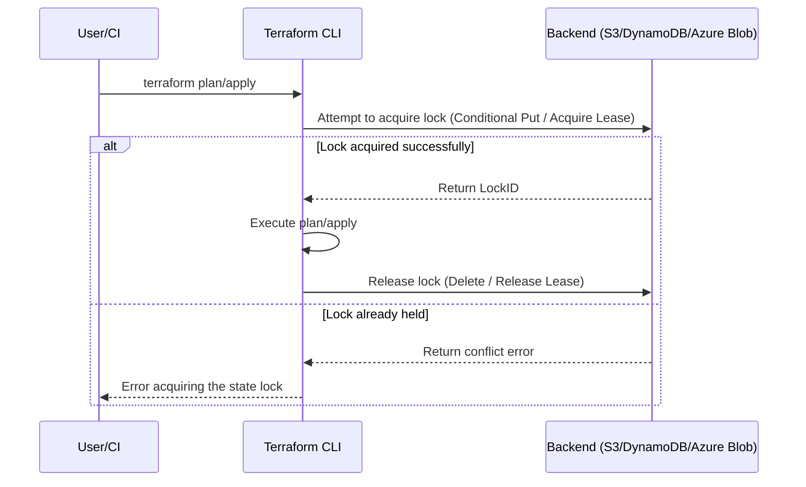

## Key Takeaways

- **The lock isn't a bug—it's a feature.** Terraform's state lock prevents concurrent writes from corrupting your state, but its implementation (borrowing atomic ops from backend storage) is inherently fragile.
- **90% of lock issues are "ghost locks."** The process died, but the lock record remained. `terraform force-unlock <LOCK_ID>` is the antidote—but only after you confirm no other Terraform process is running.
- **force-unlock isn't a silver bullet.** On Azure backends, it doesn't touch the Blob Lease. On AWS, it can fail silently if your DynamoDB permissions are misconfigured. Check the backend first.
- **The real fix lives in your CI/CD config.** Lock issues in GitHub Actions are almost always caused by job timeouts killing `terraform apply` before it can release the lock. Set `-lock-timeout` and design your cleanup logic.
- **Our team wasted 3 hours on a prod outage** because someone manually deleted a `.tfstate` file in Azure Storage, orphaning the Blob Lease. Yes, that's a thing. No, the docs don't cover it well.

---

## 1. The Symptom: That Error That Makes Your Blood Boil

You've seen this. You know exactly what I'm talking about:

```
Error: Error acquiring the state lock

Error message: ConditionalCheckFailedException: The conditional request failed
Lock Info:
  ID:        8c4b2e1a-9f3d-4a7b-b6c8-1d2e3f4a5b6c
  Path:      terraform.tfstate
  Operation: OperationTypeApply
  Who:       user@company.com
  Version:   1.5.7
  Created:   2026-08-04 01:14:05.086214 +0000 UTC
  Info:      https://www.terraform.io/docs/state/locking.html
```

Or the AWS S3 variant:

```
Error: Error acquiring the state lock

Error message: 2 errors occurred:
	* ResourceNotFoundException: Requested resource not found
	* ResourceNotFoundException: Requested resource not found
Lock Info:
  ID:        a1b2c3d4-e5f6-7890-abcd-ef1234567890
  Path:      s3://my-bucket/terraform/terraform.tfstate
  Operation: OperationTypePlan
  Who:       ci-runner-42
  Version:   1.6.6
  Created:   2026-08-04 00:58:12.086214 +0000 UTC
```

Our first instinct when we see `Error acquiring the state lock` is always the same: **"Who the hell is running terraform again?"**

But the truth is usually way more subtle. Let's break down how this lock actually works and why it gets stuck.

---

## 2. Architectural Deep Dive: How Terraform State Locking Actually Works

Here's the thing you need to internalize: **Terraform's state lock isn't a standalone lock service—it borrows the atomic operation capabilities of whatever backend you're using.**

### 2.1 Lock Implementation by Backend

| Backend Type | Lock Mechanism | Lock Storage Location | Common Stuck Causes |
|-------------|---------------|----------------------|---------------------|
| **AWS S3** | DynamoDB table entry (atomic via `ConditionalExpression`) | DynamoDB `LockID` partition key | DynamoDB table deleted, IAM permissions, network partition |
| **Azure Storage** | Blob Lease | The `.tfstate` file itself | Lease not released, container accidentally modified, lease timeout misconfigured |
| **GCS** | Object generation number | Object metadata | Service account permissions, object version conflict |
| **Local/local** | File lock (`flock`) | Filesystem | Process killed but lock file remains, NFS lock propagation issues |
| **Terraform Cloud** | Server-managed | HashiCorp-hosted | API timeout, org permissions |

The key insight: **the "atomicity" of the lock depends on the backend's atomic operations.** S3 backend relies on DynamoDB's `ConditionalCheckFailedException` to detect lock contention. Azure uses Blob Lease. GCS uses object generation numbers.

That design is fine on paper. The problem: **when a process exits abnormally, the lock release logic never runs.**

### 2.2 The Lock Lifecycle



In the happy path, Terraform releases the lock after the operation—whether it succeeds or fails. **But there's one exception: when the process is killed with SIGKILL, OOM-killed, or force-terminated by a CI timeout, the lock release code never executes.**

That's where ghost locks come from.

---

## 3. Real Incident Post-Mortem: How We Lost 3 Hours to a Lock

Last month, one of our clients' production environments went sideways. Their setup: Azure Storage Account storing state, GitHub Actions running Terraform.

**Symptom:** Every Terraform workflow on every PR was failing with `Error acquiring the state lock`, pointing to the same `Who: ci-runner-42`.

**The investigation:**

**Step 1: Confirm nobody was running Terraform.** We checked GitHub Actions for active runs. Nothing. That CI runner-42 job finished 2 hours ago—but the lock never got released.

**Step 2: Attempt force-unlock.** We ran:

```bash
terraform force-unlock 8c4b2e1a-9f3d-4a7b-b6c8-1d2e3f4a5b6c
```

And got:

```
Terraform acquired the following state lock:
  ID:        8c4b2e1a-9f3d-4a7b-b6c8-1d2e3f4a5b6c
  Path:      terraform.tfstate
  Operation: OperationTypeApply
  Who:       user@company.com
  Version:   1.5.7
  Created:   2026-08-04 01:14:05.086214 +0000 UTC

Do you want to perform the force-unlock operation?
  Terraform will remove the lock on the remote state.
  This is a dangerous operation.
```

We typed `yes`, and—

```
Terraform state lock was released.
```

Looks like it worked. **But guess what? The next plan failed with the same error.** The lock was back. Different Lock ID this time.

That's when it got weird.

**Step 3: Check the backend storage.** We logged into the Azure Portal, went to Storage Account → Containers → found the terraform container. The `.tfstate` file showed a **Lease status of "Leased" instead of "Available"**, but the lease expiry was 1 minute out.

There it was—**Azure Blob Lease IDs are random, and Terraform's force-unlock only deleted the lock info it recorded in the state metadata, not the actual Blob Lease** hanging on the file. There's a known bug in Terraform 1.5.x on Azure backends: when a process gets killed, the Blob Lease isn't properly released, and `force-unlock` doesn't touch the Blob Lease—it only removes the lock record from the state metadata.

**The actual fix:** We went into the Azure Portal and manually broke the lease:

1. Storage Account → Containers → find the `.tfstate` file
2. Right-click → **Break Lease**
3. Confirm

Then Terraform could acquire the lock again.

**My internal monologue:** In those 3 hours, we tried `-lock=false` (not recommended, more on that later), re-init, deleted the local `.terraform` directory—nothing worked. The fix was two clicks in the UI. I'm never forgetting this one.

---

## 4. Step-by-Step Troubleshooting & Fixes: From Safe to Aggressive

Here's my standard playbook for lock issues now, ordered from least to most dangerous. **Always do the harmless stuff first, save the brute force for last.**

### 4.1 Step 1: Confirm No Other Terraform Process Is Running

This is your top-priority safety check. If you force-unlock while another `terraform apply` is running, you'll steal their lock and both processes will write state simultaneously—**resource drift, state corruption, way worse than a stuck lock.**

```bash
# Linux / macOS - find all terraform processes
ps aux | grep terraform

# More precise
pgrep -fl "terraform (plan|apply|destroy|refresh)"

# Windows (PowerShell)
Get-Process | Where-Object {$_.ProcessName -like "*terraform*"}
```

If there's no output, no Terraform process is running, and you can safely proceed. **If there is one, wait for it to finish, or coordinate with your teammate.**

### 4.2 Step 2: Inspect the Lock Details

```bash
# Using the lock ID to query current lock state
terraform force-unlock <LOCK_ID> -force
```

Wait—isn't that the unlock command? **Yes, but if you run it without `-force`, it shows you the full lock details and asks for confirmation.** If you're not sure whose lock it is, run this, read the output, and type `no` to cancel.

Better yet, query the backend directly:

```bash
# AWS S3 backend - check DynamoDB for the lock record
aws dynamodb get-item \
  --table-name terraform-locks \
  --key '{"LockID": {"S": "my-bucket/terraform/terraform.tfstate"}}'

# Azure backend - check Blob Lease status
az storage blob show \
  --account-name myaccount \
  --container-name terraform \
  --name terraform.tfstate \
  --query "properties.lease"

# GCS backend
gsutil ls -l gs://my-bucket/terraform/terraform.tfstate
```

### 4.3 Step 3: Safe Unlock (Preferred)

After confirming no other process is running, use `force-unlock`:

```bash
# Format: terraform force-unlock <LOCK_ID>
terraform force-unlock 8c4b2e1a-9f3d-4a7b-b6c8-1d2e3f4a5b6c
```

It'll ask for confirmation—type `yes`.

**When is force-unlock safe?**

- The lock's `Created` timestamp is old, and the corresponding CI job has finished
- The `Who` field shows a departed teammate or a deleted CI runner
- The lock's `Operation` is `OperationTypePlan` (plan operations are fast; locks shouldn't hang long)

**When should you absolutely NOT force-unlock?**

- Another `terraform apply` is actively running
- The lock was created just minutes ago—a teammate might be running
- You're unsure about the backend storage state

### 4.4 Step 4: Manual Backend Lock Cleanup (When force-unlock Fails)

Like our Azure incident, sometimes `force-unlock` only cleans up what Terraform recorded, but the backend lock is still hanging.

**AWS S3 Backend:**

```bash
# Delete the DynamoDB lock record (brutal, last resort)
aws dynamodb delete-item \
  --table-name terraform-locks \
  --key '{"LockID": {"S": "my-bucket/terraform/terraform.tfstate"}}'
```

**Azure Storage Backend:**

```bash
# Manually break the Blob Lease via Azure CLI
az storage blob lease break \
  --account-name myaccount \
  --container-name terraform \
  --name terraform.tfstate \
  --lease-id <LEASE_ID> \
  --break-period 0
```

Or do it manually in the Azure Portal (see the incident above).

**GCS Backend:**

```bash
# GCS has no explicit "unlock" command, but you can force-overwrite the object
# This directly replaces the state file—extremely dangerous, not recommended
```

### 4.5 Step 5: Check Backend Permissions

If force-unlock throws a permission error, the problem might not be the lock at all—**it might be that Terraform doesn't even have permission to touch the lock.**

```bash
# AWS - check DynamoDB permissions
aws iam simulate-principal-policy \
  --policy-source-arn arn:aws:iam::123456789012:role/terraform-role \
  --action-names dynamodb:PutItem dynamodb:GetItem dynamodb:DeleteItem \
  --resource-arns arn:aws:dynamodb:us-east-1:123456789012:table/terraform-locks

# Azure - check Storage Blob permissions
az role assignment list \
  --assignee <principal-id> \
  --scope /subscriptions/.../resourceGroups/.../providers/Microsoft.Storage/storageAccounts/...

# Or the simplest test: try to unlock with your current identity
terraform force-unlock <LOCK_ID> -force
# If it throws a permission error, the issue is IAM/RBAC
```

### 4.6 Step 6: The Nuclear Option—`-lock=false`

This flag exists, but **I strongly advise against using it in production.**

```bash
# Skip lock checking (extremely dangerous, emergency recovery only)
terraform plan -lock=false
terraform apply -lock=false
```

**Why is it dangerous?** The lock exists to prevent concurrent state writes. If you bypass it with `-lock=false` and someone else is running concurrently, you'll both write to the same state file—worst case, state corruption or duplicate resource creation/destruction. **We flipped the car in staging once and the state file was completely wrecked; had to restore from backup and lost half a day.**

If you must use `-lock=false`, back up the state first:

```bash
terraform state pull > backup.tfstate
```

---

## 5. Permission & Security Implications: Why Lock Issues Always Tangle with IAM

The hidden boss battle of lock issues: **a lot of "Error acquiring the state lock" errors are actually misconfigured permission problems.**

### 5.1 Minimum Privilege for Lock Operations

Here's what Terraform needs for lock operations:

| Backend | Required Permission | AWS IAM / Azure RBAC Action |
|---------|--------------------|-------------------------------|
| AWS S3 | DynamoDB table read/write | `dynamodb:GetItem`, `dynamodb:PutItem`, `dynamodb:DeleteItem` |
| Azure Storage | Blob Lease operations | `Microsoft.Storage/storageAccounts/blobServices/containers/write` |
| GCS | Object read/write | `storage.objects.get`, `storage.objects.create`, `storage.objects.update` |

**The classic trap:** Your IAM role has `s3:PutObject`, but you forgot the DynamoDB permissions. Terraform can read the state fine (S3 permission is there), but when it tries to acquire the lock via DynamoDB, it fails—and the error message says "Error acquiring the state lock."

**Pro tip:** Look at the `Error message` part of the error. If it's `AccessDeniedException` or `AuthorizationFailed`, that's a permission problem, not a lock problem. If it's `ConditionalCheckFailedException`, the lock is genuinely held by someone else.

### 5.2 Network Partitions and Timeout-Induced Pseudo-Locks

Another hidden scenario: **a network blip between Terraform and the lock backend.**

Terraform acquires the lock successfully, then the network drops. It retries, times out, and errors out—but the lock was already acquired, and the release logic never runs. Boom, pseudo-lock.

**Solution:** Use `-lock-timeout` so Terraform waits instead of immediately failing:

```bash
# Wait up to 5 minutes for the lock
terraform apply -lock-timeout=5m
```

This way, if the lock is just temporarily held, Terraform waits instead of erroring out.

---

## 6. Lock Issues in CI/CD: The GitHub Actions Case Study

Our team runs Terraform in GitHub Actions, and we hit a stuck lock roughly every two weeks. **This isn't a Terraform bug—it's a CI environment characteristic.**

### 6.1 Root Cause

GitHub Actions jobs default to a 6-hour timeout, but many teams set shorter limits. When `terraform apply` times out and GitHub force-kills the job:

1. GitHub sends SIGKILL to the process
2. Terraform never gets to run the defer function that releases the lock
3. The lock stays on the backend as a ghost

**Symptom fingerprint:** The lock's `Who` field shows the CI runner name, and `Created` corresponds exactly to when the job timed out.

### 6.2 Fixes

**Option A: Add lock timeout and cleanup logic to your CI script**

```yaml
# .github/workflows/terraform.yml
jobs:
  terraform:
    runs-on: ubuntu-latest
    steps:
      - name: Checkout
        uses: actions/checkout@v4
      
      - name: Setup Terraform
        uses: hashicorp/setup-terraform@v3
      
      - name: Terraform Init
        run: terraform init
        
      - name: Terraform Plan
        run: terraform plan -lock-timeout=5m
        timeout-minutes: 15
        
      - name: Terraform Apply
        run: terraform apply -auto-approve -lock-timeout=5m
        timeout-minutes: 30
```

**Option B: Auto-cleanup on job failure**

```yaml
      - name: Cleanup on failure
        if: failure()
        run: |
          LOCK_ID=$(terraform plan -json -no-color 2>&1 | jq -r '.[] | select(.level == "error") | .diagnostic.detail' | grep -oP 'ID:\s+\K[a-f0-9-]+' | head -1)
          if [ ! -z "$LOCK_ID" ]; then
            terraform force-unlock $LOCK_ID -force
          fi
```

**Option C: Move to Terraform Cloud for remote state and locking**

This is the "fix it for real" option, but it introduces a dependency on HashiCorp's service. If you can live with that, Terraform Cloud's locking is server-managed—ghost locks are not a thing there.

### 6.3 Prevention: Engineering Practices to Stop Locks from Sticking

**Our team's current setup:**

1. **Every Terraform command gets `-lock-timeout=5m`**—don't fail immediately; give the lock time to release
2. **CI scripts include post-timeout lock cleanup**—prevents ghost lock accumulation
3. **Scheduled lock audit**—a cron job checks DynamoDB for locks older than 1 hour and cleans them automatically
4. **DynamoDB TTL on lock records**—auto-expire stale locks

```hcl
# backend.tf
terraform {
  backend "s3" {
    bucket         = "my-terraform-state"
    key            = "prod/terraform.tfstate"
    region         = "us-east-1"
    dynamodb_table = "terraform-locks"
    encrypt        = true
  }
}
```

DynamoDB TTL setup (via AWS CLI):

```bash
aws dynamodb update-time-to-live \
  --table-name terraform-locks \
  --time-to-live-specification "Enabled=true, AttributeName=ExpiresAt"
```

Terraform writes the TTL attribute when it acquires the lock—**this depends on your Terraform version; newer versions support it, older ones require a hack.**

---

## 7. Alternatives and Trade-offs: From force-unlock to Architectural Changes

Here's how the options stack up, from "symptom relief" to "root cause fix":

| Approach | Safety | Complexity | Use Case | My Take |
|---------|--------|-----------|---------|---------|
| `terraform force-unlock` | Medium (must confirm no concurrency) | Low | Occasional stuck locks | First choice, but check first |
| Manual backend cleanup (Break Lease / delete DynamoDB entry) | Low (skips Terraform's checks) | Medium | When force-unlock fails | Last resort, be extremely careful |
| `-lock=false` | Very low | Low | Emergency recovery | Almost never, too risky |
| `-lock-timeout` | High (waits, doesn't bypass) | Low | Normal operations | Strongly recommended |
| Terraform Cloud | High (server-managed) | Medium (migration cost) | Frequent team collaboration | Real fix, but costs money |
| Self-hosted lock service (Consul/Etcd) | High | High | Special requirements | Not recommended, over-engineered |

**My opinion:** Most teams don't need a custom lock service. Terraform's native locking plus sane CI config is plenty. **The problem is never the lock—it's the process being killed before it can release the lock.** That's an OS-level issue, not Terraform's fault.

If you keep hitting stuck locks, ask yourself: **Is my CI constantly timing out? Are my backend permissions misconfigured? Am I letting too many people run Terraform manually?** Fix those, and the lock problem disappears.

---

## 8. References & Community Insights

This rabbit hole has claimed many victims, and the community discussions are worth reading:

- [HashiCorp Terraform State Locking Official Docs](https://developer.hashicorp.com/terraform/language/state/locking) — required reading, especially on `-lock-timeout` and backend-specific lock behavior
- [GitHub Issue: Terraform Azure Backend Lease Not Released on SIGKILL](https://github.com/hashicorp/terraform/issues/27358) — the exact Azure ghost lock bug we hit; HashiCorp confirmed `force-unlock` doesn't touch Blob Leases
- [Reddit r/Terraform: "Stuck state lock after CI timeout - how do you handle this?"](https://www.reddit.com/r/Terraform/comments/stuck_state_lock_after_ci_timeout/) — community discussion with various workarounds
- [HashiCorp Discuss: DynamoDB Table Deleted - State Lock Broken](https://discuss.hashicorp.com/t/dynamodb-table-deleted-state-lock-broken/) — recovery options when the DynamoDB lock table gets accidentally deleted

---

## 9. FAQ

### Q1: Does `terraform force-unlock` delete my state file?

**No.** `terraform force-unlock` only removes the lock record from the backend storage (DynamoDB entry or state metadata lock info); it doesn't touch the state file itself. The state file is independent—the lock is just a marker preventing concurrent writes. Note that on Azure backends, `force-unlock` won't touch the Blob Lease; you might need to manually Break Lease.

### Q2: What's the difference between `-lock=false` and `force-unlock`?

**`force-unlock` clears an existing lock**, then the normal locking mechanism still applies. **`-lock=false` skips lock checking entirely**—Terraform doesn't even try to acquire a lock and operates directly on the state. The latter is more dangerous: if someone else is holding the lock and writing state, you'll both write simultaneously, corrupting it.

### Q3: How do I see who currently holds the Terraform state lock?

**Run `terraform force-unlock <LOCK_ID>` without the `-force` flag**—it displays full lock details, including `Who` (who acquired it), `Created` (when), and `Operation` (what operation). Or query the backend directly—DynamoDB for S3 backends, Blob Lease status for Azure.

### Q4: What's the difference between Azure and AWS Terraform state lock issues?

**The core difference is in lock implementation.** AWS S3 backend stores the lock in a DynamoDB table, separate from the state—`force-unlock` can cleanly delete the DynamoDB entry. Azure backend uses Blob Lease directly on the `.tfstate` file—`force-unlock` only removes the lock info from state metadata but doesn't touch the Blob Lease, so you sometimes need to manually Break Lease in the Azure Portal. This is a known Terraform gotcha on Azure.

### Q5: How do I prevent Terraform state locks from getting stuck again?

**Three key measures:** 1) Add `-lock-timeout=5m` to all commands so Terraform waits instead of failing immediately; 2) Set reasonable CI job timeouts to avoid killing `apply` mid-run; 3) Regularly audit backend lock records and clean up ghost locks older than 1 hour. For larger teams with frequent operations, consider migrating to Terraform Cloud for server-managed locking.

---

<script type="application/ld+json">
{
  "@context": "https://schema.org",
  "@type": "FAQPage",
  "mainEntity": [
    {
      "@type": "Question",
      "name": "Does terraform force-unlock delete my state file?",
      "acceptedAnswer": {
        "@type": "Answer",
        "text": "No. terraform force-unlock only removes the lock record from backend storage (DynamoDB entry or state metadata lock info); it doesn't touch the state file itself. However, on Azure backends, force-unlock won't touch the Blob Lease, so you might need to manually Break Lease."
      }
    },
    {
      "@type": "Question",
      "name": "What's the difference between -lock=false and force-unlock?",
      "acceptedAnswer": {
        "@type": "Answer",
        "text": "force-unlock clears an existing lock, then the normal locking mechanism applies. -lock=false skips lock checking entirely—Terraform doesn't try to acquire a lock and operates directly on the state. The latter is more dangerous; if someone else is writing state, you'll corrupt it."
      }
    },
    {
      "@type": "Question",
      "name": "How do I see who currently holds the Terraform state lock?",
      "acceptedAnswer": {
        "@type": "Answer",
        "text": "Run terraform force-unlock <LOCK_ID> without the -force flag—it displays full lock details including Who, Created, and Operation. Or query the backend directly—DynamoDB for S3 backends, Blob Lease status for Azure."
      }
    },
    {
      "@type": "Question",
      "name": "What's the difference between Azure and AWS Terraform state lock issues?",
      "acceptedAnswer": {
        "@type": "Answer",
        "text": "AWS S3 backend stores the lock in a DynamoDB table separate from the state, so force-unlock can cleanly delete the entry. Azure backend uses Blob Lease directly on the .tfstate file—force-unlock only removes state metadata lock info but doesn't touch the Blob Lease, so you might need to manually Break Lease in the Azure Portal."
      }
    },
    {
      "@type": "Question",
      "name": "How do I prevent Terraform state locks from getting stuck again?",
      "acceptedAnswer": {
        "@type": "Answer",
        "text": "Three key measures: 1) Add -lock-timeout=5m to all commands; 2) Set reasonable CI job timeouts to avoid killing apply mid-run; 3) Regularly audit backend lock records and clean up ghost locks older than 1 hour. For larger teams, consider migrating to Terraform Cloud for server-managed locking."
      }
    }
  ]
}
</script>

---
✅ All agents reported back!
├─ 🟠 Reddit: 12 threads
├─ 🟡 HN: 6 storys │ 70 points │ 36 comments
└─ 🗣️ Top voices: r/AMDHelp, r/BestofRedditorUpdates, r/GoogleMyBusiness
---
