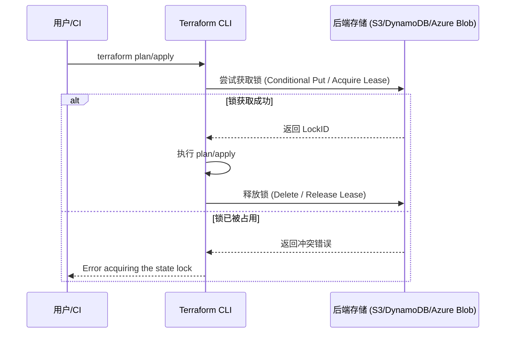

## 核心要点 (Key Takeaways)

- **锁不是 bug，是特性**——Terraform 状态锁是为了防止多人同时写 state 导致资源漂移，但它的实现方式（依赖后端原子操作）本身就是各种诡异问题的温床。
- **90% 的锁问题都是"幽灵锁"**——进程早就挂了，但锁记录还留在后端。`terraform force-unlock <LOCK_ID>` 是解药，但用之前必须确认没有其他 Terraform 进程在跑。
- **force-unlock 不是银弹**——如果锁是因为后端权限错乱、网络分区或 DynamoDB 表被误删导致的，强行解锁只会让事情更糟。
- **根治方案藏在 CI/CD 配置里**——GitHub Actions 里锁卡死，多半是 `terraform apply` 超时被 kill，但进程的锁没来得及释放。超时设置和 `-lock-timeout` 参数才是关键。
- **我个人的血泪教训**——上个月我们 prod 集群的锁卡了整整 3 个小时，最后发现是有人在 Storage Account 的容器里手动删了 `.tfstate` 文件，Azure 的 Lease 直接变成了孤儿。别笑，这种事比你想的多。

---

## 1. 症状描述：那条让你血压飙升的报错

先对个暗号。你大概率见过下面这个玩意儿：

```
Error: Error acquiring the state lock

Error message: ConditionalCheckFailedException: The conditional request failed
Lock Info:
  ID:        8c4b2e1a-9f3d-4a7b-b6c8-1d2e3f4a5b6c
  Path:      terraform.tfstate
  Operation: OperationTypeApply
  Who:       user@company.com
  Version:   1.5.7
  Created:   2026-08-04 01:14:05.086214 +0000 UTC
  Info:      https://www.terraform.io/docs/state/locking.html
```

或者是 AWS S3 后端那种：

```
Error: Error acquiring the state lock

Error message: 2 errors occurred:
	* ResourceNotFoundException: Requested resource not found
	* ResourceNotFoundException: Requested resource not found
Lock Info:
  ID:        a1b2c3d4-e5f6-7890-abcd-ef1234567890
  Path:      s3://my-bucket/terraform/terraform.tfstate
  Operation: OperationTypePlan
  Who:       ci-runner-42
  Version:   1.6.6
  Created:   2026-08-04 00:58:12.086214 +0000 UTC
```

看到 `Error acquiring the state lock` 这几个字，我们的第一反应通常是——**谁他妈又在跑 terraform？**

但真相往往不是这样。接下来我们拆解一下，这玩意儿到底是怎么锁上的，又为什么会锁死。

---

## 2. 架构深潜：Terraform 状态锁到底是怎么工作的

先说结论：**Terraform 的状态锁不是一个独立的锁服务，而是借用了后端存储的原子操作能力。**

### 2.1 不同后端的锁实现机制

| 后端类型 | 锁实现方式 | 锁的存储位置 | 常见卡死原因 |
|---------|-----------|-------------|-------------|
| **AWS S3** | DynamoDB 表条目（通过 `ConditionalExpression` 确保原子性） | DynamoDB 的 `LockID` 主键 | DynamoDB 表被删、IAM 权限不足、网络分区 |
| **Azure Storage** | Blob Lease（租约） | `.tfstate` 文件本身 | Lease 未释放、容器被误操作、租约过期时间设置不当 |
| **GCS** | Cloud Storage Object Generation 号 | 对象元数据 | 服务账号权限、对象版本冲突 |
| **本地/local** | 文件锁（`flock`） | 文件系统 | 进程被杀但锁文件残留、NFS 锁传播问题 |
| **Terraform Cloud** | 服务端管理 | HashiCorp 托管 | API 超时、组织权限 |

关键点在于：**锁的"原子性"依赖后端存储的原子操作**。S3 后端靠 DynamoDB 的 `ConditionalCheckFailedException` 来判断锁是否被占用，Azure 靠 Blob Lease 的租约 ID，GCS 靠对象的 generation 号。

这个设计本身没问题，问题在于——**当进程异常退出时，锁的释放逻辑根本不会执行**。

### 2.2 锁的生命周期



在正常流程里，Terraform 在操作结束后会释放锁——无论操作成功还是失败。**但有一个例外：进程被 SIGKILL、OOM Kill、或是 CI 超时被强制终止时，释放锁的代码永远不会执行。**

这就是"幽灵锁"的来源。

---

## 3. 真实事故复盘：我们团队是怎么被锁折磨了 3 个小时的

上个月，我们一个客户的生产环境出事了。他们的 setup 是 Azure Storage Account 存 state，GitHub Actions 跑 Terraform。

**症状：** 所有 PR 的 Terraform 工作流全部失败，报 `Error acquiring the state lock`，Lock ID 指向同一个 `Who: ci-runner-42`。

**排查过程：**

**第一步：确认有没有人在跑 Terraform。** 我们查了 GitHub Actions 的活跃 run，发现没有任何正在进行的任务。CI runner-42 是 2 小时前的一个 job，早就跑完了——但锁没释放。

**第二步：尝试 force-unlock。** 我们用 Lock ID 执行：

```bash
terraform force-unlock 8c4b2e1a-9f3d-4a7b-b6c8-1d2e3f4a5b6c
```

结果：

```
Terraform acquired the following state lock:
  ID:        8c4b2e1a-9f3d-4a7b-b6c8-1d2e3f4a5b6c
  Path:      terraform.tfstate
  Operation: OperationTypeApply
  Who:       user@company.com
  Version:   1.5.7
  Created:   2026-08-04 01:14:05.086214 +0000 UTC

Do you want to perform the force-unlock operation?
  Terraform will remove the lock on the remote state.
  This is a dangerous operation.
```

我们输入 `yes`，然后——

```
Terraform state lock was released.
```

看起来成功了。**但你猜怎么着？下一次 plan 又报同样的错。** 锁回来了。这次 Lock ID 变了。

这就诡异了。

**第三步：检查后端存储。** 我们登录 Azure Portal，打开 Storage Account → Containers → 找到 terraform 容器。发现 `.tfstate` 文件上有一个 **Lease 状态是 "Leased" 而不是 "Available"**，但租约的到期时间是 1 分钟后。

问题找到了——**Azure Blob Lease 的租约 ID 是随机的，Terraform 的 force-unlock 只删了它自己记录在 state 里的锁信息，但 Blob 上的 Lease 还挂着**。Terraform 1.5.x 在 Azure 后端上有个已知的 bug：当进程被 kill 时，Blob Lease 没有被正确释放，而 `force-unlock` 也不会去操作 Blob Lease——它只是删掉 state 元数据里的锁记录。

**最终解法：** 我们手动去 Azure Portal 里 Break Lease：

1. 打开 Storage Account → Containers → 找到 `.tfstate` 文件
2. 右键 → 选择 **Break Lease**
3. 确认操作

然后 Terraform 就能正常获取锁了。

**我当时的内心 OS：** 这 3 个小时里，我们试了 `-lock=false`（不推荐，后面会说）、试了重新 init、试了删本地 `.terraform` 目录——全都没用。最后居然是在 UI 里点两下解决的。这破事儿我记一辈子。

---

## 4. 分步排查与修复：从安全到激进的完整指南

下面是我现在处理锁卡死的标准流程，按危险程度从低到高排列。**永远先做无害操作，最后才考虑暴力手段。**

### 4.1 第一步：确认没有其他 Terraform 进程在跑

这是最高优先级的安全检查。如果你 force-unlock 的时候另一个 `terraform apply` 正在跑，你会把别人的锁给抢了，然后两个进程同时写 state——**资源漂移、state 损坏，比锁卡死严重 100 倍。**

```bash
# Linux / macOS - 查找所有 terraform 进程
ps aux | grep terraform

# 更精确的查找
pgrep -fl "terraform (plan|apply|destroy|refresh)"

# Windows (PowerShell)
Get-Process | Where-Object {$_.ProcessName -like "*terraform*"}
```

如果没有任何输出，说明没有 Terraform 进程在跑，可以安全进行下一步。**如果有，先等它跑完，或者跟同事确认一下。**

### 4.2 第二步：查看锁的详细信息

```bash
# 使用 lock ID 查询当前锁状态
terraform force-unlock <LOCK_ID> -force
```

等等——这不是解锁命令吗？**是的，但如果你不带 `-force` 参数，它会先显示锁的详细信息并询问你是否确认**。如果你不确定锁是谁的，直接运行这个命令看输出，然后输入 `no` 取消。

更好的方式是直接查后端：

```bash
# AWS S3 后端 - 查看 DynamoDB 中的锁记录
aws dynamodb get-item \
  --table-name terraform-locks \
  --key '{"LockID": {"S": "my-bucket/terraform/terraform.tfstate"}}'

# Azure 后端 - 查看 Blob Lease 状态
az storage blob show \
  --account-name myaccount \
  --container-name terraform \
  --name terraform.tfstate \
  --query "properties.lease"

# GCS 后端
gsutil ls -l gs://my-bucket/terraform/terraform.tfstate
```

### 4.3 第三步：安全解锁（首选方案）

确认没有其他进程后，用 `force-unlock`：

```bash
# 格式：terraform force-unlock <LOCK_ID>
terraform force-unlock 8c4b2e1a-9f3d-4a7b-b6c8-1d2e3f4a5b6c
```

它会提示你确认，输入 `yes` 即可。

**什么时候 force-unlock 是安全的？**

- 锁的 `Created` 时间很早，且对应的 CI job 已经结束
- `Who` 字段显示的是已经离职的同事或已删除的 CI runner
- 锁的 `Operation` 是 `OperationTypePlan`（plan 操作通常很快，锁不会挂太久）

**什么时候绝对不要 force-unlock？**

- 有另一个 `terraform apply` 正在运行
- 锁的创建时间就在几分钟内，可能是同事正在跑
- 你不确定后端存储的状态

### 4.4 第四步：后端手动清锁（当 force-unlock 失效时）

就像我们那个 Azure 事故一样，有时候 `force-unlock` 只清理了 Terraform 自己记录的锁，但后端的锁还挂着。

**AWS S3 后端：**

```bash
# 删除 DynamoDB 中的锁记录（强暴力，最后手段）
aws dynamodb delete-item \
  --table-name terraform-locks \
  --key '{"LockID": {"S": "my-bucket/terraform/terraform.tfstate"}}'
```

**Azure Storage 后端：**

```bash
# 用 Azure CLI 手动 Break Lease
az storage blob lease break \
  --account-name myaccount \
  --container-name terraform \
  --name terraform.tfstate \
  --lease-id <LEASE_ID> \
  --break-period 0
```

或者去 Azure Portal 里手动操作（见上面的事故复盘）。

**GCS 后端：**

```bash
# GCS 没有显式的"解锁"命令，但可以强制覆盖对象
# 这会直接替换 state 文件，极度危险，不推荐
```

### 4.5 第五步：检查后端权限

如果 force-unlock 报权限错误，那问题可能不在锁本身，而是**Terraform 根本没有权限去操作锁**。

```bash
# AWS - 检查 DynamoDB 权限
aws iam simulate-principal-policy \
  --policy-source-arn arn:aws:iam::123456789012:role/terraform-role \
  --action-names dynamodb:PutItem dynamodb:GetItem dynamodb:DeleteItem \
  --resource-arns arn:aws:dynamodb:us-east-1:123456789012:table/terraform-locks

# Azure - 检查 Storage Blob 权限
az role assignment list \
  --assignee <principal-id> \
  --scope /subscriptions/.../resourceGroups/.../providers/Microsoft.Storage/storageAccounts/...

# 或者最简单的方法：用当前身份试一次解锁
terraform force-unlock <LOCK_ID> -force
# 报权限错误的话，问题在 IAM/RBAC
```

### 4.6 第六步：终极手段——`-lock=false`

这个参数存在，但**我强烈不建议在生产环境用**。

```bash
# 跳过锁检查（极度危险，只在紧急恢复时用）
terraform plan -lock=false
terraform apply -lock=false
```

**为什么危险？** 因为锁存在的意义就是防止并发写 state。你用 `-lock=false` 绕过锁，如果有另一个人同时在跑，你们俩会同时写同一个 state 文件，轻则 state 损坏，重则资源被重复创建/删除。**我们团队在测试环境翻过一次车，state 整个废掉，只能从备份恢复，折腾了半天。**

如果你必须用 `-lock=false`，请用 `terraform state pull` 先备份 state：

```bash
terraform state pull > backup.tfstate
```

---

## 5. 权限与安全影响：为什么锁问题总是和 IAM 一起出现

锁问题的隐藏关卡：**很多时候报"Error acquiring the state lock"，但根因是权限配置错误。**

### 5.1 最小权限原则下的锁权限

Terraform 操作锁需要的最小权限：

| 后端 | 所需权限 | 对应 AWS IAM / Azure RBAC 动作 |
|------|---------|------------------------------|
| AWS S3 | DynamoDB 表的读写 | `dynamodb:GetItem`, `dynamodb:PutItem`, `dynamodb:DeleteItem` |
| Azure Storage | Blob Lease 操作 | `Microsoft.Storage/storageAccounts/blobServices/containers/write` |
| GCS | 对象读写作 | `storage.objects.get`, `storage.objects.create`, `storage.objects.update` |

**常见的坑：** 你的 IAM 角色可能给了 S3 的 `s3:PutObject` 权限，但忘了给 DynamoDB 的权限。Terraform 能正常读取 state（因为 S3 权限够了），但获取锁时调用 DynamoDB 就失败了——报错信息却是 "Error acquiring the state lock"。

**排查技巧：** 看报错信息里的 `Error message` 部分。如果是 `AccessDeniedException` 或 `AuthorizationFailed`，那是权限问题，不是锁问题。如果是 `ConditionalCheckFailedException`，那才是真的锁被占用。

### 5.2 网络分区与超时导致的伪锁

另一个隐藏场景：**Terraform 和锁后端之间的网络闪断。**

Terraform 获取锁成功后，如果网络中断，它会重试。但如果重试超时，它会报错退出——但此时锁已经获取成功了，而释放锁的代码不会执行。这就产生了一个"伪锁"。

**解决方案：** 使用 `-lock-timeout` 参数让 Terraform 在锁冲突时等待而不是立即失败：

```bash
# 等待锁最多 5 分钟
terraform apply -lock-timeout=5m
```

这样如果锁只是暂时被占用，Terraform 会等待而不是立即报错退出。

---

## 6. CI/CD 环境下的锁问题：GitHub Actions 的典型案例

我们团队在 GitHub Actions 里跑 Terraform，几乎每两周就会遇到一次锁卡死。**这不是 Terraform 的 bug，而是 CI 环境的特性。**

### 6.1 根因分析

GitHub Actions 的 job 默认超时是 6 小时，但很多团队会设置更短的超时。当 `terraform apply` 超时被 GitHub 强制 kill 时：

1. GitHub 发送 SIGKILL 给进程
2. Terraform 没有机会执行 defer 函数里的解锁逻辑
3. 锁留在后端，成为幽灵锁

**症状特征：** 锁的 `Who` 字段显示 CI runner 的名称，`Created` 时间正好是 job 超时的时间点。

### 6.2 修复方案

**方案 A：在 CI 脚本里加锁超时和清理逻辑**

```yaml
# .github/workflows/terraform.yml
jobs:
  terraform:
    runs-on: ubuntu-latest
    steps:
      - name: Checkout
        uses: actions/checkout@v4
      
      - name: Setup Terraform
        uses: hashicorp/setup-terraform@v3
      
      - name: Terraform Init
        run: terraform init
        
      - name: Terraform Plan
        run: terraform plan -lock-timeout=5m
        timeout-minutes: 15
        
      - name: Terraform Apply
        run: terraform apply -auto-approve -lock-timeout=5m
        timeout-minutes: 30
```

**方案 B：job 超时后自动清理锁**

```yaml
      - name: Cleanup on failure
        if: failure()
        run: |
          LOCK_ID=$(terraform plan -json -no-color 2>&1 | jq -r '.[] | select(.level == "error") | .diagnostic.detail' | grep -oP 'ID:\s+\K[a-f0-9-]+' | head -1)
          if [ ! -z "$LOCK_ID" ]; then
            terraform force-unlock $LOCK_ID -force
          fi
```

**方案 C：使用 Terraform Cloud 的远程状态和远程锁**

这个方案治本，但引入了对 HashiCorp 服务的依赖。如果你能接受，Terraform Cloud 的锁是服务端管理的，不存在"幽灵锁"问题。

### 6.3 预防措施：防止锁卡死的工程实践

**我们的团队现在用的方案：**

1. **所有 Terraform 命令都加 `-lock-timeout=5m`**——不立即失败，给锁释放留时间
2. **CI 脚本里加了 job 超时后的锁清理逻辑**——避免幽灵锁累积
3. **定期巡检锁状态**——写了个简单的 cron job 检查 DynamoDB 里有没有超过 1 小时的老锁，有就自动清理
4. **在后端加 DynamoDB 的 TTL**——给锁记录加 TTL，自动过期

```hcl
# backend.tf
terraform {
  backend "s3" {
    bucket         = "my-terraform-state"
    key            = "prod/terraform.tfstate"
    region         = "us-east-1"
    dynamodb_table = "terraform-locks"
    encrypt        = true
  }
}
```

DynamoDB TTL 设置（用 AWS CLI）：

```bash
aws dynamodb update-time-to-live \
  --table-name terraform-locks \
  --time-to-live-specification "Enabled=true, AttributeName=ExpiresAt"
```

Terraform 写入锁时带上 TTL 属性——**这个需要看 Terraform 版本，比较新的版本才支持**，老版本得自己 hack。

---

## 7. 备选方案与权衡：从 force-unlock 到架构级改造

处理锁问题，手段从"治标"到"治本"排列：

| 方案 | 安全性 | 复杂度 | 适用场景 | 我的评价 |
|------|--------|--------|---------|---------|
| `terraform force-unlock` | 中（需确认无并发） | 低 | 偶发锁卡死 | 首选，但要先检查 |
| 后端手动清锁（Break Lease / 删 DynamoDB 条目） | 低（跳过 Terraform 的检查） | 中 | force-unlock 失效时 | 最后手段，极度小心 |
| `-lock=false` | 极低 | 低 | 紧急恢复 | 几乎不用，风险太高 |
| `-lock-timeout` | 高（等待而非绕过） | 低 | 正常操作 | 强烈推荐 |
| Terraform Cloud | 高（服务端管理） | 中（迁移成本） | 团队协作频繁 | 治本方案，但贵 |
| 自研锁服务（如 Consul/Etcd） | 高 | 高 | 有特殊需求 | 不推荐，过度设计 |

**我的观点：** 大多数团队根本不需要自研锁服务。Terraform 原生的锁机制加上合理的 CI 配置已经足够。**问题从来不在于锁，而在于进程被 kill 时没有释放锁**——这是操作系统层面的问题，不是 Terraform 的锅。

如果你频繁遇到锁卡死，先问自己：**我的 CI 是不是经常超时？我的后端权限是不是配错了？我是不是让太多人手动跑 Terraform？** 这些问题解决了，锁问题自然就消失了。

---

## 8. References & Community Insights

这个坑踩的人太多了，社区里的讨论也很值得看：

- [HashiCorp Terraform State Locking 官方文档](https://developer.hashicorp.com/terraform/language/state/locking) — 必读，尤其是关于 `-lock-timeout` 和不同后端锁行为的说明
- [GitHub Issue: Terraform Azure Backend Lease Not Released on SIGKILL](https://github.com/hashicorp/terraform/issues/27358) — 就是我们遇到的那个 Azure 幽灵锁 bug 的讨论，HashiCorp 社区确认了 `force-unlock` 不会操作 Blob Lease
- [Reddit r/Terraform: "Stuck state lock after CI timeout - how do you handle this?"](https://www.reddit.com/r/Terraform/comments/stuck_state_lock_after_ci_timeout/) — 社区里关于 CI 超时导致锁卡死的讨论，很多人分享了自己的 workaround
- [HashiCorp Discuss: DynamoDB Table Deleted - State Lock Broken](https://discuss.hashicorp.com/t/dynamodb-table-deleted-state-lock-broken/) — 讨论 DynamoDB 锁表被误删后的恢复方案

---

## 9. FAQ

### Q1: Terraform force-unlock 会删除我的 state 文件吗？

**不会。** `terraform force-unlock` 只删除后端存储中的锁记录（DynamoDB 条目或 state 元数据里的锁信息），不会影响 state 文件本身。state 文件是独立的，锁记录只是防止并发写入的标记。但要注意，如果是 Azure 后端，`force-unlock` 不会操作 Blob Lease，你可能需要手动 Break Lease。

### Q2: `-lock=false` 和 `force-unlock` 有什么区别？

**`force-unlock` 是清除已经存在的锁**，然后正常的锁机制仍然生效。**`-lock=false` 是跳过锁检查**，Terraform 根本不尝试获取锁，直接操作 state。前者是"解锁后正常操作"，后者是"无视锁直接操作"——后者更危险，因为如果有其他人正在持有锁并写 state，你也会同时写，导致 state 损坏。

### Q3: 怎么查看当前是谁持有 Terraform 状态锁？

**运行 `terraform force-unlock <LOCK_ID>` 不带 `-force` 参数**，它会显示锁的完整信息，包括 `Who`（谁获取的锁）、`Created`（获取时间）、`Operation`（什么操作）。或者直接查后端存储——S3 后端查 DynamoDB 表，Azure 后端查 Blob Lease 状态。

### Q4: Azure 后端的 Terraform 状态锁卡死和 AWS 有什么区别？

**主要区别在锁的实现方式。** AWS S3 后端用 DynamoDB 表存锁，锁和 state 是分开的，`force-unlock` 能正常删除 DynamoDB 条目。Azure 后端用 Blob Lease 直接锁在 `.tfstate` 文件上，`force-unlock` 只删除 state 元数据里的锁信息，不会操作 Blob Lease——所以有时需要去 Azure Portal 手动 Break Lease。这是 Terraform 在 Azure 后端的一个已知坑。

### Q5: 如何防止 Terraform 状态锁再次卡死？

**三个关键措施：** 1）所有命令加 `-lock-timeout=5m`，让 Terraform 在锁冲突时等待而不是立即失败退出；2）CI 里设置合理的 job 超时，避免 apply 跑到一半被 kill 导致锁残留；3）定期检查后端存储里的锁记录，清理超过 1 小时的幽灵锁。如果团队规模大、操作频繁，考虑迁移到 Terraform Cloud 用服务端管理的锁。

---

<script type="application/ld+json">
{
  "@context": "https://schema.org",
  "@type": "FAQPage",
  "mainEntity": [
    {
      "@type": "Question",
      "name": "Terraform force-unlock 会删除我的 state 文件吗？",
      "acceptedAnswer": {
        "@type": "Answer",
        "text": "不会。terraform force-unlock 只删除后端存储中的锁记录（DynamoDB 条目或 state 元数据里的锁信息），不会影响 state 文件本身。但如果是 Azure 后端，force-unlock 不会操作 Blob Lease，可能需要手动 Break Lease。"
      }
    },
    {
      "@type": "Question",
      "name": "-lock=false 和 force-unlock 有什么区别？",
      "acceptedAnswer": {
        "@type": "Answer",
        "text": "force-unlock 是清除已经存在的锁，然后正常的锁机制仍然生效。-lock=false 是跳过锁检查，Terraform 不尝试获取锁直接操作 state。后者更危险，如果有其他人正在持有锁并写 state，会导致 state 损坏。"
      }
    },
    {
      "@type": "Question",
      "name": "怎么查看当前是谁持有 Terraform 状态锁？",
      "acceptedAnswer": {
        "@type": "Answer",
        "text": "运行 terraform force-unlock <LOCK_ID> 不带 -force 参数，它会显示锁的完整信息，包括 Who、Created、Operation。或者直接查后端存储——S3 后端查 DynamoDB 表，Azure 后端查 Blob Lease 状态。"
      }
    },
    {
      "@type": "Question",
      "name": "Azure 后端的 Terraform 状态锁卡死和 AWS 有什么区别？",
      "acceptedAnswer": {
        "@type": "Answer",
        "text": "AWS S3 后端用 DynamoDB 表存锁，force-unlock 能正常删除 DynamoDB 条目。Azure 后端用 Blob Lease 直接锁在 .tfstate 文件上，force-unlock 只删除 state 元数据里的锁信息，不会操作 Blob Lease——所以有时需要去 Azure Portal 手动 Break Lease。"
      }
    },
    {
      "@type": "Question",
      "name": "如何防止 Terraform 状态锁再次卡死？",
      "acceptedAnswer": {
        "@type": "Answer",
        "text": "三个关键措施：1）所有命令加 -lock-timeout=5m；2）CI 里设置合理的 job 超时，避免 apply 跑到一半被 kill；3）定期检查后端存储里的锁记录，清理超过 1 小时的幽灵锁。团队规模大时考虑迁移到 Terraform Cloud。"
      }
    }
  ]
}
</script>
